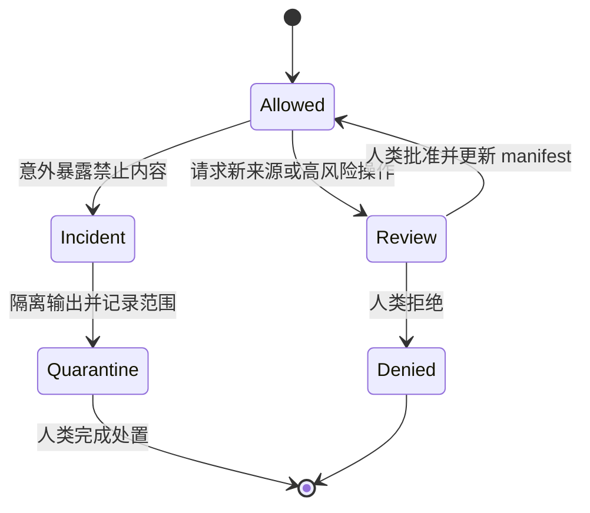

# 附录 C：Agent 上下文许可清单

Agent Context Boundary 把“模型可以看到什么”从临时提示词提升为项目控制面。它同时服务于 clean-room、许可证、隐私、安全与最小权限。许可应与 Task Contract 一起版本化，并在任务执行前由人类所有者确认。[E2-CLEANROOM][E4-CONTEXT-BOUNDARY]

## 三类许可

### MAY READ

只有完成当前行为意图所必需、且来源合法的数据进入允许列表。

- 公开标准、命令帮助、手册和已批准的行为规范；
- 候选 Rust 实现中与任务直接相关的模块、测试与构建配置；
- 经清理的黑盒输入/输出、差分报告和最小复现；
- 已批准的公开 issue、审计结论和生产指标摘要；
- 不含凭证、个人信息或客户机密的合成 fixture；
- 经过版本固定的工具链文档和依赖元数据。

### MUST NOT READ

禁止项要具体到来源类别，并包含其派生物。

- clean-room 条款禁止的参考实现源码、反编译结果和逐行派生笔记；
- 未授权的私有仓库、客户数据、支持工单、日志正文与内部聊天；
- 凭证、令牌、私钥、签名材料和生产数据库转储；
- 尚未解禁的漏洞利用细节或超出任务授权的安全材料；
- 许可证不允许用于当前派生工作的代码和数据；
- 与任务无关、会显著扩大搜索空间的仓库区域。

“禁止读参考源码”不等于禁止观察行为。只要项目规则允许，可以通过受控 harness 向 oracle 提交输入并保存可观察结果；应避免让输出包含实现细节或敏感路径。uutils 项目规则明确区分了独立实现所需的公开行为证据与 GNU 实现源码。[E2-CLEANROOM]

### NEEDS HUMAN REVIEW

以下内容可在获得明确批准后进入任务，但不能由 Agent 自主扩权。

- `unsafe`、FFI、系统调用封装与权限边界；
- 新依赖、许可证例外、source policy 例外和供应链告警；
- 公共 API、持久化格式、协议或错误语义变化；
- 真实生产数据、漏洞材料和受监管数据；
- 修改 CI、发布、签名、provider 切换或回滚配置；
- 扩大任务路径、改变行为目标或豁免验证门禁。

## 可执行清单

```yaml
context_manifest_version: "1"
task_id: "MIG-UTILITY-001"
owner: "migration maintainer"
expires_when: "task closed or contract changes"
candidate:
  canonical_root: "/approved/worktree"
  revision: "full commit hash"

declared_access:
  may_read:
    - canonical_source: "/approved/worktree/src/uu/example/**"
      revision_or_sha256: "candidate commit or content hash"
      retrieved_at: "RFC3339 timestamp"
      purpose: "理解当前 Rust 控制流"
      approved_by: "task owner / decision ID"
    - canonical_source: "/approved/worktree/cases/example/*.json"
      revision_or_sha256: "fixture content hash"
      purpose: "重放经清理的黑盒行为"

  must_not_read:
    - canonical_source: "reference implementation source"
      reason: "clean-room boundary"
    - canonical_source: "production raw logs"
      reason: "privacy and secret exposure"

  needs_human_review:
    - trigger: "新增 unsafe 或 FFI"
      approver: "safety reviewer"
    - trigger: "访问未列路径或数据源"
      approver: "task owner"

observed_access:
  - timestamp: "RFC3339 timestamp"
    tool_and_action: "read_file"
    canonical_source: "/approved/worktree/src/uu/example/mod.rs"
    source_sha256: "hash of bytes read"
    authorization_ref: "declared_access.may_read[0]"
    output_summary_sha256: "hash of retained evidence summary"

approval_log:
  - decision_id: "CTX-DEC-001"
    actor: "task owner"
    decision: "approved | denied"
    scope: "exact source or operation"
    decided_at: "RFC3339 timestamp"

output_rules:
  may_quote: ["公开规范", "经清理的测试观测"]
  must_redact: ["用户名", "主机名", "绝对客户路径", "令牌"]
  retention: "随 Change Package 保存最小证据"
```

`declared_access` 是授权，`observed_access` 是实际工具记录；只有前者不能证明执行过程中看过什么，只有后者又无法说明访问是否合法。工具层应对规范化绝对路径与网络来源执行默认拒绝，并让每条观察引用一项授权。执行前，人类检查清单如下：

- 允许来源是否都有任务目的，而非“可能有用”；
- 禁止来源是否覆盖复制品、缓存、搜索索引和 Agent 生成摘要；
- fixture 是否已去除隐私、凭证和真实客户标识；
- oracle 的调用接口是否只返回需要比较的可观察字段；
- 工具权限是否与清单一致，写权限是否限制在候选工作区；
- 网络、包管理器和外部服务访问是否有独立授权；
- 输出保留期限、审计位置和删除责任是否明确；
- 触发人工复核时，谁有资格批准以及如何记录决定。

## 边界事件处理

当 Agent 意外看到禁止内容时，不应继续“只参考一点”。正确流程是：停止相关执行；记录暴露来源与范围，但不复制敏感正文；通知任务所有者；隔离可能受污染的输出；由人类判断是否废弃候选补丁、重建上下文或启动安全响应。clean-room 场景下，污染过的实现不能靠删掉对话片段恢复独立性，应按项目法律与治理规则处理。

当 Agent 需要一个未列来源时，应提交权限变更请求，说明来源、目的、最小范围、替代方案和预期输出。批准后更新 manifest 版本，再继续执行。权限边界因此不是静态文档，而是可审计的状态机。



边界的目标不是让 Agent“知道得越少越好”，而是让每一份上下文都能回答来源是否合法、是否必要、能否追溯。这样既保护项目，也减少无关材料对实现搜索的干扰。
