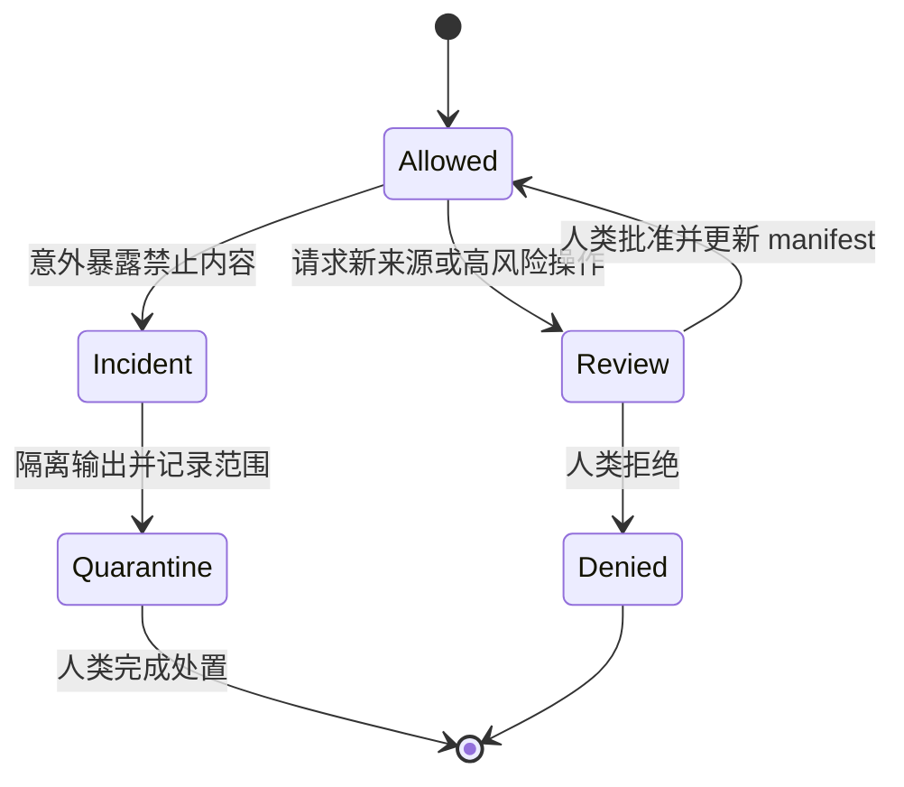
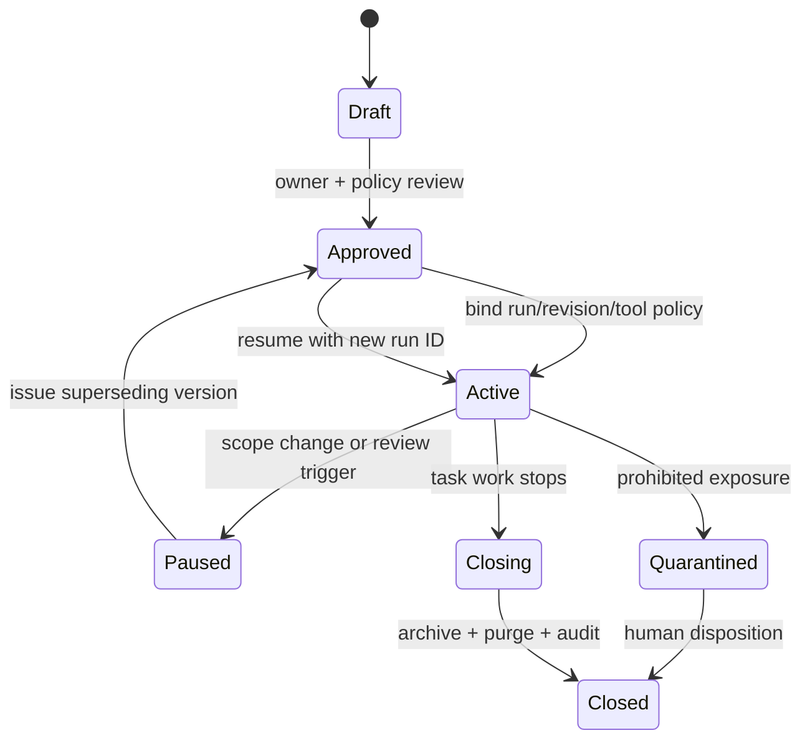

# 附录 C：Agent 上下文许可清单

Agent Context Boundary 把“模型可以看到什么”从临时提示词提升为项目控制面。它同时服务于 clean-room、许可证、隐私、安全与最小权限。许可应与 Task Contract 一起版本化，并在任务执行前由人类所有者确认。[E2-CLEANROOM][E4-CONTEXT-BOUNDARY]

## 三类许可

### MAY READ

只有完成当前行为意图所必需、且来源合法的数据进入允许列表。

- 公开标准、命令帮助、手册和已批准的行为规范；
- 候选 Rust 实现中与任务直接相关的模块、测试与构建配置；
- 经清理的黑盒输入/输出、差分报告和最小复现；
- 已批准的公开 issue、审计结论和生产指标摘要；
- 不含凭证、个人信息或客户机密的合成 fixture；
- 经过版本固定的工具链文档和依赖元数据。

### MUST NOT READ

禁止项要具体到来源类别，并包含其派生物。

- clean-room 条款禁止的参考实现源码、反编译结果和逐行派生笔记；
- 未授权的私有仓库、客户数据、支持工单、日志正文与内部聊天；
- 凭证、令牌、私钥、签名材料和生产数据库转储；
- 尚未解禁的漏洞利用细节或超出任务授权的安全材料；
- 许可证不允许用于当前派生工作的代码和数据；
- 与任务无关、会显著扩大搜索空间的仓库区域。

“禁止读参考源码”不等于禁止观察行为。只要项目规则允许，可以通过受控 harness 向 oracle 提交输入并保存可观察结果；应避免让输出包含实现细节或敏感路径。uutils 项目规则明确区分了独立实现所需的公开行为证据与 GNU 实现源码。[E2-CLEANROOM]

### NEEDS HUMAN REVIEW

以下内容可在获得明确批准后进入任务，但不能由 Agent 自主扩权。

- `unsafe`、FFI、系统调用封装与权限边界；
- 新依赖、许可证例外、source policy 例外和供应链告警；
- 公共 API、持久化格式、协议或错误语义变化；
- 真实生产数据、漏洞材料和受监管数据；
- 修改 CI、发布、签名、provider 切换或回滚配置；
- 扩大任务路径、改变行为目标或豁免验证门禁。

## 可执行清单

```yaml
context_manifest_version: "1"
task_id: "MIG-UTILITY-001"
owner: "migration maintainer"
expires_when: "task closed or contract changes"
candidate:
  canonical_root: "/approved/worktree"
  revision: "full commit hash"

declared_access:
  may_read:
    - canonical_source: "/approved/worktree/src/uu/example/**"
      revision_or_sha256: "candidate commit or content hash"
      retrieved_at: "RFC3339 timestamp"
      purpose: "理解当前 Rust 控制流"
      approved_by: "task owner / decision ID"
    - canonical_source: "/approved/worktree/cases/example/*.json"
      revision_or_sha256: "fixture content hash"
      purpose: "重放经清理的黑盒行为"

  must_not_read:
    - canonical_source: "reference implementation source"
      reason: "clean-room boundary"
    - canonical_source: "production raw logs"
      reason: "privacy and secret exposure"

  needs_human_review:
    - trigger: "新增 unsafe 或 FFI"
      approver: "safety reviewer"
    - trigger: "访问未列路径或数据源"
      approver: "task owner"

observed_access:
  - timestamp: "RFC3339 timestamp"
    tool_and_action: "read_file"
    canonical_source: "/approved/worktree/src/uu/example/mod.rs"
    source_sha256: "hash of bytes read"
    authorization_ref: "declared_access.may_read[0]"
    output_summary_sha256: "hash of retained evidence summary"

approval_log:
  - decision_id: "CTX-DEC-001"
    actor: "task owner"
    decision: "approved | denied"
    scope: "exact source or operation"
    decided_at: "RFC3339 timestamp"

output_rules:
  may_quote: ["公开规范", "经清理的测试观测"]
  must_redact: ["用户名", "主机名", "绝对客户路径", "令牌"]
  retention: "随 Change Package 保存最小证据"
```

`declared_access` 是授权，`observed_access` 是实际工具记录；只有前者不能证明执行过程中看过什么，只有后者又无法说明访问是否合法。工具层应对规范化绝对路径与网络来源执行默认拒绝，并让每条观察引用一项授权。执行前，人类检查清单如下：

- 允许来源是否都有任务目的，而非“可能有用”；
- 禁止来源是否覆盖复制品、缓存、搜索索引和 Agent 生成摘要；
- fixture 是否已去除隐私、凭证和真实客户标识；
- oracle 的调用接口是否只返回需要比较的可观察字段；
- 工具权限是否与清单一致，写权限是否限制在候选工作区；
- 网络、包管理器和外部服务访问是否有独立授权；
- 输出保留期限、审计位置和删除责任是否明确；
- 触发人工复核时，谁有资格批准以及如何记录决定。

## 边界事件处理

当 Agent 意外看到禁止内容时，不应继续“只参考一点”。正确流程是：停止相关执行；记录暴露来源与范围，但不复制敏感正文；通知任务所有者；隔离可能受污染的输出；由人类判断是否废弃候选补丁、重建上下文或启动安全响应。clean-room 场景下，污染过的实现不能靠删掉对话片段恢复独立性，应按项目法律与治理规则处理。

当 Agent 需要一个未列来源时，应提交权限变更请求，说明来源、目的、最小范围、替代方案和预期输出。批准后更新 manifest 版本，再继续执行。权限边界因此不是静态文档，而是可审计的状态机。



边界的目标不是让 Agent“知道得越少越好”，而是让每一份上下文都能回答来源是否合法、是否必要、能否追溯。这样既保护项目，也减少无关材料对实现搜索的干扰。

## Manifest 的完整生命周期

一个 Context Manifest 不是任务开头签一次的免责声明，而是有版本、有状态、有清理证明的控制对象。推荐状态为 `Draft -> Approved -> Active -> Paused -> Active -> Closing -> Closed`；`Quarantined` 可以从任何执行状态进入，且只有指定的人类处置者能离开。

### 1. 创建与审批

创建时先从 Task Contract 提取唯一意图和允许路径，再逐项增加完成意图所必需的来源。每项 `may_read` 都要有规范化标识、固定版本或哈希、用途、批准人和输出规则。URL 要固定到具体页面而非搜索结果；仓库来源固定 commit；生成的 replay bundle 固定内容哈希。模糊的“相关文档”“整个 issue 区”或“需要时联网”不能进入批准状态。

审批者同时检查工具能力。声明不读取网络，但 Agent 拥有不受限浏览器和 shell 网络访问，属于控制面不一致；声明只能改两个文件，却给工作区根目录任意写入，也同样不一致。无法技术强制的限制必须写成残余风险，并增加访问日志或隔离运行，而不是假装策略已经执行。

```yaml
lifecycle:
  manifest_id: "CTX-MIG-UTILITY-001-v1"
  state: "Approved"
  created_at: "RFC3339"
  approved_at: "RFC3339"
  activated_run: null
  supersedes: null
  contract_ref: "MIG-UTILITY-001@sha256:..."
  policy_ref: "context-policy@v3"
  enforcement:
    filesystem: "allowlisted canonical paths; symlink resolution checked"
    network: "deny by default; exact hosts if approved"
    tools: "read/write actions logged with run ID"
  residual_risks:
    - "模型服务内部缓存删除由供应商证明覆盖"
```

### 2. 激活与执行

每次执行生成新的 `run_id`，不能多个 Agent 或多次恢复共用一条无序日志。激活前核验候选 revision、manifest 哈希和工具策略哈希；任一不一致都留在 `Approved` 而非进入 `Active`。执行期间，工具访问先匹配授权再发生，拒绝事件也写日志，以便区分“没有尝试”和“尝试但被拦截”。

派生物继承来源限制。Agent 对禁止公开的日志做出的摘要、embedding、截图、临时测试和剪贴板内容，不能因为已经“转换过”就脱离保留与清理政策。每个保留输出记录 parent source、脱敏变换和 reviewer；无法追溯的派生物不能进入 Change Package。

### 3. 暂停、变更与恢复

触发暂停的典型条件包括：请求未授权来源，Task Contract 语义变化，候选基线改变，工具策略漂移，发现敏感数据，或需要 `unsafe`/发布权限。暂停不是失败；它保留已完成工件，但禁止继续读取或生成候选代码。暂停记录至少包含最后成功事件序号、当前工作树 commit、尚未归档的临时位置和恢复前置条件。

权限扩展必须生成 `v2`，写明相对 `v1` 新增、删除和收窄的项。审批人不能只批准 diff 描述，还要看到新增来源的内容类别、用途与替代方案。收窄权限同样升版，因为恢复时必须知道旧 run 曾经合法访问过更大范围。旧 manifest 保持不可变，状态变为 `Superseded`，不覆盖历史。



恢复时不把旧对话直接当授权上下文。恢复包只包含新 manifest 允许的工件、未决问题、固定 revision 和必要摘要；系统核验这些内容的 parent source。恢复生成新 `run_id` 并从事件序号 1 开始，同时引用前一 run 的结束摘要。这样能明确区分暂停前后看到的来源，也便于撤销某一污染阶段。

### 4. 正常关闭

任务停止生成候选后进入 `Closing`。所有者核对 declared 与 observed：是否有授权项从未使用、是否有拒绝事件未解释、是否存在未登记网络或工具输出、Change Package 中每个材料能否追到允许来源。然后把最小审计包归档，并按保留策略清理临时工作树、下载、搜索索引、向量缓存、浏览器下载、工具 stdout、剪贴板和本地模型缓存。

关闭证明不应声称无法控制的服务端数据已经删除。它应区分 `purged`、`retained_until`、`provider_attested` 和 `not_controllable`，每项由责任人签名。需要长期重放的 fixture 必须先脱敏并作为新的 canonical artifact 登记；“以后可能有用”不是永久保留原始数据的理由。

```yaml
closure:
  manifest_id: "CTX-MIG-UTILITY-001-v2"
  final_state: "Closed"
  final_run_ids: ["RUN-001", "RUN-002"]
  declared_observed_reconciled: true
  retained_artifacts:
    - {id: "CASE-017", sha256: "...", basis: "脱敏回归重放", expires_at: "project lifetime"}
  purge_ledger:
    - {location: "ephemeral worktree", result: "purged", actor: "automation", at: "RFC3339"}
    - {location: "tool transcript store", result: "retained_until", at: "RFC3339", expires_at: "..."}
    - {location: "model provider cache", result: "provider_attested", evidence: "policy version/ref"}
  unresolved_denials: []
  auditor: "context reviewer"
  closed_at: "RFC3339"
```

### 5. 污染与异常关闭

意外读取禁止来源时立即进入 `Quarantined`。日志只保存定位暴露所需的元数据，不复制敏感正文；写权限和网络访问被撤销；从暴露时刻以后生成的补丁、测试、摘要及其派生物形成隔离集合。clean-room 污染是否能恢复是法律与治理决定，不能由 Agent 删除几段文本后自行继续。

处置结论可以是：证明访问未发生、废弃隔离集合后从干净基线重启、扩大授权并承认任务性质改变，或彻底终止。每种结论都需要 decision ID、批准角色和受影响工件列表。安全事件还应遵循组织的 incident response，而不是只留在迁移仓库。

## 审计查询与最小充分记录

一个完成的 manifest 系统应能回答以下查询：某个补丁由哪些来源影响；某次访问依据哪条授权；哪个 run 首次看到某份 fixture；权限何时扩大、谁批准；关闭后哪些副本仍保留；一次拒绝是否导致过绕行尝试。答案来自结构化事件，而不是要求审计者重读聊天。

同时避免过度记录。提示词全文、隐式推理、敏感原文和无关文件内容不应为“审计完整”被永久保存。最小充分事件通常只需时间、run、动作、canonical source、内容哈希、授权引用、结果状态、输出工件哈希和人类决定。既能证明边界执行，又不制造第二个敏感数据仓库。

推荐每次暂停和关闭运行四项核验：manifest schema 有效；所有 observed event 匹配授权或明确拒绝；所有保留工件有来源链与保留依据；所有临时位置有清理结果。任何一项 `Unverified` 都应阻断 `Closed`，或由有权角色留下到期例外，而不能用任务代码已经合并来跳过上下文收尾。
