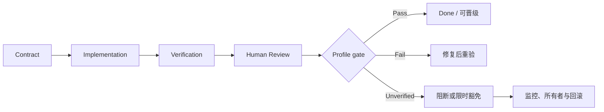
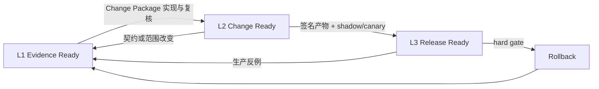

# 附录 E：Definition of Done 检查表

迁移任务的 Definition of Done（DoD）不是“代码已生成”或“CI 绿色”，而是一个可审计判定：行为、实现、验证、责任与恢复证据达到所选风险 profile。本附录只引用第 13 章唯一 schema `chapter-13/profile-schema-v1`，不定义第二套 Profile 或状态；下表可复制到 Change Package。[E4-CHANGE-PACKAGE][E4-VERIFICATION-LADDER]

## 判定值

- `Pass`：有可重放证据证明满足要求；
- `Fail`：证据证明不满足；
- `Unverified`：尚未运行、环境不可用或证据不足；
- `N/A`：有书面理由证明不适用，并由评审者确认。

`Unverified` 不得写成 `Pass`。它默认阻断该 profile 的完成，除非迁移负责人批准限时豁免，并记录影响、监控与回滚。

## 通用 DoD

复制下表后，每行填写 `status`，并将 `evidence` 写成稳定 run ID 或可寻址日志；`owner`、`reviewed_at` 和适用时的 `waiver_id` 不得省略。表格因此能区分尚未审阅、验证失败、证据缺失与确实不适用，而不是依赖一个含义不明的空复选框。

| requirement_id | 要求 | status | evidence_run_ids | owner / reviewed_at | waiver_id / notes |
|---|---|---|---|---|---|
| CONTRACT-01 | 唯一行为意图、现状、目标与非目标已入 Task Contract | `<status>` | `<run/ref>` | `<owner/time>` | `<waiver/notes>` |
| CONTRACT-02 | 七字段 `I/O/X/S/E/P/U` 都有比较或治理规则，且 `non_goals` 必填 | `<status>` | `<run/ref>` | `<owner/time>` | `<waiver/notes>` |
| CONTEXT-01 | Context Manifest 的授权与实际访问可追溯 | `<status>` | `<run/ref>` | `<owner/time>` | `<waiver/notes>` |
| SCOPE-01 | 路径与语义未越界，机械与行为修改已分离 | `<status>` | `<run/ref>` | `<owner/time>` | `<waiver/notes>` |
| BASELINE-01 | commit、平台、feature、工具链与 oracle 身份固定 | `<status>` | `<run/ref>` | `<owner/time>` | `<waiver/notes>` |
| SAFETY-01 | Safety Profile 已填写且无未处理 Fail/Unverified | `<status>` | `<run/ref>` | `<owner/time>` | `<waiver/notes>` |
| TEST-01 | 行为修复有失败先行的永久 Rust 回归 | `<status>` | `<run/ref>` | `<owner/time>` | `<waiver/notes>` |
| TEST-02 | 相关单元、进程级集成与静态门禁通过 | `<status>` | `<run/ref>` | `<owner/time>` | `<waiver/notes>` |
| DIFF-01 | 外部/差分发现已分类、最小化并固化 | `<status>` | `<run/ref>` | `<owner/time>` | `<waiver/notes>` |
| FUZZ-01 | fuzz/性质测试与风险相称，seed 可重放 | `<status>` | `<run/ref>` | `<owner/time>` | `<waiver/notes>` |
| EVIDENCE-01 | 命令、提交、版本、退出状态、日志与未运行项齐全 | `<status>` | `<run/ref>` | `<owner/time>` | `<waiver/notes>` |
| OWNER-01 | 人类所有者能解释实现、证据、风险与回退 | `<status>` | `<run/ref>` | `<owner/time>` | `<waiver/notes>` |
| REVIEW-01 | 独立评审已处理，拒绝意见有技术理由 | `<status>` | `<run/ref>` | `<owner/time>` | `<waiver/notes>` |
| RELEASE-01 | 发布、监控与回滚责任人已确认 | `<status>` | `<run/ref>` | `<owner/time>` | `<waiver/notes>` |

这些责任要求与 uutils 的贡献规则一致：AI 辅助变更仍由驱动它的人负责，行为变化与兼容修复需要测试，外部差异应回到项目自身的回归库。[E2-AI-OWNERSHIP][E2-NO-TEST-NO-MERGE][E2-AI-POLICY]

## 五种可组合 Profile 的追加项

`selected_profiles` 是数组，枚举严格为 `mechanical | local_behavior | shared_core | safety_critical | release_default`；命中多个触发条件时取要求并集，不能以较轻 Profile 覆盖较重维度。

| Profile / requirement_id | 触发与追加要求 | status | evidence / owner / waiver |
|---|---|---|---|
| `mechanical` / MECH-01 | 仅移动或命名；机械差异审核，移动前后目标与回归一致 | `<status>` | `<refs>` |
| `local_behavior` / LOCAL-01 | 单一局部契约；最小复现、red/green、相关 utility 测试和原子回退 | `<status>` | `<refs>` |
| `shared_core` / SHARED-01 | 公共 crate/错误/路径/平台层；影响矩阵、feature/target、代表消费者与第二评审 | `<status>` | `<refs>` |
| `safety_critical` / SAFE-01 | `unsafe`、FFI、权限、删除、原子替换或安全路径；专项评审、故障/竞态测试与恢复演练 | `<status>` | `<refs>` |
| `release_default` / DEFAULT-01 | 默认 provider 或广泛流量；shadow/canary、代表性、告警、观察窗口和值班 | `<status>` | `<refs>` |
| `release_default` / DEFAULT-02 | 使用真实产物演练 provider、包或版本回退并满足恢复目标 | `<status>` | `<refs>` |
| `release_default` / DEFAULT-03 | 生产反例已清理、最小化并回流永久回归 | `<status>` | `<refs>` |



## 豁免记录

```yaml
waiver_id: "WV-2026-001"
requirement: "尚未完成的 DoD 条目"
original_status: "Unverified"
reason: "为什么当前无法验证"
risk: "最坏影响与受影响范围"
compensating_controls:
  - "额外监控或流量限制"
approved_scope: "允许继续的 artifact/platform/cohort"
excluded_scope: "仍被阻断的声明与流量"
monitor: "具名指标与所有者"
threshold: "触发撤销的精确条件"
rollback: "触发条件与操作入口"
owner: "承担风险的人类角色"
approver: "有权批准该风险的人类角色"
expires_at: "明确日期或下一发布门"
closure_evidence: "到期前需要补充的证据"
verification_basis: "LimitedWithWaiver"
human_decision: "Waive"
lifecycle_state: "Proposed | Active | Closed | Revoked"
```

豁免不能永久把未知变成已知。到期时只有三种合法结果：补齐证据并转为 `Pass`，发现问题转为 `Fail`，或由有权角色重新评估并创建新的限时决定。DoD 因而不是静态打勾表，而是迁移状态能否晋级的证据门。

## 三个 DoD 判定级别

为了让团队在不同阶段说清“完成到哪里”，本附录定义三个**判定级别**：L1 Evidence Ready、L2 Change Ready、L3 Release Ready。它们不是第六、第七种 Profile，也不按风险替代五种可组合 Profile；每一级都对 `selected_profiles` 的要求并集做一次更严格的状态判定。

### L1 — Evidence Ready：可以进入实现评审

L1 证明问题、边界和验证入口已经成形，不证明补丁可以合并。适用于第 3—10 章从差异发现到永久回归的交接。

| L1 要求 | 通过条件 | 常见失败返回 |
|---|---|---|
| 契约可裁决 | 七字段 `K=(I,O,X,S,E,P,U)` 每项有比较/治理策略，`non_goals` 与允许差异明确 | 回第 3 章补观测或找行为所有者 |
| 上下文合法 | Context Manifest 已批准并能把实际访问追到授权 | 回第 4 章收窄/审批，污染则隔离 |
| 基线可重放 | 候选、oracle、平台、fixture、命令、seed 固定 | 回第 9 章修 harness |
| 失败先行 | RED run 在修复前稳定失败，失败字段正是契约字段 | 回第 8 章重写测试 |
| 风险已分类 | `selected_profiles` 与 Safety 维度已由触发条件选择 | 回第 13 章补影响矩阵 |

L1 输出至少为 `Behavior Contract + Context Manifest + RED run + risk classification`。如果任务是调查而非实现，L1 也可以作为合法终点：例如 oracle 不稳定或平台不可用时，团队保留最小证据并停止，不强行生成代码。

### L2 — Change Ready：可以合并原子变更

L2 在 L1 之上证明候选变更、永久测试和人类责任形成一个可接受/拒绝/撤销的 Change Package。它对应代码合并门，而不是生产默认门。

| L2 要求 | 通过条件 | 常见失败返回 |
|---|---|---|
| 原子性 | 一个行为意图；机械与语义提交可分辨；diff 未越界 | 回第 6 章拆任务 |
| red/green | 同一测试、fixture 与比较器在基线红、候选绿 | 回实现或测试层，不允许换 oracle 掩盖差异 |
| Profile 并集 | 所有选中实现 Profile 的适用条目均 Pass/N/A | Fail 回修；Unverified 默认阻断 |
| 影响覆盖 | 直接/共享消费者、feature、target 和平台矩阵与风险相称 | 回第 5、7、8 章补覆盖 |
| 独立评审 | 人类能解释实现、不变量、证据、未知项和 Git 回退 | 回第 12 章补包或拒绝 |

L2 输出是不可拆分的 Change Package：契约、manifest 关闭/暂停状态、最小 diff、永久回归、运行账本、风险说明、评审决定与原子代码回退。`release_default` 不进入 L2 的 `selected_profiles`；预规划写入 `planned_profiles`。独立的 L3/release package 引用 L2，选择 `release_default` 并生成生产证据。

### L3 — Release Ready：可以晋级或维持默认

L3 只适用于真实 provider、默认路径、广泛流量或系统关键部署，必须选择 `release_default`，并保留其他已命中的 Profile。它证明的是特定 cohort、版本和观察窗口下可以晋级，不是永久保证。

| L3 要求 | 通过条件 | 常见失败返回 |
|---|---|---|
| 真实产物一致 | shadow、canary 与回滚使用同一签名 artifact/config | 回构建与 provenance 门 |
| 代表性 | cohort 覆盖契约定义的 workload、平台和风险维度 | 留在当前状态并补样本 |
| 门限与所有者 | hard/soft 指标、窗口、kill switch、值班角色预先固定 | 不得开始流量 |
| 回滚演练 | provider/包/配置切回满足恢复目标，状态恢复另有证明 | 回第 14 章修恢复路径 |
| 生产反例闭环 | 差异冻结、脱敏、最小化并进入永久回归 | 回第 10、12 章，不只修线上 |
| 时间边界 | 结论记录 artifact、cohort、开始/结束与 `as of` | 证据过期后重新判定 |

L3 的“Pass”只授权下一次预定晋级或在当前状态继续，不授权跳过中间 cohort。任何 hard gate 越界先执行 kill switch，再讨论根因；发布负责人不能等待 Agent 生成补丁后才回退。不可逆副作用还要有数据恢复证明，provider 切回只能恢复未来执行路径，不能自动恢复已经删除或覆盖的状态。



## 判定记录模板

```yaml
dod_decision:
  task_id: "MIG-UTILITY-001"
  l2_change_package_ref: "CP-MIG-UTILITY-001@sha256:..."
  release_package: "RP-MIG-UTILITY-001@sha256:..."
  requested_level: "L3"
  profile_schema_ref: "chapter-13/profile-schema-v1"
  selected_profiles:
    - "local_behavior"
    - "safety_critical"
    - "release_default"
  evaluated_requirements:
    - {id: "CONTRACT-01", status: "Pass", evidence: ["BC-001"], owner: "...", reviewed_at: "RFC3339"}
    - {id: "SAFE-01", status: "Pass", evidence: ["RUN-SAFE-001"], owner: "...", reviewed_at: "RFC3339"}
  machine_evaluation:
    eligible_for_next_stage: true
    verification_basis: "Direct"
  human_decisions:
    - {role: "release owner", identity: "person/service identity", decision: "Approve", scope: "promote_next_cohort", object_hash: "sha256:...", reason: "L3 evidence accepted", decided_at: "RFC3339", signature_ref: "sig:..."}
  authorized_transition: "promote_next_cohort"
  artifact_scope: "commit/artifact/config/cohort"
  decided_by: ["behavior owner", "required specialist", "release owner"]
  decided_at: "RFC3339"
  valid_until: "time or next baseline change"
  exceptions: []
```

判定必须引用第 13 章 schema 版本，避免不同章节复制同名 Profile 后逐渐漂移。requirement `status` 只能是 `Pass | Fail | Unverified | N/A`；人工 `Approve | Reject | Waive` 不改写机器检查事实，waiver 只把 `verification_basis` 设为 `LimitedWithWaiver`。新的 requirement 先进入规范接口，再由附录模板引用。

## 完整例外记录与处置

例外只允许在失败模式可限定、补偿控制可执行且回滚可靠时使用。行为契约无法裁决、clean-room 污染、kill switch 不可用、不可逆数据恢复未证明等基础条件，不应通过普通豁免跨越。组织应列出 `non_waivable_requirements`，并由治理负责人变更该列表。

```yaml
exception_record:
  exception_id: "EXC-PLATFORM-2026-004"
  task_id: "MIG-SHARED-008"
  requested_level: "L2"
  requirement_ids: ["SHARED-01/platform-windows-runtime"]
  original_status: "Unverified"
  reason: "目标 Windows runner 在本发布窗口不可用；仅完成 compile check"
  evidence_of_constraint: ["RUNNER-INC-774", "COMPILE-WIN-008"]
  bounded_scope:
    artifact: "candidate commit sha"
    platforms: ["linux", "macOS"]
    excluded: ["windows runtime support claim"]
    traffic: "N/A; no default release"
  worst_case: "Windows 调用者可能出现未观测的路径/错误差异"
  probability_basis: "未知；不得写 low"
  compensating_controls:
    - "文档与 package metadata 明确 Windows runtime Unverified"
    - "阻止 release_default profile 与 Windows artifact 发布"
    - "Windows runner 恢复后自动创建验证任务"
  rollback: "撤销共享变更；兼容接口在撤销顺序中最后移除"
  detection: "Windows CI 恢复事件 + owner 每周检查"
  owner: "shared-core owner"
  approvers: ["platform reviewer", "migration lead"]
  approved_at: "RFC3339"
  expires_at: "2026-09-01T00:00:00Z"
  closure_conditions:
    - "真实 Windows 进程级矩阵 Pass，转正常完成"
    - "发现差异则转 Fail 并撤销/修复"
  current_state: "Active"
  supersedes: null
  closure_evidence: []
  verification_basis: "LimitedWithWaiver"
  human_decision: "Waive"
```

例外评审要问：范围是否技术上被限制，而不只是文档承诺；监控是否能在损害扩大前发现；回滚是否处理已经发生的状态；到期时谁会被自动通知；若验证永远不可用，产品是否应正式缩小支持范围。`probability_basis` 没有数据时必须写未知，不能为了批准流程主观填“低概率”。

例外状态为 `Proposed -> Active -> Closed`，也可以在新证据出现时变为 `Revoked`。续期必须创建新记录并引用旧记录，重新评估最坏影响、补偿控制和证据；直接修改 `expires_at` 会破坏决策历史。关闭时引用补齐的 run 或撤销证据，并让受限发布配置回到正常策略。

## 三个级别的使用边界

“L1 已完成”不能出现在合并结论中代替 L2，“L2 已完成”不能出现在 rollout 报告中代替 L3。反过来，L3 事故也不意味着之前 L2 一定错误：可能是 cohort 不具代表性、监控缺口或生产新环境；真正的闭环是把反例送回 L1，更新契约与永久测试，再生成新的 L2/L3 证据。

团队可以为纯文档机械任务停在 L2 并只选择 `mechanical`；局部行为任务通常走 L1/L2；默认迁移必须走完 L1/L2/L3。级别描述状态，Profile 描述风险维度，两者形成二维判定，既避免“所有任务都跑最高成本”，也避免“高风险任务用低风险模板打勾”。
