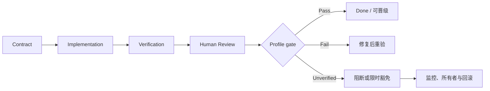

# 附录 E：Definition of Done 检查表

迁移任务的 Definition of Done（DoD）不是“代码已生成”或“CI 绿色”，而是一个可审计判定：行为、实现、验证、责任与恢复证据达到所选风险 profile。下表可复制到 Change Package；正文第 13 章解释其原理，本附录只提供执行表。[E4-CHANGE-PACKAGE][E4-VERIFICATION-LADDER]

## 判定值

- `Pass`：有可重放证据证明满足要求；
- `Fail`：证据证明不满足；
- `Unverified`：尚未运行、环境不可用或证据不足；
- `N/A`：有书面理由证明不适用，并由评审者确认。

`Unverified` 不得写成 `Pass`。它默认阻断该 profile 的完成，除非迁移负责人批准限时豁免，并记录影响、监控与回滚。

## 通用 DoD

复制下表后，每行填写 `status`，并将 `evidence` 写成稳定 run ID 或可寻址日志；`owner`、`reviewed_at` 和适用时的 `waiver_id` 不得省略。表格因此能区分尚未审阅、验证失败、证据缺失与确实不适用，而不是依赖一个含义不明的空复选框。

| requirement_id | 要求 | status | evidence_run_ids | owner / reviewed_at | waiver_id / notes |
|---|---|---|---|---|---|
| CONTRACT-01 | 唯一行为意图、现状、目标与非目标已入 Task Contract | `<status>` | `<run/ref>` | `<owner/time>` | `<waiver/notes>` |
| CONTRACT-02 | 输入、stdout、stderr、退出状态和副作用有比较规则 | `<status>` | `<run/ref>` | `<owner/time>` | `<waiver/notes>` |
| CONTEXT-01 | Context Manifest 的授权与实际访问可追溯 | `<status>` | `<run/ref>` | `<owner/time>` | `<waiver/notes>` |
| SCOPE-01 | 路径与语义未越界，机械与行为修改已分离 | `<status>` | `<run/ref>` | `<owner/time>` | `<waiver/notes>` |
| BASELINE-01 | commit、平台、feature、工具链与 oracle 身份固定 | `<status>` | `<run/ref>` | `<owner/time>` | `<waiver/notes>` |
| SAFETY-01 | Safety Profile 已填写且无未处理 Fail/Unverified | `<status>` | `<run/ref>` | `<owner/time>` | `<waiver/notes>` |
| TEST-01 | 行为修复有失败先行的永久 Rust 回归 | `<status>` | `<run/ref>` | `<owner/time>` | `<waiver/notes>` |
| TEST-02 | 相关单元、进程级集成与静态门禁通过 | `<status>` | `<run/ref>` | `<owner/time>` | `<waiver/notes>` |
| DIFF-01 | 外部/差分发现已分类、最小化并固化 | `<status>` | `<run/ref>` | `<owner/time>` | `<waiver/notes>` |
| FUZZ-01 | fuzz/性质测试与风险相称，seed 可重放 | `<status>` | `<run/ref>` | `<owner/time>` | `<waiver/notes>` |
| EVIDENCE-01 | 命令、提交、版本、退出状态、日志与未运行项齐全 | `<status>` | `<run/ref>` | `<owner/time>` | `<waiver/notes>` |
| OWNER-01 | 人类所有者能解释实现、证据、风险与回退 | `<status>` | `<run/ref>` | `<owner/time>` | `<waiver/notes>` |
| REVIEW-01 | 独立评审已处理，拒绝意见有技术理由 | `<status>` | `<run/ref>` | `<owner/time>` | `<waiver/notes>` |
| RELEASE-01 | 发布、监控与回滚责任人已确认 | `<status>` | `<run/ref>` | `<owner/time>` | `<waiver/notes>` |

这些责任要求与 uutils 的贡献规则一致：AI 辅助变更仍由驱动它的人负责，行为变化与兼容修复需要测试，外部差异应回到项目自身的回归库。[E2-AI-OWNERSHIP][E2-NO-TEST-NO-MERGE][E2-AI-POLICY]

## 五种可组合 Profile 的追加项

`selected_profiles` 是数组；命中多个触发条件时取要求并集，不能以较轻 Profile 覆盖较重维度。

| Profile / requirement_id | 触发与追加要求 | status | evidence / owner / waiver |
|---|---|---|---|
| Mechanical / MECH-01 | 仅移动或命名；机械差异审核，移动前后目标与回归一致 | `<status>` | `<refs>` |
| Local Behavior / LOCAL-01 | 单一局部契约；最小复现、red/green、相关 utility 测试和原子回退 | `<status>` | `<refs>` |
| Shared Core / SHARED-01 | 公共 crate/错误/路径/平台层；影响矩阵、feature/target、代表消费者与第二评审 | `<status>` | `<refs>` |
| Safety Critical / SAFE-01 | `unsafe`、FFI、权限、删除、原子替换或安全路径；专项评审、故障/竞态测试与恢复演练 | `<status>` | `<refs>` |
| Release Default / DEFAULT-01 | 默认 provider 或广泛流量；shadow/canary、代表性、告警、观察窗口和值班 | `<status>` | `<refs>` |
| Release Default / DEFAULT-02 | 使用真实产物演练 provider、包或版本回退并满足恢复目标 | `<status>` | `<refs>` |
| Release Default / DEFAULT-03 | 生产反例已清理、最小化并回流永久回归 | `<status>` | `<refs>` |



## 豁免记录

```yaml
waiver_id: "WV-2026-001"
requirement: "尚未完成的 DoD 条目"
reason: "为什么当前无法验证"
risk: "最坏影响与受影响范围"
compensating_controls:
  - "额外监控或流量限制"
rollback: "触发条件与操作入口"
owner: "承担风险的人类角色"
approver: "有权批准该风险的人类角色"
expires_at: "明确日期或下一发布门"
closure_evidence: "到期前需要补充的证据"
```

豁免不能永久把未知变成已知。到期时只有三种合法结果：补齐证据并转为 `Pass`，发现问题转为 `Fail`，或由有权角色重新评估并创建新的限时决定。DoD 因而不是静态打勾表，而是迁移状态能否晋级的证据门。
