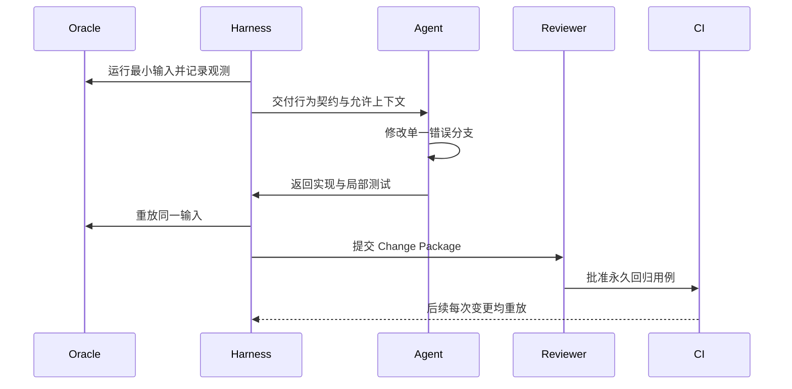
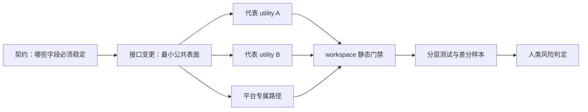
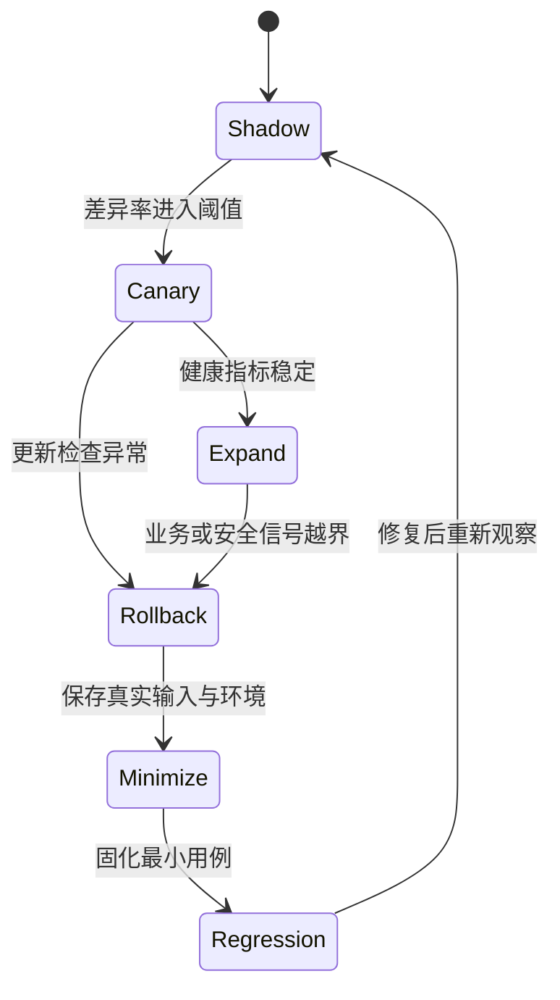

# 附录 A：三条端到端迁移轨迹

本附录把正文中的方法串成三条完整轨迹。它们不是三个“标准答案”，而是三种常见风险的演练脚本：命令行语义漂移、共享基础设施变更，以及进入生产后的兼容事故。每条轨迹都从可观察事实出发，以永久证据和可恢复发布结束。

## 轨迹一：一个退出码差异如何进入回归库

场景：Rust 实现在“输入文件不存在、同时给出静默选项”时返回 `1`，旧实现返回 `2`。输出文本看起来合理，功能演示也能完成，但 shell 脚本把退出码作为分支条件，因此这是行为破坏，而非文案偏好。

操作顺序如下。

1. 依据第 3 章记录输入、环境、stdout、stderr、退出码与文件系统副作用。本例明确把退出码列为强兼容字段，不用“命令失败了”这种模糊描述。
2. 依据第 4 章建立上下文许可：Agent 可以读公开规范、黑盒执行记录和 Rust 项目代码，不得读受限制的参考实现源码。oracle 是行为来源，不是代码来源。
3. 依据第 6 章把任务收缩成“修复这一组输入下的退出码”，不顺手重写错误框架，也不整理不相关文案。
4. 依据第 8、9 章先写一个会失败的 Rust 集成测试，再用差分 harness 证明测试确实复现已观测差异。比较器应逐字段报告，不把 stdout 一致误当成整体一致。[E1-DIFF-FUZZ][E2-UUFUZZ-COMPARE]
5. 依据第 10 章把输入最小化，删除不影响失败的选项、路径层次和环境变量；保存可复制的 seed、平台和 oracle 版本。
6. 依据第 12、13 章提交 Change Package：行为意图、最小实现、回归测试、门禁结果、风险与责任人必须同时存在。

验收不是“Agent 说修好了”，而是：新测试在旧 Rust 提交上失败、在候选提交上通过；差分运行中退出码相同；静态与相关测试门禁全部通过；评审者能从包内材料解释为什么 `2` 是契约要求。这个轨迹跨越第 3、4、6、8、9、10、12、13 章，展示了从未知差异到永久资产的最短闭环。

这条轨迹可用下面的工件账本演练。固定源码锚点为 `fuzz/uufuzz/src/lib.rs` 的结果比较，以及 `CONTRIBUTING.md` 的兼容修复流程；它们只提供案例形状，不把虚构退出码归给真实 utility。[E2-UUFUZZ-COMPARE][E2-COMPAT-WORKFLOW]

| 阶段 | 输入 | 产物 ID | 失败返回 |
|---|---|---|---|
| Contract | 黑盒记录 `oracle=2/candidate=1` | `BC-EXIT-017` | 契约无法裁决则回第 3 章补规范/负责人决定 |
| Context | 允许规范、观测与候选 Rust 路径 | `CTX-EXIT-017` | 请求未授权来源则回第 4 章审批 |
| Reproduce | 双沙箱执行包 | `RUN-EXIT-017-RED` | 不能稳定重放则回第 9 章修夹具 |
| Repair | 单一错误分支与回归 | `CP-EXIT-017` | 需要共享接口则回第 6 章新建任务 |
| Verify | red/green、静态与目标测试 | `DOD-EXIT-017` | 任一项 Unverified 则阻断或显式豁免 |

简化 Task Contract 片段为 `profiles: [local_behavior]`、`stop_conditions: [需要共享接口, oracle 不可重放]`。最终 Change Package 至少列出 `BC-EXIT-017`、修复提交、`RUN-EXIT-017-RED/GREEN`、风险所有者和 Git 级原子回退；这比“测试已通过”的口头交接多出了可定位的责任边。

## 轨迹二：共享错误层变更如何控制爆炸半径

场景：团队要修改共享错误类型，让不同 utility 统一携带退出码和诊断上下文。改动位于公共 crate，局部代码很少，但可能影响大量命令、平台条件和错误文本。这里最危险的误判是把“小 diff”当成“小风险”。uutils 的共享 `uucore`、统一错误桥接和 workspace lint 展示了这种架构的收益，也同时说明共享层需要更强验证。[E1-ARCH][E2-UUCORE][E2-ERROR-MODEL]

执行时，迁移负责人先建立影响矩阵，而不是立即让 Agent 全仓修改。矩阵至少包含：直接调用者、间接错误转换、不同退出码、是否比较 stderr、Unix/Windows 条件、feature 组合和外部消费者。然后把工作拆成三个原子包：先增加兼容的新接口；再迁移少量代表调用者并验证；最后才批量迁移剩余调用者。机械改名与语义变化分开提交，使评审能识别真正改变行为的部分。[E2-ATOMICITY]

测试也按风险扩张。第一圈是错误类型的单元性质：退出码传播、source 链和格式化不丢失。第二圈是代表 utility 的进程级集成测试，覆盖成功、普通失败和平台错误。第三圈是 workspace 编译、Clippy、格式和依赖策略。第四圈才是外部套件与差分测试，检查共享修改是否改变可观察诊断。[E2-STATIC-GATES][E2-TEST-COMMANDS][E2-EXTERNAL-SUITES]

如果候选实现需要 `unsafe` 或 FFI，附录 D 的 Safety Profile 自动升级：必须把前置条件、所有权、生命周期和平台假设写到最小封装旁，由人类评审。若只是为了方便格式化或绕开类型系统，则退回重构设计，不把“编译通过”当成安全证明。[E2-RUST-SAFETY]

最终 Change Package 要特别说明 blast radius：哪些调用者已验证，哪些只被编译覆盖，哪些平台尚未运行；未验证项不能被无声标记为通过。这个轨迹跨越第 5、6、7、8、11、12、13 章，说明公共层迁移应以风险覆盖面而非代码行数定级。

对应工件可以这样编号：`IMPACT-ERR-004` 保存直接/间接消费者和平台矩阵；`API-ERR-004` 只增加兼容接口；`CP-ERR-004-A/B` 分别迁移代表 utility；`RUN-ERR-004-*` 保存 workspace 与进程测试。源码锚点使用 `src/uucore/src/lib/mods/error.rs`、workspace `Cargo.toml` 和 `DEVELOPMENT.md`，让评审能从共享抽象追到实际门禁。[E2-ERROR-MODEL][E2-LINTS][E2-TEST-COMMANDS]

Task Contract 应选择 `profiles: [shared_core]`；若出现 FFI，则组合为 `[shared_core, safety_critical]`，而不是把它误写成“production”。停止条件包括：调用者矩阵无法列全、safe wrapper 前提不成立、目标平台只有编译没有运行。任一条件触发时，返回第 5 章重新划接缝或第 6 章拆任务。最终 Change Package 的 DoD 摘要要逐项列出代表消费者、未运行平台和独立评审者，不能用全仓测试总数替代影响证明。

## 轨迹三：生产中的 `date` 兼容事故如何反哺流程

场景来自 Ubuntu 25.10：官方说明记录了一个后来已修复的 `date` 兼容问题，它会让部分系统停止自动检查更新，影响云、容器、桌面和服务器环境；修复版本为 `0.2.2-0ubuntu2.1` 或更高。[E3-DATE-INCIDENT] 这里的重点不是复盘某一行代码，而是观察一个看似普通的基础命令如何通过脚本和运维链路放大影响。

这条轨迹从第 14 章的发布状态机开始。系统在 shadow 或 canary 阶段不仅要统计进程崩溃，还应监控退出码分布、关键脚本成功率、自动更新的新鲜度和回退触发量。若只观察“命令能启动”，就无法发现下游调度链已经停止。

事故发生后，第一动作是利用预先设计的 provider 切换或包级回退恢复服务，而不是等待重新训练模型或生成更大补丁。第二动作是冻结证据：命令行、区域设置、时区、环境变量、输入时间格式、调用脚本和软件包版本。第三动作遵循第 10 章闭环，把真实案例最小化并转成 Rust 回归测试；涉及外部套件差异时，同样进入项目自身的永久测试库。[E2-NO-TEST-NO-MERGE][E4-DISCOVER-LOOP]

随后进行两类根因审查。语义审查询问：行为契约是否漏掉某种时间格式、输出布局、退出状态或环境依赖？系统审查询问：为何监控没有更早发现更新检查停滞，canary 是否覆盖对应机器类型，回滚是否足够快？修复只有同时补强实现证据和运行证据，才能再次晋级。

第 15 章提醒我们，Rust 的内存安全收益、审计进展与迁移价值并不消除兼容风险；Ubuntu 26.04 仍保留 GNU 回退，并在当时对 `cp`、`mv`、`rm` 采用 GNU 实现，说明生产迁移可以按 utility 和风险分层，而不必追求一次性纯化。[E3-AUDIT-UPDATE][E3-RELEASE-26.04] 这条轨迹跨越第 9、10、12、14、15、16 章，把事故转化为下一轮更强的契约、测试、监控和发布门禁。

这条轨迹的工件链为：事故事实 `INC-DATE-2025-10-23`，受控重放 `RUN-DATE-001`，最小契约 `BC-DATE-001`，回归与修复包 `CP-DATE-001`，以及重新扩流的 `ROLLOUT-DATE-002`。生产事实来自 Ubuntu 官方事故记录；具体实现根因若不在允许证据中，不由本书猜测。[E3-DATE-INCIDENT]

Task Contract 选择 `[local_behavior, release_default]`；若问题进入更新或权限安全链路，再组合 `safety_critical`。失败分支不是只有“代码未修好”：如果监控不能证明更新新鲜度，返回第 14 章补观测；如果真实输入不能安全脱敏，返回第 4 章的数据权限审查；如果回退后仍有部分系统状态未恢复，迁移停在 Default 之前。最终 DoD 除 red/green 测试外，还必须引用实际 provider 回退演练、观察窗口和值班所有者。

## 如何使用这三条轨迹

项目启动时，任选一条与当前风险最接近的轨迹做桌面演练。团队应能现场指出每一步的责任人、输入证据、输出制品、失败状态和回退动作。若某一步只能回答“到时让 Agent 判断”，说明控制面仍有缺口；若某个门禁没有可保存的输出，它就还不是可审计门禁。轨迹的价值不在于流程图完整，而在于让行为、证据、责任与恢复动作在同一条链上闭合。
