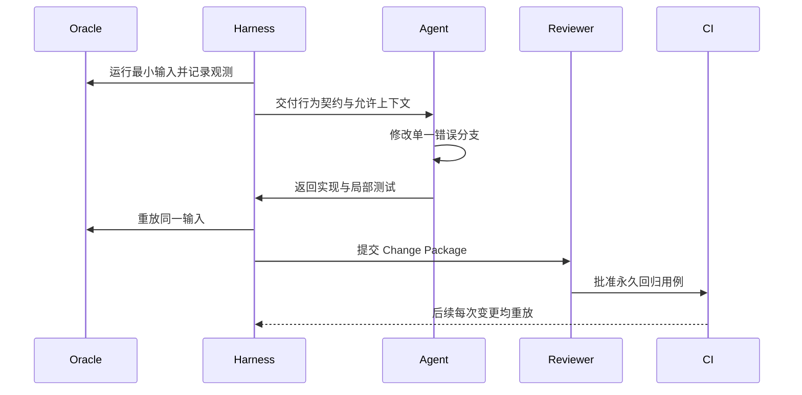
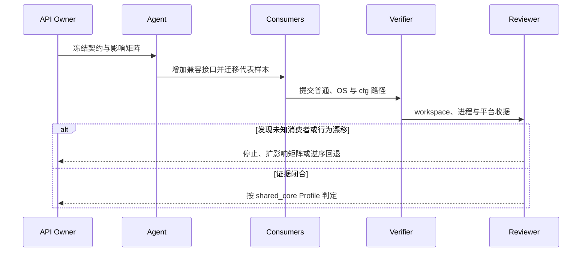
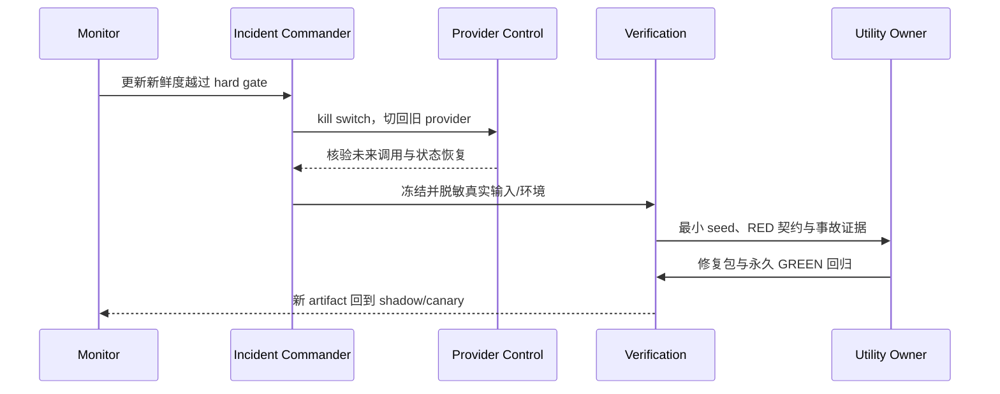

# 附录 A：三条端到端迁移轨迹

本附录把正文中的方法串成三条完整轨迹。它们不是三个“标准答案”，而是三种常见风险的演练脚本：命令行语义漂移、共享基础设施变更，以及进入生产后的兼容事故。每条轨迹都从可观察事实出发，以永久证据和可恢复发布结束。

## 轨迹一：一个退出码差异如何进入回归库

场景：Rust 实现在“输入文件不存在、同时给出静默选项”时返回 `1`，旧实现返回 `2`。输出文本看起来合理，功能演示也能完成，但 shell 脚本把退出码作为分支条件，因此这是行为破坏，而非文案偏好。

操作顺序如下。

1. 依据第 3 章建立完整七字段 `K=(I,O,X,S,E,P,U)`：输入/前态 `I`，stdout/stderr `O`，退出/信号/超时 `X`，副作用 `S`，环境 `E`，平台能力 `P`，非确定性与未知 `U`；另将 `non_goals` 列为必填。本例明确把退出码列为强兼容字段，不用“命令失败了”这种模糊描述。
2. 依据第 4 章建立上下文许可：Agent 可以读公开规范、黑盒执行记录和 Rust 项目代码，不得读受限制的参考实现源码。oracle 是行为来源，不是代码来源。
3. 依据第 6 章把任务收缩成“修复这一组输入下的退出码”，不顺手重写错误框架，也不整理不相关文案。
4. 依据第 8、9 章先写一个会失败的 Rust 集成测试，再用差分 harness 证明测试确实复现已观测差异。比较器应逐字段报告，不把 stdout 一致误当成整体一致。[E1-DIFF-FUZZ][E2-UUFUZZ-COMPARE]
5. 依据第 10 章把输入最小化，删除不影响失败的选项、路径层次和环境变量；保存可复制的 seed、平台和 oracle 版本。
6. 依据第 12、13 章提交 Change Package：行为意图、最小实现、回归测试、门禁结果、风险与责任人必须同时存在。

验收不是“Agent 说修好了”，而是：新测试在旧 Rust 提交上失败、在候选提交上通过；差分运行中退出码相同；静态与相关测试门禁全部通过；评审者能从包内材料解释为什么 `2` 是契约要求。这个轨迹跨越第 3、4、6、8、9、10、12、13 章，展示了从未知差异到永久资产的最短闭环。

这条轨迹可用下面的工件账本演练。固定源码锚点为 `fuzz/uufuzz/src/lib.rs` 的结果比较，以及 `CONTRIBUTING.md` 的兼容修复流程；它们只提供案例形状，不把虚构退出码归给真实 utility。[E2-UUFUZZ-COMPARE][E2-COMPAT-WORKFLOW]

| 阶段 | 输入 | 产物 ID | 失败返回 |
|---|---|---|---|
| Contract | 黑盒记录 `oracle=2/candidate=1` | `BC-EXIT-017` | 契约无法裁决则回第 3 章补规范/负责人决定 |
| Context | 允许规范、观测与候选 Rust 路径 | `CTX-EXIT-017` | 请求未授权来源则回第 4 章审批 |
| Reproduce | 双沙箱执行包 | `RUN-EXIT-017-RED` | 不能稳定重放则回第 9 章修夹具 |
| Repair | 单一错误分支与回归 | `CP-EXIT-017` | 需要共享接口则回第 6 章新建任务 |
| Verify | red/green、静态与目标测试 | `DOD-EXIT-017` | 任一项 Unverified 则阻断或显式豁免 |

简化 Task Contract 使用 `profile_schema_ref: "chapter-13/profile-schema-v1"`、`selected_profiles: ["local_behavior"]` 和停止条件。Change Package 至少列出 `BC-EXIT-017`、修复提交、`RUN-EXIT-017-RED/GREEN`、风险所有者与原子回退。

### 轨迹一的正常分支

行为所有者先运行两次独立黑盒观测，确认同一基线、locale 和输入下 oracle 都返回 `2`。第一次结果只用于发现，第二次才证明夹具可重放。随后创建 `BC-EXIT-017`：`I` 固定 argv/前态，`O` 规定 stdout 精确为空且 stderr 只比较已批准类别，`X` 精确为 `2`，`S` 要求文件树无变化，`E/P` 固定 locale 与平台，`U` 记录动态临时路径映射为 `<TMP>`，`non_goals` 排除全局诊断重写。这里的退出码/输出摘要只是讲解子集，不能替代完整七字段契约；也不能在发现差异后临时增加归一化。

Context Manifest `CTX-EXIT-017-v1` 只允许公开规范、观测 JSON、目标 Rust 模块和目标测试。harness 本身由验证负责人维护，Agent 可以调用但不能改比较器；若比较器也需要修复，另建任务。RED run 记录候选 commit、oracle 身份、容器 digest，以及七字段契约对应的完整 argv/env 与实际观测值。验证负责人交换执行顺序再跑一次，排除缓存和共享目录污染。

Agent 的第一份候选只改错误分支并增加进程级测试。评审者用 `git diff` 确认没有顺便统一诊断框架；静态门禁和目标 utility 测试通过后，使用同一 case 生成 GREEN run。最小化器删除一个选项时差异消失，因此该选项保留在 seed，并记录“不可再删”的理由。最后把 seed 从外部 corpus 复制成项目自身测试数据，使以后无需 oracle 也能检查契约。[E2-NO-TEST-NO-MERGE][E4-DISCOVER-LOOP]

Change Package 通过 L2 Change Ready：契约、manifest 关闭证明、原子 diff、RED/GREEN、永久回归和人类评审齐全。合并后 CI 使用项目测试而非外部聊天或临时文件。一次差异由此完成 `Discover -> Minimize -> Codify -> Repair -> Verify`，并将 oracle 的临时知识转成候选仓库的永久资产。

### 轨迹一的失败分支与回退点

失败分支 A：oracle 两次分别返回 `2` 和 `1`。任务停在 L1 前，不能由多数投票决定契约。验证负责人检查时间、locale、随机性和共享状态；行为所有者决定是固定环境、允许集合，还是声明 oracle 不适合作此字段。此时合法交付是 `RUN-EXIT-017-A/B` 与未决问题，不生成“可能正确”的补丁。

失败分支 B：修复必须改变共享错误 API。Agent 不得扩大 `allowed_paths`，而是提交 impact sketch 并停止。所有者可新建 `[shared_core]` 契约，或选择在 utility 边界做局部映射。原任务的 RED run仍有效，但不能把共享改动塞进同一 Change Package。

失败分支 C：GREEN 只靠放宽 stderr/exit 比较器得到。评审直接判 `Fail`，回到契约或实现；测试变化与实现变化应能分别解释。失败分支 D：候选通过但基线也通过，说明测试没有捕获原问题，返回第 8 章重建 red/green，不能把它当“额外覆盖”关闭任务。

本轨迹有三个回退点：编码前可撤销 Context run 且无代码；合并前可丢弃候选原子 diff；合并后可撤销单一提交。因为没有持久化数据变化，Git 回退足够；若真实任务修改数据格式，则必须升级风险并另写状态恢复。回退发生时保留 RED case，不删除发现证据。

| 工件 | 内容哈希/身份 | 所有者 | 保留期 | 回退/失败用途 |
|---|---|---|---|---|
| `BC-EXIT-017` | contract v1 | behavior owner | 随回归长期保留 | 判断比较器是否越界 |
| `CTX-EXIT-017-v1` | manifest + access events | context owner | 按政策 | 证明未读禁止源码 |
| `RUN-EXIT-017-RED` | oracle/candidate 双结果 | verification owner | 长期摘要 | 重建问题 |
| `SEED-EXIT-017` | 最小 argv/env/fixture | test owner | 仓库生命周期 | 后续永久回归 |
| `CP-EXIT-017` | diff、GREEN、评审 | maintainer | 版本历史 | 原子接受或撤销 |

桌面验收时，主持人随机隐藏一个工件，让团队判断流程应停在哪里：缺 `BC` 不能裁决 GREEN，缺 manifest 不能证明来源合法，缺 RED 不能证明回归命中旧问题，缺最小 seed 会让永久测试依赖外部 oracle。演练只有在另一位成员能从账本重放命令、指出唯一语义 diff，并在两分钟内说明原子撤销入口时通过。若回答需要翻查聊天历史，轨迹仍未形成可交接资产。

最后交换 oracle 与 candidate 的执行顺序再重放一次；结果随顺序变化时，应视为共享状态污染而非真实兼容结论。

## 轨迹二：共享错误层变更如何控制爆炸半径

场景：团队要修改共享错误类型，让不同 utility 统一携带退出码和诊断上下文。改动位于公共 crate，局部代码很少，但可能影响大量命令、平台条件和错误文本。这里最危险的误判是把“小 diff”当成“小风险”。uutils 的共享 `uucore`、统一错误桥接和 workspace lint 展示了这种架构的收益，也同时说明共享层需要更强验证。[E1-ARCH][E2-UUCORE][E2-ERROR-MODEL]

执行时，迁移负责人先建立影响矩阵，而不是立即让 Agent 全仓修改。矩阵至少包含：直接调用者、间接错误转换、不同退出码、是否比较 stderr、Unix/Windows 条件、feature 组合和外部消费者。然后把工作拆成三个原子包：先增加兼容的新接口；再迁移少量代表调用者并验证；最后才批量迁移剩余调用者。机械改名与语义变化分开提交，使评审能识别真正改变行为的部分。[E2-ATOMICITY]

测试也按风险扩张。第一圈是错误类型的单元性质：退出码传播、source 链和格式化不丢失。第二圈是代表 utility 的进程级集成测试，覆盖成功、普通失败和平台错误。第三圈是 workspace 编译、Clippy、格式和依赖策略。第四圈才是外部套件与差分测试，检查共享修改是否改变可观察诊断。[E2-STATIC-GATES][E2-TEST-COMMANDS][E2-EXTERNAL-SUITES]

如果候选实现需要 `unsafe` 或 FFI，附录 D 的 Safety Profile 自动升级：必须把前置条件、所有权、生命周期和平台假设写到最小封装旁，由人类评审。若只是为了方便格式化或绕开类型系统，则退回重构设计，不把“编译通过”当成安全证明。[E2-RUST-SAFETY]

最终 Change Package 要特别说明 blast radius：哪些调用者已验证，哪些只被编译覆盖，哪些平台尚未运行；未验证项不能被无声标记为通过。这个轨迹跨越第 5、6、7、8、11、12、13 章，说明公共层迁移应以风险覆盖面而非代码行数定级。

对应工件可以这样编号：`IMPACT-ERR-004` 保存直接/间接消费者和平台矩阵；`API-ERR-004` 只增加兼容接口；`CP-ERR-004-A/B` 分别迁移代表 utility；`RUN-ERR-004-*` 保存 workspace 与进程测试。源码锚点使用 `src/uucore/src/lib/mods/error.rs`、workspace `Cargo.toml` 和 `DEVELOPMENT.md`，让评审能从共享抽象追到实际门禁。[E2-ERROR-MODEL][E2-LINTS][E2-TEST-COMMANDS]

Task Contract 使用 `profile_schema_ref: "chapter-13/profile-schema-v1"` 和 `selected_profiles: ["shared_core"]`；出现 FFI 时后者改为 `["shared_core", "safety_critical"]`。调用者矩阵不全、safe wrapper 前提不成立或目标平台仅编译时停止，返回第 5/6 章。DoD 摘要逐项列出代表消费者、未运行平台和独立评审者。

### 轨迹二的正常分支

共享层所有者从静态调用图、workspace 依赖和代码搜索建立 `IMPACT-ERR-004`，再由两个 utility 维护者人工补充宏、feature 和间接转换。矩阵不是为了证明“所有消费者都会工作”，而是给每个消费者标验证层：直接单测、代表进程测试、compile-only 或未覆盖。Unix 与 Windows 分开，错误码、路径编码和 cfg 分支都成为采样维度。

第一包 `API-ERR-004` 只添加兼容接口：旧调用者继续编译和运行，新接口能携带退出码与上下文。它没有大规模迁移，因此可单独评审 API 不变量。第二包迁移一个普通用户错误和一个 OS I/O 错误，故意选择不同 source 链；第三个代表样本覆盖平台 cfg。每包都有旧接口/新接口的行为对照，机械调用点替换与语义映射不放在同一提交。

测试顺序从共享单元性质开始：错误码保留、source 链不丢、格式化不 panic。进程层再验证 stdout/stderr、退出与路径；workspace 静态门禁检查所有未迁移消费者仍能编译。外部差分只选择契约声明需要精确或分类兼容的样本，不能用整库巨大通过率掩盖某个高风险错误分支。[E2-STATIC-GATES][E2-TEST-COMMANDS]

当三个代表样本通过，评审者检查 safe Rust 边界与平台假设。`IMPACT-ERR-004` 中 compile-only 的平台保持 `Unverified runtime`；若产品政策允许本次合并，例外必须限制平台声明并到期，不能改成 Pass。L2 判定引用 `[shared_core]` 的影响矩阵和第二评审。后续批量迁移以新的 Task Contract 进行，不由本包无限承载。

### 轨迹二的失败分支与回退点

失败分支 A：代码搜索发现一个无法归属的外部消费者。公共 API 删除被阻断，兼容接口继续保留；所有者先确认支持政策、版本窗口和 deprecation。失败分支 B：统一类型无法表达某平台 errno 或路径字节。不得把它格式化成字符串以求接口整齐，而应回第 5 章重画错误接缝，必要时保留平台枚举或原始 code。

失败分支 C：Agent 提议用 `unsafe` 转换生命周期以保持旧 API。任务立即暂停，组合 `safety_critical` 并启用附录 D 的 Unsafe/FFI 维度；如果 safe wrapper 前提不能被所有调用者满足，则拒绝候选。失败分支 D：workspace 通过，但代表 utility 的诊断顺序改变。共享单元测试无法证明进程行为，返回第 8 章补进程级契约与回归。

回退必须遵守依赖顺序。批量消费者已经迁到新接口时，先撤消费者，再撤 API；直接删除新接口会让工作树无法构建。若新错误格式已写入持久日志协议或被外部解析，Git 回退也可能造成双向不兼容，必须先恢复兼容输出层。本演练明确把日志格式列为非目标，从而让代码回退保持充分。

| 工件 | 关键字段 | 责任人 | 失败时动作 |
|---|---|---|---|
| `IMPACT-ERR-004` | caller/feature/target/verification level | shared owner | 不完整则不删旧 API |
| `API-ERR-004` | 新旧接口不变量 | API reviewer | 恢复兼容接口 |
| `CP-ERR-004-A/B` | 代表调用者 diff | utility owners | 逆序撤消费者 |
| `RUN-ERR-004-*` | unit/process/workspace/platform | verification owner | 按失败层返回测试或设计 |
| `DOD-ERR-004` | `[shared_core]` 并集 | independent reviewer | Unverified 限制支持声明 |

这条正常与失败链跨第 5 章的架构接缝、第 6 章的原子化、第 7—9 章的分层验证、第 11 章的人类审查和第 13 章的 Profile 判定。它说明共享层的“完成”是一张影响证明，而非小 diff 的视觉印象。

桌面演练增加一次“第四个调用者”注入：主持人在评审末尾揭示一个 feature-gated 消费者。团队若直接补进当前 diff，说明停止条件没有执行；正确动作是冻结 L2 判定、更新影响矩阵、评估旧兼容接口是否足以隔离，再决定升版契约或新建原子包。随后模拟逆序回退，确认 API 在最后一个消费者撤回前仍存在，测试命令能区分 API 包、代表迁移包和后续批量包。验收者还应随机选择一个 compile-only 平台，要求报告明确写 `Unverified runtime`，而不是把 workspace 编译绿灯解释成平台兼容。最后检查第二评审者是否独立于实现搜索者，能从不变量和调用者矩阵解释接受理由。

再注入一次旧接口使用量未知的情形：若团队没有版本化弃用窗口和外部消费者政策，就只能保留兼容接口，不能把仓库内调用点归零当作删除许可。演练输出应把“已验证的内部消费者”和“支持政策覆盖的外部消费者”分栏，并为后者指定所有者、发现渠道和到期决策。这样共享层回退计划才不会依赖一个未经证明的封闭世界假设。

最终判定必须由接口所有者签署并注明基线。

## 轨迹三：生产中的 `date` 兼容事故如何反哺流程

场景来自 Ubuntu 25.10：官方说明记录了一个后来已修复的 `date` 兼容问题，它会让部分系统停止自动检查更新，影响云、容器、桌面和服务器环境；修复版本为 `0.2.2-0ubuntu2.1` 或更高。[E3-DATE-INCIDENT] 这里的重点不是复盘某一行代码，而是观察一个看似普通的基础命令如何通过脚本和运维链路放大影响。

这条轨迹从第 14 章的发布状态机开始。系统在 shadow 或 canary 阶段不仅要统计进程崩溃，还应监控退出码分布、关键脚本成功率、自动更新的新鲜度和回退触发量。若只观察“命令能启动”，就无法发现下游调度链已经停止。

事故发生后，第一动作是利用预先设计的 provider 切换或包级回退恢复服务，而不是等待重新训练模型或生成更大补丁。第二动作是冻结证据：命令行、区域设置、时区、环境变量、输入时间格式、调用脚本和软件包版本。第三动作遵循第 10 章闭环，把真实案例最小化并转成 Rust 回归测试；涉及外部套件差异时，同样进入项目自身的永久测试库。[E2-NO-TEST-NO-MERGE][E4-DISCOVER-LOOP]

随后进行两类根因审查。语义审查询问：行为契约是否漏掉某种时间格式、输出布局、退出状态或环境依赖？系统审查询问：为何监控没有更早发现更新检查停滞，canary 是否覆盖对应机器类型，回滚是否足够快？修复只有同时补强实现证据和运行证据，才能再次晋级。

第 15 章提醒我们，Rust 的内存安全收益、审计进展与迁移价值并不消除兼容风险；Ubuntu 26.04 仍保留 GNU 回退，并在当时对 `cp`、`mv`、`rm` 采用 GNU 实现，说明生产迁移可以按 utility 和风险分层，而不必追求一次性纯化。[E3-AUDIT-UPDATE][E3-RELEASE-26.04] 这条轨迹跨越第 9、10、12、14、15、16 章，把事故转化为下一轮更强的契约、测试、监控和发布门禁。

这条轨迹的工件链为：事故事实 `INC-DATE-2025-10-23`，受控重放 `RUN-DATE-001`，最小契约 `BC-DATE-001`，回归与修复包 `CP-DATE-001`，以及重新扩流的 `ROLLOUT-DATE-002`。生产事实来自 Ubuntu 官方事故记录；具体实现根因若不在允许证据中，不由本书猜测。[E3-DATE-INCIDENT]

Task Contract 使用 `profile_schema_ref: "chapter-13/profile-schema-v1"` 与 `selected_profiles: ["local_behavior", "release_default"]`；进入更新或权限安全链路时追加 `"safety_critical"`。监控不能证明更新新鲜度就回第 14 章，真实输入不能脱敏就回第 4 章，状态未恢复则停在 Default 前；DoD 还须引用 provider 回退演练、观察窗口和值班所有者。

### 轨迹三的正常分支

在 rollout 前，发布负责人定义 `ROLLOUT-DATE-001`：shadow 不改变用户结果，候选在独立状态目录和只读/快照输入上执行；canary 只进入带 cohort 标签的少量代表机器。指标包含命令级差异率、调用更新检查的业务成功率、最近成功更新时间、provider 回退次数和支持信号。更新新鲜度是结果指标，进程无崩溃只是实现指标。

kill switch 在 canary 前用将要发布的签名包演练。演练记录发现阈值、决策时间、切换开始/结束、健康恢复和残留状态；release commander 有权限独立执行，不依赖 Agent 或新构建。配置回滚与状态恢复分开：切回 provider 只影响未来调用，已经错过的更新检查需要受控补跑并验证时间戳。

canary 假设先稳定，随后某个机器类型的更新新鲜度越过 hard gate。正常事故处理路径不是继续扩流观察，而是立即冻结、kill switch、provider 切回、核验受影响 cohort，再保存最小必要证据。官方事故记录支撑影响与修复版本；实现级根因仍由项目在允许上下文中重放，不从结果反推源码。[E3-DATE-INCIDENT]

脱敏 bundle `RUN-DATE-001` 固定 locale、timezone、命令、软件包版本和调用脚本的可观察接口。第 10 章的最小化将生产案例压成 `BC-DATE-001`，第 8 章加入 red/green，第 12 章形成 `CP-DATE-001`。修复包先回 shadow，确认旧事故 seed 和宽邻域样本，再进入新的 `ROLLOUT-DATE-002`；旧 canary 的通过证据不能转移给新 artifact。

新的 L3 判定要求观察窗口结束、hard/soft gate 都有解释、回滚再次演练、值班交接完成。只有修复版本和 cohort 满足这些条件，才授权下一档扩流。生产事故因此增加四项永久资产：行为契约、回归 seed、更新新鲜度指标和回滚核验，而不是只留下某个版本号。

### 轨迹三的失败分支与回退点

失败分支 A：shadow 与旧 provider 共享缓存或状态目录。差异可能来自执行顺序，候选也可能污染用户路径；状态直接判 Fail，回第 14 章重建 stateful isolation，不能开始 canary。失败分支 B：canary 样本量大但全部来自同一镜像。它不覆盖云、容器、桌面和服务器风险维度，代表性门禁失败，扩流暂停。

失败分支 C：指标能看到命令退出，却不能看到更新是否新鲜。团队必须补结果指标和数据责任人；不能用 crash rate 作为代理。失败分支 D：真实 bundle 含客户标识或凭证。Context Manifest 进入 Paused/Quarantined，由数据所有者脱敏并生成新 hash；原始材料不交给 Agent。

失败分支 E：provider 已切回，但部分机器仍未恢复更新。此时 rollout 回退成功、业务恢复失败，两项不能合并成“回滚成功”。发布负责人继续状态修复、盘点遗漏 cohort，并保持默认迁移关闭。失败分支 F：修复回归只覆盖已知 seed，邻域 fuzz 又发现新的时间格式差异。Change Package 返回 Repair/Verify，不能因为事故窗口压力绕过。

本轨迹有四个回退点：shadow 前撤销 artifact；shadow 异常时丢弃候选状态目录；canary 越界时 kill switch/provider 切回；状态异常时从快照或业务恢复入口修复。每一步都记录恢复目标和实际耗时。代码 Git revert 是后续工程动作，不是线上第一响应。

| 工件 | 账本内容 | 所有者 | 保留/回退作用 |
|---|---|---|---|
| `ROLLOUT-DATE-001` | artifact、cohort、阈值、窗口 | release owner | 决定何时冻结/切回 |
| `INC-DATE-*` | 通知时间、检测信号、受影响范围 | incident commander | 区分事实与推断 |
| `RUN-DATE-001` | 脱敏重放环境 | data + verification owners | 进入最小化而不泄露原文 |
| `BC/CP-DATE-001` | 契约、修复、red/green | utility owner | 永久防回归 |
| `ROLLBACK-DATE-001` | provider 与状态恢复时间线 | release owner | 证明恢复目标，不只证明开关存在 |
| `ROLLOUT-DATE-002` | 新 artifact 的全新证据 | release owner | 禁止继承旧 canary 结论 |

这条链跨第 4 章上下文权限、第 9—10 章差分闭环、第 12 章 Change Package、第 14 章状态化 shadow/回滚、第 15 章生产边界和第 16 章流水线。成功定义不是“最终没有事故”，而是事故触发可恢复动作，并使下一次契约、测试和发布门比上一次更强。

轨迹三的桌面验收不讨论实现补丁，先注入 hard gate 告警并计时。值班者必须在没有 Agent 的情况下识别 artifact/cohort、执行 kill switch、切回 provider，再分别核验命令路径与更新新鲜度；若只确认包版本，状态恢复尚未完成。演练记录从检测到决策、从决策到切换、从切换到业务恢复三段时间，并故意安排一个未被 cohort 查询捕获的离线节点，验证盘点与补跑策略。只有证据冻结、脱敏责任、回归回流负责人和下一次 rollout 的新 run ID 都明确，演练才算闭环。

## 如何使用这三条轨迹

项目启动时，任选一条与当前风险最接近的轨迹做桌面演练。团队应能现场指出每一步的责任人、输入证据、输出制品、失败状态和回退动作。若某一步只能回答“到时让 Agent 判断”，说明控制面仍有缺口；若某个门禁没有可保存的输出，它就还不是可审计门禁。轨迹的价值不在于流程图完整，而在于让行为、证据、责任与恢复动作在同一条链上闭合。
