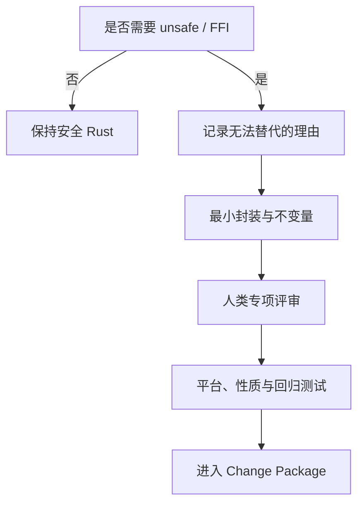

# 附录 D：Rust Safety Profile

本清单把 Rust 迁移中的安全主张拆成可检查约束。Rust 能显著压缩内存和并发错误空间，但不能自动证明 CLI 语义、权限处理、文件系统原子性或系统集成正确。Safety Profile 必须与行为契约和测试证据同时使用。[E2-RUST-SAFETY][E4-VERIFICATION-LADDER]

## 基线配置

### 类型与控制流

- [ ] 外部输入使用可失败解析，不以 `unwrap`、`expect` 或索引假定输入合法；
- [ ] library 层以 `Result` 传播错误，不直接 `process::exit`；退出码在进程边界统一映射；
- [ ] 不用 panic 表达普通用户错误、I/O 错误或不支持的平台行为；
- [ ] 整数转换、长度计算和时间运算明确处理溢出与截断；
- [ ] 取消、超时和部分完成状态有明确语义；
- [ ] 错误上下文不吞掉原始 OS error，也不泄露不应公开的数据。

uutils 的共享 `UResult`/`UError` 与退出码桥接展示了把内部错误传播和 CLI 进程语义分层的做法；这是一种可借鉴的结构，不代表所有项目必须复制同一类型。[E2-ERROR-MODEL]

### 路径、字节与平台

- [ ] 文件路径保持为 `Path`/`OsStr` 等 OS 原生表示，未证明时不转换为 UTF-8；
- [ ] stdin/stdout 的二进制数据不经过会改变字节的文本层；
- [ ] Unix 权限、链接、设备文件、稀疏文件和扩展属性按适用范围测试；
- [ ] Windows 路径、换行、链接与错误码差异有条件编译和平台测试；
- [ ] locale、时区、编码与环境变量被列入行为契约；
- [ ] 平台不支持的行为返回稳定、可说明的错误，而不是静默退化。

### `unsafe` 与 FFI

- [ ] 默认禁止新 `unsafe`；确有需要时缩到最小模块和最小语句；
- [ ] 每个 `unsafe` 块写明调用者必须满足的前置条件和本地不变量；
- [ ] 指针有效期、别名、对齐、初始化、长度与所有权逐项说明；
- [ ] FFI 的 ABI、整数宽度、字符串终止、errno、nullability 与函数指针约束固定；
- [ ] 跨边界结构使用适用的 `#[repr(C)]`，布局、union 与动态库版本边界经过核验；
- [ ] panic/unwind 不跨越不允许展开的 FFI 边界；回调的生命周期、线程、重入和取消语义明确；
- [ ] 外部分配器与释放方匹配，资源句柄的所有权和关闭次数可验证；
- [ ] safe wrapper 不允许安全调用者制造未定义行为；
- [ ] 至少一位具备相应平台经验的人类评审；
- [ ] 能用稳定安全 API 表达时，不以性能猜测为由保留 `unsafe`。

### 文件系统与 TOCTOU

- [ ] 检查后使用的路径是否可能在两步之间被替换；
- [ ] 能使用句柄相对或原子系统接口时，不依赖“先检查再打开”；
- [ ] 临时文件创建避免可预测名称和不安全权限；
- [ ] rename、copy、remove 的跨文件系统和失败中间态被测试；
- [ ] 符号链接跟随策略属于显式契约；
- [ ] 权限提升或特权执行路径使用攻击者可控输入时进行威胁建模；
- [ ] 并发操作的幂等性、锁与恢复行为有可重复测试。

Ubuntu 的两阶段外部审计和当时对若干高风险文件操作工具的保守选择说明，内存安全语言并不会自动消除竞态和语义漏洞；发布决策应以具体发现、修复和验证为依据。[E3-AUDIT-UPDATE]

### 依赖与构建

- [ ] 新依赖的功能必要性、维护状态、许可证和 source 被审查；
- [ ] default features 和传递依赖可解释，禁用不需要的能力；
- [ ] lockfile 更新与功能修改分开或在 Change Package 中清楚归因；
- [ ] advisory、license、duplicate 和 source policy 作为自动门禁；
- [ ] MSRV、目标平台和 feature 组合被固定；
- [ ] 构建脚本、proc macro 和原生依赖按可执行代码审查。

uutils 在 workspace 层统一 lint，并通过 `deny.toml` 管理 advisory、许可证、重复依赖和来源策略，表明供应链验证应当进入常规门禁，而不是发布前人工突击。[E2-LINTS][E2-DENY]

## 与统一 DoD Profile 组合

本书只使用第 13 章定义的五种可组合 Profile：Mechanical、Local Behavior、Shared Core、Safety Critical、Release Default。Safety Profile 不另造“普通/共享/生产”三级：引入 `unsafe`、FFI、删除、覆盖、权限、身份、时间或更新链路时增加 `safety_critical`；修改公共错误、路径或平台抽象时增加 `shared_core`；改变默认 provider 或大范围流量时再增加 `release_default`。例如局部 FFI 修复可以是 `[local_behavior, safety_critical]`，并不会被错误提升为默认发布；共享 safe-Rust 重构也可以是 `[shared_core]`。命中多个 Profile 时取门禁并集。

## 审查结论

每项只能标记为 `Pass`、`Fail`、`Not applicable` 或 `Unverified`。`Unverified` 不是较弱的通过；它必须阻断发布，或附带有到期时间、风险所有者和回滚措施的书面豁免。最终结论应说明 Safety Profile 覆盖了哪些错误类别，又没有覆盖哪些语义与运行风险。诚实的边界比笼统的“Rust 更安全”更有工程价值。
