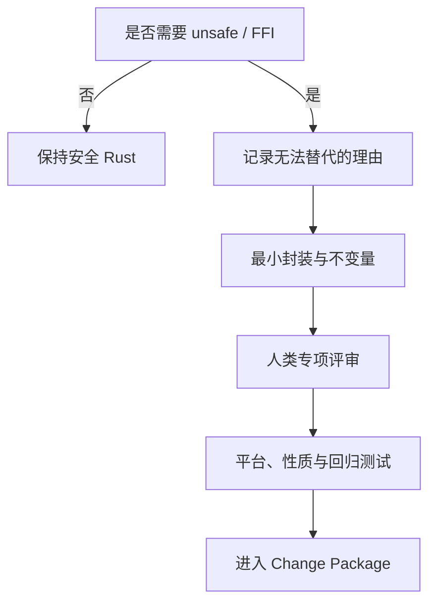

# 附录 D：Rust Safety Profile

本清单把 Rust 迁移中的安全主张拆成可检查约束。Rust 能显著压缩内存和并发错误空间，但不能自动证明 CLI 语义、权限处理、文件系统原子性或系统集成正确。Safety Profile 必须与行为契约和测试证据同时使用。[E2-RUST-SAFETY][E4-VERIFICATION-LADDER]

## 基线配置

### 类型与控制流

- [ ] 外部输入使用可失败解析，不以 `unwrap`、`expect` 或索引假定输入合法；
- [ ] library 层以 `Result` 传播错误，不直接 `process::exit`；退出码在进程边界统一映射；
- [ ] 不用 panic 表达普通用户错误、I/O 错误或不支持的平台行为；
- [ ] 整数转换、长度计算和时间运算明确处理溢出与截断；
- [ ] 取消、超时和部分完成状态有明确语义；
- [ ] 错误上下文不吞掉原始 OS error，也不泄露不应公开的数据。

uutils 的共享 `UResult`/`UError` 与退出码桥接展示了把内部错误传播和 CLI 进程语义分层的做法；这是一种可借鉴的结构，不代表所有项目必须复制同一类型。[E2-ERROR-MODEL]

### 路径、字节与平台

- [ ] 文件路径保持为 `Path`/`OsStr` 等 OS 原生表示，未证明时不转换为 UTF-8；
- [ ] stdin/stdout 的二进制数据不经过会改变字节的文本层；
- [ ] Unix 权限、链接、设备文件、稀疏文件和扩展属性按适用范围测试；
- [ ] Windows 路径、换行、链接与错误码差异有条件编译和平台测试；
- [ ] locale、时区、编码与环境变量被列入行为契约；
- [ ] 平台不支持的行为返回稳定、可说明的错误，而不是静默退化。

### `unsafe` 与 FFI

- [ ] 默认禁止新 `unsafe`；确有需要时缩到最小模块和最小语句；
- [ ] 每个 `unsafe` 块写明调用者必须满足的前置条件和本地不变量；
- [ ] 指针有效期、别名、对齐、初始化、长度与所有权逐项说明；
- [ ] FFI 的 ABI、整数宽度、字符串终止、errno、nullability 与函数指针约束固定；
- [ ] 跨边界结构使用适用的 `#[repr(C)]`，布局、union 与动态库版本边界经过核验；
- [ ] panic/unwind 不跨越不允许展开的 FFI 边界；回调的生命周期、线程、重入和取消语义明确；
- [ ] 外部分配器与释放方匹配，资源句柄的所有权和关闭次数可验证；
- [ ] safe wrapper 不允许安全调用者制造未定义行为；
- [ ] 至少一位具备相应平台经验的人类评审；
- [ ] 能用稳定安全 API 表达时，不以性能猜测为由保留 `unsafe`。

### 文件系统与 TOCTOU

- [ ] 检查后使用的路径是否可能在两步之间被替换；
- [ ] 能使用句柄相对或原子系统接口时，不依赖“先检查再打开”；
- [ ] 临时文件创建避免可预测名称和不安全权限；
- [ ] rename、copy、remove 的跨文件系统和失败中间态被测试；
- [ ] 符号链接跟随策略属于显式契约；
- [ ] 权限提升或特权执行路径使用攻击者可控输入时进行威胁建模；
- [ ] 并发操作的幂等性、锁与恢复行为有可重复测试。

Ubuntu 的两阶段外部审计和当时对若干高风险文件操作工具的保守选择说明，内存安全语言并不会自动消除竞态和语义漏洞；发布决策应以具体发现、修复和验证为依据。[E3-AUDIT-UPDATE]

### 依赖与构建

- [ ] 新依赖的功能必要性、维护状态、许可证和 source 被审查；
- [ ] default features 和传递依赖可解释，禁用不需要的能力；
- [ ] lockfile 更新与功能修改分开或在 Change Package 中清楚归因；
- [ ] advisory、license、duplicate 和 source policy 作为自动门禁；
- [ ] MSRV、目标平台和 feature 组合被固定；
- [ ] 构建脚本、proc macro 和原生依赖按可执行代码审查。

uutils 在 workspace 层统一 lint，并通过 `deny.toml` 管理 advisory、许可证、重复依赖和来源策略。[E2-LINTS][E2-DENY] 本书据此在 E4 层把供应链验证放入常规门禁，而不是发布前人工突击。[E4-VERIFICATION-LADDER]

## 与统一 DoD Profile 组合

本书只引用第 13 章 `chapter-13/profile-schema-v1` 的五个可组合枚举：`mechanical | local_behavior | shared_core | safety_critical | release_default`。Safety Profile 不另造“普通/共享/生产”三级：引入 `unsafe`、FFI、删除、覆盖、权限、身份、时间或更新链路时增加 `safety_critical`；修改公共错误、路径或平台抽象时增加 `shared_core`；改变默认 provider 或大范围流量时再增加 `release_default`。例如局部 FFI 修复可以是 `[local_behavior, safety_critical]`，并不会被错误提升为默认发布；共享 safe-Rust 重构也可以是 `[shared_core]`。命中多个 Profile 时取门禁并集。

## 五个安全维度的执行表

下面的 Path、Error、Unsafe/FFI、Concurrency、Platform 是检查维度，不是新的 DoD Profile 名称。Task Contract 先按第 13 章选择 Profile，再根据输入、副作用和实现接缝启用一个或多个维度。每一维都要写明适用理由、威胁、静态约束、动态证据、未验证边界和恢复动作。

### Path Safety：路径、链接与副作用

适用于任何创建、覆盖、复制、移动、删除、权限或元数据操作。路径安全的核心问题不只是“Rust 字符串不会越界”，而是路径在解析、遍历和使用之间是否仍指向预期对象。

- [ ] 根目录、当前目录、尾随分隔符、`.`、`..`、空组件与多分隔符进入测试矩阵；
- [ ] 相对路径的解析基准固定，任务中途改变工作目录不会静默改变目标；
- [ ] 符号链接策略逐操作声明：跟随、操作链接本身或拒绝；中间组件与最终组件分别考虑；
- [ ] 非 UTF-8 名称不因日志、排序或错误格式化而丢失字节；
- [ ] hard link、mount point、bind mount、设备文件、FIFO、socket 与稀疏文件按支持范围分类；
- [ ] `umask`、默认 ACL、扩展属性、所有者、权限位和时间戳的保留/改变是契约，而非实现偶然；
- [ ] overwrite、no-clobber、backup 与 interactive 路径在打开目标前后没有竞态窗口；
- [ ] 失败中间态可描述：临时文件、部分目标、源是否仍存在、目录项是否已替换；
- [ ] 临时对象使用不可预测且排他的创建，清理不跟随攻击者替换的路径；
- [ ] 回滚区分“撤销代码”和“恢复数据”，不可逆删除必须在执行前具备快照或备份边界。

证据包至少保存初始与最终文件树的结构化快照、inode/链接关系、权限与错误注入点。测试夹具应在可丢弃沙箱内运行；仅把真实路径复制到命令行并不构成生产等价验证。发现 TOCTOU 时，应优先改变 API 接缝与句柄生命周期，而不是增加一次存在性检查。

### Error Safety：错误、退出与可恢复状态

适用于所有外部输入和 I/O，修改共享错误层时同时启用 `shared_core`。错误安全同时保护兼容性和运营可诊断性。

- [ ] 每类可预期失败都通过 `Result` 或等价显式路径表达，普通用户错误不 panic；
- [ ] library 层不提前 `exit`，资源清理与进程退出码映射分开；
- [ ] 多个输入同时失败时，错误顺序、继续/停止策略和最终退出码有契约；
- [ ] stdout 与 stderr 不串流，二进制 stdout 不被诊断污染；
- [ ] OS error 的 code、category、path context 与用户文案分层，归一化不吞掉裁决字段；
- [ ] 部分成功有可识别状态，不能只以非零退出码掩盖已经发生的副作用；
- [ ] 重试只用于可安全重试的操作，次数、退避与幂等前提固定；
- [ ] 诊断不包含密钥、客户路径、环境变量全量或未脱敏输入；
- [ ] OOM、取消、超时、broken pipe 与信号路径按项目边界处理；
- [ ] 错误桥接的 source 链和退出码由代表调用者做进程级测试。

一个有用的反例是 `unwrap` 被移除后就宣布安全完成：若替换成统一错误码却改变 stderr 顺序、丢失已复制文件清单或让调用者无法区分重试，内存安全改善并没有保存行为契约。评审结论应分别回答“会不会未定义行为”“会不会返回错误结果”“失败后能否恢复”。

### Unsafe/FFI Safety：最小不安全边界

只要新增、扩大或重新解释 `unsafe`、原生调用、内存映射、信号 handler 或 ABI 边界，就组合 `safety_critical`。已有 `unsafe` 附近的纯 safe 修改，如果改变其前置条件，也视为命中。

- [ ] 记录安全 API 无法满足的具体能力，不用“性能更快”代替测量；
- [ ] `SAFETY` 说明覆盖每个原始指针的 provenance、有效区间、对齐、初始化和别名；
- [ ] 长度来自可信边界，乘加和窄化转换在进入 FFI 前检查；
- [ ] 借用数据不会被外部保留超过生命周期，回调 userdata 的释放与取消顺序固定；
- [ ] `errno`/last-error 在可能覆盖它的调用前读取，成功返回不误用旧错误；
- [ ] ABI、calling convention、`repr`、结构布局和目标版本由编译/运行双重核验；
- [ ] unwind、panic 与 longjmp 不跨越不允许的边界；signal handler 只做异步信号安全操作；
- [ ] 外部资源的 acquire/release 恰好一次，early return 与 panic 路径有 guard；
- [ ] safe wrapper 的全部公开输入都不能构造 UB，不能把证明责任推给安全调用者；
- [ ] Miri、sanitizer、模型检查或平台工具在适用处运行；未适用要说明覆盖缺口。

专项评审要从调用者逆向检查不变量，而不只读 `unsafe` 块内部。若一个 private unsafe helper 被多个平台 wrapper 调用，影响矩阵必须包含每个 caller 和 cfg 组合。回滚还要考虑 ABI/持久化状态是否已经外溢，单纯回退二进制可能不兼容。

### Concurrency Safety：竞态、取消与进程协作

线程安全类型只能约束数据竞争，不能自动证明文件系统竞态、锁顺序、跨进程原子性和取消语义。涉及并行遍历、后台任务、共享缓存、信号或多个进程操作同一树时启用本维度。

- [ ] 共享状态所有权、锁粒度、锁顺序和最大持锁 I/O 明确；
- [ ] 不在持锁时调用未知回调、阻塞外部进程或等待另一个可能反向取锁的任务；
- [ ] 原子变量的内存顺序有不变量解释，不能默认用 relaxed 追求性能；
- [ ] channel 关闭、发送者消失、worker panic 和队列满分别测试；
- [ ] 取消点定义哪些副作用已经提交，清理线程不会再次删除/覆盖用户数据；
- [ ] 并行输出的顺序属于契约时使用确定性合并，不属于时明确允许集合；
- [ ] 进程间锁处理 stale owner、崩溃释放、NFS/网络文件系统语义和超时；
- [ ] TOCTOU 用句柄与原子提交缩小，不用 mutex 假装控制外部进程；
- [ ] 测试包含受控调度、重复压力、故障注入和 seed，不能只跑一次；
- [ ] 生产指标能区分吞吐下降、死锁、活锁、重试风暴和资源泄漏。

并发失败经常不能靠 Git 回退恢复：候选可能留下锁文件、临时对象、半完成目录或重复任务。Task Contract 的 rollback 必须写清进程停止顺序、状态盘点、幂等清理和重新接管条件。

### Platform Safety：cfg、能力与真实运行

跨平台迁移需要区分“可编译”“可链接”“测试通过”“真实文件系统/权限下运行”。修改 cfg、平台抽象、系统调用或 feature 时通常组合 `shared_core`；若进入默认 provider，再组合 `release_default`。

- [ ] 支持矩阵列 OS、architecture、libc/ABI、filesystem、feature、权限模型与实际验证层级；
- [ ] cfg 分支无空洞：未知 target 明确编译失败或返回受控 unsupported，而非进入错误默认分支；
- [ ] 宽度相关类型、endian、时间范围、inode/uid/gid 与系统常量转换有边界测试；
- [ ] Windows 与 Unix 的路径前缀、链接、删除打开文件、大小写和错误码不被一套文本假设覆盖；
- [ ] locale、timezone database、换行和控制台编码分别固定；
- [ ] 权限测试不因 CI 总以管理员/root 运行而失真；特权与非特权均有夹具；
- [ ] 网络/用户空间文件系统、容器 overlay 与本地磁盘差异按产品范围取样；
- [ ] compile-only 平台明确标 `Unverified runtime`，不能算入“全平台通过”；
- [ ] 平台特定 fallback 不静默降低安全或兼容保证；
- [ ] 版本说明记录工具链、内核/系统版本和已知 exclusion。

平台证据应按能力而非 logo 取样。两个 Linux 发行版在同一文件系统与权限模型下可能提供重复信号，而同一发行版上的 ext4、overlay 与网络挂载可能暴露不同风险。代表性选择与第 14 章 cohort 设计一致：先定义风险维度，再选能覆盖维度的环境。

## 组合示例与升级规则

| 变更 | DoD Profiles | Safety 维度 | 必须新增的证据 |
|---|---|---|---|
| 局部数值解析 | `local_behavior` | Error | red/green、退出与无副作用 |
| 共享 `Path` helper | `shared_core` | Path + Error + Platform | 消费者矩阵、非 UTF-8、平台 run |
| FFI 元数据读取 | `local_behavior + safety_critical` | Path + Unsafe/FFI + Platform | 不变量、专项评审、ABI/平台测试 |
| 并行目录删除 | `local_behavior + safety_critical` | Path + Error + Concurrency | 故障调度、状态恢复、攻击性夹具 |
| 默认 provider 切换 | 前述集合再加 `release_default` | 所有命中维度 | shadow/canary、kill switch、真实回滚 |

若实现搜索中命中新的维度，Agent 应暂停并请求 Task Contract 升级。例如局部解析修复为了复用而移动到共享 crate，会增加 `shared_core`；safe API 候选退化为 FFI，会增加 `safety_critical`；开始真实默认流量才增加 `release_default`。Profile 的升级由可观察触发条件决定，不由代码行数、作者信心或截止压力决定。

## 审查结论

每项只能标记为 `Pass`、`Fail`、`Unverified` 或 `N/A`。`N/A` 必须有触发规则、理由与确认人；`Unverified` 不是较弱的通过。`Fail/Unverified` 默认阻断，只有人类 `Waive` 创建范围受限、到期且可回退的例外时，验证依据才可记为 `LimitedWithWaiver`，原状态不改变。最终结论应说明 Safety Profile 覆盖了哪些错误类别，又没有覆盖哪些语义与运行风险。
