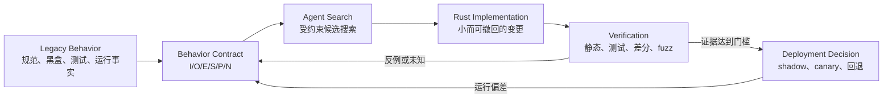

# 第 1 章：从代码翻译到行为重建

> **定位**：本章重新定义「迁移」：输入不是一棵等待翻译的源码树，而是一组带证据与边界的遗留行为；输出不是 Rust 代码本身，而是一个可由人类负责、可验证、可回退的候选实现。无前置章节；适用于准备拆分迁移范围、委派 AI Coding 任务或判断替换证据是否充分的读者。

## 一个“翻译正确”的失败现场

先看一个合成但可复现的工程现场。某内部工具 `publish-copy` 把生成物发布到固定路径。旧实现的正常路径很朴素：打开源文件、复制字节、返回成功。团队让 Agent 把核心复制循环迁到 Rust；代码通过编译，普通文件测试也通过，基准测试甚至更快。评审看见的 diff 几乎是逐句对应，于是把任务标成“迁移完成”。

故障注入改变了结论。目标路径原先保存着可工作的上一版文件；复制到第 4096 字节时，目标文件系统报告空间不足。Rust 候选正确地打印错误并返回非零，但它在复制前已经截断目标，失败后只留下 4096 字节的半成品。旧工具在同一条件下先写临时文件，失败时保留原目标。调用者下一次启动读到了损坏文件。

这个现场里，翻译没有明显的语法错误，失败分支也“被处理”了，甚至退出码方向都是对的。真正丢失的是一个没有出现在函数签名里的外部承诺：发布要么完整生效，要么维持上一版。若评审只比较函数结构，错误不可见；若测试只覆盖成功路径，错误不可见；若只断言非零退出码，错误仍不可见。必须比较执行前后的文件系统状态，才能看见迁移失败。

这就是本章的核心命题：

> **软件迁移是对可观察行为的重建，不是对源代码形状的翻译。**

源码可以是理解旧系统的一种材料，但不是替换成功的判据。调用者观察不到内部函数是否一一对应，却能观察参数是否接受、stdout 和 stderr 写了什么、进程怎样结束、资源如何改变，以及失败发生在什么时点。对基础软件而言，这些观察才是接口。

论文给出的 P1 是一个具体证据锚点：uutils 的目标被表述为 functional drop-in replacement；对 GNU coreutils 成功的调用，要求 uutils 调用也成功，并保持退出码、stdout 与文件系统结果一致，同时允许 stderr 更有信息量。[E1-P1] 这项事实并没有声称“所有迁移都应逐字复制一切”，也没有给出 AI 迁移方法；它说明兼容目标天然跨越进程输出与外部状态，而不是停在源码相似性。固定源码基线的贡献指南又把兼容、跨平台、可靠、性能与充分测试并列为项目目标。[E2-GOALS]

<!-- source: CONTRIBUTING.md -->
<!-- source: AGENTS.md -->

## 三个容易混淆的完成概念

迁移看板常把三个不同命题压成一个“完成百分比”。拆开之后，很多争论会立刻变得可判定。

**源代码相似**回答“候选是否沿用了相近的控制流或数据结构”。它有助于评审局部逻辑，却既非必要条件，也非充分条件。Rust 所有权和库边界可能使正确实现与旧源码不同；逐行相似也会遗漏路径字节、缓冲刷新和提交时点。

**功能存在**回答“命令、选项或入口是否出现”。它适合管理范围，却只能证明名义能力。两个程序都接受 `--atomic`，不代表它们在磁盘满、信号中断或目标已存在时语义相同。

**行为兼容**回答“在明确的输入、初始状态和环境中，候选产生的可观察结果是否落在允许集合内”。这里故意使用“允许集合”，而不是一律要求字节相等：项目可以允许更清晰的错误文本、不同的性能区间，或有意修复旧缺陷；但允许差异必须是被记录和批准的决定，不能由测试遗漏代替。

因此，迁移进度至少要有两条轴：实现状态与证据状态。“代码完成、关键失败路径未知”是精确信息；“95% 已迁移”如果没有说明剩余 5% 是否涉及数据损坏、权限或恢复路径，几乎不能支持发布决定。

## 七维行为表面

为了从遗留系统中检索行为，本章把一次调用展开成七个观察维度。它们不是七种测试工具，而是七类不能被源码翻译自动保留的外部事实。

| 维度 | 要盘点的问题 | 常见遗漏 |
|---|---|---|
| 1. 调用语法 | 参数顺序、组合、缩写、重复选项、环境变量和 stdin 怎样被解释？ | 只确认选项“存在”，未确认冲突优先级 |
| 2. 输入与初始状态 | 输入字节、路径类型、权限、已有文件、locale、工作目录是什么？ | 用空目录正常样本代表全部状态 |
| 3. 主输出 | 各终止路径下 stdout/主返回载荷的原始字节、排序、编码与格式是什么？ | 只看成功路径，或经 lossy UTF-8 转换后丢失差异 |
| 4. 诊断通道 | stderr 是否有内容，诊断属于什么语义类别，是否可本地化？ | 只比较文案或干脆忽略整个 stderr |
| 5. 终止语义 | 正常退出码、信号终止、超时、部分成功如何表达？ | 把“非零”视为所有失败的同一种结果 |
| 6. 外部状态转移 | 文件、权限、时间戳、链接、锁、网络或数据库怎样从前态变到后态？ | 只检查最终文件存在，不检查旧状态是否被破坏 |
| 7. 环境与时序 | 平台、文件系统、资源限制、并发观察、信号到达时点怎样改变结果？ | 单一 CI 平台通过后外推到所有环境 |

七维表面适合“发现”：它逼迫团队逐项询问还缺什么观察。进入契约阶段时，可以压缩为本书的可观察行为五元组：

\[
B = (I, O, E, S, P)
\]

其中 `I` 合并调用语法、输入与初态；`O` 是每种终止路径的 stdout 或主返回载荷；`E` 合并诊断与终止语义；`S` 是外部状态转移；`P` 是平台、资源和时序前提。七维是五元组的盘点视图。随后[第 3 章：兼容性不是功能列表，而是行为契约](ch03-behavior-contract.md)会增加非目标 `N`，把观察整理成可执行契约。

这种映射有一个重要效果：任何“实现某功能”的任务，都可以追问它在 `I/O/E/S/P` 上分别承诺什么。若答案只有 `O`，任务还不是一个可安全委派的迁移切片。

## 五类迁移失败

七维行为表面描述“观察什么”，下面五类失败描述“迁移为什么看似完成却不能替换”。这是本章的规范分类，后续章节遇到新反例时应优先归入其中，再决定是否需要扩展分类。

| 类别 | 典型现象 | 根因 | 首选工程机制 |
|---|---|---|---|
| F1 接口解释漂移 | 选项存在但组合、默认值或输入边界不同 | 把 API/CLI 名称对应当成语义对应 | 参数语法矩阵、生成式组合测试 |
| F2 输出与失败语义漂移 | 正常输出相近，但通道、退出码、错误优先级或部分成功不同 | 只迁移主路径，或把所有错误折叠成一个内部 `Err` | 原始字节采集、失败注入、退出状态契约 |
| F3 状态转移漂移 | 最终主文件相同，权限、链接、临时文件或失败后状态不同 | 把副作用视为实现细节，只比较返回值 | 前后状态快照、提交点与清理不变量 |
| F4 环境与时序漂移 | 本机通过，换平台、资源上限、并发或信号时失败 | 将测试夹具的环境偶然性误当成系统契约 | 平台分支契约、能力检测、资源/时序控制 |
| F5 证据外推失败 | 有限样本全绿，被表述为“完全兼容” | 把未发现反例误当成不存在反例 | 验证阶梯、覆盖账本、未知项与发布回退 |

F1 到 F4 是候选行为偏差，F5 是证据解释错误。分类允许多标签：按直接观察到的漂移标 F1–F3 主类，以环境触发标 F4，F5 可叠加在任何一类上。比较器若未采集权限，一百万次“相等”仍不能证明权限兼容；证据必须携带观察范围。

编译器可以拒绝本次配置下违反类型与借用规则的候选，却不覆盖 `unsafe`、未编译平台和外部语义。F1 的选项优先级、F2 的退出码、F3 的提交时点、F4 的平台假设和 F5 的外推，都仍需显式契约与验证。

## 从遗留行为到替换决定

本书采用同一条主链组织后续章节：



`Legacy Behavior` 不等于 `Legacy Source`。允许的规范、帮助文本、黑盒执行、测试、问题报告和生产观测都能提供事实；项目还须规定人和 Agent 能读什么。`Contract` 按风险选择切片并声明允许差异与未知；Agent 生成候选，Rust 承载候选，验证寻找反例，最终由人作发布决定。

这里的 **E4-SEARCHER 是本书作者的工程提炼，不是论文原结论**：把 Coding Agent 视为“约束下的实现搜索器”，而不是能从源码直接预言正确 Rust 程序的翻译器。[E4-SEARCHER] 同样，下面使用的验证阶梯也是本书综合的方法标签 [E4-VERIFICATION-LADDER]。论文 P1 和仓库规则提供事实约束，但没有提出这两个 AI 工作模型。

固定源码基线还规定了责任边界：驱动 Agent 的人负责其输出、应阅读 diff，审稿回复由人完成。[E2-AI-OWNERSHIP] 这意味着图中的箭头可以由自动化加速，契约选择、允许差异、证据解释和发布授权却不能被“模型说已完成”替代。

## 行为清单：从一句需求到可验证切片

下面用开篇的 `publish-copy` 演练一次完整盘点。它是方法案例，不是对 uutils 某个 utility 的事实描述。

**第 0 步：缩小行为意图。** 原任务“把发布工具迁到 Rust”不可判定。把它切成：`BC-PUBLISH-017`——当目标已存在且写入候选内容中途失败时，命令返回失败，原目标内容与元数据保持不变，不遗留可被误认为成功版本的临时文件。性能优化、诊断逐字兼容和跨文件系统发布不在本切片内。

**第 1 步：记录来源而非先写预期。** 团队在受控沙箱中执行允许使用的旧二进制，以固定输入复现磁盘满；保存命令参数、输入摘要、执行前后目录树、stdout/stderr 原始字节和退出状态。再用产品文档确认“原子发布”是有意承诺，而不是一次偶然观察。黑盒结果标为行为事实，产品决定标为契约裁决，两者不能混成一句“旧程序就是规范”。

**第 2 步：逐项走完七维表面。** 语法是 `publish-copy SRC DST`；初态是 `SRC` 可读、`DST` 已存在；成功 stdout 为空；失败诊断属写入失败类且退出非零；`DST` 内容、mode、mtime 不变且无临时文件；环境限定为 Linux 上指定文件系统，临时文件须同目录独占创建，故障在临时写入阶段注入。每项都写值，即使是“不比较具体文案”。

**第 3 步：标出 oracle 强度。** 原目标不变同时由产品文档和黑盒重复观察支持，强度高；stderr 只观察到一个平台的一种文案，契约只锁定通道和错误类别；信号恰好到达 rename 前后的语义尚未调查，必须列为未知，不能偷偷归入“已支持”。

**第 4 步：先构造会失败的验证。** 测试创建带已知内容和 mode 的目标，在第 4096 字节注入写失败，执行候选后断言：退出非零、stdout 为空、stderr 属于写失败、目标内容摘要和 mode 不变、目录中没有残留临时文件。负向夹具要先证明：若直接截断目标再写，测试确实失败；否则“绿色”可能只是断言没有观察到关键状态。

**第 5 步：交给 Agent 搜索最小实现。** 上下文只包含契约、允许资料、目标模块、测试入口和停止条件。Agent 可以选择临时文件、刷新、关闭、原子 rename 与清理顺序，但不得顺便统一全部错误文本或重构无关 I/O 层。测试暴露的是行为约束，不预设唯一内部设计。

**第 6 步：解释验证结果。** 编译通过排除类型与借用层面的候选错误；故障注入测试支持本平台、本文件系统、本失败时点下的不变量；普通成功测试防止修复破坏主路径。它们仍未覆盖跨文件系统、断电持久性、所有信号时点和其他平台。证据状态应写成“`BC-PUBLISH-017` 在声明环境通过，四项边界待调查”，而不是“publish-copy 完全兼容”。

**第 7 步：形成替换决定。** 若该切片是 canary 的必需条件，只有契约负责人确认允许差异、审稿人理解 diff、验证回执可重放且回退路径已准备，才进入下一状态。仓库规则所体现的“行为变化必须带测试、无测试不合并”正是这一原则的项目级实例。[E2-NO-TEST-NO-MERGE]

这次演练从输入证据一直走到替换决定，没有把“Agent 写完代码”当成终点。它也产生可复用资产：失败夹具、契约 ID、观察包、测试和未决边界。下一次出现相似差异，团队不必从聊天记录重新考古。

## 完整工程案例

将上述步骤放进拟真合成工作流，可以看到 F2–F5 怎样被拦截；F1 参数解释不在本切片内，另由语法矩阵验证。

迁移负责人先创建 `BC-PUBLISH-017`，指定一个实现者和一个契约负责人。实现者用允许的黑盒执行包确认旧行为，测试工程师建立可控的短写入适配器，使“第 4096 字节失败”不依赖真实磁盘被填满。第一版 Rust 候选直接打开 `DST` 写入：它通过正常复制测试，却被前后快照识别为 F3 状态转移漂移。Agent 根据反例改成同目录临时文件并在完成后提交。

第二版保住了内容，但测试发现失败清理时把诊断写到了 stdout；这是 F2。修正通道后，Linux 上全部通过。评审没有立刻宣布完成，而是看到 worksheet 中 `P` 仍只包含一种文件系统。作为未验证边界，假设另一平台观察到不同的临时文件权限继承，便会暴露 F4；团队应把本切片先限定到已验证平台并创建后续契约，而不是用条件分支伪装已经理解所有平台。

随后差分样本没有新差异，但证据负责人拒绝“完全兼容”：样本未覆盖信号与断电，属于 F5。变更包只证明受控写失败时的保旧与清理，不证明断电持久性或跨文件系统原子性。候选仅在隔离目标上重放流量进入 shadow，观察清理计数与失败率；真实目标上的有限执行才是 canary，越界即回退。

这个案例的完整性不在于“所有问题都解决”，而在于每个未知都有位置：要么被当前契约排除，要么进入后续任务，要么成为发布观察项。一个诚实的有限结论，比一个没有边界的“重写成功”更能支持工程决策。

## 反例

行为重建不等于盲目复制旧行为。假设旧工具在收到畸形输入时意外泄露内部路径，黑盒差分会把泄露文本识别为差异；若团队机械地让候选逐字相等，就会把旧缺陷永久化。正确处理是由安全与产品负责人把该现象分类为“不保留的旧行为”，在契约中记录允许差异，并增加负向测试，确保候选不再泄露。

另一个反例是过度建模。内部转换器的 stdout 若被下游解析为结构化数据，可以约束字段等价而非排版；stderr 若没有机器消费者且风险低，可以只约束语义类别。若预先枚举所有平台、locale 和时序，迁移会停在建模阶段。少写一个经过裁决的承诺，不等于忽略行为；它是在保护验证预算。

因此，旧实现只是证据源之一，不是自动拥有最终解释权的 oracle；行为表面是检索框架，不是要求所有字段永远字节相等。规范、安全要求、产品决定和实际观察发生冲突时，人必须记录裁决及其适用版本。

## 可复用工件

下面的 **Behavior Surface Worksheet** 可以直接复制到 issue、Task Contract 或 Change Package。它故意先记录事实与未知，再记录目标，避免 Agent 把自己的候选设计倒写成“遗留行为”。

```text
# Behavior Surface Worksheet
slice_id:
owner:
decision_owner:
baseline_version_or_commit:
allowed_evidence:
prohibited_evidence:

observed_surface:             # 遗留行为事实；每项引用 evidence_ledger
  invocation_grammar:        # argv/env/stdin 的解释
  input_and_initial_state:   # 输入字节、目录树、权限等
  output_by_outcome:         # 每种终止路径的原始主输出
  diagnostics:               # stderr 通道、类别、是否锁定文本
  termination:               # exit code / signal / timeout / partial success
  state_transition:          # before -> after，不变量与允许残留
  environment_and_timing:    # OS/FS/locale/resource/concurrency/signal

evidence_ledger:
  - claim:
    source_type:             # spec / black-box / test / incident / decision
    locator:
    observed_at:
    strength:

target_contract:
  behavior_intent:
  required_surface:          # I/O/E/S/P
  allowed_differences:
  non_goals:
  decision_owner:
unknowns:
risk_if_wrong:

verification:
  fast_gate:
  focused_test:
  differential_or_property:
  negative_control:
  platform_matrix:
  production_signal:

stop_conditions:
rollback:
result:
  implementation_state:
  evidence_state:
  residual_risk:
```

使用时至少做三项审查。第一，`surface` 七项不能留空；若不适用，要写理由。第二，`allowed_differences` 必须有决策者，不能写“测试先忽略”。第三，`negative_control` 要证明验证能看见目标缺陷：把一个已知错误候选放进去，它应当失败。worksheet 不是文档负担的终点，而是 Agent 输入、评审问题、测试回执和发布观察之间的共同索引。

对 `BC-PUBLISH-017`，`state_transition` 会写“失败后目标内容摘要、mode、mtime 不变，无临时文件”，`environment_and_timing` 写“同文件系统、受控短写入；信号与断电未覆盖”，`negative_control` 写“直接 truncate 目标的实现必须失败”。只看这三行，审稿人已经能区分本次结论与“所有复制语义兼容”。

## AI Coding 工作台

把 Agent 放进迁移流程时，工作台应显示约束与反馈，而不是只显示聊天窗口。一次最小工作循环包含五栏：

1. **证据栏**：只读且带来源类型，区分规范、黑盒观察、测试、事故与项目决定；在工具层阻断对禁止来源的访问。
2. **契约栏**：当前只处理一个行为意图，展示 `I/O/E/S/P/N`、允许差异、未知与停止条件。
3. **候选栏**：Agent 提交最小实现和对应测试，解释修改触及哪个契约条目，不用生成篇幅代表进度。
4. **反例栏**：保存失败输入、环境、前后快照、比较器版本和最小复现；失败先分类，不立即让 Agent 模仿参考输出。
5. **责任栏**：人类签署契约裁决、源码/许可证边界、diff 理解、残余风险和发布状态；Agent 的自评只能作为材料。

一个高质量提示不应是“把这个模块翻译成 Rust”，而应是：“在允许路径内实现 `BC-PUBLISH-017`；保持失败时目标不变；不得统一诊断文案或重构 I/O 层；先运行聚焦负向测试；若跨文件系统语义、参考行为或许可来源不明确，停止并报告未知。”这种提示让模型搜索的每次迭代都有可判定出口。

工作台还应把失败预算显式化。编译错误可以让 Agent 自行迭代；契约冲突、来源越界、观察结果互相矛盾或需要新增外部副作用时，必须停下来交给人。自动化的价值来自更快地收缩候选空间，而不是更快地越过决策边界。

## 能证明什么／不能证明什么

验证阶梯的每一级都只排除特定错误。表中结论是本书对 E4-VERIFICATION-LADDER 的实质限定，不是把多项检查简单堆成“信心更高”。

| 能证明什么 | 不能证明什么 |
|---|---|
| `rustc` 通过：候选满足本次构建配置下的语法、类型、借用及部分静态约束。 | 不能证明行为兼容，也不能证明 `unsafe`、FFI、依赖或逻辑不变量健全；未编译的 feature/平台未检查。 |
| 格式与 lint 通过：候选满足启用规则能表达的风格和缺陷模式。 | 不能证明规则未覆盖的逻辑正确，也不能证明 suppress 是合理的。 |
| 单元测试通过：被调用函数在夹具与断言覆盖范围内成立。 | 不能证明进程边界、真实文件系统、locale、信号和模块组合行为。 |
| 集成/进程测试通过：声明环境中的 argv、通道、退出与已采集副作用符合预期。 | 不能证明未采集字段、未枚举输入、其他平台或并发交错。 |
| 差分测试相等：参考与候选对同一受控样本的已观察字段相等或落在允许差异内。 | 不能证明参考行为正确、归一化不过宽、样本空间完整或隐藏状态相同；详见[第 9 章：Differential Testing](../part3/ch09-differential-testing.md)。 |
| fuzz 在预算内无反例：生成策略触达的状态中未发现违反当前 oracle/性质的样本。 | 不能证明反例不存在，也不能弥补错误 oracle、不可观察副作用或过弱性质。 |
| CI 全绿：声明矩阵中的门禁在该次环境与版本组合上通过。 | 不能证明生产负载、权限拓扑、硬件故障和长期运行行为。 |
| shadow/canary 指标正常：有限真实流量与观察窗口内没有超过预设阈值。 | 不能证明尚未出现的稀有事件安全，也不能替代可用回退和人类发布授权。 |

把这些限定写入验证回执，有两个收益：失败时知道应修代码、夹具还是契约；成功时知道还能安全地说多大范围。所谓“证据充足”始终相对于一个切片和风险门槛，而不是相对于所有可能输入的数学完备性。

## 模式提炼

**约束下的实现搜索器**：先用允许证据建立行为表面，再以契约、仓库规则、Rust 约束与验证反馈限制 Agent 的候选搜索。它适用于旧系统行为可观察、差异有人裁决、任务能拆成独立切片的迁移；若关键效果不可观察、来源边界不清或无人拥有契约，搜索循环会把未知包装成实现。

**双状态迁移账本**：每个切片分别记录实现状态和证据状态。它解决“代码已写完”被误读为“可以替换”的问题；前提是验证回执携带环境、观察字段和剩余未知，而不是只有一个绿色徽章。

**负向可见性检查**：为关键验证准备一个已知错误候选或夹具，确认门禁会失败。它防止快照漏字段、比较器误归一化和断言没有命中真正风险；前提是负向样本代表目标失败类，而不是为了制造任意红灯。

## 局限

行为重建不会自动告诉团队哪些历史行为值得保留。旧系统可能包含缺陷、偶然性、过时的平台假设或不安全默认值。保留、修复还是废弃属于产品、兼容、安全和治理决策，不能交给相似度或差分结果自动决定。

黑盒观察也永远是有限采样。并发时序、断电、硬件错误、长尾输入和不可见外部系统可能超出当前采集能力。worksheet 能让未知可见，不能让未知消失。对无法隔离或无法重放的系统，团队需要增加遥测、模型检查、形式化性质或阶段部署，而不是假装 CLI 式差分可以直接照搬。

最后，可观察行为不是唯一质量维度。可维护性、供应链、性能、安全、运维成本和组织能力也影响迁移价值；它们应作为独立约束进入后续决策。行为兼容可以证明候选“像原系统那样工作到何种程度”，不能单独证明迁移值得做。

## 实践清单

- [ ] 把迁移目标改写成单一行为意图，而不是“转成 Rust”或“支持全部选项”。
- [ ] 用七维表面盘点调用语法、初态、stdout、诊断、终止、状态转移与环境时序。
- [ ] 将七维观察压缩为 `I/O/E/S/P`，并为进入第 3 章的契约补上明确非目标 `N`。
- [ ] 给每条行为事实标来源、时点、强度；把产品裁决与黑盒观察分开。
- [ ] 把 F1–F5 失败类别用于评审与差异分类，尤其检查证据外推。
- [ ] 在 Agent 动手前固定允许上下文、修改范围、验证入口与停止条件。
- [ ] 为高风险不变量准备故障注入、前后快照和负向可见性检查。
- [ ] 在验证回执中写“能证明/不能证明”，同时维护实现状态与证据状态。
- [ ] 由人类拥有允许差异、残余风险、发布状态和回退决定。

## 练习

- **练习一：重建七维表面。** 选择团队正在迁移的一个命令或 API，填写 Behavior Surface Worksheet。至少包含一个成功样本、两个失败样本和一个平台/资源前提。自检标准：七维无空项，所有“不适用”都有理由，事实与决策来源分开。
- **练习二：识别五类失败。** 对“新工具在本机正常生成文件，但 CI 偶尔退出 0 且留下空文件”列出 F1–F5 中至少两个候选类别，为每个类别设计一个能证伪它的最小实验。自检标准：实验同时观察退出状态与文件前后态，且没有先假定根因。
- **练习三：写有限证明。** 取一次现有 CI 绿色结果，分别写三句话：它证明什么、不能证明什么、进入 canary 前还缺什么证据。再加入一个已知错误候选验证门禁可见性。自检标准：结论包含环境、样本或观察字段，不能只写“测试通过”。

## 本章证据

本章使用四项主证据：论文 P1 对成功调用的替换要求 [E1-P1]；固定 commit 的兼容、跨平台、可靠与测试目标 [E2-GOALS]；Agent 输出由人负责的规则 [E2-AI-OWNERSHIP]；行为变化需要测试且无测试不合并 [E2-NO-TEST-NO-MERGE]。七维行为表面、五类失败、Behavior Surface Worksheet、约束下的实现搜索器和验证阶梯均为本书作者基于这些事实的工程综合 [E4-SEARCHER] [E4-VERIFICATION-LADDER]，不是论文作者的原结论。`publish-copy` 是合成案例，不对应 uutils 的具体实现事实。

### 版本演化说明

论文基线为 **arXiv:2608.07135**；源码事实固定核验于 **d8bee62c1ddc227d5e4385d80bbf6d7dee266a41**；本章证据核验日期为 **2026-08-14**。P1 描述的是论文记录的项目原则，固定 commit 描述的是该时点的仓库规则；活跃项目后续可能调整实现、测试与贡献政策。E4 方法标签和本章分类由作者维护，应随新反例修订，不能反向归因给论文。
