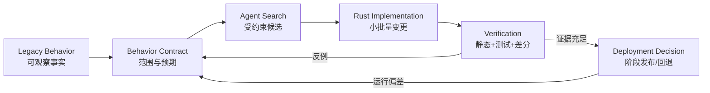

# 第 1 章：从代码翻译到行为重建

> **定位**：本章重新定义「迁移」。前置依赖是对待替换系统有基本了解；输出是一个从 Legacy Behavior 到可验证 Rust 候选实现的心智模型；后续第 3 章会把它形式化为行为契约。

把 C 函数改写为 Rust 函数，并不等于完成软件迁移。它最多说明了一件事：新语言中已经出现一个结构相似的实现。对于 coreutils 这类基础软件，使用者依赖的对象不是函数名、数据结构或源码布局，而是可观察行为。脚本只关心某个参数是否被接受，失败时退出码是否为非零，错误是写向 stderr 还是 stdout，文件是被原子替换还是留下半成品。这些属性构成真正的替换边界。

uutils 论文之所以是一个重要样本，不是因为它证明了「重写很容易」，恰恰相反：论文把长期演化、测试基础设施、差分 fuzz、社区参与和操作系统集成并置在一起，显示语言重写是一项长期行为重建工程。[E1-PAPER] [E1-P1] [E1-LESSONS] 仓库的贡献规则也把「兼容优先」、「小而聚焦的变更」与「测试先于合并」写成工程约束。[E2-GOALS] [E2-NO-TEST-NO-MERGE]

<!-- source: CONTRIBUTING.md -->
<!-- source: AGENTS.md -->

## 五个观察面，一个替换结果

为了避免把「功能存在」误当成「行为等价」，可以先把旧系统对外的反应拆成五个观察面：

1. **输入解析**：参数、环境变量、标准输入、文件系统状态与 locale 如何被读取。
2. **成功输出**：stdout 的字节、排序、换行、编码与格式是否匹配。
3. **失败语义**：退出码、stderr、部分成功和错误优先级是否一致。
4. **副作用**：文件、权限、时间戳、链接、设备与进程状态如何改变。
5. **边界条件**：竞态、信号、资源耗尽、不合法字节串与平台差异下发生什么。

五个观察面不是测试用例的最终列表，而是建立契约的检索框架。例如，一个新的 `cp` 实现即使能复制普通文件，仍可能在符号链接、稀疏文件、目标已存在、中途失败或权限保留上违反旧契约。若任务只写「实现文件复制」，Agent 就只会在一个巨大且模糊的空间里猜测。若任务列出上述观察面与已知边界，搜索才有可判定的方向。[E4-SEARCHER]

## 从 Legacy Behavior 到 Rust 候选实现

本书采用如下的基本链路。它不以「代码生成」结束，而以证据能否支持替换决策结束：

这条链路中，Legacy Behavior 不等于 Legacy Source。行为可以来自公开规范、帮助文本、黑盒执行、用户报告、现有测试和运行观测；当项目采用 clean-room 约束时，某些源码甚至是明确不得读取的。uutils 仓库要求贡献者不读取或复制 GNU 实现代码，同时允许用人工页、执行结果和测试来学习行为。[E2-CLEANROOM] 这一区分是后面设计 Agent Context Boundary 的起点。

### Agent 的任务不是预言，而是受约束搜索

将 Agent 理解为「代码预言器」会让工程设计走向错误的指标：一次生成的代码越多，仿佛生产率越高。更合理的模型是，Agent 在契约、可读上下文、Rust 类型系统、仓库规则和测试反馈构成的空间中搜索候选补丁。人类工程师决定哪些观察是契约，哪些差异可被接受，哪些证据足以进入下一阶段。AI 加速的是候选的构造、局部解释与反例修正，而不是对契约的最终所有权。

这也解释了为什么「请重写整个工具」是一个坏任务。它同时混合了行为发现、架构选择、平台适配、错误文本、性能和发布风险，使每个失败都难以归因。反之，一个良好的迁移切片可以被独立接受或拒绝：例如「在 Unix 平台上保持某个选项的退出码和 stderr 类别，不改变文件写入逻辑」。它的边界明确，可以构造失败样本，也可以在不接受整个重写的情况下撤回。[E4-ATOMICITY]

## 「编译通过」在这个模型中处于什么位置

Rust 编译器可以强力排除一类候选：所有权冲突、部分类型不匹配、线程安全边界不成立等。这是搜索空间的重要缩减，但不是行为证明。一个类型完全正确的程序，仍然可以输出错误的换行，可以把 `1` 当成 `0` 退出，可以在重命名时留下不一致中间状态。所以编译位于验证阶梯的较低层：它快速、确定，应尽早运行；它的结论也必须被准确限定。

同理，单元测试通过不能取代系统测试，黑盒差分测试通过不能取代代码审查，仓库 CI 全绿也不能取代 canary 阶段的运行观测。可验证迁移的核心不是找到一个全能测试，而是让不同层次的证据覆盖不同类型的错误。

## 从「完成度」转向「未知量」

传统迁移看板喜欢使用「已转换文件数」、「已实现选项比例」或「Rust 代码行占比」来表示进度。这些数据可以描述工作量，却很难描述替换风险。一个 95% 的功能完成度，如果剩下 5% 集中在数据丢失、权限和恢复路径，仍然不适合默认切换。

更有用的进度视图会同时展示：已建模的高风险行为数，已被机械验证的契约数，尚未分类的差分失败，只在单一平台运行的检查，以及没有回退演练的发布切片。这些指标把团队注意力从「生成了多少」拉回「还有什么不知道」。对 AI Coding 而言，这尤其重要：模型可以迅速抬高代码完成度，但只有反例、证据和运行观测才能降低未知量。

因此，每个迁移切片都应有两种状态：实现状态与证据状态。「代码已完成，关键失败路径未验证」不是矛盾句，而是一个非常有价值的精确状态。它阻止了代码产出量被直接换算为发布信心。

一个简单会议问法是：「如果今天必须回退这个 Rust 切片，我们是因为代码没写完，还是因为某项行为没有证据？」能够具体回答，就说明团队已经开始用行为重建而非代码翻译来管理迁移。

## 模式提炼

**约束下的实现搜索器**：把迁移从源码翻译改写为在行为证据、Rust 约束和验证反馈中寻找实现。它适用于旧系统可执行或行为可观察的场景；若关键效果无法观测、规范不可用且没有责任人裁决差异，搜索循环会把未知误装成兼容。

## 局限

行为重建模型不会自动告诉我们哪些历史行为必须保留。旧系统可能包含缺陷、未文档化偶然性或已经不再合理的平台假设。是保持、修复还是废弃，属于产品与治理决策，不是模型或语言可代替的判断。此外，黑盒观察总是有限样本；没有被观察到的路径，不能被想当然地宣称兼容。

## 实践清单

- [ ] 把迁移目标写成可观察行为，而不是「转成 Rust」。
- [ ] 对输入、stdout、stderr/退出码、副作用和边界条件分别盘点。
- [ ] 标注行为事实来源，不把源码观察与方法推导混在一起。
- [ ] 将 Agent 任务缩小到可独立验证、接受或拒绝的切片。
- [ ] 对每项验证准确说明它能排除什么，不能证明什么。
- [ ] 在开始生成代码前，确认行为契约的人类负责人。

## 本章证据

核心事实来自论文对重实现、测试与长期维护的描述 [E1-PAPER] [E1-P1] [E1-LESSONS]，以及仓库对兼容、clean-room 和测试的明文要求 [E2-GOALS] [E2-CLEANROOM] [E2-NO-TEST-NO-MERGE]。Agent 搜索器与原子切片是本书在这些事实上的方法综合 [E4-SEARCHER] [E4-ATOMICITY]。

### 版本演化说明

论文基线为 **arXiv:2608.07135**；本地源码基线为 **d8bee62c1ddc227d5e4385d80bbf6d7dee266a41**；本章证据核验日期为 **2026-08-14**。论文所述测量时点与本地仓库现状不等同；本章仅从两者提炼方法，不声称 uutils 是所有迁移的行业标准。
