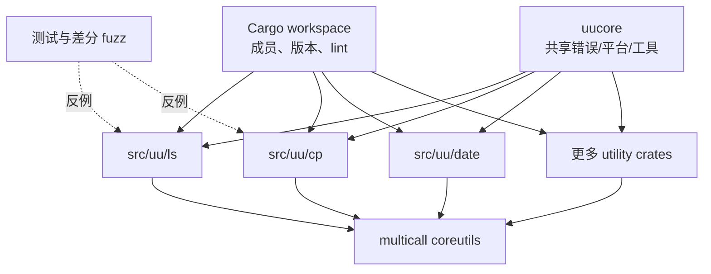

# 第 2 章：uutils——一个基础软件重实现样本

> **定位**：本章建立全书的案例基线。前置依赖是第 1 章的行为重建视角；输出是一张分离论文、源码与生产证据的 uutils 工程地图；它支持后续对架构、测试和部署的分析。

coreutils 是一组日常到令人忽略其复杂性的工具：`ls`、`cp`、`mv`、`rm`、`date`等命令出现在开发环境、包构建、安装脚本、容器镜像和系统启动链路中。它们的单个主路径往往很直接，但多年积累的选项组合、平台差异和边界语义构成了庞大的兼容面。重新实现它们，意味着进入一个对细小差异极其敏感的环境。

2026 年论文 *Rust Coreutils: Rebuilding Unix Foundations in a Modern Language* 从历史、架构、测试、社区和操作系统集成多个方面研究 uutils。[E1-PAPER] 其中一个关键信号是「时间」：这不是一次性端到端转换，而是经过长期演化，不断增加命令、纠正差异、扩大测试和适配下游环境的工程。[E1-P1] 因此，uutils 的价值不是一个「模型能否一次生成 coreutils」的答案，而是展示大规模兼容性如何被组织成可持续修正的工作。

## 三个不能混淆的时间层

研究一个活跃仓库时，最容易犯的错误是把不同时点的数据拼成一张「现状照片」。本书始终区分三层：

| 层次 | 本书的用途 | 不能做的推论 |
|---|---|---|
| 论文测量层 | 理解项目发展、架构、测试及集成经验 | 不把论文中的数量当成当前仓库即时统计 |
| 源码基线层 | 核对当前可见的模块、测试命令、门禁和贡献规则 | 不用某个 commit 推断所有发布版本的行为 |
| 生产事件层 | 理解发行版集成、事故、审计和回退边界 | 不把下游事件简化为上游代码的单一优劣 |

这种分层也是一种 AI 上下文防污染机制。当模型同时看到论文数据、当前源码和后来的新闻时，它很容易把数字、版本和结论拼错。将每个陈述绑定到证据 ID 与时点，可以让审稿人看出哪些是事实，哪些是方法综合。

## 从仓库观察的工程形状

uutils 的根 workspace 统一管理成员、版本与 lint，各个工具在 `src/uu/` 下保持独立 crate，共享能力收敛在 `uucore`，并提供多调用入口将多个 utility 组合为一个二进制。[E1-ARCH] [E2-WORKSPACE] [E2-UUCORE] [E2-MULTICALL] 这个结构同时解决了两个方向相反的需求：单个命令需要局部边界，以便实现和测试；大量命令又需要统一的错误、平台、测试和构建能力，避免每个 crate 重新发明基础设施。

<!-- source: Cargo.toml -->
<!-- source: src/bin/coreutils.rs -->
<!-- source: src/uucore/src/lib/lib.rs -->

这个图不应被读成「每个迁移都必须使用相同目录」。可迁移的方法是：以可独立验证的行为单元作为局部边界，以共同失败模型、平台抽象和门禁作为共享边界。对数据库、网络代理或桌面应用来说，局部单元可能是协议命令、服务端点或平台后端，而不是 CLI utility。

## 测试不是附件，而是项目结构的一部分

论文将测试栈与差分 fuzz 作为重要研究对象。[E1-TEST-STACK] [E1-DIFF-FUZZ] 当前仓库文档则区分普通 Cargo 测试、nextest 执行和 BusyBox/GNU 外部套件；基线 `uufuzz` 能执行参考与候选命令，始终以 stdout 和退出码差异判定失败，stderr 差异会被报告，并可按调用配置为失败条件。[E2-TEST-COMMANDS] [E2-EXTERNAL-SUITES] [E2-UUFUZZ-RUN] [E2-UUFUZZ-COMPARE] 这些设施告诉我们，兼容性不能靠审查者的记忆维持，必须被持续编码为可重复的反馈。

<!-- source: DEVELOPMENT.md -->
<!-- source: fuzz/uufuzz/src/lib.rs -->

需要注意，差分测试不会使参考程序自动成为规范。如果参考程序包含缺陷，字节级相等可能只是复制了缺陷；如果平台、locale 或时间条件不受控，差异可能是环境噪声。正确的做法是把参考执行当作一个强证据源，再用规范、项目决策和安全要求解释差异。

## 从项目到操作系统：成功定义发生了变化

在仓库阶段，一个改动的成功通常由格式、lint、单元/集成测试和兼容测试来证明。进入操作系统默认环境后，成功定义扩展为：包走向和替代机制正确，升级与回退路径可用，大量未知脚本不会被细小差异破坏，安全审计没有发现超出接受阈值的风险。论文将 Ubuntu 集成作为项目发展的重要阶段 [E1-OS-INTEGRATION]，而后续生产记录进一步显示，默认切换并不意味迁移已经结束。[E3-DEFAULT-25.10] [E3-AUDIT-UPDATE]

这是本书选择 uutils 的另一原因：它既能展示 Rust 仓库内的工程组织，也能展示当这些二进制进入真实发行版后，原本被测试隐藏的边界如何显现。一个成熟方法必须能同时解释仓库内的高质量与生产中仍然出现的问题，而不是从中挑选一面来证明预设立场。

论文还将社区参与放入视野 [E1-COMMUNITY]。这提醒我们，长期重实现的能力不只是架构属性，也是社会技术属性：新贡献者能否定位工具，审稿人能否在可控范围内理解变更，下游发现能否回流，项目规则能否在人员与 AI 工具变化时仍保持。一个只有少数人能够理解的「完美架构」，很可能比结构稍微朴素、却能持续审查和修正的系统更难迁移。

## 模式提炼

从案例中可以先提炼五个后续会展开的模式：

- **行为单元模块化**：让变更、测试和责任有局部边界。
- **共享基础能力收敛**：错误、平台和工具代码不应在每个迁移单元中无序复制。
- **多层验证共存**：编译、lint、项目测试、外部套件和差分 fuzz 各自拦截不同错误。
- **可审查贡献规则**：人类理解、clean-room、小变更和测试证据不是口号，而是仓库规则。
- **生产反馈回到契约**：事故与审计发现必须回流为测试、实现或发布边界。

## 局限

uutils 是 Unix 命令行工具集，它的行为高度可以通过进程输入输出与文件系统状态来观察。这一特征使差分测试尤其有效。对分布式系统、长时运行 GUI、硬实时系统或与专有硬件紧密耦合的软件，可观察面、确定性和回放成本会明显不同。本书的模式需要按系统类型改写，不能照搬目录结构或测试比例。

另一个局限是证据可见性。公开论文、开源仓库和发行版公告能展示很多事实，却不包含每次设计讨论、未公开的运行数据或所有取舍背景。因此本书只在可核验范围内提炼模式，不对不可见动机作心理推断。

## 实践清单

- [ ] 为自己的迁移项目分开记录历史文献、当前源码和生产事件。
- [ ] 确认可独立实现与验证的行为单元。
- [ ] 找出应收敛的共享能力，并记录其失败模型。
- [ ] 画出从快速静态检查到生产观测的验证层次。
- [ ] 对所有数量、版本和「当前状态」陈述附上时点。
- [ ] 写下案例不适用于自身系统的地方，再决定变体。

## 本章证据

论文证据包括项目历史、架构、测试栈、差分 fuzz 与操作系统集成 [E1-P1] [E1-ARCH] [E1-TEST-STACK] [E1-DIFF-FUZZ] [E1-OS-INTEGRATION]。当前源码证据包括 workspace、`uucore`、multicall、测试命令和 `uufuzz` 比较机制 [E2-WORKSPACE] [E2-UUCORE] [E2-MULTICALL] [E2-TEST-COMMANDS] [E2-UUFUZZ-COMPARE]。生产层只在其对应时点使用 [E3-DEFAULT-25.10] [E3-AUDIT-UPDATE]。

### 版本演化说明

论文基线为 **arXiv:2608.07135**；本地源码基线为 **d8bee62c1ddc227d5e4385d80bbf6d7dee266a41**；本章证据核验日期为 **2026-08-14**。论文中的定量数据属于其测量窗口，不代表本地 commit 或后续 Ubuntu 发行版的即时状态。
