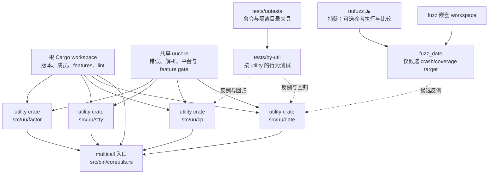

# 第 2 章：uutils 能证明什么

> **定位**：本章把 uutils 作为一个可复核的基础软件重实现样本，而不是 Rust 或 AI Coding 的成功宣传。前置依赖是[第 1 章：从代码翻译到行为重建](ch01-behavior-reconstruction.md)的行为视角；输出是一张分离论文测量、固定源码事实与作者方法提炼的证据地图。适用于评估案例能否外推、给 Coding Agent 划定仓库上下文，或准备进入[第 3 章：行为契约](ch03-behavior-contract.md)的读者。

coreutils 命令既被人直接调用，也藏在构建、升级、容器和系统脚本里。主路径可能只有“解析—执行—输出”，兼容面却分布在选项组合、权限、locale、终端、时区、退出状态和失败后的外部状态中。调用者通常只会在旧假设失效时发现实现已替换。

2026 年论文 *Rust Coreutils: Rebuilding Unix Foundations in a Modern Language* 记录了 uutils 从 2013 年开始的重实现经验。它呈现兼容原则、星形架构、分层测试和操作系统集成，而不是“自动翻译成 Rust”的捷径。

先看一个合成失败现场。升级脚本在 `TZ=UTC0`、`LC_ALL=C` 下，把带 `+05:30` 偏移的绝对日期转成 UTC；候选命令退出为 0，格式也正确，却把墙上时间直接当 UTC，结果偏了五个半小时。解析器通过编译，常见日期测试也绿色。只有同时固定输入、时区、locale、stdout 和退出码的回归，才能把“看起来像日期”与“同一瞬间”分开。本章稍后沿仓库路径闭合这个案例。

## 为什么这很重要

迁移讨论经常把案例当作一句类比：“uutils 做到了，所以我们的系统也能做到。”这句话省略了至少四个条件：目标行为是否同样容易观察，参考行为是否可执行，工作负载能否在测试里重放，部署是否有监控和回退。uutils 提供的是带条件的证据，不是普遍定理。

本章以三个研究问题组织材料。它们是**E4 作者分析框架，不是论文原文中的 RQ 编号或 AI 结论**：

1. 当完整规范不存在、调用者又无法穷举时，兼容目标怎样被表达为可观察结果？
2. 当上百个命令既要独立演化又共享基础能力时，仓库怎样给实现、测试和责任划边界？
3. 当测试永远只能覆盖有限样本时，怎样解释“通过”，又怎样让生产反例回到工程闭环？

这三个问题按“现象—根因—工程机制—证明边界”追问：常见输出正确时，边界脚本为何仍失败；局部 crate、共享核心、multicall、测试和 fuzz 排除了什么；每层还没观察什么。

## 两条基线，不能拼成一张现状照片

本章只使用六个主证据项：五个 E1 论文项和一个 E2 固定仓库项。论文为 arXiv v1（2026-08-07）；其项目比较声明使用 uutils `0.4.0`，活动图说明 2025 年数据当时尚未结束。源码固定在 `d8bee62c1ddc227d5e4385d80bbf6d7dee266a41`（2026-08-13），`Cargo.toml:387-395` 的 workspace 版本为 `0.10.0`。

| 主张 | 标签 | 版本／位置 | 允许推论 | 禁止推论 |
|---|---|---|---|---|
| 成功调用兼容关注成功性、退出码、stdout 与文件系统结果，stderr 可改善 | [E1-P1] | 论文第 2 页，uutils `0.4.0` 测量语境 | P1 是跨进程输出与状态的兼容原则 | 所有失败调用、stderr 或平台行为均已规定 |
| P2 鼓励现代能力，P3 借助 crate 保持可维护 | [E1-P2-P3] | 论文第 2–3 页 | 生态复用是带取舍的设计原则 | 引入 crate 自动带来安全或正确性 |
| 多个 utility 依赖 `uucore`，multicall 有静态链接体积动机 | [E1-ARCH] | 论文第 3 页 | 论文窗口中存在星形架构及部署动机 | 论文数字等于当前构建，或该架构普适最优 |
| 项目采用单元、集成、外部端到端三层测试 | [E1-TEST-STACK] | 论文第 3–4 页 | 不同测试层提供不同反馈 | 历史数量、耗时或覆盖率等于当前仓库 |
| OS 集成暴露开发测试遗漏，并配合监控与回退 | [E1-OS-INTEGRATION] | 论文第 6–7 页 | 生产反馈与回退属于替换证据 | 上线可代替前置测试，或一个发行版代表所有环境 |
| workspace、utility、`uucore`、multicall、测试和 fuzz 路径存在 | [E2-ORIENTATION] | 固定 commit；`CONTRIBUTING.md:29-51` 及本章逐项核验路径 | 该快照的仓库导航与具体接口可复核 | 单个 commit 代表其他发布、平台或运行行为 |

论文中的数量只属于其测量窗口；固定源码只证明快照结构。模型若把两者压成“当前现状”，就会产生版本倒灌，因此证据账本必须同时保存来源类型、版本和核验时点。

## 星形架构走查：中心不是总管，叶子不是孤岛

论文称 uutils 为星形架构：多个 utility 软件包依赖共享的 `uucore`，而 multicall binary 用一次部署承载多个命令。[E1-ARCH] 固定源码让这幅图变得可点击和可核验：根 `Cargo.toml:375-395` 将 `src/uu/*`、`src/uucore`、`src/uucore_procs` 与 `tests/uutests` 纳入 workspace；`fuzz` 在该成员表中仍以注释形式留在 workspace 之外。这个细节很重要——“同一仓库”不等于“同一 Cargo workspace 成员”。[E2-ORIENTATION]



从叶子向中心走一遍，可以看见边界如何成立。

**utility crate 是局部实现边界。** `src/uu/date/Cargo.toml:15-17` 指向库入口 `src/date.rs`，`src/main.rs:6` 只有 `uucore::bin!(uu_date)`；`cp`、`stty`、`factor` 同样使用薄入口。局部 crate 让依赖、feature 和测试围绕命令收敛，却不表示风险同质。

**`uucore` 是共享机制边界。** `src/uucore/src/lib/lib.rs:16-90` 重导出跨平台与 feature 能力，`92-140` 按目标暴露平台能力。共享减少重复，也扩大变更半径；只有复用收益足以支付更强验证才应上移。错误模型详见[第 5 章](../part2/ch05-rust-skeleton.md)。

**multicall 是部署和调用边界。** `src/bin/coreutils.rs:52-78` 从二进制名或下一参数选择 utility，`80-124` 再调用映射的 `uumain`。独立二进制与 multicall 是两条可见入口；只测内部函数不能证明 `argv[0]`、第二参数和初始化正确。

**测试夹具是行为执行边界。** `tests/uutests/src/lib/util.rs:1366-1409` 的 `TestScenario` 为每个用例准备独立临时目录、定位测试二进制并复制 fixture；`1486-1525` 的 `UCommand` 记录参数、环境、stdin/stdout/stderr、timeout、资源限制和终端模拟等状态。`tests/by-util/test_<util>.rs` 因而不是源码旁的附件，而是把进程边界变成可编程观察点。

**fuzz 是另一个工具边界。** 根 workspace 没有纳入 `fuzz`；`fuzz/Cargo.toml:14-16` 另建嵌套 workspace，`28-50` 才把 `uufuzz`、`uu_date` 与 `fuzz_date` target 连起来。库的 `CommandResult`（`fuzz/uufuzz/src/lib.rs:26-38`）只含字符串 stdout/stderr 和退出码；同一库另提供参考执行（`157-243`）与可配置比较器（`246-323`）。但“库里有比较器”不表示每个 target 都做差分。

星形结构调和局部变化与共同纪律；它让依赖和验证入口可分配，不证明中心永远正确或叶子同样容易。

## 四类 utility 难度：相同目录形状，不同证明任务

下面的四类不是论文分类，而是本书作者根据固定源码提炼的 **E4 Repository Risk Lens**。分类目的不是给命令排难度名次，而是防止 Agent 看见统一的 crate 模板后误以为任务同质。

### 1. 解析与语义组合：`date`

`date` 的难点不是把时间戳打印出来，而是把参数优先级、日期语言、时区、locale、格式字符串、当前时间和系统时钟副作用组合起来。固定源码中，`src/uu/date/src/date.rs:34-101` 将输入来源和输出格式建模为不同枚举；`284-408` 从 Clap 结果建立 settings，并把 human input、文件、stdin、文件 mtime 与 now 分流；`1096-1173` 又把时区缩写处理和 `parse_datetime` 结果连接起来。测试在 `tests/by-util/test_date.rs:69-102` 明确固定 `LC_ALL=C` 与 `TZ=UTC0` 后检查大年份边界。

现象是“多数日期都能解析”，根因却可能是一个顺序、默认时区或边界年份错误。工程机制应包含语法矩阵、固定时钟与时区、格式化断言和失败类别；证明边界是：一种 locale、一个时区和若干字符串通过，不证明自然语言日期空间已经穷尽。Rust 的枚举能让来源状态更清楚，不能替团队决定每个模糊输入的兼容语义。

### 2. 文件系统状态机：`cp`

`cp` 的风险位于字节之外。`src/uu/cp/src/cp.rs:276-351` 的 `Options` 同时保存覆盖、解引用、递归、稀疏文件、reflink、属性保留、更新、备份和进度等决策；`790-830` 解析路径后调用复制逻辑并把非致命/致命错误映射到外部退出状态；`881-920` 明确列出所有权、mode、时间戳、链接和扩展属性的保留组合。`tests/by-util/test_cp.rs:74-93` 甚至提供元数据比较宏，`95-145` 覆盖写满、stdout 写失败、普通复制和已有目标。

现象可能只是“目标内容相同”，根因却藏在符号链接跟随、目标预先存在、部分写入、权限、时间戳或清理顺序。工程机制需要前后目录树和元数据快照、受控故障、平台夹具及非 UTF-8 路径；证明边界是：stdout 和退出码相等不能证明副作用相等，成功复制也不能证明失败时目标仍满足不变量。文件系统行为契约将在[第 3 章](ch03-behavior-contract.md)正式建模。

### 3. 平台与设备交互：`stty`

`stty` 直接接触终端设备和 `termios`。`src/uu/stty/src/stty.rs:24-49` 已出现按 OS/架构选择的类型与常量，`168-220` 把 stdin 或显式文件统一成可借用文件描述符的 `Device`，`257-445` 先验证全部参数，再读取、修改并写回终端状态。`620-700` 还对 Linux、BSD 和 PowerPC 的 baud rate 读取/显示作条件分支。测试 `tests/by-util/test_stty.rs:27-65` 使用伪终端，而不是拿普通 pipe 冒充 tty。

现象是同一组选项在开发机工作，根因可能是 ioctl、结构布局、字节序、内核能力或测试设备不同。工程机制是 `cfg` 分支、受支持目标矩阵、伪终端和真实平台 CI；证明边界是：Linux x86_64 的绿色测试不能证明 BSD、Windows 或其他架构。类型检查可以确认调用处满足 Rust 签名，不能证明内核在目标设备上的语义。

### 4. 纯计算核心：`factor`

`factor` 最接近“算法迁移”：`src/uu/factor/src/factor.rs:36-101` 把输入分为 `u64`、`u128` 与大整数，分别调用 `num-prime` 能力；`126-147` 格式化结果；`149-204` 处理 argv、stdin、刷新和错误。测试 `tests/by-util/test_factor.rs:122-172` 对整数序列做摘要断言，`185-236` 构造随机乘积及期望输出并执行验证。

纯计算比文件系统更适合性质测试：可以检查因子乘积等于输入、因子有序、宽度边界不溢出。但它仍不是只有数学函数。输入可能含无效字节，输出缓冲可能失败，多个数字的部分成功和退出状态仍是 CLI 契约。工程机制应把算法性质与进程协议分开验证；证明边界是：算法正确不推出解析、格式、流式 I/O 或资源上限正确。

四类允许重叠；它们用于给高风险切片选择观察工具，不是永久标签。

## 完整工程案例

下面把开篇合成现场闭合为 `BC-DATE-OFFSET-01`：环境固定为 `TZ=UTC0`、`LC_ALL=C`，输入为 `date -u -d '2025-01-01 00:00 +05:30' '+%F %T %z'`。合成初始观测中，参考行为输出 `2024-12-31 18:30:00 +0000`、退出 0、stderr 为空；错误候选忽略输入偏移，输出 `2025-01-01 00:00:00 +0000`。这是方法演练，不是对固定 commit 的缺陷报告。

**第 0 步：固定来源边界。** 记录允许的论文、项目文档、workspace、`date`、相关 `uucore` 接口、测试与 fuzz。禁止来源保持拒绝；证据不足时报告缺口，不自行扩权。[E4-CONTEXT-BOUNDARY]

**第 1 步：从根 workspace 找构建身份。** `Cargo.toml:614` 把 `date` 映射到 `uu_date` 和 `src/uu/date`；`375-395` 给出 workspace 与版本。这一步只回答构建身份，不决定案例期望。

**第 2 步：读取 utility manifest 和薄入口。** `src/uu/date/Cargo.toml:15-50` 指出库文件、默认 i18n feature、`jiff`、`parse_datetime`、`uucore` 与目标特定依赖；`src/main.rs:6` 只展开公共启动宏。因此真正的局部逻辑入口是 `src/date.rs` 的 `uumain`，不是薄 `main.rs`。

**第 3 步：建立参数到行为的切片。** 在 `date.rs:284-408` 追踪 `--date`、format 与 UTC 如何形成 `Settings`，再按证据进入 `parse_date`（`1096-1173`）。案例使用绝对日期，因此当前时钟不是变量；输入偏移到 UTC 的转换才是待验证语义。

**第 4 步：只在需要时进入共享层。** 只有错误桥接或通用解析证据指向 `uucore` 才继续；先确认依赖版本和调用转换。共享层改动必须扩大回归范围。

**第 5 步：固化最小回归。** `tests/by-util/test_date.rs` 是行为落点；`tests/uutests/src/lib/macros.rs:42-76` 提供 `new_ucmd!`，`util.rs:1486-1525` 可控制环境与通道。回归固定上述环境和 argv，断言 stdout 为参考值、退出 0、stderr 为空；错误候选必须失败，形成负向控制。

**第 6 步：判断是否进入 fuzz。** 可执行路径是 `fuzz/Cargo.toml:48-52` → `fuzz/fuzz_targets/fuzz_date.rs:14-47` → `uufuzz::generate_and_run_uumain`。固定 target 只对候选做 crash/coverage fuzz，不运行参考或 `compare_result`，也不固定 `TZ`/locale。要搜索同类差异，必须新建或扩展 harness，显式控制环境并接入参考执行与比较；不能把库中未调用的能力算作现有 target 证据。

**第 7 步：给出有界结论。** 回归只证明该绝对日期、`+05:30` 偏移、UTC 输出和固定 locale 的转换；不证明 DST、相对日期、其他偏移、其他 locale 或设置系统时钟。交付物包含案例 ID、双边观测、测试和边界；完整反例循环详见[第 10 章](../part3/ch10-fuzz-regression.md)。

走查覆盖 feature、utility、共享层、测试和 fuzz，但范围仍小；orientation 不是读完整个仓库，而是定位相关依赖和观察面。

## 测试栈：每一层都只排除一类候选

论文把测试描述为单元、项目集成和外部端到端三层；历史数量和耗时只属于测量窗口。[E1-TEST-STACK] 固定仓库的 `DEVELOPMENT.md:111-152` 给出 Cargo/nextest 与按 utility 选择入口，`197-237` 给出外部套件入口。它证明当前仍有多类执行路径，不证明历史与当前覆盖率相同。

| 层 | 擅长发现 | 典型盲区 | 对四类 utility 的价值 |
|---|---|---|---|
| 编译与 lint | 类型、借用、未使用、部分 cfg 和代码规范问题 | 外部语义、未构建目标、资源与时序 | 所有类的快速拒绝门 |
| 单元测试 | 解析函数、转换函数、数学性质、局部错误 | 真实 argv、进程通道、文件系统和设备 | `date` 解析、`factor` 性质最强 |
| `tests/by-util` 集成 | CLI、退出状态、环境、fixture、部分副作用 | 未列组合、未运行平台、真实部署 | `cp` 状态和 `stty` PTY 的主要回归层 |
| 外部套件/差分 | 未编码的兼容差异、选项组合 | oracle 缺陷、环境噪声、观察字段不足 | 搜索 `date`/CLI 组合很有效 |
| fuzz | 大量生成输入、崩溃、差异、性质反例 | 生成器到不了的状态、昂贵副作用、不可重放环境 | 纯计算与解析优先，文件/设备需专门 harness |
| 系统集成与监控 | 未知真实脚本、性能、打包和回退问题 | 低频未触发路径，且发现成本高 | 不是前面测试的替代，而是最后反馈层 |

论文记录的操作系统集成说明，开发条件下的测试无法覆盖全部真实工作流；Ubuntu 部署暴露了此前未发现的日期、脚本上下文和性能问题，并保留按机器切回的机制。[E1-OS-INTEGRATION] 这支持“生产反馈与回退是基础组件替换的一部分”，但不支持“先上线再测试”。前置测试负责减少已知错误，分阶段部署负责控制仍未知的错误。

## 可复用工件

下面的 **Repository Orientation Map** 可直接复制到 Task Contract 或 issue。它是本书作者提炼的 E4 工件，不是论文附录。[E4-CONTEXT-BOUNDARY]

```text
# Repository Orientation Map
task_id:
behavior_intent:
baseline:
  paper_version_or_window:
  source_commit:
  verified_at:

context_boundary:
  allowed_docs:
  allowed_source_paths:
  allowed_tests:
  prohibited_sources:
  expansion_rule:            # 何时必须停下并请求扩大上下文

build_identity:
  workspace_manifest:
  package_or_feature:
  target_matrix:
  shared_lints:

entry_trace:
  standalone_entry:
  multicall_entry:
  argument_dispatch:
  public_result_or_exit_bridge:

implementation_boundary:
  utility_crate:
  local_modules:
  shared_modules_touched:
  platform_modules:
  external_crates:

verification_map:
  unit_tests:
  by_util_tests:
  harness_capabilities:
  differential_or_fuzz:
  production_signal:

observation_surface:
  argv_env_stdin:
  stdout_stderr_exit:
  filesystem_or_device_state:
  locale_time_platform:
  resource_and_timing:

proof_boundary:
  demonstrated:
  not_observed:
  non_goals:
  rollback_or_stop:
```

从基线和权限开始填写。`entry_trace` 同时检查独立入口与 multicall；`not_observed` 不得无依据写“无”。对 `date`，列出 `TZ`、`LC_ALL`、目标 OS、相对输入所需当前时点，以及 target 是否真的接入比较器。

这个工件与[第 1 章的 Behavior Surface Worksheet](ch01-behavior-reconstruction.md#可复用工件)分工不同：前者回答“仓库里去哪里、依赖怎样连”，后者回答“外部世界观察什么”。二者组合后，Agent 才同时拥有代码地图和行为地图。

## 模式提炼

**双基线证据账本**：论文解释历史测量，固定 commit 解释源码结构；数字带版本，断言带路径。

**星形但非同质**：utility crate 提供局部边界，`uucore` 提供共享机制，multicall 提供部署入口。中心只承载稳定共同语义，共享改动配置更宽验证。

**风险形状先于代码量**：解析、文件状态、平台设备和纯计算需要不同 oracle 与 harness；分类允许重叠，最终都回到外部行为。

**测试层是证据过滤器**：每层只排除其能观察的候选错误；比较器、归一化和 fixture 版本必须可复核。

**orientation 先于 delegation**：委派 Agent 前先固定入口、共享层、测试落点和禁止来源；跨多个独立行为意图时拆任务，不扩张上下文。

## AI Coding 工作台

AI Coding 工作台至少保留六个同步视图；这是作者提炼 [E4-SEARCHER]，不是论文的 Agent 实验结论。

1. **基线视图**：论文测量与固定 commit 分栏，所有数量带版本；禁止把实时网页、旧论文和本地源码合并成无日期摘要。
2. **权限视图**：展示允许/禁止路径；资料缺失时停止分支。边界必须能从访问记录核对。
3. **架构视图**：画出 feature、utility、`uucore`、两类入口、测试和 fuzz；共享层变更提高审查级别。
4. **行为视图**：当前只显示一个 `(I,O,E,S,P,N)` 切片，尤其标出文件系统/设备状态与平台前提；行为六元组在[第 3 章](ch03-behavior-contract.md)展开。
5. **反馈视图**：按门禁来源分类失败，保存最小输入、环境和比较器版本；绿色也记录盲区。
6. **责任视图**：Agent 生成候选与证据草稿，人类确认期望来源、diff、许可、残余风险和发布决策。模型自信度不能提升证据等级。

合格提示应限定 commit、`TZ`/`LC_ALL`、输入、允许路径、测试落点、共享层停止条件和输出证据，而不是只说“实现 date 兼容”。

停止条件同样可见：无法稳定复现就停止编码；触及 `uucore` 就扩大回归；比较器看不到副作用就先扩展 harness；与安全决策冲突则交给人裁决。[E4-VERIFICATION-LADDER]

## 能证明什么／不能证明什么

| 能证明什么 | 不能证明什么 |
|---|---|
| P1 把成功调用的退出码、stdout 与文件系统结果列为兼容面，stderr 可改善 | 所有失败、stderr 文案或平台行为均已规定 |
| 论文窗口观察到星形架构、`uucore` 和 multicall 动机 | 架构普适最优，或历史体积数字等于当前产物 |
| 固定 commit 存在 root workspace、utility、共享层、两类入口、测试与 fuzz 嵌套 workspace | 这些路径在其他版本或下游保持不变 |
| `date`、`cp`、`stty`、`factor` 展示四种可重叠风险形状 | 行数决定难度，或四类穷尽所有 utility |
| `TestScenario`/`UCommand` 能隔离目录并控制多项进程条件 | 每个测试都控制了 locale、时钟、资源与目标平台 |
| `uufuzz` 库提供候选捕获、参考执行和可配置比较函数 | 固定 `fuzz_date` 已调用参考或比较器；它实际只做候选 crash/coverage fuzz |
| `compare_result` 比较 trim 后的 stdout、退出码，并可让 stderr 差异失败 | 原始字节等价：捕获使用 lossy UTF-8；stderr 按首个冒号截前缀、无冒号时变空，再 trim；也不观察文件状态、信号、性能或内存 |
| OS 集成能发现开发测试遗漏，回退具有工程价值 | 用户规模自动带来安全，或上线可以替代前置测试 |
| 仓库地图能约束 Coding Agent 的可见上下文 | Agent 已理解语义、来源合规或可替代人类批准 |

证据价值与边界必须成对记录；否则有限事实会被夸大成“完全兼容”“Rust 自动安全”或“AI 可以复制成功项目”。

## 反例

**分布式控制面。** 长时运行的集群调度器包含消息顺序、租约、时钟偏差、部分故障和持续状态；参考与候选也未必能同时接收真实写流量。照搬 `src/uu/* + shared core + multicall` 不会自动得到 oracle、确定性 replay 或安全回退，还需事件日志、仿真、shadow state 和数据迁移协议。可外推的是“局部边界与反馈层”，不是目录比例。

**把纯计算当低风险。** `factor` 的数学核心适合性质测试，但超大输入耗尽资源、多个 argv 中途失败、缓冲写失败等仍可使 CLI 不兼容。“纯计算”只描述核心，不是程序豁免证书。

uutils 不是行业标准，而是条件清楚的高信息密度案例：CLI 行为较易观察、项目公开、测试多层且进入过 OS 集成。它教我们写有限结论，而不是复制唯一答案。

## 练习

- **练习一：为 `cp` 填地图。** 只使用本章允许的源码与测试，为“已有目标上的一次写失败”填写 Repository Orientation Map。至少列出 `Options`、copy 入口、平台模块、`TestScenario`、需要拍摄的前后元数据，以及当前 `uufuzz` 为什么不足。最后写一句你能证明和不能证明的结论。

- **练习二：设计四类最小 oracle。** 分别为 `date`、`cp`、`stty`、`factor` 写一个高风险切片。每个切片指定输入、环境、观察字段、负向控制和停止条件；不得只写“与参考输出一致”。解释为什么同一种差分 harness 不能原样覆盖四类。

- **练习三：审计一次 AI 结论。** 给定陈述“uutils 已经证明 Agent 可以自动重写基础软件”，用本章六个主证据逐项拆解。把可保留事实改写为带版本和边界的句子，把 AI 方法判断标为 E4，并指出还需要什么直接实验才能研究 Agent 的质量或生产力。

## 局限

第一，论文是对项目的研究与经验总结，不是对所有调用的形式化证明。本章也没有重新计算论文的复杂度、依赖、测试覆盖或社区指标；所有历史数字保持在其原测量方法和版本内。

第二，源码阅读只证明文件、依赖和控制流在快照存在；我们没有执行四个 utility 的全部平台测试。`uufuzz` 字段说明工具能力，不代表所有 target 使用相同配置。

第三，本章不评价禁止来源实现的代码质量，也不读取、搜索、引用或派生其源码。论文中的比较性陈述只作为历史事实使用；仓库推理只来自允许的 uutils 源码、测试和项目文档。

## 实践清单

- [ ] 论文事实是否带版本或测量窗口，源码事实是否带 commit 和核验日期？
- [ ] 是否保持六个主证据项（五个 E1、一个 E2），并把 AI 方法标为 E4 作者提炼？
- [ ] 是否从 root workspace 走到 utility、`uucore`、standalone/multicall、测试和 fuzz？
- [ ] 是否按解析、文件系统、平台设备、纯计算选择了不同的观察与 oracle？
- [ ] 比较器做过哪些 trim、归一化或 lossy 转换，是否写进证明边界？
- [ ] 共享层修改是否扩大了验证矩阵和人类审查范围？
- [ ] 绿色结果是否同时记录未构建平台、未观察副作用和未覆盖输入？
- [ ] 外推到自己的系统前，是否列出了至少一个条件不成立的反例？

## 本章证据

完整证据矩阵见本章“两条基线”一节：六项中五项为 E1 论文事实，一项为 E2 固定源码事实；E4 内容均以作者提炼明示。

<!-- source: /Users/zhangalex/Work/Projects/consult/coreutils/docs/rust-coreutils.pdf -->
<!-- source: CONTRIBUTING.md -->
<!-- source: Cargo.toml -->
<!-- source: src/bin/coreutils.rs -->
<!-- source: src/uucore/src/lib/lib.rs -->
<!-- source: src/uu/{date,cp,stty,factor}/ -->
<!-- source: tests/uutests/ and tests/by-util/ -->
<!-- source: fuzz/Cargo.toml and fuzz/fuzz_targets/fuzz_date.rs -->
<!-- source: fuzz/uufuzz/src/lib.rs -->

四类难度、Repository Risk Lens、Repository Orientation Map、AI Coding 工作台和证明限定均为 E4 作者提炼，不是论文的 AI 研究结论。

### 版本演化说明

论文基线为 **arXiv:2608.07135**（v1，2026-08-07）；论文中的项目比较明确使用 uutils **0.4.0**，其数量与测量结论只属于论文窗口。源码事实固定核验于 **d8bee62c1ddc227d5e4385d80bbf6d7dee266a41**（提交日期 2026-08-13，workspace 版本 `0.10.0`）；本章证据核验日期为 **2026-08-14**。活跃仓库后续可能改变实现、测试、依赖与路径，因此复用本章地图时必须重新核验，不能把固定 commit 当永久现状。
