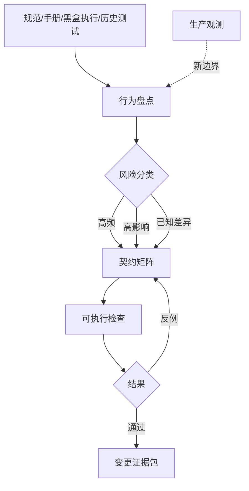

# 第 3 章：兼容性不是功能列表，而是行为契约

> **定位**：本章把前两章的行为视角转成可执行的契约。前置依赖是五个观察面与 uutils 案例地图；输出是一份可供 Agent、测试者和审稿人共同使用的行为矩阵。

「实现所有选项」是一张功能列表，不是兼容性契约。它回答了「入口是否存在」，却没有回答「在什么条件下，产生什么可观察结果」。两个工具都接受 `--recursive`，不意味它们在符号链接、权限错误或中途失败时的语义相同。兼容性必须将输入条件与多个结果维度绑在一起。

一份实用契约至少包含如下元组：

\[
C = (I, O, E, S, P, N)
\]

其中 `I` 是输入和初始状态，`O` 是成功输出，`E` 是错误通道与退出状态，`S` 是文件系统或外部系统副作用，`P` 是平台/环境前提，`N` 是本切片明确不承诺的范围。第 1 章用五个观察面盘点行为；这里增加 `N` 形成六元组，用于把未承诺范围也纳入契约。`N` 很重要：没有它，测试中没出现的情况很容易被误读为「已经支持」。

## 从行为盘点到契约矩阵

契约的第一个版本不应追求穷尽所有组合。更有效的做法是用风险分层：先覆盖高频主路径、高影响失败路径和已知历史差异，再用差分测试与生产观测扩展边界。对一个文件复制切片，可以从下表开始：

| 场景 | 初始状态/输入 | stdout | stderr/退出码 | 副作用 | 平台与范围 |
|---|---|---|---|---|---|
| 普通文件成功 | 源存在，目标不存在 | 默认无输出 | 空 / 0 | 目标字节与源一致 | 本切片的支持平台 |
| 源不存在 | 路径不存在 | 无 | 诊断类别 / 非 0 | 不创建目标 | 错误文本可按平台归一化 |
| 目标不可写 | 父目录或目标拒绝写入 | 无 | 权限类诊断 / 非 0 | 不应留下误导性完成文件 | Unix 权限语义 |
| 中途 I/O 失败 | 读或写在过程中失败 | 无 | I/O 诊断 / 非 0 | 部分目标的处理策略被明确定义 | 需可控故障注入 |
| 符号链接 | 源或目标为链接 | 由选项决定 | 由选项决定 | 跟随、保留或拒绝 | 未列选项明确排除 |

这个矩阵的价值不只是指导测试。它还向 Agent 说明了不能随意改变的界面，向审稿人说明了应当寻找哪类反例，向发布负责人说明了哪些指标需要在 shadow/canary 阶段观察。[E4-CHANGE-PACKAGE]

## 错误是一等契约

迁移中最常见的偏差之一，是主路径输出被仔细比较，失败却被简化为一个通用 `Err`。但 shell 和其他调用者会直接观察退出码，测试可能断言 stderr 类别，自动化可能依赖部分成功后继续处理还是立即终止。uutils 的共享错误模型将 utility 结果、退出码和错误上下文连接起来，说明 Rust 内部错误传播与 CLI 外部语义之间需要显式桥接。[E2-ERROR-MODEL] [E2-ERROR-COMPAT]

<!-- source: src/uucore/src/lib/mods/error.rs -->

契约不一定要锁死所有字符级错误文本。如果文本受 locale、操作系统或底层库影响，可以将它分成不同强度：退出码完全相等；错误通道必须相同；诊断必须属于同一语义类别；只在环境固定时要求字节级相等。这比简单的「忽略 stderr」更严格，也比在所有平台上强求字节完全一致更可执行。

## 契约必须显式处理副作用与原子性

对文件工具，只比较输出远远不够。一个失败命令可能返回正确的非零退出码，却留下一个被截断的目标文件；一个成功命令可能字节正确，却丢失权限或时间戳。因此，契约应在执行前后采集受影响资源的状态快照，并对「成功后必须存在」、「失败后必须不存在」、「允许部分结果」作出明确区分。

原子性也不是一个简单布尔值。进程之外的观察者在什么时点能看到新状态？信号到来时中间文件如何处理？跨文件系统移动时是否从 rename 退化为复制与删除？这些都应在精确切片中定义，而不是在「支持 mv」的功能勾选项下被隐藏。

## 平台差异：分支契约，不是随机豁免

Rust 提供跨平台抽象，但不会消除文件系统、权限、字节路径、信号和系统调用的差异。行为契约应将平台写成前提：在 Unix 上断言某类 mode bits；在 Windows 上断言对应的文件属性或明确不支持。如果某项行为只在特定内核或文件系统成立，契约应使用能力检测、跳过理由和目标环境记录，而不是将失败统统归为「CI 不稳定」。

好的平台契约会让变更更小。通用语义留在共享层，系统调用与差异收敛到明确的平台模块，测试以能力而非模糊的 OS 名称决定预期。这使 Agent 无需在一个补丁中重写所有平台分支，审稿人也可以看出某项 `cfg` 是否真的对应了契约差异。

## 从契约到可执行证据

行为契约不应只存在设计文档里。每一行高风险契约至少应对应一种机械验证：静态规则、单元测试、集成测试、差分样本、fuzz 属性、shadow 比对或 canary 指标。无法自动化的条目，应记录人工审查方法和负责人，而不是消失在「需要注意」之中。契约还应指向变更包：修改了哪些条目，证据来自何处，未覆盖哪些边界，上线后如何观测。

这使契约成为一个活的边界模型。当差分 fuzz 发现新反例时，团队首先判断差异是候选缺陷、参考缺陷、允许差异还是环境噪声；然后更新契约与永久回归。当生产环境出现事故时，事故不只产生一个修复补丁，还应产生一条新的契约边界和一个可重复的验证。可直接填写的字段见[附录 B：迁移 Task Contract 模板](../appendices/task-contract.md)。

## 用契约驱动 Agent 的反例循环

把契约交给 Agent 时，最差的用法是让它一次生成全部实现，再尝试修到测试通过。更稳定的用法是从矩阵中取一行，先要求 Agent 说明可观察点、证据来源和尚未确定的前提，然后只编写能使该行成立的最小测试与补丁。测试失败时，修正对象不一定是代码：也可能是契约忽略了平台条件，比较器将非确定文本当成了字节契约，或参考程序的行为并不符合项目决策。[E4-DISCOVER-LOOP]

这种循环把「模型不确定性」从一个抽象风险转化为可观察工件：未确定的假设、失败的样本、改动后的矩阵行与仍未覆盖的范围。人类审稿人无需推测 Agent 的「思考」，只需判断这些工件是否支持补丁。

## 模式提炼

**六元组行为切片**：用 `(I, O, E, S, P, N)` 把一个可观察意图变成可验证契约。它要求团队能控制输入与初始状态，并明确非目标；当副作用、并发时序或平台前提无法被观测时，必须先扩展记录能力，不能靠缩小元组宣称通过。

## 局限

契约矩阵会带来维护成本，而且不可能穷尽所有输入与并发时序。如果团队把它当成一次性文档，它会很快与实现脱节。如果团队追求在写代码前枚举所有组合，又会陷入无限建模。本书建议以风险排序，用新反例逐步扩展，并对未知范围保持明确陈述。契约也不应阻止有意改善；当团队决定不保留某项旧行为时，应将它作为可见的版本化决策，而不是偷偷发生的偏差。

## 实践清单

- [ ] 用 `(I, O, E, S, P, N)` 描述一个最小迁移切片。
- [ ] 同时编写成功、失败、副作用和平台分支条目。
- [ ] 对错误文本决定字节级、语义类别或通道/退出码级别的比较强度。
- [ ] 对副作用记录执行前后状态，并定义中途失败语义。
- [ ] 为每条高风险契约绑定机械检查或明确的人工审查。
- [ ] 将新发现的差异先分类，再更新契约、实现与回归。

## 本章证据

本章以论文对兼容性重实现的描述为案例背景 [E1-P1]，以仓库的兼容目标与错误模型为源码依据 [E2-GOALS] [E2-ERROR-MODEL] [E2-ERROR-COMPAT]，再将行为矩阵与变更证据包连接起来 [E4-CHANGE-PACKAGE]。矩阵中的复制场景是方法示例，不是对任何特定版本 `cp` 全部语义的完整声明。

### 版本演化说明

论文基线为 **arXiv:2608.07135**；本地源码基线为 **d8bee62c1ddc227d5e4385d80bbf6d7dee266a41**；本章证据核验日期为 **2026-08-14**。行为契约必须随新反例和明示产品决策演化；基线仅说明本书引用的仓库事实，不将某个 commit 冻结为永久规范。
