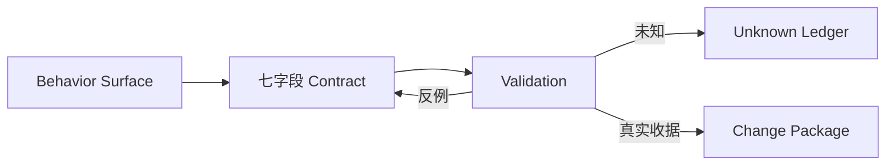

# 第 3 章：兼容性不是功能列表，而是行为契约

> **定位**：把[第 1 章行为表面](ch01-behavior-reconstruction.md#七维行为表面)和[第 2 章证据地图](ch02-uutils-case.md#星形架构走查中心不是总管叶子不是孤岛)编译为七字段 Behavior Contract，供迁移、测试、平台、Agent 及[附录 B](../appendices/task-contract.md)复用。

## 契约遗漏事故

合成事故 `manifest-copy SRC DST` 复制目录并输出成功路径；任务只写“递归复制、失败非零”。候选按文本行输出路径。Unix 目录含 `report-\xFF.csv`、合法 `report-�.csv` 和换行名称时，身份碰撞；复制与 code 正确，索引却错。

遗漏了字节、边界、顺序、重复、平台能力。指南要求保留 `OsStr`/`Path`（`CONTRIBUTING.md:178-187`），测试按字节断言无效 UTF-8 参数（`tests/by-util/test_basename.rs:139-159`）。[E2-RUST-SAFETY]

<!-- source: CONTRIBUTING.md -->
<!-- source: tests/by-util/test_basename.rs -->

## 从五元组展开为七字段契约

第 1 章用 `B=(I,O,E,S,P)`，相邻旧文还见 `(I,O,E,S,P,N)`。本章规范为 `K=(I,O,X,S,E,P,U)`：错误拆为 `O.stderr/X`，前提拆为 `E/P/U`，`N` 迁为必填 `non_goals`；旧缩略引用由 Task 19 迁移。

| 字段 | 内容 | 可执行要求 |
|---|---|---|
| `I` | argv/stdin/前态 | 构造器、边界、快照 |
| `O` | stdout/stderr | 通道、表示、比较器 |
| `X` | code/signal/timeout | 精确状态 |
| `S` | 外部状态转移 | before/after、提交与清理 |
| `E` | cwd/locale/TZ/umask | 状态、治理记录 |
| `P` | OS/FS/能力 | 矩阵、probe、skip 理由 |
| `U` | 非确定性、未知 | 允许集合、账本 |

七字段与 `non_goals` 是 E4 综合。[E4-CHANGE-PACKAGE] P1 在 uutils `0.4.0` 语境要求成功参考调用的候选也成功，code、stdout、文件系统一致，stderr 可更丰富（[arXiv:2608.07135 第 2 页](https://arxiv.org/abs/2608.07135)）。[E1-P1]

## 什么叫“可执行”

可执行字段须有可重建前提、可采集观察、允许集合和 pass/fail/unknown 判定器；人工审查也要有方法与负责人。

`manifest-copy` 的最小矩阵先覆盖成功、失败、副作用和平台分支：

| `case_id`／场景 | 输入与前态 | stdout | stderr／退出 | 副作用 | 环境／平台／非确定性 |
|---|---|---|---|---|---|
| `BC-SUCCESS-01` 成功 | 两文件；无 `DST` | committed 路径 NUL 多重集合；可重排 | 空／`0` | 精确树；无临时文件 | 固定/Unix；`NC-DROP-RECORD-01` |
| `BC-SUCCESS-FF` 字节路径 | 名称含 `FF` | 保留 `FF`；一文件一记录 | 空／`0` | 同名字节路径 | Unix；`NC-LOSSY-01` |
| `BC-SRC-MISSING-FF` 缺源 | 含 `FF` 的源缺失 | 空 | 原始字节；类别、转义路径／`1` | 无 `DST`/临时文件 | 固定 locale；`NC-LOSSY-ERR-01` |
| `BC-MIDREAD-01` 中途失败 | 第二文件故障 | 仅 committed；可重排 | `read_error`、转义路径／`1` | 首个完整；失败项/临时项无 | 固定故障；`NC-EARLY-RECORD-01` |
| `BC-NOCAP-01` 缺能力 | probe=false | 空 | `unsupported`／`2` | 无 `DST`/临时文件 | `UB-04`；`NC-SKIP-AS-PASS-01` |

YAML 用 ID 闭合验证；第 8 章分配[测试层](../part3/ch08-test-layers.md)，第 9 章让[差分比较器](../part3/ch09-differential-testing.md)读取允许集合。



## stdout、stderr：先决定字节还是文本

管道运送字节，解码是测试选择。固定 `CmdResult` 以 `Vec<u8>` 保存两通道（`tests/uutests/src/lib/util.rs:119-159`），访问在 `365-430`，字节断言在 `580-588,655-676`。本例 stdout 为 NUL 记录；stderr 仍存原始字节，`diag_path` 比较类别与路径：ASCII 原样、反斜线 `\\`、其余 `\xNN`。`BC-SRC-MISSING-FF` 覆盖非 UTF-8 错误路径。比较器 enum 见约束表，属 E4。[E4-CHANGE-PACKAGE]

## 路径与编码：不要把显示形式当身份

路径身份与诊断显示须分开；Unix 用字节，Windows 用原生表示。[E2-RUST-SAFETY] lossy、`trim()`、Unicode 排序、去重均设负控。

## 退出状态与错误兼容

“失败非零”过弱。固定错误模块桥接 `UResult/UError` 与退出码（`src/uucore/src/lib/mods/error.rs:5-32,65-103`）[E2-ERROR-MODEL]，`UIoError` 做窄诊断规范化（`408-506`）[E2-ERROR-COMPAT]。这不证明各 utility 共用码表；signals 是本例非目标。

## 文件系统副作用：比较状态转移，不只比较文件内容

递归快照覆盖 `DST/**` 与本次创建的同级临时文件。字段取 `required|ignored|not_applicable`：路径、类型、摘要、临时文件、Unix mode 必查；owner/time/xattrs 忽略，无链接夹具的链接不适用；后两态必须写理由。

固定 `cp` 测试采元数据、写失败、通道失败和目标状态（`tests/by-util/test_cp.rs:74-145`），但不是本例规范。不变量是 committed 多重集合等于 stdout、失败文件无记录、退出无临时文件；不覆盖跨 FS 或断电原子性。

## locale、timezone 与其他环境

`E/P/U` item 的五态及治理列见 YAML；fixed 有 value，matrix 有 values。[E4-CHANGE-PACKAGE] `date` 测试固定 `LC_ALL=C/TZ=UTC0`（`tests/by-util/test_date.rs:69-102`），只证明环境可进入夹具。本例另固定 cwd/umask，时钟不适用。

## 平台是分支，不是豁免

平台先写能力再写 OS；skip 不能变 pass，缺 runner 是 `unknown` 并引用 `UB-*`。跨平台、兼容、可靠、性能、测试虽并列 [E2-GOALS]，性能不能抵扣兼容失败。

## 非确定性与 unknown-behavior 风险账本

目录枚举只许重排，保留字节与重复；signals 进 `non_goals`。

| unknown ID／状态 | 未知问题／影响 | 当前证据 | 收敛实验 | 负责人／到期 | 发布处理／引用 |
|---|---|---|---|---|---|
| `UB-01`/`open` | 并发新增；索引不一致 | 无样本 | barrier | test-owner/R2 | `block_canary`；`U.concurrent_tree`/`VAL-UB01` |
| `UB-03`/`open` | 网络 FS；中间态可见 | 无 runner | FS 重放 | release-owner/R4 | `exclude_platform`；`P.network_fs`/`VAL-UB03` |
| `UB-04`/`open` | Windows 路径；身份失真 | Unix 不可外推 | 原生往返 | platform-owner/R3 | `block_that_platform`；`P.windows_path`/`VAL-UB04` |

YAML 保存 impact/evidence/experiment/owner/due、发布处理与双向引用。[E4-CHANGE-PACKAGE]

## 一次完整契约评审会议

`BC-MANIFEST-007` 由行为、实现、测试、平台、发布负责人评审 45 分钟；Agent 只交草稿。输入为事故、证据、候选输出、账本。

| 时间 | 争议／反例 | 会议裁决与产出 |
|---|---|---|
| 0–15 | intent 太宽；`FF`、换行、重复 | 限静态树；NUL 字节多重集合；闭合 `0/1/2`；性能、signal、跨 FS 列非目标 |
| 15–35 | 提交点、平台、归一化 | 完成后才记录；只许重排；Windows/网络 FS 进账本；四类有损候选设负控 |
| 35–45 | oracle 权威与发布 | 观察、规范、裁决分栏；字段绑定 validation；只批准实现，计划保持未运行或受 unknown 阻断 |

产出为下方 schema；真实 receipt 才能进入[第 12 章 Change Package](../part4/ch12-change-package.md)。[E4-CHANGE-PACKAGE]

## 可复用工件

下面 YAML 可复制；矩阵 `fields` 必填且顺序固定，行宽、根键不符即拒绝。

| 约束 | required／enum |
|---|---|
| 根 | `schema,id,version,intent,baseline,owners,input,output,exit_status,side_effects,environment,platform,nondeterminism,outcomes,invariants,unknown_behavior,non_goals,validation,negative_controls,verification_receipts,decision` |
| 状态 | E/P/U=`fixed|matrix|inherited|not_applicable|unknown`；outcome=`success|failure|unsupported`；unknown=`open|bounded|resolved|accepted` |
| 比较／发布 | comparator=`exact|multiset|diag_path|empty|snapshot`；disposition=`block_candidate|block_canary|block_that_platform|exclude_platform|monitor|accepted` |
| validation | `fields` 固定为 `id,outcome_id,case_id,fixture,runner,locator,expected_verdict,status,contract_fields,unknown_refs`；verdict=`pass|fail|not_applicable`，status=`not_run|pass|fail|not_applicable|blocked_by_unknown` |

约束为 E4 综合。[E4-CHANGE-PACKAGE]

```yaml
schema: behavior-contract/v1
id: BC-MANIFEST-007
version: 4
intent: copy a static tree and emit lossless records for completed files
baseline:
  evidence: [E1-P1, E2-GOALS, E2-RUST-SAFETY, E2-ERROR-MODEL, E2-ERROR-COMPAT]
  source_commit: d8bee62c1ddc227d5e4385d80bbf6d7dee266a41
owners:
  behavior: behavior-owner
  test: test-owner
  platform: platform-owner
  release: release-owner

input:
  argv: [manifest-copy, SRC, DST]
  stdin: closed
  pre_state: {src_tree: static_during_run, dst: absent}
  path_identity: native
  edge_fixtures_hex: [7265706f72742dff2e637376, 7265706f72742defbfbd2e637376]

output:
  stdout: {representation: bytes, separator_hex: "00", comparator: multiset, duplicates: significant}
  stderr: {representation: bytes, comparator: diag_path, escape: ascii_else_hex}

exit_status:
  success: 0
  source_missing_or_mid_read_failure: 1
  missing_capability: 2

side_effects:
  snapshot_scope: recursive_dst_and_run_owned_sibling_temps
  snapshot_fields:
    path_set: &req {state: required}
    path_type: *req
    content_hash: *req
    mode: {<<: *req, platforms: [unix]}
    temp_files: *req
    owner: &ign {state: ignored, reason: outside_intent}
    timestamps: *ign
    xattrs: *ign
    symlink_target: {state: not_applicable, reason: no_symlinks}

environment:
  fields: &epu [item, state, value, reason, evidence, owner, due, release_disposition, validation_refs, unknown_refs]
  rows:
    - [cwd, fixed, isolated_tempdir, controlled_fixture, contract_decision, test-owner, candidate, block_candidate, [V-SCHEMA], []]
    - [locale, fixed, C, diagnostic_fixture, test_date_69_102, test-owner, candidate, block_candidate, [VAL-SRC-MISSING], []]
    - [timezone, fixed, UTC0, reproducible_fixture, test_date_69_102, test-owner, candidate, block_candidate, [V-SCHEMA], []]
    - [umask, fixed, "022", mode_fixture, contract_decision, test-owner, candidate, block_candidate, [VAL-SUCCESS], []]
    - [clock, not_applicable, null, no_time_observation, contract_scope, behavior-owner, v4, accepted, [V-SCHEMA], []]

platform:
  fields: *epu
  rows:
    - [unix_path_bytes, matrix, [linux], edge_path_capability, test_basename_139_159, platform-owner, candidate, block_candidate, [VAL-SUCCESS-FF, VAL-NOCAP], []]
    - [windows_path, unknown, null, runner_absent, unix_not_transferable, platform-owner, R3, block_that_platform, [VAL-UB04], [UB-04]]
    - [network_fs, unknown, null, runner_absent, local_fs_only, release-owner, R4, exclude_platform, [VAL-UB03], [UB-03]]

nondeterminism:
  fields: *epu
  rows:
    - [enumeration_order, matrix, [any_order], fs_enumeration, contract_decision, test-owner, candidate, block_candidate, [VAL-SUCCESS, V-NC-DROP], []]
    - [concurrent_tree, unknown, null, static_fixture, none, test-owner, R2, block_canary, [VAL-UB01], [UB-01]]

outcomes:
  fields: [outcome_id, case_id, status, stdout, stderr, exit, before, after]
  rows:
    - [O-SUCCESS, BC-SUCCESS-01, success, bytes_multiset_any_committed, bytes_empty, 0, src_static_dst_absent, dst_equal_temps_absent]
    - [O-SRC-MISSING, BC-SRC-MISSING-FF, failure, bytes_multiset_any_empty, bytes_diag_path_not_found, 1, src_dst_absent, dst_temps_absent]
    - [O-MIDREAD, BC-MIDREAD-01, failure, bytes_multiset_any_committed, bytes_diag_path_read_error, 1, second_faulted_dst_absent, first_committed_second_temps_absent]
    - [O-NOCAP, BC-NOCAP-01, unsupported, bytes_multiset_any_empty, bytes_diag_path_unsupported, 2, probe_false_dst_absent, dst_temps_absent]

invariants:
  - committed_multiset_equals_stdout_multiset
  - failed_has_no_record
  - temps_empty_at_exit

unknown_behavior:
  fields: [id, status, question, impact, current_evidence, convergence_experiment, owner, due, release_disposition, validation_refs, surface_refs]
  rows:
    - [UB-01, open, concurrent_tree, index_mismatch, none, barrier, test-owner, R2, block_canary, [VAL-UB01], [nondeterminism.concurrent_tree]]
    - [UB-03, open, network_fs, intermediate_state, no_runner, fs_replay, release-owner, R4, exclude_platform, [VAL-UB03], [platform.network_fs]]
    - [UB-04, open, windows_path, identity_loss, unix_only, native_roundtrip, platform-owner, R3, block_that_platform, [VAL-UB04], [platform.windows_path]]
non_goals: [performance_parity, verbose_diagnostic_text, signal_termination, cross_fs_atomicity, crash_durability]

validation:
  fields: [id, outcome_id, case_id, fixture, runner, locator, expected_verdict, status, contract_fields, unknown_refs]
  rows:
    - [V-SCHEMA, none, C-SCHEMA, yaml, schema, "v1:schema", pass, not_run, [E, P, U], []]
    - [VAL-SUCCESS, O-SUCCESS, BC-SUCCESS-01, ascii2, contract, "plan:success", pass, not_run, [I, O, X, S, E, P, U], []]
    - [VAL-SUCCESS-FF, O-SUCCESS, BC-SUCCESS-FF, names_ff, unix, "plan:success_ff", pass, not_run, [I, O, X, S, P], []]
    - [VAL-SRC-MISSING, O-SRC-MISSING, BC-SRC-MISSING-FF, missing_ff, unix, "plan:missing_ff", pass, not_run, [I, O, X, S, E, P], []]
    - [VAL-MIDREAD, O-MIDREAD, BC-MIDREAD-01, fault2, fault, "plan:midread", pass, not_run, [I, O, X, S, E, U], []]
    - [VAL-NOCAP, O-NOCAP, BC-NOCAP-01, no_cap, contract, "plan:nocap", pass, not_run, [I, O, X, S, P], [UB-04]]
    - [VAL-UB01, none, C-UB01, barrier, fault, "plan:concurrent", pass, blocked_by_unknown, [U], [UB-01]]
    - [VAL-UB03, none, C-UB03, netfs, unavailable, "plan:netfs", pass, blocked_by_unknown, [P, S], [UB-03]]
    - [VAL-UB04, none, C-UB04, winpath, unavailable, "plan:windows", pass, blocked_by_unknown, [I, O, P], [UB-04]]
    - [V-NC-DROP, O-SUCCESS, NC-DROP-RECORD-01, drop, contract, "plan:reject_drop", fail, not_run, [O, S, U], []]
    - [V-NC-LOSSY, O-SUCCESS, NC-LOSSY-01, lossy, unix, "plan:reject_lossy", fail, not_run, [I, O, P], []]
    - [V-NC-LOSSY-ERR, O-SRC-MISSING, NC-LOSSY-ERR-01, lossy_err, unix, "plan:reject_lossy_err", fail, not_run, [I, O, P], []]
    - [V-NC-EARLY, O-MIDREAD, NC-EARLY-RECORD-01, early, fault, "plan:reject_early", fail, not_run, [O, S], []]
    - [V-NC-SKIP, O-NOCAP, NC-SKIP-AS-PASS-01, no_runner, schema, "plan:reject_skip", fail, not_run, [P], [UB-04]]
negative_controls: [NC-DROP-RECORD-01, NC-LOSSY-01, NC-LOSSY-ERR-01, NC-EARLY-RECORD-01, NC-SKIP-AS-PASS-01]
verification_receipts: []
decision: approved_for_implementation_only
```

空 receipt 只批准实现；receipt 须带 version、commit、runner、环境、verdict、日志。解析仅证明结构。

## 完整工程案例

工程链为“事故最小化→裁决→契约→验证”：`NC-LOSSY-01` 拒绝 lossy+换行，`NC-EARLY-RECORD-01` 拒绝提前记录，再跑四个 outcome。仅当 receipt 证明负控 fail、正例 pass、UB 已处置，包才从 Draft 进 Candidate。“完整”指链路闭合，不表示测试已执行或边界外行为已覆盖。

## 反例

旧实现不是绝对规范。若参考程序把绝对 cwd 写入 stderr，安全负责人可裁决只输出相对路径：保留通道、类别、退出码，并用负控禁止泄露。P1 对成功调用约束严格，却允许失败与 stderr 改进。[E1-P1] 因此“参考现象／规范／产品裁决”须分栏；性能或新特性也不能抵扣路径改写。[E2-GOALS]

## 模式提炼

**七字段契约**编译 outcome 与 validation；**通道—表示—比较器**拒绝有损；**状态转移**绑定提交与清理；**Unknown 账本**绑定实验、责任、发布。

## AI Coding 工作台

工作台展示契约、证据、样本、比较器、反例、门禁、责任。它继承[第 4 章 Context Boundary](../part2/ch04-clean-room.md)：Agent 只能按 `BC-MANIFEST-007@v4` 生成实现与测试，不能扩张 normalization、把 unknown 改 pass 或批准发布；越界即停。这是 E4 综合。[E4-CHANGE-PACKAGE]

## 能证明什么／不能证明什么

| 能证明什么 | 不能证明什么 |
|---|---|
| P1 在论文语境列出成功、code、stdout、文件系统及 stderr 允许项。[E1-P1] | 失败、locale、平台、时序的通用标准。 |
| 固定源码有错误—退出桥、窄诊断与字节测试能力。[E2-ERROR-MODEL] [E2-ERROR-COMPAT] | 所有 utility 同码表、stderr 字节相等或调用链无 lossy。 |
| schema receipt 若 pass，证明根键、enum、引用与 YAML 结构合规。 | 期望正确、locator 存在或实现通过。 |
| `verification_receipts: []` 表明它仍是实现时契约。 | 正例已 pass、负控已 fail 或包已 Verified。 |
| 未来 receipt 只证明其 commit/runner/fixture/字段范围。 | Windows、网络 FS、并发、signals、断电、性能。 |

## 局限

契约不穷尽输入或生成 oracle；复杂系统仍需日志或仿真。变化须升版；差异、unknown 与上线由人批准。

## 实践清单

- [ ] 七字段、`non_goals`、通道、exit、路径和比较器是否闭合？
- [ ] 四 outcome 是否覆盖 before/after 与 committed 不变量？
- [ ] E/P/U、unknown、skip 是否有治理字段和双向引用？
- [ ] validation、负控、receipt 与证明边界是否入包？

## 练习

- **练习一**：把“递归复制”编成七字段、四 outcome 与负控，拒绝“非零即可”。
- **练习二**：用无效 UTF-8、换行、尾空格、重复击穿 lossy、trim、普通集合，再收窄 comparator。
- **练习三**：五角色评审 locale/timezone 命令，产出两项 unknown、一次不保留旧行为的裁决；Agent 无投票权。

## 本章证据

主证据为 P1 [E1-P1]、目标 [E2-GOALS]、路径 [E2-RUST-SAFETY]、错误—退出桥 [E2-ERROR-MODEL]、诊断 [E2-ERROR-COMPAT]；提交已核验。schema、enum、账本、评审、工作台属 E4 [E4-CHANGE-PACKAGE]，案例为合成。

<!-- source: https://arxiv.org/abs/2608.07135 -->
<!-- source: CONTRIBUTING.md -->
<!-- source: src/uucore/src/lib/mods/error.rs -->
<!-- source: tests/uutests/src/lib/util.rs -->
<!-- source: tests/by-util/test_basename.rs -->
<!-- source: tests/by-util/test_date.rs -->
<!-- source: tests/by-util/test_cp.rs -->

### 版本演化说明

论文 **arXiv:2608.07135** v1（uutils `0.4.0`）；源码 **d8bee62c1ddc227d5e4385d80bbf6d7dee266a41**（`0.10.0`），核验于 **2026-08-14**。复用须重验升版。
