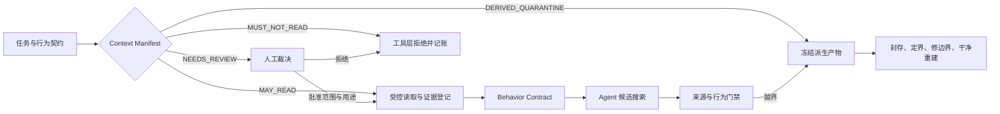

# 第 4 章：Clean Room 与 Agent Context Boundary

> **定位**：本章把 clean-room 从一句许可警告编译为 Agent 可执行、可暂停、可审计的上下文访问控制。前置依赖是[第 3 章的七字段行为契约](../part1/ch03-behavior-contract.md#从五元组展开为七字段契约)；适用于重实现任务启动、检索系统配置、子任务委派和来源事故响应。读完后，读者应能批准一份 Context Manifest，并判断一次“没有引用禁止材料”为什么仍不足以证明上下文干净。

## 具体失败现场：引用删掉了，污染没有消失

团队准备迁移内部命令 `manifest-copy`。负责人在提示中写了“不得读取参考实现源码”，却把两个仓库都交给代码索引器。Agent 搜索“保留目标 mode”时，检索器先读取禁止仓库中的帮助函数，再生成一段不带引用的摘要；Agent 根据摘要提出几乎相同的辅助结构。评审只扫描最终 Markdown 和 diff，没有发现禁止路径，于是认为 clean-room 门禁通过。

两周后，索引服务的访问日志显示禁止文件曾进入向量缓存。问题不只是一段代码是否逐字相同：行为契约、测试命名、模块拆分和后续三个任务都读过同一缓存。删掉候选中的注释无法回答哪些产物受影响；重新开聊天也无效，因为检索缓存与自动补全仍在。团队只能冻结任务、封存日志、撤销受影响提交，再从干净索引重建。

这个现场暴露三种常见错觉。第一，prompt 是意图，不是强制访问控制。第二，最终产物没有链接，只能证明“成稿未显示链接”，不能证明生成过程没有接触材料。第三，Agent 的上下文不是一次聊天窗口，而是文件、搜索结果、命令输出、附件、缓存、子 Agent 和人工粘贴内容的联合供应链。

因此本章的工程问题不是“如何提醒模型别看”，而是：**如何让每一条进入候选搜索空间的信息都有分类、有准入决定、有访问记录，并在越界时能确定废弃范围。**

## 概念模型：三种边界与四种状态

clean-room 讨论容易把法律许可、工程来源与工具可见性混成一个布尔值。本章将它们分开：

| 边界 | 回答的问题 | 决策者 | 典型证据 | 不能替代 |
|---|---|---|---|---|
| 法律／合同边界 | 材料能否按许可证、合同和司法辖区规则使用？ | 法务、许可负责人 | 许可证文本、合同、专业意见 | 工具 ACL、行为正确性 |
| 工程来源边界 | 本项目是否允许用该材料派生代码、测试或结构？ | 项目维护者、来源负责人 | `AGENTS.md`、贡献规则、项目决定 | 法律意见、访问日志 |
| Agent 可见边界 | 本任务的模型、工具、缓存和子任务实际能看到什么？ | 任务负责人、平台负责人 | allowlist、工具策略、审计记录 | 独立性法律结论 |

三者可能给出不同答案。公开可访问不等于项目允许派生；项目规则允许阅读某类手册，也不等于每个任务都需要把整套文档塞进上下文；工具成功阻断路径，也不证明模型训练来源或最终相似性没有其他风险。**E4-CONTEXT-BOUNDARY 是本书作者对这些工程控制的提炼，不是论文结论，也不是法律意见。** [E4-CONTEXT-BOUNDARY]

对具体来源，manifest 使用四种状态，而不是模糊的“可读／不可读”：

1. `MAY_READ`：任务可直接读取，仍须记录版本、用途和访问结果。
2. `MUST_NOT_READ`：文件、搜索、网络、索引、缓存和委派层都必须拒绝。
3. `NEEDS_REVIEW`：来源或内容不清，任务暂停，由指定负责人裁决。
4. `DERIVED_QUARANTINE`：内容来自允许性未知的摘要、补丁、日志或缓存；在来源闭合前不得进入候选或测试。

`NEEDS_REVIEW` 与 `DERIVED_QUARANTINE` 的区别很实用：前者是“尚未决定能不能读”，后者是“已经出现一个可能被派生污染的产物”。把二者都当成普通待办，会让候选继续沿用未知摘要。



## 一手规则走查：政策事实怎样变成控制

固定源码基线 `d8bee62c1ddc227d5e4385d80bbf6d7dee266a41` 中，[`AGENTS.md:7–15`](https://github.com/uutils/coreutils/blob/d8bee62c1ddc227d5e4385d80bbf6d7dee266a41/AGENTS.md#L7-L15)先规定驱动 Agent 的人对输出负责并须阅读 diff，随后明确禁止读取、复制或派生禁止实现的代码、辅助结构、测试夹具和注释。[E2-CLEANROOM] 这条规则至少带来三个工程动作：允许列表不能只排除 `.c` 文件；测试与注释也属于来源对象；人工责任不能由 Agent 自报“我没读过”完成。

同一文件的 [`AGENTS.md:17–23`](https://github.com/uutils/coreutils/blob/d8bee62c1ddc227d5e4385d80bbf6d7dee266a41/AGENTS.md#L17-L23)要求新行为或 bug 修复进入本地 Rust 测试，并以“No tests, no merge”收束。[E2-AI-POLICY] 这使 clean-room 与回归资产发生连接：允许的黑盒或外部套件发现差异后，修复不能只依赖外部材料长期存在，而要把经过来源裁决的行为固化到本项目拥有的测试中；测试本身也必须有来源记录。

[`CONTRIBUTING.md:19–25`](https://github.com/uutils/coreutils/blob/d8bee62c1ddc227d5e4385d80bbf6d7dee266a41/CONTRIBUTING.md#L19-L25)把原始代码与禁止来源的链接同时排除，并说明可参考的其他许可实现仍需按其许可证判断。[E2-CLEANROOM] 这否定了“只要不复制文本，给 Agent 一个链接就没关系”的做法。许可 URL、问题报告中的粘贴片段、代码搜索摘要都应按内容而非载体分类。

[`CONTRIBUTING.md:218–229`](https://github.com/uutils/coreutils/blob/d8bee62c1ddc227d5e4385d80bbf6d7dee266a41/CONTRIBUTING.md#L218-L229)进一步要求 AI 辅助贡献者理解、解释、证明每一行，警惕输出派生风险，并保持补丁小而聚焦。[E2-AI-POLICY] 这是项目当前规则，不是 arXiv 论文对 Agent 的实验结论。它给 manifest 增加了 `human_owner`、`explain_back`、`diff_scope` 和 `review_receipt` 字段；第 6 章会把“小而聚焦”编译为[原子任务](ch06-agent-atomicity.md#概念模型行为意图而不是文件数量)。

固定提交的 [`CONTRIBUTING.md:128–133`](https://github.com/uutils/coreutils/blob/d8bee62c1ddc227d5e4385d80bbf6d7dee266a41/CONTRIBUTING.md#L128-L133)允许从用户手册理解行为，[`DEVELOPMENT.md:197–239`](https://github.com/uutils/coreutils/blob/d8bee62c1ddc227d5e4385d80bbf6d7dee266a41/DEVELOPMENT.md#L197-L239)只记录外部套件的执行入口与前提。[E2-EXTERNAL-SUITES] 它们证明项目文档存在这些入口，不证明 Agent 获得了上下文访问权；访问仍由 manifest 决定。论文 P1 把成功调用的退出状态、stdout 与文件系统结果纳入兼容目标，说明黑盒采集需要跨越文本输出和外部状态。[E1-P1] 但 P1 没有提出 Context Manifest，也没有证明任何特定观察就是规范；观察仍须经过第 3 章的契约裁决。

<!-- source: AGENTS.md -->
<!-- source: CONTRIBUTING.md -->
<!-- source: DEVELOPMENT.md -->

### 从规则到多层强制

一份真正可执行的边界至少覆盖六层：

| 层 | 最小控制 | 失败信号 | 处置 |
|---|---|---|---|
| 文件系统 | 规范化绝对路径 allowlist；拒绝符号链接逃逸 | 路径不在允许根或解析后越界 | 拒绝、记录、停止任务 |
| 搜索／RAG | 建索引前排除禁止来源；结果带原始 locator | 命中未知索引、摘要无来源 | 隔离结果，不能返回模型 |
| 命令执行 | 区分“执行黑盒”与“读取容器文件”；输出字段白名单 | 命令枚举参考环境或输出源码 | 终止进程，封存日志 |
| 网络／附件 | 域名、仓库、MIME 与内容复核 | 链接重定向、附件含代码片段 | 转 `NEEDS_REVIEW` |
| 缓存／记忆 | 任务级 namespace、TTL、关闭时清除证明 | 跨任务命中或来源丢失 | 污染范围升级为所有消费者 |
| 委派 | 子任务继承 manifest 哈希和最小权限 | 子 Agent 请求更宽上下文 | 父任务暂停并人工扩权 |

成稿中的 `<!-- source: ... -->` 扫描只覆盖“最终文稿声明了什么”；它不读取模型历史、索引内容或工具日志，因而不能被写成过程 clean-room 证明。扫描结果应叫 `publication_reference_gate`，访问控制结果应叫 `context_access_receipt`，两者分栏报告。

## 完整工程案例

### 启动、暂停、重建与关闭

案例 `CM-MANIFEST-COPY-004` 的行为意图是修复 `manifest-copy` 对非 UTF-8 路径的记录丢失。它继承第 3 章 `BC-MANIFEST-007@v4`，候选提交固定，允许修改一个 utility 模块和对应 Rust 测试。团队不把“整个仓库可读”当默认值，而按生命周期执行。

**启动。** 来源负责人先批准项目文档、目标仓库中指定路径、对应测试、公开接口规范和隔离黑盒输出为 `MAY_READ`；禁止实现源码及其测试、补丁、镜像、派生索引为 `MUST_NOT_READ`；含未知代码片段的问题单进入 `NEEDS_REVIEW`。平台创建全新索引 namespace，记录规则版本、commit、规范化根、工具策略摘要和缓存 TTL。负向探针尝试读取一个禁止 locator，预期结果必须是 `denied`；若探针成功，任务不能启动。

**发现。** 测试工程师在隔离容器中只暴露参考二进制的执行接口，输入由候选侧准备。采集 argv、locale、stdout/stderr 原始字节、退出码和目录前后快照，不挂载可浏览源码。每条观察写入 evidence ledger，并标为“reference observation”；产品负责人再决定哪些现象进入契约。Agent 只看批准后的观察包和契约，不看原始环境。

**第一次候选。** Agent 提出把路径转成 `String` 后输出。固定仓库贡献规则与现有字节路径测试表明该设计会丢失 Unix 非 UTF-8 身份，评审拒绝，并要求保留 `OsStr`/`Path` 边界；这属于允许源码证据，不需要扩张来源集。候选尚未形成提交，日志仍记下拒绝原因。

**暂停事故。** 一个审稿人粘贴了来自未知 issue 的辅助函数摘要。工具无法确认其原始 locator，于是将内容标为 `DERIVED_QUARANTINE`，停止 Agent，冻结从粘贴时点后的候选、测试草稿与摘要缓存。负责人没有假定“只有十行，不影响大局”，而沿 provenance graph 找到两个消费者：当前候选与一个子任务的测试设计。

**裁决与重建。** 来源负责人拒绝该摘要；平台修复粘贴入口，要求未知代码块先隔离。两个受影响产物被废弃，不从其 diff 继续修改。在新 namespace 中，团队只用原行为契约、允许的项目规则与重新执行的黑盒观察生成测试和实现。重建产物可能与旧草稿得到相同算法，但证据链不再依赖被拒来源；相似性仍交给人工与必要的专业审查。

**关闭。** 聚焦测试、来源探针和引用门禁通过后，任务生成关闭回执：列出实际读取 locator、拒绝事件、人工裁决、产物哈希、缓存删除结果、剩余未知和 human owner。manifest 状态从 `active` 变为 `closed`；任何后续修改都必须新建版本，而不能静默复用旧缓存。

案例完整并不表示法律独立性得到证明。它证明的是：在声明的工具和日志范围内，访问决定可复核，已知越界产物被废弃并从批准材料重建。训练数据、未受控人工记忆、审计系统自身缺陷和司法判断仍在边界外。

## 反例

**反例一：只有 prompt 禁令。** “不要读取 X”写在系统提示中，但工具仍可搜索 X。即使这次日志没有命中，也只是偶然未触发；权限模型仍错误。修复是先缩小工具能力，再把提示用于解释停止条件。

**反例二：把所有旧行为都隔绝。** 某团队害怕来源风险，连公开规范、帮助文本、批准的黑盒输出和本项目测试都不允许 Agent 读取。候选只能猜测接口，兼容差异迅速增加。clean-room 的目标是控制来源，不是消灭行为证据；合法来源应通过 `MAY_READ` 进入契约。

**反例三：删除污染提交即可。** 如果一个摘要被缓存、下游任务复制了测试结构，删除最初 commit 没有清除派生图。事故范围应由“从首次暴露时点起的所有消费者”决定，而不是由 Git 最终树决定。

## 可复用工件

下面的 **Context Manifest v1** 可直接复制。它是 E4 作者工件，必须由项目规则和专业审查校准。

```yaml
schema: context-manifest/v1
task_id: CM-MANIFEST-COPY-004
behavior_contract: BC-MANIFEST-007@v4
candidate_commit: d8bee62c1ddc227d5e4385d80bbf6d7dee266a41
owners:
  task: migration-owner
  provenance: source-owner
  legal: legal-contact
  tooling: platform-owner
policy:
  version: clean-room-policy/2026-08-14
  normalized_workspace_root: /workspace/candidate
  may_read:
    - {kind: project_doc, locator: AGENTS.md, purpose: repository_rules}
    - {kind: project_doc, locator: CONTRIBUTING.md, purpose: source_and_rust_policy}
    - {kind: candidate, locator: src/uu/manifest-copy/**, purpose: scoped_implementation}
    - {kind: candidate_test, locator: tests/by-util/test_manifest_copy.rs, purpose: regression}
    - {kind: black_box_receipt, locator: obs://BC-MANIFEST-007/*, purpose: behavior}
  must_not_read:
    - {kind: prohibited_implementation, locator: deny://reference-source/**}
    - {kind: derived_index, locator: deny://reference-index/**}
  needs_review:
    - {kind: issue_or_attachment_with_code, owner: source-owner, sla: 1d}
  derived_quarantine:
    - {id: Q-01, locator: paste://review/778, status: rejected, consumers: [draft-2, child-test-1]}
tool_controls:
  filesystem: {mode: allowlist, symlink_escape: deny}
  search: {index_namespace: cm-004-clean, provenance_required: true}
  command: {reference_capability: execute_only, filesystem_browse: deny}
  network: {allowlist: [approved-primary-sources], redirects: recheck}
  cache: {namespace: cm-004-clean, ttl: task, close_action: purge}
  delegation: {inherit_manifest_hash: required, privilege_escalation: human_only}
access_log:
  - {at: 2026-08-14T09:00:00Z, tool: filesystem, locator: AGENTS.md, decision: allow, digest: sha256:...}
  - {at: 2026-08-14T09:02:00Z, tool: negative_probe, locator: deny://reference-source/probe, decision: deny}
decisions:
  - {id: D-01, subject: Q-01, owner: source-owner, verdict: reject, reason: origin_unresolved}
artifacts:
  - {id: contract, digest: sha256:..., clean_rebuild: true}
  - {id: candidate, digest: sha256:..., clean_rebuild: true}
receipts:
  access_control: pass
  negative_probe: pass
  publication_reference_gate: pass
  cache_purge: pass
remaining_unknowns: [model_training_provenance, human_unlogged_memory]
state: closed
```

使用时有四条硬规则：`may_read` 必须写用途，不能用仓库根通配符逃避最小权限；`must_not_read` 同时进入文件、搜索、网络和缓存策略；所有派生产物有消费者边；`closed` 必须有缓存处理和人类签署。manifest 不记录模型隐式推理，也不应保存敏感内容全文；它记录的是来源决定、访问事实与产物关系。

## 模式提炼

**三边界分栏**解决“项目允许”被误写成“法律安全”或“Agent 实际没读”的问题。前提是三类负责人和证据分别存在；失效边界是用同一个绿色勾选替代所有判断。

**最小可见上下文**让 Agent 只获得当前行为意图需要的材料。它降低无关派生与搜索噪声；若任务跨越共享层，应升版 manifest 并扩大验证，而不是私自搜索。

**派生图式污染响应**以首次暴露和消费者决定废弃范围。它比删除引用严格，也比无条件重做全项目精确；前提是访问与产物日志能连接。日志缺失时应采取保守范围，不能伪造精确结论。

**执行与读取能力分离**允许黑盒观察输出，同时阻断参考环境文件浏览。适用于可隔离执行的 CLI；对产生不可逆副作用或无法封装的系统，应先设计仿真、镜像流量或人工观察，不直接授权 Agent。

## AI Coding 工作台

工作台固定展示六块而非一个聊天框：当前 manifest 哈希、允许 locator、拒绝事件、Behavior Contract 版本、派生产物图、停止／恢复状态。Agent 每次请求新路径都得到 `allow|deny|review` 的结构化结果；`deny` 不是可由换关键词绕过的建议，`review` 不得自动重试其他工具。

任务提示骨架可以写成：

```text
实现 behavior_contract=BC-MANIFEST-007@v4 的 lossless path record 切片。
只读 context_manifest=CM-MANIFEST-COPY-004 中 MAY_READ locator；
只改 allowed_paths；不得创建共享抽象或修改比较器。
先证明 negative_probe=denied，再读取证据。
若来源无 locator、工具返回 NEEDS_REVIEW、需要扩路径、观察互相冲突，立即停止。
交付：最小 diff、聚焦测试、访问回执、未运行检查、剩余 unknown；不得批准发布。
```

提示词没有改变权限；真正约束来自工具配置和门禁。人类负责批准来源、解释 diff、裁决允许差异和处理事故。Agent 可以建议缩小上下文、生成 manifest 草稿、检查字段闭合，但不能把自己对来源的确信升级为许可决定。

## 能证明什么／不能证明什么

| 能证明什么 | 不能证明什么 |
|---|---|
| 固定提交的项目规则明确禁止读取、复制和派生禁止实现材料，并要求人类拥有输出。[E2-CLEANROOM] [E2-AI-POLICY] | 这些项目规则本身不是某司法辖区的法律意见，也不证明工具执行过规则。 |
| allowlist、拒绝探针与访问日志若在声明工具范围内通过，可证明已记录请求按该策略处置。 | 未受审计工具、人工记忆、模型训练数据或审计系统缺陷没有引入信息。 |
| publication reference gate 可证明成稿没有命中它扫描的路径和 URL 模式。 | 生成过程未读取禁止内容，或无引用文本一定独立产生。 |
| 污染响应记录能证明已知消费者被识别、废弃并在新 namespace 重建。 | 未记录消费者不存在，或重建产物自动满足法律与行为要求。 |
| 黑盒收据能证明特定输入、环境与观察字段下发生了某个现象。[E1-P1] | 该现象值得保留、其他输入相同，或参考实现是绝对规范。 |
| 本地 Rust 回归能保存经过裁决的行为反例。[E2-EXTERNAL-SUITES] | 测试夹具来源天然合规、契约完备或生产风险已消失。 |

## 局限

clean-room 工程控制降低来源不明和不可审计派生风险，不自动提供法律结论。高风险重实现仍需法律、许可证与供应商条款审查，必要时还需独立相似性分析。模型训练来源的宏观不确定性不能由任务 manifest 消除。

日志也有代价与隐私风险。访问记录应保存 locator、摘要哈希、决定和消费者关系，不应无差别复制秘密或个人数据。审计服务自身需要访问控制、保留周期和篡改防护；否则“为了可追溯”会创造新的敏感数据仓库。

最后，边界会演化。仓库新增子模块、构建脚本下载产物、搜索服务更换索引，都可能使旧策略失效。manifest 必须绑定版本；跨任务记忆与缓存默认不复用。合法证据被错误阻断时，`NEEDS_REVIEW` 通道要有负责人和时限，否则治理会退化为停工。

## 实践清单

- [ ] 三种边界是否由不同证据和负责人作答，没有用工程回执冒充法律结论？
- [ ] `MAY_READ/MUST_NOT_READ/NEEDS_REVIEW/DERIVED_QUARANTINE` 是否覆盖文件、搜索、命令、网络、缓存和委派？
- [ ] 是否先运行拒绝探针，再让 Agent 读取证据？
- [ ] 黑盒执行是否与参考环境文件读取隔离，并记录 `I/O/X/S/E/P/U`？
- [ ] 派生产物是否能从来源追到消费者；越界后是否废弃而非只删引用？
- [ ] 关闭任务时是否清理缓存、封存决策、列出剩余 unknown 并由人签署？

## 练习

- **练习一：设计验证。** 为一个带 RAG 的迁移任务写 Context Manifest，并设计三个负向探针：直接路径、符号链接逃逸、从旧缓存命中。验收标准是三者都被拒绝且日志仍不泄漏内容。
- **练习二：污染定界。** 给定“未知 issue 摘要被当前候选、测试生成器和子任务读取”的时间线，画 provenance graph，列出必须废弃、可以保留和需要人工判断的产物，并说明证据缺口如何扩大保守范围。
- **练习三：边界评审。** 比较“禁用所有黑盒执行”与“execute-only 容器”两种方案，为带文件副作用的命令填写风险、可观察字段、停止条件和人工裁决；不得把执行能力自动等同于读取许可。

## 本章证据

本章四项主证据为 clean-room 项目规则 [E2-CLEANROOM]、AI 与测试责任 [E2-AI-POLICY]、外部行为入口 [E2-EXTERNAL-SUITES] 和论文成功调用观察面 [E1-P1]。三边界、四状态、Context Manifest、派生图与工作台属于作者工程提炼 [E4-CONTEXT-BOUNDARY]；合成案例不对应固定仓库事故。

### 版本演化说明

论文基线为 **arXiv:2608.07135**；源码与规则固定核验于 **d8bee62c1ddc227d5e4385d80bbf6d7dee266a41**；本章证据核验日期为 **2026-08-14**。仓库政策、检索产品和模型工具都会演化，复用 manifest 前必须重验策略与实际控制；“该提交规则如此”不能外推为永久现状。
