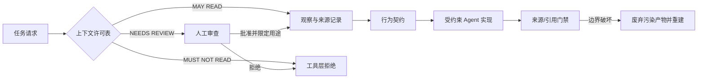

# 第 4 章：Clean Room 与 Agent Context Boundary

> **定位**：本章设计 Agent 在迁移中的知识边界。前置依赖是第 3 章的行为契约；输出是一张可审计的上下文许可表，以及发现行为而不接触禁止源码的工作流。

AI Coding 系统往往把「更多上下文」视为无条件利好：索引整个仓库，加载更多文档，允许模型在多个代码库中自由搜索。在普通功能开发中，广泛上下文确实可能减少重复工作。在独立重实现中，这个假设却可能破坏项目的法律、来源或设计边界。上下文不只是计算资源，也是一种权限。

uutils 对贡献者的明文要求是：不阅读、不复制 GNU 实现源码；贡献指南允许阅读 GNU 手册，外部套件与黑盒比较则提供行为证据入口。[E2-CLEANROOM] [E2-EXTERNAL-SUITES] 对 AI 贡献，仓库还要求贡献者理解和拥有变更，注意生成内容的来源与许可风险，保持补丁小而聚焦。[E2-AI-POLICY] 这些是当前仓库规则，不是论文对 AI 开发的测量结论。

<!-- source: AGENTS.md -->
<!-- source: CONTRIBUTING.md -->

## clean-room 是一种过程约束

clean-room 不是心理声明。「我没有故意复制」不能代替可审计过程。一个可执行的 clean-room 流程至少需要回答：

- 哪些信息源可读，哪些永远不得读，哪些需经人工复核；
- 行为事实如何进入契约，并保留来源与时点；
- Agent 的检索、命令与输出如何留下可审计记录；
- 发现边界被破坏时，哪些产物必须废弃并从干净上下文重建。

这种过程的目标是降低不当派生与无法解释的相似性风险，不是凭借一张许可表自动证明法律独立性。实际项目仍需要法务、许可和来源专业审查。工程流程能做的，是让信息流动变得可见、可拒绝和可复盘。[E4-CONTEXT-BOUNDARY]

## 上下文许可表

下表是可改造的起点，并非法律意见。具体项目应根据许可、合同、组织政策与开源项目规则由负责人批准。

| 类别 | 默认决策 | 典型信息 | 工程处理 |
|---|---|---|---|
| MAY READ | 可用作契约证据 | 公开规范、手册、已批准测试、黑盒执行结果 | 记录来源、版本、查询方法与观察 |
| MUST NOT READ | 禁止进入 Agent 上下文 | 项目规则禁止的参考实现源码或未授权材料 | 在文件、搜索、RAG、工具和日志层同时拦截 |
| NEEDS REVIEW | 暂停使用 | 许可不清、含源码摘录的问题报告、第三方补丁或训练来源不明产物 | 由指定审查人做决定，结论进入许可表 |

「MUST NOT READ」必须在技术上成立。只在 prompt 中写「不要看」，同时让全仓库索引包含禁止目录，不是真正边界。应在建立索引时排除，在命令工具中以规范化绝对路径允许列表拒绝越界访问，在网络工具中限制来源域，在任务契约中写明，并保存实际访问日志。本书自带脚本只做**出版物引用扫描**：检查声明的本地来源存在，并拒绝成稿中出现若干已知禁止路径或 URL 形态；它既不能证明 Agent 从未读取禁止材料，也不能替代工具 ACL、索引隔离和访问审计。两类结论必须分开报告。

## 如何在不读实现的情况下发现行为

第一个信息源是公开规范与用户文档。它们定义名义接口，但往往不穷尽错误顺序、文本和平台细节。第二个信息源是黑盒实验：在隔离且可复现的环境中执行参考程序，记录输入、环境、stdout、stderr、退出码与资源前后状态。第三个信息源是已批准的外部测试套件和下游问题报告，它们补充真实使用方式。[E1-P1]

黑盒实验也需要受控。输入文件应使用临时沙箱，时区、locale、umask、时钟和平台应被记录，带副作用的命令不应直接对开发者环境运行。否则 Agent 看到的不是行为契约，而是未被标记的环境噪声。每个观察还应分为「规范要求」、「参考实现现象」与「项目决定保留」，防止一次执行直接晋升为永久规范。

## Agent Context Manifest

对每个迁移任务，建议生成一份 context manifest。它并不保存模型的隐式推理，而是分别保存声明权限与观察记录：任务 ID、候选仓库 commit、规范化路径根、允许/禁止来源、文档哈希与检索时间、实际工具动作、黑盒命令与环境、人工批准决定、输出摘要哈希、生成的契约版本，以及门禁结果。当仓库或来源变化时，manifest 可以判定哪些任务需要重新发现；当审查者质疑某个实现选择时，可以追溯到它所依据的行为证据。可复制结构见[附录 C：Agent 上下文许可清单](../appendices/context-permissions.md)。

对 RAG 或代码搜索系统，manifest 应控制检索集本身，而不只在返回文本后做过滤。否则禁止内容可能已经通过向量、摘要、缓存或自动生成的符号描述泄漏到候选中。同理，子 Agent、外部工具与代码审查器必须继承相同的边界；不能通过转交任务绕过权限。

## 将边界作为供应链控制

Agent 的上下文不只来自开发者主动打开的文件。命令输出可能包含生成源码，issue 可能粘贴禁止实现，构建脚本可能下载外部产物，代码搜索结果可能经过一层摘要间接泄漏。因此，context boundary 应同时覆盖文件读取、网络来源、仓库搜索、命令输出、附件、缓存和子任务。它实际上是一条信息供应链。

对每种工具，应定义「可见输入」、「可持久输出」与「不得作为二次上下文的内容」。例如，黑盒执行的 stdout/stderr 可作为行为证据，但命令所在容器中的参考实现文件系统仍不得被枚举。通过将执行能力与读文件能力分开，团队可以获得黑盒现象，而不是把参考环境变成可浏览仓库。

## 边界事故的处理

如果发现 Agent 误读禁止文件，不应只删除引用后继续使用生成代码。第一步是冻结相关产物与日志，确定暴露范围；第二步由独立负责人判断哪些契约、测试和代码可能受影响；第三步修复技术边界，并在干净会话中使用可允许的行为证据重建受影响产物；第四步增加可自动检测的回归门禁。是否需要法务或项目管理层升级，由组织政策决定。

## 模式提炼

**可审计上下文边界**：在 Agent 执行前声明权限，在工具层强制允许列表，并将实际访问写入 manifest。它适用于来源、隐私或安全边界明确的重实现；只有成稿引用扫描而没有 ACL 与访问日志时，该模式失效，不能声称过程 clean-room 已被证明。

## 局限

clean-room 流程降低了过程风险，但不自动产生法律结论，也无法消除模型训练来源的宏观不确定性。对高风险项目，需要专业许可审查、工具与模型供应商条款评估，以及必要的相似性分析。许可表还有过时风险：新增目录、子模块和外部链接可能改变信息边界，所以门禁与审计必须持续运行。

最后，过严的边界也可能让合法行为证据无法进入契约。因此 NEEDS REVIEW 通道必须真正可用，并在时限、负责人和决策记录上有明确机制。

## 实践清单

- [ ] 由明确负责人批准 MAY READ、MUST NOT READ 与 NEEDS REVIEW 列表。
- [ ] 在索引、搜索、文件工具和子 Agent 层统一强制禁止边界。
- [ ] 对黑盒执行记录命令、环境、平台、输出和副作用快照。
- [ ] 将规范、观察现象与项目决策分别标注。
- [ ] 为每个任务生成 context manifest，并将其放入变更证据包。
- [ ] 一旦发现禁止上下文泄漏，停止沿用受污染产物并进行独立复核。

## 本章证据

项目的 clean-room 与 AI 贡献要求来自当前仓库文档 [E2-CLEANROOM] [E2-AI-POLICY]，外部套件与黑盒比较入口来自开发文档 [E2-EXTERNAL-SUITES]；行为发现的案例背景来自论文 [E1-P1]；上下文许可表、manifest 与工具层强制是本书的治理综合 [E4-CONTEXT-BOUNDARY]。

### 版本演化说明

论文基线为 **arXiv:2608.07135**；本地源码基线为 **d8bee62c1ddc227d5e4385d80bbf6d7dee266a41**；本章证据核验日期为 **2026-08-14**。仓库 AI policy 可在论文之后演化，因此本章明确把它归入当前源码证据，而非论文研究结论。
