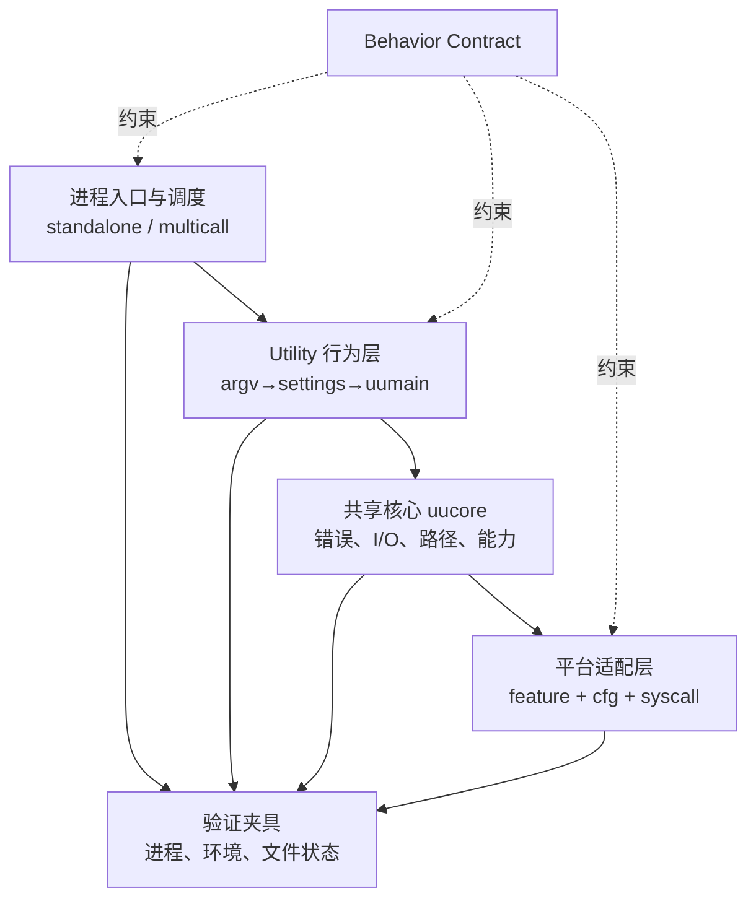
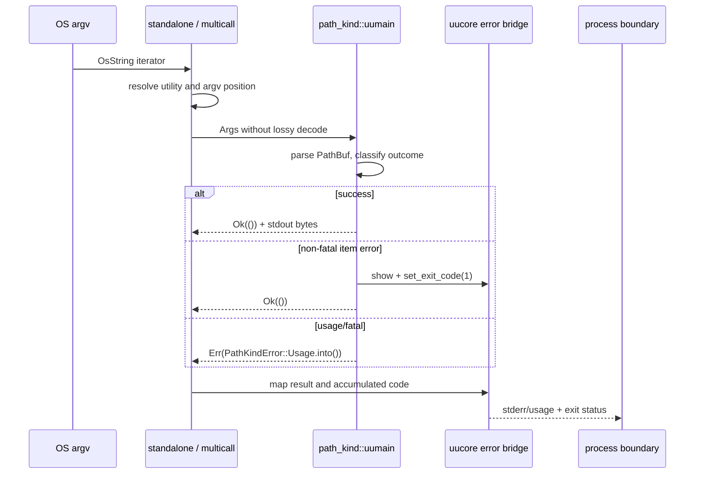

# 第 5 章：用 Rust 建立迁移骨架

> **定位**：本章把[第 3 章行为契约](../part1/ch03-behavior-contract.md#七字段契约)和[第 4 章 Context Manifest](ch04-clean-room.md#可复用工件)落到 Rust 工程接缝：workspace、utility、共享核心、进程入口、平台分支与验证夹具。适用于创建第一个候选 crate、决定抽象上提，或审查路径／错误／cfg 边界的读者。完成本章后，读者应能画出从 argv 到进程退出的真实控制流，并为“先共享还是先局部”留下可复核决策。

## 具体失败现场：类型都对，命令仍然不兼容

团队迁移一个合成命令 `path-kind PATH`。它输出路径最后一个组件；找不到路径时打印诊断并退出 1。第一版 Rust 代码很整洁：入口将 `args_os()` 立刻转成 `String`，解析函数返回 `Result<String, anyhow::Error>`，顶层统一打印错误并退出 1。Linux 上 ASCII 测试全绿，Clippy 没有警告。

三个反例击穿了“骨架已完成”。包含字节 `0xFF` 的合法 Unix 路径在 `to_string_lossy()` 后与另一个真实 Unicode 名称碰撞；某个参数错误本应退出 2，却被统一映射为 1；multicall 形式 `toolbox path-kind ...` 比独立二进制多消费一个参数，候选测试只调用了库函数。所有代码都是 safe Rust，所有 `Result` 都被处理，错误仍位于外部契约。

根因不是 Rust 不适合，而是架构接缝在证据之前做了三个有损决定：把路径身份降为文本、把错误类别降为字符串、把进程入口降为“以后再测”。迁移骨架的职责不是预先建造完美抽象，而是**延迟不可逆归一化，让每个外部行为在合适边界仍然可观察、可测试、可替换**。

## 概念模型：五层骨架与两条轴

本章用五层表示证明责任，而不是目录审美；五层骨架与下述两条轴统一标为作者治理模型 [E4-RUST-SKELETON]，不是论文或固定仓库自称的方法：



**入口层**拥有 argv 形状、utility 选择、初始化与最终退出；**utility 层**拥有某个命令的参数优先级和行为状态机；**共享核心**只承载已证实共同且稳定的机制；**平台层**把能力差异显式化；**验证夹具**从进程外观察 `I/O/X/S/E/P/U`。测试不是第五个实现层，而是一条不随内部重构消失的外部接缝。

另有两条正交轴：

| 轴 | 左端 | 右端 | 决策问题 |
|---|---|---|---|
| 复用轴 | utility-local | workspace-shared | 共同的是代码形状，还是已经证明相同的行为？ |
| 平台轴 | portable core | target capability | 差异能由通用类型表达，还是必须在目标系统执行验证？ |

抽象位置不是由函数行数决定。两个命令都有“打开文件失败”并不代表诊断、退出码、继续处理策略相同；同一个“rename”名称也不代表跨文件系统、Windows 与 Unix 的提交语义相同。先把行为留在局部，积累至少两个独立用例和相同契约，再上提；这条规则属于 [E4-RUST-SKELETON]，不是仓库强制的模块数量。

## 一手源码走查：从 workspace 到退出状态

论文把多个 utility 依赖共享 `uucore`、由 multicall 承载多命令描述为星形架构。[E1-ARCH] [第 2 章](../part1/ch02-uutils-case.md)已将它与固定提交路径分栏，本章不混成“永久现状”。

### workspace 是统一策略入口，不是自动继承魔法

[`Cargo.toml:375–395`](https://github.com/uutils/coreutils/blob/d8bee62c1ddc227d5e4385d80bbf6d7dee266a41/Cargo.toml#L375-L395)声明 resolver 3，把根包、`src/uu/*`、`src/uucore`、过程宏和测试夹具纳入 workspace，并在 `workspace.package` 固定 edition、最低 Rust 版本、许可证和版本。[E2-ORIENTATION] 这证明固定快照存在共同构建身份，不证明每个成员自动继承所有字段。实际成员要用 `edition.workspace = true`、依赖的 `workspace = true` 或 `[lints] workspace = true` 显式接入。

workspace 适合集中三类政策：构建身份、已批准依赖版本、共享 lint。它不应隐藏发布差异。某个 feature 如果改变 CLI 可见行为，就不只是“编译开关”，而是另一个需要契约和测试的产物。resolver 能解决 feature 解析规则，不能替项目决定哪些组合受支持。

### utility crate 保存局部行为

固定贡献指南 [`CONTRIBUTING.md:29–51`](https://github.com/uutils/coreutils/blob/d8bee62c1ddc227d5e4385d80bbf6d7dee266a41/CONTRIBUTING.md#L29-L51)给出 `src/uu`、`uucore`、`tests/by-util`、multicall 和测试夹具的方向，并说明 utility 通常是独立 crate。[E2-ORIENTATION] 例如 `src/uu/basename/src/main.rs:6` 只有 `uucore::bin!(uu_basename)`；薄入口避免每个 utility 重写相同启动协议，命令语义仍在局部库。

“薄”不等于“不重要”。入口宏怎样把 OS 参数传给 `uumain`、怎样处理 `UResult`、最后怎样选择 exit code，都是进程契约。如果单元测试绕过入口，最容易漏掉的正是参数消费和最终退出。

### `uucore` 是 feature 与平台交叉点

[`src/uucore/src/lib/lib.rs:10–90`](https://github.com/uutils/coreutils/blob/d8bee62c1ddc227d5e4385d80bbf6d7dee266a41/src/uucore/src/lib/lib.rs#L10-L90)先按 feature 重导出外部 crate、跨平台模块和解析／格式／I/O 等能力；[`92–140`](https://github.com/uutils/coreutils/blob/d8bee62c1ddc227d5e4385d80bbf6d7dee266a41/src/uucore/src/lib/lib.rs#L92-L140)再把 `mode`、`entries`、`perms`、`safe_copy`、`signals`、`wide` 等限定到目标与 feature 的交集。[E2-UUCORE] `src/uucore/Cargo.toml:100–140` 还为 Linux/Android、Unix、Windows 与 OpenBSD 声明不同依赖。

这段布局证明的是“平台能力被条件编译表达”，不是所有分支都被当前机器验证。`cfg` 为 false 的代码不参加本次类型检查；API 在 Linux 构建成功也不证明 Windows 系统调用语义。平台分支必须进入第 3 章的 `P` 字段和[第 8 章平台矩阵](../part3/ch08-test-layers.md#环境权限与平台矩阵)。

### `UResult` 把 Rust 传播与 CLI 退出连接

[`src/uucore/src/lib/mods/error.rs:5–32`](https://github.com/uutils/coreutils/blob/d8bee62c1ddc227d5e4385d80bbf6d7dee266a41/src/uucore/src/lib/mods/error.rs#L5-L32)解释 `UResult` 的目的：让 utility 使用 `?` 等惯用传播，同时让错误携带外部退出码；成功时使用累计的非致命 exit code，失败时输出错误并使用错误 code。[E2-ERROR-MODEL] [`65–103`](https://github.com/uutils/coreutils/blob/d8bee62c1ddc227d5e4385d80bbf6d7dee266a41/src/uucore/src/lib/mods/error.rs#L65-L103)定义全局 exit code、`set_exit_code`、`UResult<T>`；[`160–268`](https://github.com/uutils/coreutils/blob/d8bee62c1ddc227d5e4385d80bbf6d7dee266a41/src/uucore/src/lib/mods/error.rs#L160-L268)让 `UError::code()`提供 shell 可见状态，并另有 usage 决策。

这套桥接保留了“多个输入中部分失败、继续处理、最终非零”的表达能力。它也有边界：共享 trait 不自动给每个错误分配正确 code；错误 `Display` 仍可能写错通道、路径显示或文案；全局 exit 状态需要结合入口与测试理解。`UResult` 是桥，不是 oracle。

### multicall 也是公共入口

[`src/bin/coreutils.rs:52–78`](https://github.com/uutils/coreutils/blob/d8bee62c1ddc227d5e4385d80bbf6d7dee266a41/src/bin/coreutils.rs#L52-L78)取得可执行文件名，判断由名称直接选 utility，还是从第二个参数选 utility；[`80–124`](https://github.com/uutils/coreutils/blob/d8bee62c1ddc227d5e4385d80bbf6d7dee266a41/src/bin/coreutils.rs#L80-L124)处理特殊参数、定位 `uumain`、初始化本地化并以其结果退出。[E2-MULTICALL]

因此同一个 utility 至少有三种入口观察：独立二进制、以名称／链接形式进入 multicall、`coreutils <utility>`。映射代码生成成功只证明符号存在；只有进程测试能证明 argv 没有多吃或少吃、utility name 正确、帮助和错误前缀符合契约。

### 路径类型要保留身份直到边界

贡献指南 [`CONTRIBUTING.md:147–187`](https://github.com/uutils/coreutils/blob/d8bee62c1ddc227d5e4385d80bbf6d7dee266a41/CONTRIBUTING.md#L147-L187)要求避免 panic／直接退出，限制 `unsafe`，并在路径上保留 `OsStr`/`Path`，因为 Unix 路径可能不是 UTF-8。[E2-RUST-SAFETY] 固定测试 [`tests/by-util/test_basename.rs:139–159`](https://github.com/uutils/coreutils/blob/d8bee62c1ddc227d5e4385d80bbf6d7dee266a41/tests/by-util/test_basename.rs#L139-L159)构造无效 UTF-8 参数并按原始字节断言输出。这是具体 E2 证据：项目的测试夹具能表达一类字节路径行为；它不证明所有 utility 的整条调用链无 lossy 转换。

<!-- source: Cargo.toml -->
<!-- source: CONTRIBUTING.md -->
<!-- source: src/uucore/Cargo.toml -->
<!-- source: src/uucore/src/lib/lib.rs -->
<!-- source: src/uucore/src/lib/mods/error.rs -->
<!-- source: src/bin/coreutils.rs -->
<!-- source: tests/by-util/test_basename.rs -->

## 完整工程案例

### `path-kind` 从 CLI 到退出的控制流

本案例是合成迁移，不声称固定仓库存在 `path-kind`。行为契约 `BC-PATH-KIND-011` 规定：输入一个原生路径；Unix outcome 的 stdout 是最后组件原始字节加换行，Windows outcome 则保持 `OsString`/`Path` 身份到输出边界，再使用该平台明确批准的表示与比较器；两者都要求 stderr 空、exit 0。缺参数是 usage error（exit 2）；路径不存在时不把“显示失败”与“身份失败”混淆，stderr 使用各平台批准的显示、exit 1。



图中的 `PathKindError::Usage` 是合成 utility 定义的具体错误变体；它实现 `UError::code()`，再由 `.into()` 转为 `UResult` 所需的 `Box<dyn UError>`。trait 只规定行为，不能直接构造。

**第一版：utility 局部、原生路径。** 团队先创建独立 crate 与薄入口，不修改 `uucore`。parser 接收 `OsString`，内部保留 `PathBuf`；只有 `--mode` 这类规范限定为 ASCII 的枚举参数才转 `str`。Unix 输出边界可按契约取原始字节；Windows 仍保留 `OsString`/`Path`，直到使用该平台声明的输出表示，不能用通用“原生字节”模型代替。

**第二步：错误分类。** utility 定义局部 `PathKindError::{Usage,Missing,Display}`，每个变体实现外部 code；usage 与运行失败分开。第一版反例把所有错误包装为 `USimpleError(1, text)`，虽方便却让缺参数从 2 漂到 1，因此被负控拒绝。团队没有因此立刻上提共享错误，因为只有一个 utility 证明了这组类别。

**第三步：入口矩阵。** 测试分别启动独立命令、以 multicall 名称进入和 `coreutils path-kind`。第一次运行发现后者把 utility 名留在参数迭代器中，parser 把它当 PATH；修复位于入口适配，不在路径算法。若只测 `uumain(vec![path])`，这个缺陷永远不可见。

**第四步：平台路径。** Unix fixture 创建字节名 `some-\xFF-file`，按字节断言 stdout；`to_string_lossy()` 负控必须失败。Windows runner 用 `OsString`/`Path` 构造本地合法名称，并断言 Windows outcome 规定的输出表示与路径副作用；它既不复用 Unix 字节 fixture，也不把测试结论表述成泛化的“宽字符串往返”。

**第五步：平台能力。** symlink 分类在目标平台语义不一致，当前任务只承诺 Linux 的 `symlink_metadata` 观察；Windows 项标为 `unknown`，阻断该平台发布，不用 `#[cfg(windows)] return Unsupported` 冒充行为完成。新增平台分支必须先补契约 outcome 与 runner，再进入实现。

**第六步：共享决策。** 第二个 utility 后来需要完全相同的 `MissingPath` code 和显示策略，但第三个 utility 对部分失败要继续并最终 exit 1。团队只把“可逆路径显示”上提共享层，错误状态机保留局部。这个切法由契约相同部分决定，而不是把三个 `match` 长得相似当作证据。

**验证结果。** 编译与聚焦进程测试支持三种入口、两类错误、Linux 字节路径和声明的文件类型；代表性共享回归支持显示帮助未破坏另一 utility。它不证明未构建 target、所有文件系统、竞态、权限错误顺序或诊断逐字兼容。Change Package 应写有限结论，而不是“Rust 骨架跨平台完成”。

## 反例

**反例一：万能共享 trait。** 团队预先设计 `PlatformFs`，方法返回统一 `String` 错误，所有 OS 都实现同一布尔能力。接口看起来整洁，却抹掉原生路径、错误码和“不支持／未验证”的区别。正确替代是窄能力接口、原生类型、显式 unsupported outcome 和平台契约。

**反例二：每段重复都留局部。** 反过来，十个 utility 各自实现完全相同且有稳定测试的字节显示，修复一次安全问题要改十处。局部不是信条；当行为、错误与平台前提已由多个案例证明相同，上提共享层能减少漂移，但必须扩大回归。

**反例三：feature 关闭就算不支持。** 某发布产物没启用 `xattrs`，帮助仍宣传保留扩展属性。构建成功不等于范围被批准；feature 改变行为时，要么从契约与帮助明确移除，要么为该产物补 feature 与测试。

## 可复用工件

下面的 **Rust Skeleton Decision Record** 是受 [E4-RUST-SKELETON] 治理的作者工件，可复制到设计 issue：

```yaml
schema: rust-skeleton-decision/v1
id: RSD-PATH-KIND-011
behavior_contract: BC-PATH-KIND-011@v3
source_commit: d8bee62c1ddc227d5e4385d80bbf6d7dee266a41
context_manifest: CM-PATH-KIND-011@v2
entry:
  standalone: {path: src/uu/path_kind/src/main.rs, tested: true}
  multicall_name: {tested: true}
  multicall_second_arg: {tested: true}
utility_boundary:
  owner: path-kind
  native_input_types: [OsString, PathBuf]
  local_errors: [Usage, Missing, Display]
shared_candidates:
  - capability: reversible_path_display
    evidence: [path-kind, second-util]
    contract_equal: true
    decision: promote
  - capability: path_error_state_machine
    evidence: [path-kind, second-util, partial-third-util]
    contract_equal: false
    decision: keep_local
platform:
  - {capability: unix_path_bytes, targets: [linux], state: verified, receipt: T-UNIX-FF}
  - {capability: windows_native_path_representation, targets: [windows], state: unknown, disposition: block_target}
error_bridge:
  success: 0
  runtime_missing: 1
  usage: 2
  partial_success: not_applicable
  diagnostic_representation: reversible_path_display
features:
  - {name: symlink_kind, external_behavior_change: true, contract_ref: P.symlink, matrix_required: true}
safety:
  unsafe_blocks: []
  ffi: []
  lossy_conversions: forbidden_for_path_identity
verification:
  focused: [standalone, multicall_name, multicall_second_arg, unix_non_utf8]
  shared_regression: [reversible_display_consumer]
  negative_controls: [lossy_path, all_errors_exit_1, extra_multicall_arg]
proof_boundary:
  demonstrated: [three_entries, exit_0_1_2, linux_path_bytes]
  unknown: [windows_native_path_representation, network_fs, races]
decision_owner: rust-architecture-owner
```

记录的关键不是画层次，而是给每次不可逆转换一个审查点：原生路径何时可转文本、局部错误何时可归一、feature 何时形成不同产品、共享上提依据是什么。`contract_equal: false` 必须阻止纯粹按代码相似度提取。

## 模式提炼

**可验证接缝骨架**把入口、utility、共享机制、平台能力与进程测试按证明责任分开。适用于外部行为可执行的系统；如果测试只调用内部函数，入口接缝就只是图上的盒子。

**延迟有损转换**让 `OsStr/Path`、结构化错误和平台能力保持到明确显示或序列化边界。前提是调用链都接受原生类型；一处早期 lossy 会让后续类型看似安全却已失真。

**证据驱动上提**要求至少两个独立消费者在行为、错误、平台与性能前提上相同，再提升到共享层。替代方案是局部复制并建立收敛任务；共享层每次变化配置更宽测试。

**能力优先平台建模**用“原生路径往返”“原子同文件系统替换”等能力命名接口，再映射 target。它比 `if linux` 更接近契约，但不能取消真实 runner：能力探测代码本身也需要验证。

## AI Coding 工作台

工作台同时显示 Behavior Contract、Context Manifest、五层依赖图、允许路径、入口矩阵与验证收据。Agent 的任务不是“设计整个 Rust 架构”，而是填一个接缝：

```text
实现 BC-PATH-KIND-011@v3；只修改 utility 与聚焦测试。
输入路径必须保持 OsString/PathBuf 身份，禁止 to_string_lossy 参与比较或键。
保持 exit 0/1/2 分类；不要创建共享错误层。
验证 standalone、multicall-name、multicall-second-arg 与 Unix 非 UTF-8 负控。
若需要 uucore、feature、unsafe、FFI 或未批准平台分支，停止并提交 RSD 更新草案。
交付 diff、测试收据、未运行 target 与 proof boundary；不能宣布跨平台兼容。
```

Agent 可以沿真实源码定位入口和类型，可以根据编译／测试反馈修正当前切片；不能自行批准共享抽象、改变允许差异、把 unknown 改成 unsupported，或用关闭 feature 解决契约。人类负责判断抽象相同性、unsafe 安全论证、平台支持和外部诊断。

## 能证明什么／不能证明什么

| 能证明什么 | 不能证明什么 |
|---|---|
| 固定 workspace 声明成员、共同 edition、最低 Rust 版本、许可证和版本。[E2-ORIENTATION] | 所有成员自动继承政策、所有 feature 组合受支持或其他 commit 结构不变。 |
| `uucore` 按 feature 与 cfg 暴露共享、Unix、Windows 等能力。[E2-UUCORE] | 本机未构建分支类型正确、系统调用语义正确或平台行为等价。 |
| `UResult/UError` 能表达惯用错误传播、非致命累计状态与错误 code。[E2-ERROR-MODEL] | 每个 utility 的 code、stderr、usage、部分副作用符合行为契约。 |
| multicall 固定入口按名称或第二参数选择 utility，并调用 `uumain`。[E2-MULTICALL] | 独立与所有 multicall 调用形式自动等价；必须由进程测试覆盖。 |
| `OsStr/Path` 规则与非 UTF-8 回归证明项目能表达一类原生路径行为。[E2-RUST-SAFETY] | 整条调用链没有 lossy、Windows 路径可按 Unix 字节处理，或显示等于身份。 |
| safe Rust 与本次 `rustc` 通过排除被编译路径中的许多类型、借用和数据竞争候选。 | 退出码、错误顺序、文件提交、TOCTOU、资源语义、`unsafe`/FFI 与未编译 target 正确。 |

## 局限

uutils 的 workspace、utility crate、`uucore` 和 multicall 是具体项目快照，不是所有迁移的标准拓扑。服务型系统可能以协议适配器、状态机和数据迁移层替代 CLI 入口；嵌入式系统可能不能承担同样的 crate 粒度。可迁移的是证明责任分离，不是目录名称。

Rust 的保证受语言边界限制。`unsafe`、FFI、内核、文件系统、依赖和硬件仍可破坏假设；safe Rust 也能表达错误的删除顺序、权限策略和退出码。性能优化可能需要平台专用路径，但不能以“更快”抵扣行为差异。

抽象时机没有机械阈值。两个案例可能仍不足以证明稳定共同语义；长期局部复制也会产生维护漂移。Decision Record 的价值是让依据、反例和撤回路径可见，而不是一次性算出最优架构。

## 实践清单

- [ ] 是否从三种进程入口追到 utility、共享错误桥与最终 exit，而不是只读库函数？
- [ ] 路径身份是否始终使用 `OsStr/OsString/Path/PathBuf`，有损显示是否只发生在批准边界？
- [ ] 每个错误类别是否同时映射 code、stderr、usage、继续／停止和副作用？
- [ ] feature 与 cfg 是否进入发布产物、平台 runner 和 unknown 账本？
- [ ] 共享上提是否有多个消费者的契约等价证据，并扩大回归？
- [ ] `unsafe`、FFI、系统调用与未构建 target 是否明确留在证明边界外？

## 练习

- **练习一：控制流复核。** 选择一个 utility，从独立入口与 multicall 两条路径画到 `UResult` 和 exit，标出 argv 消费、本地化、stdout/stderr 与非致命状态；设计一个会击穿“只测 `uumain`”的进程测试。
- **练习二：路径验证。** 为 Unix 非 UTF-8、Windows 原生路径及正常 UTF-8 各写一个 contract outcome；分别声明输出表示，设计 lossy 负控和 runner 缺失处置，不能把 skip 算 pass。
- **练习三：共享决策。** 给出三个看似相同的错误 helper，其中一个允许部分成功。填写 Rust Skeleton Decision Record，决定哪些机制上提、哪些保留局部，并列出共享改动后的最小回归矩阵。

## 本章证据

论文结论为星形架构 [E1-ARCH]；五项源码主证据为 workspace/utility 边界 [E2-ORIENTATION]、共享 feature/cfg [E2-UUCORE]、multicall [E2-MULTICALL]、错误—退出桥 [E2-ERROR-MODEL] 与路径／unsafe 规则 [E2-RUST-SAFETY]。五层骨架、上提决策与 Decision Record 由 [E4-RUST-SKELETON] 明标为作者综合；`path-kind` 为合成案例。

### 版本演化说明

论文基线为 **arXiv:2608.07135**；源码固定核验于 **d8bee62c1ddc227d5e4385d80bbf6d7dee266a41**（workspace `0.10.0`）；核验日期为 **2026-08-14**。活跃仓库会改变模块、feature、lint 与入口，复用行号和 Decision Record 前必须重新核验，不能把固定 commit 当永久架构。
