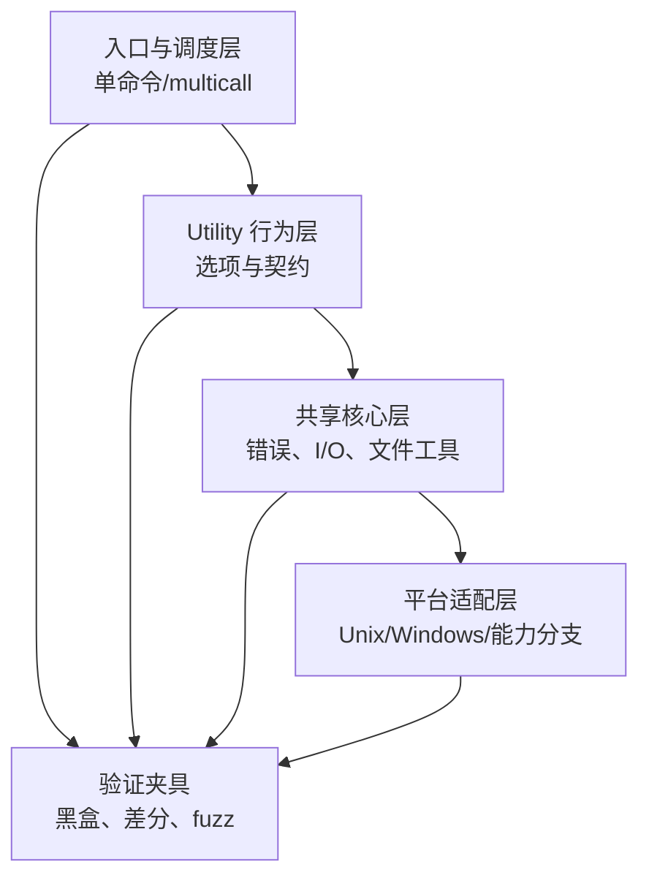

# 第 5 章：用 Rust 建立迁移骨架

> **定位**：本章把行为契约放入 Rust 架构。前置依赖是 clean-room 上下文与最小行为切片；输出是一个分离 utility、共享核心、平台边界、错误桥接和多调用入口的迁移骨架。

一个 Rust 重写很容易从「设计最终完美架构」开始：抽象出通用 trait，将所有平台包装起来，预先统一每个错误。这种自顶向下的设计在契约尚未被反例检验时风险很高：抽象可能提前折叠了必须保留的行为差异，并使后续修正横跨大量模块。迁移骨架的目标不是一次定义终局，而是为可验证的小步演化提供稳定接缝。

uutils 提供了一个具体样本：Cargo workspace 统一管理多个工具 crate，`uucore` 容纳共享功能，每个 utility 保持自己的实现与测试边界，multicall 入口根据调用名或第一个参数分派。[E1-ARCH] [E2-WORKSPACE] [E2-UUCORE] [E2-MULTICALL] 这不是唯一正确布局，但它展示了如何在大量局部行为与共享工程能力之间建立层次。

<!-- source: Cargo.toml -->
<!-- source: src/bin/coreutils.rs -->
<!-- source: src/uucore/src/lib/lib.rs -->

## 五层迁移骨架

**入口与调度层**负责进程级契约：从何处获取 utility 名，参数如何传递，帮助与版本如何展示，未知名称如何失败。multicall 的优势是可以共享调度与打包，但它也扩大入口契约：通过符号链接调用、以 `coreutils <utility>` 调用和独立二进制调用都可能需要一致。

**Utility 行为层**是最小审稿单元。参数解析、命令特有语义与局部测试应在这里保持近距离。如果一个补丁只改某个 utility 的某个选项，审稿人应能够在不理解整个工具集的情况下判断它。但模块边界不应追求「越细越好」：一个行为若需要大量跨 crate 内部协调，过度拆分反而会隐藏原子性。

**共享核心层**收敛真正稳定且反复出现的能力：错误与退出状态桥接、字节路径处理、平台能力、测试帮助和通用 I/O。共享层是高杠杆区域：一个修改可以修复多个工具，也可以同时破坏它们。因此共享抽象应由重复证据推动，而不是由「这些代码看起来相似」推动。

**平台适配层**隔离系统调用与 OS 语义。通用层不应到处散落 `cfg` 分支，但平台层也不能假装差异不存在。理想接口表达能力和契约：「原子替换」、「读取 Unix mode」、「保留稀疏区间」，而不只是一个庞大的 `Platform` trait。

**验证夹具**从外部观察整个进程，不应被架构重构破坏。它是一个关键的抗过度抽象机制：内部模块可以变，只要契约证据仍然成立。

## 用 Rust 表达错误，但不丢失 CLI 语义

Rust 的 `Result` 与 `?` 运算符使失败传播变得可见，但 CLI 并不直接观察 Rust 类型。调用者观察退出码、stderr、输出是否已经部分写入，以及副作用是否留下。uutils 的共享错误模型展示了一个桥接：utility 以共享结果类型返回，错误可携带退出状态与上下文，进程入口再将它翻译成外部行为。[E2-ERROR-MODEL] [E2-ERROR-COMPAT]

<!-- source: src/uucore/src/lib/mods/error.rs -->

这个模式的关键不是复制某个类型名，而是保持两层错误模型：内部层支持组合、上下文和资源清理；边界层严格实现行为契约。如果一开始就把所有失败压缩为字符串，会丢失可编程区分；如果只保留丰富 Rust 枚举而忽略边界翻译，又会破坏退出码与诊断兼容。

## Rust 能防御什么，不能防御什么

Rust 安全子集可以强力防御一类内存与并发错误：使用后释放、悬垂引用、数据竞争等候选很难穿过编译器。贡献指南提出避免 panic/直接退出、限制 `unsafe` 并附安全理由、路径与 OS 字符串优先使用 `Path`/`OsStr` 等目标，同时注明其中部分规则仍属 aspirational；实际强制程度要分别由 lint、CI 与代码现状核验。[E2-RUST-SAFETY]

Rust 不能防御语义错误：错误的退出码仍然是类型正确的整数；错误的文件删除顺序仍然可以通过借用检查；错误的 TOCTOU 流程仍然可以是 safe Rust；不完整的平台抽象仍然可以编译。因此应将 Rust 视为验证阶梯的强大一层，而不是取代行为契约、差分测试和安全审计的总证明。

## Cargo workspace 作为策略边界

workspace 不只是一个便利构建文件。Cargo 官方文档说明 workspace 可共享锁文件、输出目录和配置，feature 影响条件编译与依赖，profile 影响编译选项。[E2-CARGO-OFFICIAL] 对迁移项目，这些能力可以承载策略：统一最低 Rust 版本、lint 级别、release profile、平台 feature 和依赖版本。它们将「每个 crate 都应遵守」的决策变成可检查的中央边界。

但 feature 不应被用来隐藏未完成兼容性。如果不同 feature 组合产生不同外部行为，它们就是不同的发布产物，必须分别建立契约和测试。同样，为了减小二进制而关闭功能，应记录为产品范围决定，不能在构建脚本中无声发生。

## 骨架的演化规则

第一，先收敛接缝，再抽象。当两个 utility 出现相似代码时，先检查它们的错误、平台与性能契约是否真正相同。第二，共享层变更需要更广验证，因为其影响面大于局部补丁。第三，平台差异由能力和契约命名，而不是由某个当前 OS 的巧合命名。第四，入口层不承担 utility 语义，避免多调用组合变成难以测试的中央大函数。

对 Agent 来说，这些规则应被写入任务边界。「只修改 utility 层，不引入共享抽象」与「将已在三个 utility 中证实相同的错误翻译收敛到共享层，保持外部契约不变」是两类不同任务，它们需要不同的测试范围和审稿人。

## 模式提炼

**可验证接缝骨架**：以局部行为单元、共享核心、平台边界和进程入口分隔不同证明责任。它适用于能够建立稳定接缝的系统；若在行为尚未证实相同前就抽取共享层，骨架会放大错误契约，此时应退回局部实现与代表性测试。

## 局限

uutils 的 workspace、utility crate、`uucore` 和 multicall 结构是具体项目的结果，不能直接映射到所有系统。过早创建庞大共享核心会将行为差异变成隐式参数；过度拆分则会让原子行为横跨过多包。Rust 安全保证还受 `unsafe`、FFI、底层系统调用和外部依赖影响；「使用 Rust」不是安全评估的替代品。

## 实践清单

- [ ] 按入口、局部行为、共享核心、平台适配与验证夹具标记当前系统。
- [ ] 让每个局部单元可独立构建、测试和审查。
- [ ] 只在行为契约真正相同时将能力上提到共享层。
- [ ] 显式设计 Rust 内部错误到外部退出码/stderr 的桥接。
- [ ] 对 `unsafe`、FFI 与平台调用保留局部、可审查的安全说明。
- [ ] 把 workspace lint、feature、profile 和最低 Rust 版本当作可验证策略管理。

## 本章证据

架构案例来自论文与当前仓库 [E1-ARCH] [E2-WORKSPACE] [E2-UUCORE] [E2-MULTICALL]；错误桥接来自 `uucore` 错误模型 [E2-ERROR-MODEL] [E2-ERROR-COMPAT]；安全边界来自贡献规则 [E2-RUST-SAFETY]；Cargo 语义以官方文档为准 [E2-CARGO-OFFICIAL]。

### 版本演化说明

论文基线为 **arXiv:2608.07135**；本地源码基线为 **d8bee62c1ddc227d5e4385d80bbf6d7dee266a41**；本章证据核验日期为 **2026-08-14**。仓库模块、feature 与 lint 会演化，所以本章提炼的是边界设计原则，不是永久冻结的目录清单。
