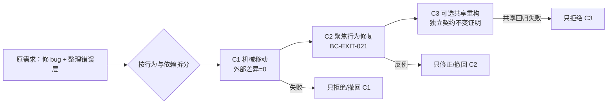

# 第 6 章：Agent Atomicity

> **定位**：本章把项目的“小而聚焦”规则编译为 Agent 任务切片、补丁原子性和停止条件。前置依赖是[第 3 章行为契约](../part1/ch03-behavior-contract.md#什么叫可执行)、[第 4 章上下文边界](ch04-clean-room.md#概念模型三种边界与四种状态)和[第 5 章 Rust 接缝](ch05-rust-skeleton.md#概念模型五层骨架与两条轴)；适用于拆 issue、分配 Agent、审查大 diff 或设计跨层兼容修复。读完后，读者应能把一个多目标需求拆成可独立接受、拒绝、验证与撤回的变更列。

## 具体失败现场：一个“顺手整理”的 1,800 行补丁

合成任务 `AC-PATH-021` 原本只要求：路径不存在时退出 1，而缺少参数时退出 2。Agent 很快找到局部错误分支，却又判断错误代码重复，于是同时做了三件事：机械移动错误模块、把四个 utility 改用新枚举、修正目标 utility 的 exit code，并运行格式化。最终 diff 1,800 行，测试全绿。

评审无法回答一个简单问题：接受 exit code 修复是否必须同时接受新共享抽象？移动造成的删除／新增淹没了真正行为差异；其中一个 utility 在“部分文件失败但继续处理”时依赖累计 exit 状态，新枚举把它改成遇错即返。聚焦测试没有覆盖第二个 utility，workspace 测试又只给出一个失败名，没有说明是移动、重构还是行为修改导致。

团队试图回退新抽象，却发现目标修复已经建立在新路径上；若整体 revert，又会丢失正确回归。补丁可以编译、可以一次提交，却不具备工程原子性。生成只用了几分钟，理解、归因和撤回却需要数天。

本章的核心判断是：**Agent Atomicity 不是固定行数，也不是 Git 只有一个 commit；它是“一次行为决策、一个最小影响面、一组对齐验证、一个可独立撤回点”。** 这是作者的 E4 方法提炼 [E4-ATOMICITY]，不是 Cargo 或论文内置能力。

## 概念模型：行为意图而不是文件数量

原子任务用四个集合表示：

\[
A = (B, \Delta, V, S)
\]

`B` 是一个行为意图及其契约条目；`Δ` 是实现该意图必须触及的最小路径与语义变化；`V` 是能够拒绝错误候选的验证选择器；`S` 是来源、范围、失败和未知触发的停止条件。四者必须闭合：每个修改映射到 `B`，每个高风险契约字段映射到 `V`，任何无法在当前范围闭合的依赖映射到 `S`。

“修改文件少”不是闭合条件。跨入口、utility 与错误桥的一项 exit 修复可能需要三个文件，但仍只有一个行为决策；反过来，一个文件里同时修改解析、性能与诊断，是三个决策。审稿人应问“能否只接受其中一项而不接受其他项”，而不是先问行数。

### 三类变更必须分列

| 变更类型 | 目标 | 允许外部差异 | 首要证明 | 常见污染 |
|---|---|---|---|---|
| 机械移动／改名 | 改 locator，不改语义 | 无 | 移动前后公共行为与接口不变，diff 可识别移动 | 顺手改格式、名称语义或可见性 |
| 内部重构 | 改内部组织，不改契约 | 无 | 原契约与代表性回归仍通过 | 抽象偷偷归一错误／平台差异 |
| 行为修改 | 新增、修正或有意改变契约 | 只限已批准项 | 先有反例，再有最小实现和回归 | 被大量机械差异遮住 |

三列可以组成同一交付序列，但不能合并成同一审稿决定。若行为修复必须等待接缝出现，先提交纯机械移动，再提交有契约证据的行为变更；若抽象本身尚未被证明，先在局部完成修复，不把“理想架构”作为前置税。



## 一手规则走查：项目要求如何约束任务

固定提交 [`CONTRIBUTING.md:218–229`](https://github.com/uutils/coreutils/blob/d8bee62c1ddc227d5e4385d80bbf6d7dee266a41/CONTRIBUTING.md#L218-L229)允许 AI 辅助，但要求贡献者理解、解释并证明每一行，特别警惕来源派生，同时保持补丁小而聚焦并先自审 diff。[E2-AI-POLICY] “小”的理由在文本里就是可理解和可审查，不是一个数字阈值；任务预算应服务于人类理解带宽。

[`CONTRIBUTING.md:235–244`](https://github.com/uutils/coreutils/blob/d8bee62c1ddc227d5e4385d80bbf6d7dee266a41/CONTRIBUTING.md#L235-L244)要求 small and atomic commits、干净历史、组件化提交信息，并明确不必要的移动会让评审更困难；确需移动时应单独提交。[E2-ATOMICITY] 这直接支持三列模型：机械移动的审稿问题是“语义是否保持”，行为修复的问题是“契约是否改变到批准范围”，不能用一个测试绿灯混答。

固定 [`AGENTS.md:7–10`](https://github.com/uutils/coreutils/blob/d8bee62c1ddc227d5e4385d80bbf6d7dee266a41/AGENTS.md#L7-L10)要求驱动 Agent 的人对输出负责、阅读 diff，评审回复由人完成。[E2-AI-POLICY] 因而“Agent 生成解释”和“另一个 Agent 同意”不能关闭所有权；人类必须能复述行为意图、关键控制流和证据边界。

[`AGENTS.md:17–23`](https://github.com/uutils/coreutils/blob/d8bee62c1ddc227d5e4385d80bbf6d7dee266a41/AGENTS.md#L17-L23)要求新行为或 bug 修复带本地 Rust 测试，即使外部测试从失败变为通过，也要增加回归，并以“No tests, no merge”结束。[E2-NO-TEST-NO-MERGE] 所以一行 exit code 修改仍是行为任务，不能因 diff 小而免测试；反过来，纯机械移动不应伪造无意义新测试，但要运行原契约证明无差异。

这些规则只证明固定时点的项目要求。本章的任务预算、依赖图、Atomic Change Card 与“一次决策”判据是 E4-ATOMICITY，不反向归因给项目或论文。

<!-- source: CONTRIBUTING.md -->
<!-- source: AGENTS.md -->

## 依赖图切片：先画必须关系，再排提交

切片前用有向图标出“没有前者，后者无法独立构建／验证”的硬依赖，不把“顺手更漂亮”画成依赖。节点不是文件，而是可判定的变更：契约反例、测试夹具、机械接缝、局部实现、共享抽象、平台实现、发布配置。

对 `AC-PATH-021`，真实依赖只有：契约中区分 usage/runtime → 回归能观察 1/2 → 局部错误映射修复。错误模块移动不是修复的硬依赖；共享四个 utility 更不是。于是存在三种切法：

| 方案 | 变更列 | 评审成本 | 失败归因 | 适用判断 |
|---|---|---|---|---|
| A 大补丁 | 移动+共享重构+行为修复 | 最高；多项决定互锁 | 差；一次失败有多根因 | 拒绝，除非不可分割生成物且有专门审查 |
| B 接缝优先 | C1 纯移动；C2 局部修复；C3 可选共享 | 中；三次审查但每次单一问题 | 强；可独立 revert/bisect | 接缝确为后续多个任务硬前提 |
| C 行为优先 | C1 契约+回归+局部修复；C2 后续共享 | 最低的当前修复成本 | 最强；先交付用户价值 | 抽象相同性尚无证据，推荐 |

方案 C 不是永远最好。如果局部模块无法注入故障、必须先抽取无语义接缝，方案 B 合理；但 C1 必须是纯重构并通过原测试，C2 才改变行为。方案选择写进工件，避免 Agent 根据生成便利度默认 A。

### 原子预算不是只有 max diff

预算至少有六维：

1. `behavior_intents=1`：只有一个可见契约改变。
2. `allowed_paths`：写路径精确，读路径继承 Context Manifest。
3. `semantic_hunks`：每个 hunk 能映射到契约、测试或必要接缝。
4. `diff_budget`：行数是异常探针，不是自动正确性；超限触发拆分评审。
5. `verification_selectors`：聚焦负控、受影响回归、静态门禁与未运行项。
6. `iteration_budget`：超过失败轮数、触及共享／平台／unsafe 或证据冲突即停止。

固定行数很容易被游戏化：Agent 可压成一行、隐藏生成文件、或把必要跨层修复拆得无法构建。预算的作用是让异常显性化，例如“预计 60 行却出现 600 行”必须解释；它不替代语义审查。

### 用风险而不是生成速度调整预算

同样 80 行，纯文案拼写修正与文件删除顺序修复的预算不应相同。Task owner 应按行为表面、共享半径、平台数量、不可逆副作用和回退成本调整审查强度：低风险局部变更可以允许 Agent 在聚焦门禁内多迭代；共享错误桥、权限、持久化或平台分支一旦出现，哪怕 diff 很小，也应减少并行任务、增加 reviewer 和代表性回归。预算控制的是“一次交给反馈回路多少未知”，不是奖励短代码。

| 风险信号 | 预算动作 | 额外证据 |
|---|---|---|
| 只改局部纯函数，无外部行为变化 | 保持一个重构 Card | 原契约与局部性质测试 |
| 改 stdout/stderr/exit 或失败顺序 | 单独行为 Card，禁止顺手重构 | 负控、进程测试、contract diff |
| 触及共享层或三类以上消费者 | 停止当前局部任务，重画依赖图 | 代表消费者与周期全量回归 |
| 触及权限、删除、持久化、unsafe/FFI | 收紧路径和迭代次数，指定专家 | 故障注入、安全说明、回退演练 |
| 缺 target runner 或 oracle 冲突 | 不以 skip 完成，转 unknown | 人工裁决与发布阻断／排除 |

这个矩阵也防止“最大 diff=100”成为形式主义。若 101 行都服务一个不可分割且有证据的状态转移，可由人批准升版 Card；若 20 行含两个无关行为决定，仍应拆分。

## 完整工程案例

### 把 `AC-PATH-021` 重排成三份可撤回交付

**输入与契约。** 第 3 章格式的 `BC-PATH-021@v2` 有三个 outcome：成功 0、路径不存在 1、缺参数 usage 2；stdout/stderr 与文件副作用分别声明。现有错误候选把后两者都映射为 1。负控 `NC-ALL-ERRORS-ONE` 必须失败。

**第一次任务设计。** Agent 收到“修 exit code 并清理错误模块”，Task Contract 允许写 utility、共享 error 和四个测试文件，最大 500 行。评审发现两个行为意图：修 code 与统一四个 utility；机械移动还会遮挡 diff，于是在编码前拒绝任务，不把“大上下文已加载”当沉没成本。

**选择方案 C。** `A1` 只改目标 utility 和对应 Rust 测试。先加入缺参数 exit 2 的回归，并证明当前候选失败；再让局部错误枚举区分 usage/runtime。聚焦测试通过后运行该 utility 全集与三种入口测试。diff 48 行，只有两个语义 hunk：测试和映射。评审可独立接受，也可整体撤回而不影响其他 utility。

**发现接缝债务。** 修复过程中看见三处字符串构造重复，但错误继续策略不同。Agent 被停止条件禁止修改共享层，只在 Change Card 记录 `follow_up_candidate`，附“代码形状相似、契约未证明相同”。这不是未完成当前任务，因为 `BC-PATH-021` 已闭合。

**第二列机械接缝。** 后续确有三个任务需要移动共同显示 helper。`A2` 只移动函数与更新 import，外部契约差异为零；用 `git diff --color-moved` 辅助人读，运行原 utility 回归。任何顺手改文案都移出 A2。

**第三列共享重构。** `A3` 比较三个消费者的 path display 契约，确认一致后上提；部分成功状态机仍留局部。验证扩大到所有消费者和非 UTF-8 负控。若 A3 失败，revert A3 不会丢失 A1 的用户修复或 A2 的接缝。

**提交与回执。** 每列的消息写组件与意图，回执记录 commit、测试命令、退出码、未运行 target 与 proof boundary。生成速度不进入完成标准；人类逐列复述“为什么改、怎样失败、怎样撤回”。

这个案例展示了跨层修复的例外：一个行为意图可以跨测试、utility 和入口，但仍原子；真正需要拆的是独立决策，而不是硬把每个文件做成一个 commit。

## 反例

**反例一：一文件一任务。** 把同一错误修复拆成“只加测试”“只改 enum”“只改入口”，中间提交不能构建或红测长期停留，任何一个都不能独立接受。这是碎片化，不是原子性。可以先提交会失败的测试仅在团队明确采用红绿提交协议且分支不合并时使用；最终审稿单元仍需闭合。

**反例二：20 行以下免测试。** 一行把 exit 2 改成 0 就改变行为；没有回归的小 diff 只更容易看，并不更正确。[E2-NO-TEST-NO-MERGE]

**反例三：永远不改共享层。** 为避免大影响，团队在每个 utility 复制安全修复，最终十处漂移。原子性不是局部主义；共享变更可以单独成为一个行为不变／共同机制任务，只是配置更广验证和专门 owner。

## 可复用工件

下面的 **Atomic Change Card** 可作为 Agent Task Contract 的最小可复制核心：

```yaml
schema: atomic-change-card/v1
id: AC-PATH-021-A1
behavior:
  contract: BC-PATH-021@v2
  intent: distinguish missing-path exit=1 from missing-operand usage exit=2
  allowed_differences: [X.exit_for_missing_operand]
  non_goals: [shared_error_refactor, diagnostic_rewording, performance]
change_class: behavior
dependencies:
  hard: [BC-PATH-021@v2, NC-ALL-ERRORS-ONE]
  optional_follow_up: [shared_path_display]
context_manifest: CM-PATH-021@v3
write_scope:
  allowed_paths:
    - src/uu/path_kind/src/path_kind.rs
    - tests/by-util/test_path_kind.rs
  forbidden: [shared_core, manifests, ci, unrelated_tests]
budget:
  behavior_intents: 1
  expected_semantic_hunks: 2
  diff_warning_lines: 100
  max_agent_iterations: 3
verification:
  negative_first: NC-ALL-ERRORS-ONE
  focused: test_path_kind_exit_classes
  affected: test_path_kind
  entry_matrix: [standalone, multicall]
  static: [fmt_check, targeted_check, targeted_clippy]
stop_conditions:
  - needs_shared_core_or_manifest
  - contract_or_evidence_conflict
  - changes_diagnostic_text
  - adds_unsafe_or_platform_branch
  - exceeds_budget_without_human_reslice
delivery:
  required: [diff, test_receipts, unexecuted_checks, proof_boundary, follow_ups]
rollback: revert_this_commit_without_reverting_dependencies
human_owner: utility-owner
```

审查 Card 时做闭合检查：`allowed_differences` 只有一项；两个写路径都能解释；负控能看见目标错误；停止条件覆盖共享层和语义扩张；rollback 不依赖未提交草稿。若任何修改无法映射到字段，移出任务或升版 Card。

## 模式提炼

**一次行为决策**：一个审稿单元只要求接受一个外部行为改变；机械移动和重构分列。前提是契约字段足够具体，失效边界是用宽泛“兼容性改进”包装多个决策。

**依赖图切片**：只把构建、测试或语义上的硬前提连边，按拓扑提交。它防止美学重构伪装前置；图错时，用失败和评审更新，而不是坚持原计划。

**验证带宽限流**：Agent 生成量不超过人类解释和测试反馈能力。diff warning、迭代次数、共享触及是控制信号；高风险小 diff 仍配置高强度验证。

**可撤回变更列**：每列有独立契约、回执和 revert 点。它支持 bisect、并行评审和逐列拒绝；如果数据库 schema 或协议必须协调切换，则用兼容阶段、双写或 feature flag 建立可撤回接缝，而不是假装单 commit 原子。

## AI Coding 工作台

工作台展示 Card、依赖图、当前 diff、契约字段映射、预算消耗和门禁回执。每个 hunk 标 `contract|test|necessary_seam`；未标 hunk 自动进入人工审查队列。Agent 在聚焦失败上迭代，遇到 stop condition 输出“为什么停、需要哪项决策、已生成哪些可废弃草稿”。

高质量提示是：“实现 `AC-PATH-021-A1`，先让负控看到 exit=1/2 混淆；只改两个允许路径；不得移动代码、统一文案或改共享层；超过三轮或需要扩范围则停止。交付可重放命令与不能证明项。” 这比“尽量小地修一下”可执行，因为大小、边界和出口都被定义。

人类拥有任务切片、允许差异、预算豁免和提交解释。Agent 可以建议重切、生成依赖图和 follow-up Card，不能通过扩大 allowlist、删除测试或降低门禁让自己“完成”。

## 能证明什么／不能证明什么

| 能证明什么 | 不能证明什么 |
|---|---|
| 固定项目规则要求 AI 变更由人理解、自审，并保持小而聚焦。[E2-AI-POLICY] | 某个固定行数以下补丁天然可审查、正确或来源合规。 |
| 提交规则要求小而原子，并把必要代码移动单独提交。[E2-ATOMICITY] | 所有重构都必须机械拆成一文件一个 commit，或 Git 单提交等于行为原子。 |
| 新行为／bug 修复必须有本地 Rust 测试，外部测试修复也要固化。[E2-NO-TEST-NO-MERGE] | 一个测试足够、断言能看到缺陷、所有平台已验证。 |
| Card 闭合能证明计划中一个意图、路径、验证与停止条件互相引用。 | 实现遵守 Card、契约期望正确或测试真实执行；需要回执与审查。 |
| 可独立 revert 的提交列支持局部撤回和更清晰 bisect。 | 运行时状态、数据迁移或部署副作用也自动回滚。 |
| 聚焦与受影响测试通过支持声明环境中的目标切片和代表回归。 | 未运行 target、共享隐藏消费者、生产时序或所有兼容行为。 |

## 局限

原子性会增加提交和流水线次数；极小切片若缺乏自动化，管理成本可能超过收益。应优化模板、选择器与缓存，而不是把独立决策重新揉成大包。生成文件、大规模 API 升级和协议协同有时无法形成很小 diff，但仍可通过阶段兼容、机械／语义分列和专门回滚计划保持决策原子。

依赖图也可能不完整。宏、feature、构建脚本和隐式消费者会让局部改动影响更广；因此共享层触及是停止信号，影响分析需要定期全量验证校验。原子补丁降低归因空间，不保证测试 oracle 正确。

最后，小补丁不是治理借口。若团队没有人能解释路径、错误或 unsafe，即使只有五行也应拒绝；若一个完整行为修复需要跨三层且证据闭合，不应为追求数字把它拆成不可构建碎片。

## 实践清单

- [ ] 是否只有一个行为意图，机械移动、内部重构与行为修改是否分列？
- [ ] 每个 hunk 是否映射到契约、测试或必要接缝？
- [ ] 依赖图是否只包含硬前提，没有把“顺手整理”伪装依赖？
- [ ] 写路径、diff warning、迭代预算、选择器和停止条件是否明确？
- [ ] 一行行为修改是否仍有负控与回归，没有按大小豁免？
- [ ] 每列是否可独立接受、拒绝和撤回，并由人复述证据边界？

## 练习

- **练习一：比较切片。** 将“改名解析模块、抽共享错误、修 exit code、更新四个测试”分别按方案 A/B/C 排列，计算每份需要的审查问题和验证矩阵；选择方案并写拒绝其他方案的证据。
- **练习二：设计验证。** 为一行“失败改为 exit 0”的补丁写 Atomic Change Card，至少包含一个负控、进程级退出断言和受影响回归；解释为何编译、行数和 Agent 自评都不能替代它。
- **练习三：跨层例外。** 给定一个同时触及入口、utility 与错误桥的单一行为修复，画硬依赖图，设计可构建的提交列和 rollback；若无法拆分，写明为何仍是一次行为决策及需要的加强审查。

## 本章证据

本章三项主证据为 AI 所有权与聚焦要求 [E2-AI-POLICY]、小而原子及移动分列规则 [E2-ATOMICITY]、行为变化必须有本地回归 [E2-NO-TEST-NO-MERGE]。四元模型、三方案比较、Atomic Change Card 和验证带宽属于作者提炼 [E4-ATOMICITY]；案例为合成。

### 版本演化说明

论文基线为 **arXiv:2608.07135**；项目规则固定核验于 **d8bee62c1ddc227d5e4385d80bbf6d7dee266a41**；本章证据核验日期为 **2026-08-14**。AI policy 与提交规则会演化，Task Card 必须绑定当前规则版本；E4 原子性模型应随真实不可分割反例修订。
