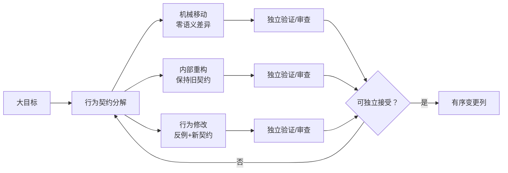

# 第 6 章：Agent Atomicity

> **定位**：本章定义 AI Coding 变更的最小可审查单元。前置依赖是行为契约、上下文边界和 Rust 迁移骨架；输出是可独立理解、验证、接受或撤回的 Agent 任务和补丁。

原子性在这里不是数据库事务的同义词，也不是固定行数限制。它是一个审稿与决策属性：如果一份变更不需要接受其他无关决策，就能被独立接受；如果发现问题时可以撤回它而不同时丢失不相干修复，就能被独立回退；如果验证失败能指向明确契约，就能被独立诊断。[E4-ATOMICITY]

uutils 当前贡献指南要求 AI 生成的变更小而聚焦，贡献者必须理解并自行审查；对代码移动、重构和行为变更还要分开组织，避免机械差异掩盖语义差异。[E2-AI-POLICY] [E2-ATOMICITY] 项目级规则还明确表达，没有测试证据的 AI 生成变更不应合并。[E2-NO-TEST-NO-MERGE]

<!-- source: CONTRIBUTING.md -->
<!-- source: AGENTS.md -->

## 为什么 AI 使小批量更重要

人类编写的大补丁已经难以审查，AI 还会带来一个特殊问题：代码可以在很短时间内产生，而理解、反例构造和验证的成本没有同比下降。如果团队用生成速度设定补丁大小，审稿队列会迅速积累一批“编译了但没有被人拥有”的变更。

原子切片将生成带宽限制在验证与审查带宽之内。它还改善 Agent 的反馈信号：当一份补丁只对应一个行为假设时，测试失败的归因空间很小；当补丁同时改参数解析、错误类型、平台抽象与目录布局时，一个失败会导致 Agent 在多个方向反复猜测，甚至修坏原本正确的部分。

## 三类必须分开的变更

| 类型 | 目标 | 允许的语义差异 | 核心证据 |
|---|---|---|---|
| 机械移动 | 改变文件/模块位置或符号名称 | 无 | 移动前后测试与对外接口不变，diff 可识别移动 |
| 内部重构 | 改善内部边界或去除重复 | 对外行为无差异 | 原契约套件全部通过，必要时加入局部结构检查 |
| 行为修改 | 新增、纠正或有意改变契约 | 只允许任务契约中声明的差异 | 先有反例，再有最小实现与更新后契约 |

这三类变更可以属于同一个大目标，但不应属于同一个审稿单元。例如，为了修复两个 utility 的相同错误，可以先用一份补丁将无语义差异的共享帮助移入新模块，再用第二份补丁增加失败契约和修复。第一份可以在不接受行为变更的情况下审查；第二份的 diff 则不会被大量文件移动淹没。

## 如何判断切片足够小

行数不是可靠指标。改一行共享错误映射可能影响上百个工具，新增几百行独立测试夹具反而可能不改变任何生产行为。可以用五个问题判断：

1. 能否用一句话说清被改变的行为契约？
2. 是否只有一个主要拒绝理由？若架构、命名和语义都可独立被拒绝，应拆分。
3. 失败时能否将反例指向某个假设，而不是整个重写？
4. 能否在不撤回无关修复的情况下回退？
5. 审稿人是否可在一次连续阅读中理解契约、diff 与证据？

若任一问的答案为否，优先缩小任务。缩小方式不只是减少文件，还可以限定平台、错误路径、选项组合、共享层影响或交付类型。一个只增加反例测试但暂不修复的补丁，也可以是有价值的原子步骤，因为它先把未知行为变成了团队共有证据。

## Agent 任务契约的最小字段

一个原子 Agent 任务不应只包含「修复某 bug」。它应写明：意图；允许修改的文件/模块；禁止上下文；要改变与必须保持的行为；已知反例；必须运行的静态与动态检查；允许的文档、测试、实现产物；不在范围的内容；以及失败时应停止还是返回人类决策。

这种契约不会阻止 Agent 发现更好实现，它只是把「更好」限定在当前可审查决策中。如果 Agent 发现修复需要改变共享接口或扩大平台范围，正确输出是一份新决策请求与证据，而不是悄然扩大 diff。

## 从反例到原子提交列

当一个差分测试暴露错误时，可以建立如下列队：第一份变更只将失败样本固定为回归；第二份做无语义的结构准备（如果确有必要）；第三份实现最小修复；第四份在多个实例已经证明共性后再做共享抽象。每一份都可独立通过对应门禁。这不意味着每次都必须有四个提交，而是让团队能看到四种决策，再决定哪些可以安全合并。

证据也应与变更同等原子。一份修复若只附上整个 workspace 的「全绿」截图，无法说明哪个测试真正命中行为。应同时记录最小反例、目标测试、必要的更广回归、运行环境与未执行项。一个原子补丁配一个原子证据包，才能为后续回退和问题定位提供精确边界。

## 用依赖图管理原子变更列

多份原子变更之间可以有依赖，但这些依赖应被显式画出。「回归样本」可以是「行为修复」的前置，「无语义接口准备」也可能是前置；但「顺手统一命名」不应伪装成必要依赖。对每条边要问：如果前一份变更被拒绝，后一份是真的无法正确实现，还是只需要换一种写法？

依赖图还能支持并行 Agent。只有修改集、契约与测试夹具互不冲突的节点才适合并行；共享核心、workspace 策略和同一行为矩阵上的变更应保持顺序。这不是为了减少 Agent 数量，而是避免多个候选在相同契约上同时改变前提，导致证据失去可组合性。

## 审稿时的「一次决策」原则

审稿人应能在一次决策中给出「接受这个行为改变」或「拒绝它」，而不是被迫同时接受新公共抽象、大规模格式化和无关依赖更新。为此，变更说明应先写决策，再写文件列表：「接受后，某个输入的 stderr 语义类别从 A 变为 B」比「重构错误处理」更可决策。

当审稿人发现无法在不理解大量无关上下文的情况下给出结论，应把「不可决策」视为切片失败，而不是审稿者不够努力。对 AI 高产出流水线，这条规则是防止「因为已经生成了很多，所以只能整包接受」的重要门禁。

## 模式提炼

**一意图一证据包**：一个 Agent 任务只承载一个可独立接受、拒绝和回退的行为决策，并绑定最小验证集。它要求存在可分割的契约接缝；若拆分会留下不可编译或不安全中间态，应保留单一决策而扩大补丁，并用提交列与审稿地图维持可理解性。

## 局限

过度追求小补丁会产生另一种风险：系统始终处于大量过渡状态，而每个局部变更都迫使审稿人重新建立上下文。原子性的目标是最小可决策单元，不是最少行数。对无法在中间状态编译或安全运行的变更，可以保留为一份较大但单一决策的补丁，同时用分步 commit 或详细审稿地图保留可理解性。

另一个局限是跨切片性能：局部改动各自正确，组合后仍可能产生内存、启动时间或 I/O 回归。因此原子门禁之上还需要定期组合验证。

## 实践清单

- [ ] 判断变更属于机械移动、内部重构还是行为修改，不混在一份审稿单元中。
- [ ] 用一句可观察契约命名每个 Agent 任务。
- [ ] 确认补丁可独立接受、拒绝和回退，不以固定行数判断。
- [ ] 为任务声明允许文件、禁止上下文、反例、门禁和范围外内容。
- [ ] 将新反例优先固定为永久测试，再实现修复。
- [ ] 将最小目标测试、更广回归和未执行项一起放入证据包。

## 本章证据

小而聚焦、人类理解和自审查来自当前 AI 贡献规则 [E2-AI-POLICY]；机械移动与行为改动分离来自贡献指南 [E2-ATOMICITY]；没有测试证据不合并来自项目级规则 [E2-NO-TEST-NO-MERGE]；可决策原子性是本书综合 [E4-ATOMICITY]。

### 版本演化说明

论文基线为 **arXiv:2608.07135**；本地源码基线为 **d8bee62c1ddc227d5e4385d80bbf6d7dee266a41**；本章证据核验日期为 **2026-08-14**。原子性不由某个固定行数或工具阈值定义；它需随架构边界、审稿能力与发布方式调整。
