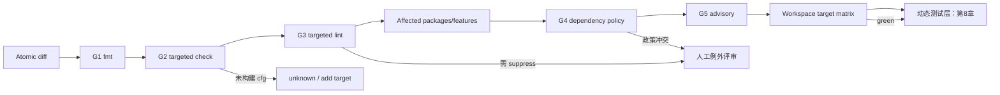

# 第 7 章：静态验证门禁

> **定位**：本章为[第 5 章 Rust 骨架](../part2/ch05-rust-skeleton.md#概念模型五层骨架与两条轴)和[第 6 章原子任务](../part2/ch06-agent-atomicity.md#概念模型行为意图而不是文件数量)配置静态拒绝层：rustfmt、rustc、Clippy、依赖政策和安全情报各自发现什么、按何种范围运行、怎样记录例外。适用于设计本地反馈、CI 矩阵、Agent 自动修正回路和 Change Package 门禁收据。读完后，读者应能选择一条与风险匹配的快速失败路径，并明确“编译通过”对行为兼容几乎不构成证明。

## 具体失败现场：全绿的 Linux 构建漏掉了目标分支

合成任务 `SG-PATH-032` 给共享路径 helper 增加一个 Windows 分支。Agent 在 Linux 上运行 `cargo fmt`、`cargo check -p path-helper` 和默认 feature 的 Clippy，三项都通过；为了修复一个 lint，它还把错误分支改成 `unwrap_or_default()`。PR 描述写“all static gates pass”。

Windows CI 随后编译失败：条件分支引用了只在 Unix 导入的 trait。修正后，程序能编译，却把路径转换失败归一为空串；目标平台进程测试才发现错误路径被当成当前目录。依赖扫描又报告新增 crate 的许可证不在策略允许集合，但 Agent 自动扩大 allowlist 以取得绿灯。

这里至少有四种不同失败：本地选择器没有构建目标 cfg；lint 自动修正改变了错误语义；编译从未观察 CLI 行为；依赖政策被候选本身降低。把四者压成一个“CI 是否绿”会让 Agent 不知道该修实现、扩矩阵、请求政策裁决还是停止。

静态门禁的正确职责是：**按成本从低到高快速拒绝已知坏候选，并为未构建配置、未表达规则和动态行为保留显式出口；任何一层都不能跨级宣称行为兼容。**

## 概念模型：五层拒绝器与三种范围

本章把静态验证分为五层：

| 层 | 主要输入 | 擅长拒绝 | 不观察的核心问题 |
|---|---|---|---|
| G1 rustfmt | Rust 语法树与格式规则 | 格式漂移、合并噪声 | 类型、逻辑、行为、依赖 |
| G2 rustc/check | 当前 package/feature/target 的代码 | 语法、名称、类型、借用、部分 cfg 错误 | 未构建配置、CLI 契约、运行副作用 |
| G3 Clippy/lint | 编译后的程序结构与启用规则 | 已编码的可疑模式、项目规范 | 未启用 lint、误报裁决、外部语义 |
| G4 依赖政策 | manifest、lockfile、元数据 | license、来源、重复／禁止依赖政策 | API 使用正确、运行安全、行为兼容 |
| G5 security advisory | 依赖版本与已知数据库 | 已公开且可匹配的已知漏洞 | 未知漏洞、配置可达性、项目自身逻辑 |

门禁还有三种范围：`local` 只检查当前 package/target，适合秒级反馈；`affected` 沿依赖图检查消费者与相关 feature，适合原子 Change Card；`workspace-matrix` 检查批准的多平台／多 feature 集合，适合合并门。三者不是互斥命令，而是成本递增的证据层。



顺序基于“反馈速度与归因性优先”这一 E4-VERIFICATION-LADDER 作者提炼，而不是声称所有仓库的耗时相同。[E4-VERIFICATION-LADDER] 格式失败无需等待依赖扫描；局部 check 失败也无需跑完整矩阵。反过来，快速门通过只是把候选送到下一层，不产生累计式“越绿越正确”的绝对分数。

## 一手配置走查：固定提交真实启用了什么

### 开发入口和 CI 入口要分开记录

固定 [`DEVELOPMENT.md:53–87`](https://github.com/uutils/coreutils/blob/d8bee62c1ddc227d5e4385d80bbf6d7dee266a41/DEVELOPMENT.md#L53-L87)说明 pre-commit 可检查编译、Clippy 与 rustfmt，并给出 `cargo clippy --workspace --all-targets --all-features`、`cargo fmt --all`、`cargo deny --all-features check all` 的本地入口。[E2-STATIC-GATES] 文档命令是执行建议，不等于本次任务实际运行；Change Package 必须记录真实命令、工具链、target、feature、退出码和日志摘要。

固定 `.github/workflows/code-quality.yml:51–65` 对根与 fuzz 目录分别执行 format check；`:67–148` 的 style/lint matrix 包含 Linux 全 feature workspace、macOS 全 feature workspace、Windows feature，以及两个 Wasm target，并在条件允许时单独检查 fuzz workspace。[E2-STATIC-GATES] 这证明固定 CI 配置列出了这些组合，不证明每条路径一定成功运行、所有 cfg 值被覆盖，或 FreeBSD/OpenBSD 等其他 workflow 与它完全等价。

### workspace lint 需要显式接入

[`Cargo.toml:517–569`](https://github.com/uutils/coreutils/blob/d8bee62c1ddc227d5e4385d80bbf6d7dee266a41/Cargo.toml#L517-L569)说明 workspace lint 要由各 crate 的 `[lints] workspace = true` 接入，并设置 `unexpected_cfgs`、Rust 警告以及 Clippy `all/cargo/pedantic` 基线，同时列出多个项目级 allow。[E2-LINTS] 例如固定 `src/uu/basename/Cargo.toml:24–25` 确实显式接入；`src/uucore/Cargo.toml:225–226` 也接入。

这个事实有两个边界。第一，共享配置存在不等于所有未来成员接入，新增 crate 要有结构门禁。第二，workspace 中的 allow 是已知政策，不代表任意局部 suppress 自动合理。Clippy 规则也会随工具链演化；同一 commit 用不同 stable 版本可能产生不同结果，收据必须包含 `rustc -Vv` 和 Clippy 版本。

### `cargo-deny` 是四类政策，不是“安全扫描”一个词

固定 [`deny.toml:3–31`](https://github.com/uutils/coreutils/blob/d8bee62c1ddc227d5e4385d80bbf6d7dee266a41/deny.toml#L3-L31)配置 advisory 数据库、yanked 等行为和许可证 allowlist；`:45–115` 对重复版本采取 deny，并列出有理由的 skip；`:118–126` 对未知 registry/git source 给出政策。[E2-DENY] 这说明门禁能机械匹配元数据与策略，不能证明依赖源码无漏洞、许可证元数据真实完整，或新增 API 的使用方式安全。

例外列表不是永久垃圾桶。每个新增 skip/allow 应包含 requester、依赖链、原因、风险、替代评估、批准者和重评触发。固定文件中的历史例外可以说明配置能力，却不能自动成为新例外的先例。

### 安全情报是时间敏感输入

固定 `.github/workflows/audit.yml:1–21` 配置定时任务并调用 RustSec audit action。[E2-DENY] 这支持“项目有按已知 advisory 数据库检查的入口”，不支持“PR 时每次都执行”“无输出即无漏洞”或“数据库覆盖所有安全问题”。advisory 结论需要数据库 revision、扫描时点、lockfile 和忽略项；过期绿灯不能复用为当前证明。

### workspace 构建身份影响门禁选择

[`Cargo.toml:375–395`](https://github.com/uutils/coreutils/blob/d8bee62c1ddc227d5e4385d80bbf6d7dee266a41/Cargo.toml#L375-L395)定义成员、resolver、edition、最低 Rust 版本与版本。[E2-WORKSPACE] affected 选择器要识别根包、utility、`uucore` 和测试夹具的依赖关系；共享层、resolver、workspace dependencies 或 lint 修改都应升级到 workspace-matrix，而不是只检查一个叶子 crate。

<!-- source: DEVELOPMENT.md -->
<!-- source: .github/workflows/code-quality.yml -->
<!-- source: .github/workflows/audit.yml -->
<!-- source: Cargo.toml -->
<!-- source: deny.toml -->
<!-- source: src/uu/basename/Cargo.toml -->
<!-- source: src/uucore/Cargo.toml -->

## 门禁顺序与成本模型

实际顺序不能只看平均秒数，还要看缓存命中、失败归因、变更半径和 runner 稀缺性。可用近似成本：

\[
Cost(g)=runtime(g) \times frequency(g) + queue(g) + diagnosis(g)
\]

`fmt --check` runtime 和 diagnosis 通常都低，适合每轮；target-specific Clippy 可能排队很久，适合候选稳定后；依赖政策只有 manifest/lockfile 未变时可以按缓存复用，但 advisory 数据时效需单独处理。这个式子用于排序，不把质量换算成金钱。

推荐执行：

1. **编辑循环**：改动文件的格式检查、targeted `cargo check`、最相关 lint。失败立即返回当前原子任务。
2. **候选循环**：affected packages、声明 feature、测试 target 的 check/Clippy；若 lockfile 或 manifest 改变，运行完整依赖政策。
3. **合并循环**：workspace 批准矩阵、平台 target、全局 policy 与新鲜 advisory；随后进入第 8 章动态验证。
4. **周期循环**：昂贵或稀缺 runner、全 feature 组合、供应链数据库刷新，用于校验 affected 分析没有长期漏项。

局部门禁不能成为永久替代。若十次 affected 选择都避开某个平台，周期矩阵要发现漂移；共享核心改动直接跳到更宽层。失败回执保留“在哪层、哪个选择器、是否确定复现”，避免 Agent 在不同层反复猜。

## 完整工程案例

### `SG-PATH-032` 从局部绿灯到分层收据

**变更输入。** Atomic Change Card 只允许修改共享路径 helper 与两个平台测试；行为意图是“Windows 原生路径显示失败时保留错误而非变为空串”。因为触及共享层、平台 cfg 和错误语义，Static Gate Selector 风险为 high。

**G1 格式。** `cargo fmt -- --check` 发现 Windows 分支缩进。Agent 可在任务内修复；这一层只减少 diff 噪声，收据写 `proof=format_conformance`，不能写“代码正确”。

**G2 局部 Linux check。** 默认 Linux 构建通过。Selector 明确把结果记为 `target=x86_64-unknown-linux-gnu, features=default`，Windows 条目仍是 `not_run`。旧工作流把它汇总成“compile pass”，本流程拒绝这种抬升。

**G2 Windows target。** 对批准 target 检查时发现 Unix trait 泄漏。修复 import 后通过。这证明该 cfg 在该工具链完成类型检查，不证明能在 Windows 运行；交叉 check 没有执行系统 API。

**G3 Clippy。** lint 建议用 `unwrap_or_default()`。Agent 若自动应用会改变契约，Card 的 `semantic_auto_fix=deny` 触发停止。人类选择保留显式错误传播，并只在最窄表达式对一个确认为误报的 lint 加 allow；记录规则名、反例、批准者和“当 Clippy 版本升级或代码修改时重评”。宽泛 crate-level allow 被拒绝。

**G4 dependency policy。** 为了可逆路径显示，Agent 新增 crate。`cargo deny` 报 license 不在 allowlist。Agent 不能修改 `deny.toml`，而提交三选一：移除依赖并用已有能力；选择已批准依赖；请求来源委员会评审。团队发现 `uucore` 已有能力，于是去掉新增 crate。政策冲突没有被误当成源代码 bug。

**G5 advisory。** lockfile 最终未变，候选收据引用同 commit、同 lockfile 且在规定新鲜度内的扫描；若扫描过期则重跑。结果只说明匹配数据库未发现未豁免 advisory，不说明 helper 安全。

**workspace matrix。** 共享层触及使 Selector 选择 Linux/macOS/Windows/Wasm 的固定 CI 组合。FreeBSD runner 本次不可用，记录 `unknown` 和合并策略，而不是从列表删除。静态矩阵通过后，任务仍进入进程测试验证原生路径和错误通道；“compile success”从未晋升为 compatibility。

**负向控制。** 团队保留两个错误候选：Unix-only import 应在 Windows check 失败，`unwrap_or_default()` 应在后续行为测试失败。第一项验证静态矩阵看得到 cfg 泄漏；第二项刻意展示静态层的盲区。门禁质量由能拒绝对应缺陷证明，而不是由绿色数量证明。

## 反例

**反例一：所有任务都跑全 workspace。** 这看似最严格，却让简单格式错误等待稀缺 runner，Agent 反馈变慢，开发者开始跳过整套 CI。正确做法是快层每轮、宽层候选／合并运行，并用周期全量校验影响分析。

**反例二：Clippy 建议一律自动修。** lint 建议依据通用模式，不拥有当前 CLI 契约。涉及错误吞没、排序、精度、路径转换和分配的修改必须回到行为意图；自动修只适合已批准的语义保持类别。

**反例三：为了通过而改门。** 候选同时修改实现和 `deny.toml` allowlist、workspace lint 或 CI 选择器，评审看见绿灯却无法区分修复与降级。门禁配置属于更高权限路径，应单独 Atomic Change Card、人类批准和负向测试。

**反例四：advisory 绿灯等于依赖安全。** 数据库只含已知披露并成功匹配的条目；依赖可能有未知漏洞、不可达漏洞或项目误用。扫描是供应链信号，不是程序安全证明。

## 可复用工件

下面的 **Static Gate Selector** 是 E4 工件，可作为 Change Package 的计划与收据骨架：

```yaml
schema: static-gate-selector/v1
change_id: SG-PATH-032
commit: candidate-sha
risk:
  behavior_fields: [O.stderr, X.exit, P.windows_path]
  scopes: [shared_core, platform_cfg]
  manifest_or_lock_changed: false
  unsafe_or_ffi_changed: false
toolchain:
  rustc: required_exact_version
  cargo: required_exact_version
  clippy: required_exact_version
gates:
  - id: fmt-root
    layer: G1
    command: cargo fmt -- --check
    cadence: every_iteration
    proves: formatting_for_selected_workspace
  - id: check-local
    layer: G2
    selector: {packages: [uucore], features: [default], target: linux}
    cadence: every_iteration
    proves: compiled_static_constraints_for_selector
  - id: check-windows
    layer: G2
    selector: {packages: [uucore], features: [wide], target: windows}
    cadence: candidate
  - id: clippy-affected
    layer: G3
    selector: {packages: [uucore, consumer-a, consumer-b], all_targets: true}
    semantic_auto_fix: deny
  - id: deny-policy
    layer: G4
    condition: manifest_or_lock_changed
    command: cargo deny --all-features check all
  - id: advisory
    layer: G5
    freshness: 24h
    database_revision: required
  - id: workspace-matrix
    layer: G2_G3
    selectors: [linux_all, macos_all, windows_features, wasm_p1, wasm_p2]
    cadence: merge
exceptions:
  required_fields: [rule, locator, reason, counterexample, owner, approved_at, recheck_trigger]
  broad_workspace_suppression: forbidden
receipts:
  required_fields: [gate_id, command, tool_version, selector, started_at, exit_code, verdict, log_digest]
unexecuted:
  - {selector: freebsd, reason: runner_unavailable, state: unknown, disposition: human_decision}
next_dynamic_gate: test-layer-map/SG-PATH-032
```

Selector 与 receipt 分开：前者说明应该跑什么，后者说明实际跑了什么。`condition=false` 也要生成 `not_applicable` 回执并说明依据，不能静默消失。`unknown` 不能序列化成 `pass`；是否阻断合并由风险 owner 决定。

## 模式提炼

**快速失败验证阶梯**按格式、当前构建、lint、affected、依赖政策、advisory、workspace matrix 排序。前提是每层结论带 selector；失效边界是把局部绿灯汇总成全局通过。

**配置即产品矩阵**把 feature、target、profile 和最低 Rust 版本视为候选身份。适用于条件编译显著的 Rust workspace；无法运行的配置保持 unknown，不由 cfg 存在推导支持。

**例外有生命周期**让 suppress、deny skip 和 advisory ignore 带负责人、理由、反例与重评触发。没有 owner/expiry 的 allow 会永久降低门禁；无法给出反例时应优先修代码或请求专家判断。

**政策与源码双轨**将“实现是否满足静态规则”和“依赖是否符合组织政策”分开报告。两者都可阻断，却不能互相抵扣；政策变更是独立治理任务。

## AI Coding 工作台

Agent 工作台按 gate ID 展示选择器、状态、证明句和下一动作。`fmt`/确定性编译错误可以自动迭代；lint 的语义修改、依赖政策冲突、门禁配置变化、未支持 target 和 unsafe 进入人工队列。日志只展示最小诊断，完整产物以 digest 引用，防止模型被长日志淹没。

提示骨架如下：

```text
按 Static Gate Selector SG-PATH-032 执行；不得修改 Cargo/deny/CI/lint 配置。
先 fmt 与 local check，再 affected Clippy；候选稳定后跑 Windows 与 workspace matrix。
自动修只限 format 和已批准 non-semantic lint。
遇到 policy conflict、需要 suppress、selector 缺 runner 或修复改变 O/X/S/P 时停止。
每层输出 tool version、selector、exit code、证明／不能证明、未执行项。
静态全绿后仍交给 Test Layer Map，不得声明行为兼容。
```

工作台应检测“绿灯取得方式”：删除 gate、降低 warning、扩大 allowlist、把失败命令加 `|| true`、缩小 feature 或 target 都是高权限变化。Agent 无权用这些手段自救；人类审查者先判断门禁是否错误，再单独修改配置。

## 能证明什么／不能证明什么

| 能证明什么 | 不能证明什么 |
|---|---|
| rustfmt 通过证明所选 workspace 的 Rust 文件符合该版本格式器输出。[E2-STATIC-GATES] | 类型正确、行为兼容、文档／生成文件格式或所有 workspace 都已覆盖。 |
| rustc/check 通过证明 selector 中代码满足该工具链的语法、名称、类型、借用和部分静态约束。 | 未构建 feature/cfg/target、运行时错误、退出码、stdout/stderr 或副作用正确。 |
| Clippy 通过证明启用规则未报告未豁免命中。[E2-LINTS] | 没有逻辑 bug、建议自动修保持语义，或 suppress 合理。 |
| cargo-deny 结果证明 lockfile/metadata 按该配置检查 license、重复、source 与 advisory 政策。[E2-DENY] | 许可证事实绝对正确、依赖无漏洞、API 使用安全或行为兼容。 |
| 固定 CI 配置列出 Linux/macOS/Windows/Wasm 的若干 lint selector。[E2-STATIC-GATES] | 每个历史 run 成功、所有 OS/feature/cfg 已覆盖或生产平台等价。 |
| workspace 声明能支持 affected 分析的成员基线。[E2-WORKSPACE] | 动态加载、构建脚本、隐藏消费者和外部下游影响都已枚举。 |

## 局限

静态分析依赖工具链、规则、target 与 feature。规则会新增、删除或改变误报；跨 target check 不执行系统调用；宏和构建脚本可能让影响分析复杂。门禁收据必须绑定版本，过去的绿灯不可永久缓存。

供应链检查同样有限：advisory 数据有披露延迟，license 元数据可能不完整，重复依赖有时是现实兼容需求。例外治理能让风险可见，不能消除风险。项目仍需动态测试、源码／安全审查和生产观测。

成本优化也会失败。缓存可能陈旧，affected 图可能漏边，稀缺平台队列可能阻塞。应通过周期全量和负向控制检查优化没有让门禁失明，而不是为了速度删除高风险矩阵。

## 实践清单

- [ ] 每个门禁是否同时写 selector、工具版本、能发现和不能证明？
- [ ] local、affected、workspace-matrix 是否分层，局部绿灯没有抬升成全局结论？
- [ ] 新 crate 是否显式接入 workspace lint，feature/target 是否作为产物身份？
- [ ] lint suppress、deny skip、advisory ignore 是否有局部范围、owner 和重评触发？
- [ ] 实现正确性与依赖政策是否分栏，Agent 是否被禁止修改门禁取得绿灯？
- [ ] 静态门通过后是否明确进入第 8 章动态行为测试？

## 练习

- **练习一：选择门禁。** 为“局部纯函数重构”“共享错误桥修复”“新增平台依赖”分别填写 Static Gate Selector，说明哪些每轮运行、哪些合并运行，以及 manifest 未变时依赖门如何报告。
- **练习二：设计验证。** 构造两个负向候选：一个只在 Windows cfg 编译失败，一个能编译但交换 exit 0/1。指出哪层应拒绝、哪层必然看不见，并设计与第 8 章的交接。
- **练习三：例外治理。** 对一个 Clippy 误报和一个 cargo-deny 重复依赖冲突写例外申请，包含最小 locator、反例、替代方案、owner、重评触发；再写一个必须拒绝的宽泛 allow。

## 本章证据

本章四项主证据为固定本地／CI 静态入口 [E2-STATIC-GATES]、workspace lint 接入与规则 [E2-LINTS]、cargo-deny/advisory 配置 [E2-DENY]、workspace 成员与构建身份 [E2-WORKSPACE]。门禁顺序、成本模型、Selector 和例外生命周期属于作者提炼 [E4-VERIFICATION-LADDER]；案例为合成。

### 版本演化说明

论文基线为 **arXiv:2608.07135**；源码与配置固定核验于 **d8bee62c1ddc227d5e4385d80bbf6d7dee266a41**；核验日期为 **2026-08-14**。Rust 工具链、lint、CI matrix、许可证政策和 advisory 数据持续演化；复用门禁结论必须记录实际版本和数据库 revision，不能把固定快照写成当前永久政策。
