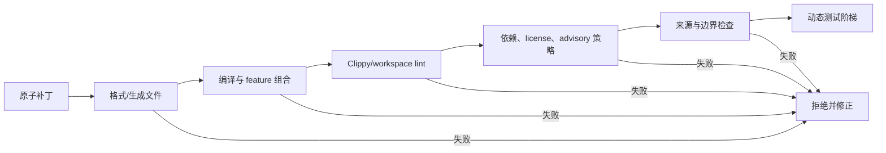

# 第 7 章：静态验证门禁

> **定位**：本章建立候选补丁进入动态验证前的快速拒绝链。前置依赖是 Rust 迁移骨架和原子变更；输出是一组从格式、编译、lint 到依赖策略的可复现门禁，以及对每层证明能力的清晰限定。

静态门禁的价值不在于「让 CI 更严格」，而在于用廉价、确定性高的检查尽早排除大量不合格候选。当 Agent 可以快速生成多个补丁时，人类审稿时间成为稀缺资源。一份未格式化、不能编译或违反仓库 lint 的补丁，不应占用审稿者认知带宽。

uutils 当前仓库将 `rustfmt`、Clippy、锁文件检查等放入 pre-commit/CI 路径，并使用 `cargo deny` 类策略检查 advisories、license、ban 与 source。[E2-STATIC-GATES] [E2-DENY] workspace 还在根配置统一 lint 策略。[E2-LINTS] [E2-WORKSPACE] 这些观察提供了工程样本，但具体项目应根据自身工具链、安全等级与依赖政策设置门禁。

<!-- source: .pre-commit-config.yaml -->
<!-- source: deny.toml -->
<!-- source: Cargo.toml -->
<!-- source: DEVELOPMENT.md -->

## 验证阶梯：快者先行，语义不跨级

顺序有两个目的。第一，让反馈尽可能快。格式和编译通常比大型测试更快，所以应在昂贵资源启动前拒绝明显问题。第二，让失败容易归因。如果格式、lint、依赖政策和系统测试同时失败，Agent 可能在一次修正中混合多个问题。用阶梯分层，每一层通过后再进入下一层，反馈更接近原子任务。[E4-VERIFICATION-LADDER]

但「先运行」不代表「证明更多」。格式化只证明源码符合规范化布局；编译只证明在目标配置下类型、宏与依赖可构造；Clippy 只证明没有命中已启用的模式诊断；`cargo deny` 只证明依赖图符合当前配置策略。它们都不证明兼容行为正确。

## 各层门禁应如何定义

| 层 | 建议检查 | 主要拦截 | 不能证明 |
|---|---|---|---|
| 格式与生成物 | `cargo fmt --check`，锁文件/生成文件一致性 | 噪声 diff、遗忘重生成 | 编译或行为正确 |
| 编译 | 目标 workspace/package/feature/target 矩阵 | 类型、宏、依赖与条件编译错误 | 选项语义或副作用兼容 |
| lint | workspace 定义的 Clippy/Rust lint，警告作错误 | 已编码的代码品质、可疑模式 | 未被 lint 表达的逻辑错误 |
| 依赖策略 | advisory、license、ban、source、重复版本规则 | 已知风险、不允许许可或来源 | 依赖在本系统中的运行正确性 |
| 仓库治理 | 禁止路径、source marker、文档必填项、安全说明 | 来源边界破坏与产物不完整 | 法律独立性或安全上线决策 |

门禁必须是可复现命令，不是某个开发者 IDE 中的绿色状态。变更证据应记录命令、工具链版本、目标包/feature/target、退出状态和关键输出。对不可在当前环境执行的平台检查，应标为「未验证」并由对应环境补足，不能将「未运行」写成「不适用」。

## workspace 级策略：集中定义，显式接入，显式例外

迁移项目包含多个 crate 时，如果每个 crate 自行选择 lint，门禁很快出现漂移。根 workspace 可以定义最低 Rust 版本、共享 lint、依赖规则与 profile，但成员并不会自动继承全部 package 字段、依赖和 lint；需要按 Cargo 对应机制显式使用 `workspace = true` 等接入方式，profile 的作用域也应单独核对。Cargo 官方 workspace、feature 与 profile 文档提供了这些机制的语义基线。[E2-CARGO-OFFICIAL] uutils 基线的 workspace lint 同样要求成员显式配置接入。[E2-LINTS]

例外必须局部、有理由、有过期或重评条件。例如，FFI 边界可能需要 `unsafe`，某个平台模块可能暂时不能满足某项 lint。正确方式是在最小范围上写准确的 allow 与安全/兼容理由，并让审稿人看见。错误方式是降低整个 workspace 的级别，只为了让 Agent 候选通过。

## 依赖治理与源码正确性分开报告

一个新依赖可以让实现更简洁，也可以带来新的 license、供应链、最低 Rust 版本、平台可用性和二进制大小问题。`cargo deny` 类门禁用来表达可接受政策，但不评估 API 是否被正确使用。所以变更证据应分成两列：「实现与行为验证」和「依赖政策验证」。两列都通过才能进入下一阶段，但任何一列都不应代替另一列的结论。

## 将静态门禁编进 Agent 回路

对 Agent，门禁输出应尽量结构化：失败层、命中规则、文件位置、建议修正范围、是否需要人类决策。当 lint 发现一个代码模式时，Agent 可以在当前原子任务内修正；当依赖策略拒绝某个新 crate 时，Agent 不应自动改变组织 license 允许表，而应返回一个设计选择：去除依赖、选用已批准能力，或请求人类政策评审。

门禁的配置本身也必须经过审查。一个危险的自动修正是：测试或 lint 失败后，Agent 通过删除测试、降低规则、增加宽泛 allowlist 或忽略退出码来取得绿灯。因此，变更门禁应对 CI 脚本、lint 配置、deny 配置和测试删除设置更高审批级别。

## 模式提炼

**快速失败验证阶梯**：按格式、编译、lint、依赖政策和仓库治理排列高归因性门禁，再进入动态行为证据。它适用于检查可重放且规则版本固定的工程；如果为使候选变绿而同步降低门禁，或把未运行 target 当成通过，阶梯就失去约束作用。

## 局限

静态分析受规则集、工具链版本、feature 和 target 影响；一个平台上的全绿不代表所有配置。advisory 数据库只包含已知且已公开的问题，license 检查只能依照元数据与政策。静态门禁最大的管理风险是「绿灯幻觉」：指标容易收集，人们便开始用它取代难以量化的行为与生产风险。

门禁还会占用计算与维护预算。对大型 workspace，应通过缓存、影响分析与定期全量检查平衡速度，但不应为了节约 CI 时间而让高风险共享变更只运行局部检查。

这些取舍应有可见的服务级别与负责人。

## 实践清单

- [ ] 将门禁按反馈速度和归因性排序，先运行快速确定检查。
- [ ] 为每层写明「能拦截什么」与「不能证明什么」。
- [ ] 在 workspace 统一 Rust 版本、lint、profile 和依赖策略，局部例外必须有理由。
- [ ] 将实现正确性与依赖/license/advisory 政策分开报告。
- [ ] 为命令记录工具链、feature、target、退出状态和未执行项。
- [ ] 对降低门禁、删除测试和扩大 allowlist 设置人类审批。

## 本章证据

仓库的 pre-commit/CI 门禁、deny 策略、workspace lint 与开发命令来自本地源码 [E2-STATIC-GATES] [E2-DENY] [E2-LINTS] [E2-WORKSPACE]；Cargo 机制以官方文档为语义基线 [E2-CARGO-OFFICIAL]；门禁顺序与证明限定是本书的验证阶梯综合 [E4-VERIFICATION-LADDER]。

### 版本演化说明

论文基线为 **arXiv:2608.07135**；本地源码基线为 **d8bee62c1ddc227d5e4385d80bbf6d7dee266a41**；本章证据核验日期为 **2026-08-14**。lint、advisory、工具链与仓库政策都会演化，变更证据必须记录实际版本，不能将过去的绿灯当成当前证据。
