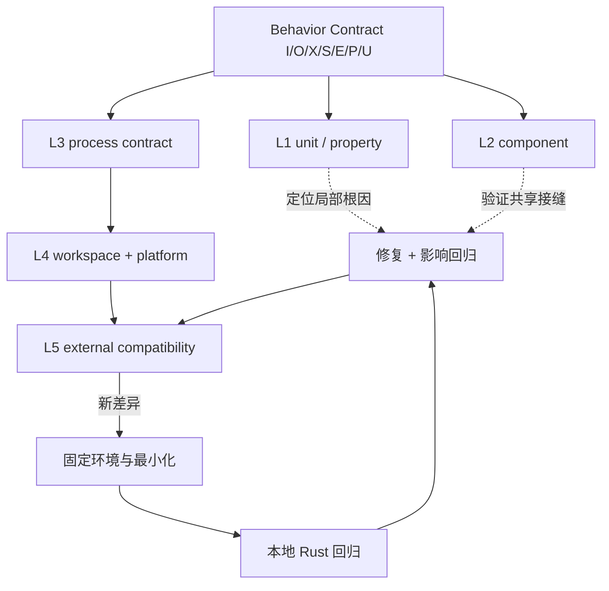

# 第 8 章：测试层次

> **定位**：本章把[第 3 章七字段契约](../part1/ch03-behavior-contract.md#从五元组展开为七字段契约)和[第 7 章静态门禁](ch07-static-gates.md#概念模型五层拒绝器与三种范围)映射为动态证据：纯函数单元测试、crate/component、utility 进程、workspace 集成与外部兼容套件。适用于选择测试落点、设计 fixture／平台矩阵、分诊 flaky failure 和规定测试所有权。读完后，读者应能让同一行为在不同层互补验证，并把外部发现固化为本项目可维护的 Rust 回归。

## 具体失败现场：四百个单元测试没有启动过进程

合成命令 `emit-record PATH` 读取路径并输出 NUL 分隔记录。团队把解析、转义和排序拆成纯函数，写了四百个表驱动测试；覆盖率很高，静态门禁也全绿。部署前的第一个进程测试却失败：入口把 stderr 重定向到 stdout，usage error 返回 0，而且工作目录继承了开发机，读取到 fixture 之外的同名文件。

团队补进程测试后又遇到平台问题。Linux 用例通过，macOS 对文件名顺序不同；测试为消除 flaky 直接 `sort()`，结果把“重复记录被丢弃”的 bug 一并隐藏。外部兼容套件随后找到非 UTF-8 路径差异，维护者加了永久 skip，没有把最小反例写进 Rust 测试。几个月后套件版本升级，skip 消失，缺陷重新出现。

测试数量和行覆盖率不能回答“观察了哪一层”。测试层次的职责是：**用最便宜的层定位原因，用足够外部的层证明契约，再把新反例固化到可维护层。**

## 概念模型：五层动态证据与四个评价维度

论文在其测量窗口把项目测试描述为单元、项目集成和外部端到端三层。[E1-TEST-STACK] 本章按固定仓库可见边界扩成五层；这是 E4-VERIFICATION-LADDER 作者提炼，不是把论文历史数量改写为当前事实。[E4-VERIFICATION-LADDER]

| 层 | 典型对象 | 反馈 | 观察范围 | 主要 oracle | 反例持久化 |
|---|---|---|---|---|---|
| L1 纯函数／单元 | parser、转换、错误分类、性质 | 最快、定位强 | 内存内输入输出 | 枚举期望、性质、模型 | 源码旁 `#[test]` |
| L2 crate/component | utility 与共享接口、feature | 快 | Rust API 与局部资源 | 类型化结果、不变量 | crate tests |
| L3 utility 进程 | argv/env/stdin、通道、exit、副作用 | 中 | 单命令真实进程 | Behavior Contract | `tests/by-util` |
| L4 workspace／平台 | shared core、multicall、target 组合 | 较慢 | 多消费者与 runner | 回归矩阵、平台契约 | 项目 CI 与平台测试 |
| L5 外部兼容套件 | 长期 CLI 兼容案例 | 慢、分诊成本高 | 外部用户视角 | 外部套件／参考观察 | 先分诊，再转本地 Rust 回归 |

选择层时同时衡量四维：速度、隔离性、行为覆盖面、诊断成本。不存在单向“越高越好”的金字塔：L5 发现差异很强，失败定位可能很弱；L1 定位精确，观察面窄。对每个契约字段，选择**最小能看见它的层**，再用更外层验证接缝。



## 一手测试架构走查：仓库实际能观察什么

### 执行入口区分局部与完整矩阵

固定 [`DEVELOPMENT.md:111–152`](https://github.com/uutils/coreutils/blob/d8bee62c1ddc227d5e4385d80bbf6d7dee266a41/DEVELOPMENT.md#L111-L152)给出 `cargo test`、平台 feature、选定 utility、`uucore/coreutils` package 和 nextest 入口；`:162–195` 给出 Make 下全体、排除、选择和 nextest 入口。[E2-TEST-COMMANDS] 这些命令展示可选择范围，不证明本章运行过它们，也不证明默认 `cargo test` 包含所有平台 feature。收据必须保存真实 selector。

### `CmdResult` 保留进程契约的原始观察

[`tests/uutests/src/lib/util.rs:119–159`](https://github.com/uutils/coreutils/blob/d8bee62c1ddc227d5e4385d80bbf6d7dee266a41/tests/uutests/src/lib/util.rs#L119-L159)的 `CmdResult` 保存二进制路径、utility 名、临时目录、可选退出状态，以及 `Vec<u8>` 形式的 stdout/stderr。[E2-TEST-COMMANDS] 这是重要能力边界：原始字节可以支持非 UTF-8 和 NUL 数据，但调用者若选择 `stdout_str()`、`trim()` 或宽松 contains，仍可能主动丢信息。结构有字段不等于每个测试都断言字段。

### `TestScenario` 提供每例隔离目录和 fixture

[`util.rs:1366–1409`](https://github.com/uutils/coreutils/blob/d8bee62c1ddc227d5e4385d80bbf6d7dee266a41/tests/uutests/src/lib/util.rs#L1366-L1409)说明 `TestScenario` 定位测试二进制、为每例创建唯一临时目录并复制 `tests/fixtures/<util>` 内容；后续还可在部分平台挂临时文件系统。[E2-TEST-COMMANDS] 隔离目录减少并行相互污染，却不会自动控制 locale、时区、用户、umask、时钟或文件系统能力；测试必须显式配置契约相关项。

fixture 是输入代码，不是静态图片。它需要来源、平台适用性、预期状态和清理策略。二进制 fixture 应按字节创建或校验 digest，不能经文本编辑器无意改行尾；权限 fixture 在 Git 中未必保留 mode，应在 setup 阶段显式设置。

### `UCommand` 让环境、资源与终端进入夹具

[`util.rs:1486–1524`](https://github.com/uutils/coreutils/blob/d8bee62c1ddc227d5e4385d80bbf6d7dee266a41/tests/uutests/src/lib/util.rs#L1486-L1524)说明 `UCommand` 包装命令、记录参数、使用独立工作目录并默认清空环境，同时持有 stdin/stdout/stderr、字节 stdin、Unix resource limit、timeout、终端模拟和 umask 等状态。[E2-TEST-COMMANDS] `1657–1705` 提供 env、umask 与 timeout builder；`1928–2048` 构建命令时清环境、设默认 timeout、连接 PTY 并应用 umask。

这些能力支持可重复 fixture，但也定义了测试环境与真实 shell 的差异。默认清空环境可能隐藏用户继承变量问题；PTY 模拟不等于所有终端；resource limit 与 `/dev/full` 只覆盖特定故障。每项选择都要回写 Behavior Contract 的 `E/P/U`。

### 真实用例展示环境与副作用观察

固定 [`tests/by-util/test_date.rs:69–102`](https://github.com/uutils/coreutils/blob/d8bee62c1ddc227d5e4385d80bbf6d7dee266a41/tests/by-util/test_date.rs#L69-L102)显式设置 `LANG/LC_ALL=C` 和 `TZ=UTC0`，检查大年份、偏移边界、成功输出与无效日期失败。[E2-TEST-COMMANDS] 它证明这些具体用例控制了 locale/timezone，不证明整个 date 测试或所有 locale 受控。

固定 [`tests/by-util/test_cp.rs:74–145`](https://github.com/uutils/coreutils/blob/d8bee62c1ddc227d5e4385d80bbf6d7dee266a41/tests/by-util/test_cp.rs#L74-L145)提供元数据比较、Linux `/dev/full` 写失败、stdout 写失败后目标状态、普通复制和已有目标断言。[E2-TEST-COMMANDS] 它显示进程测试能同时观察通道与文件状态；单个宏所列 mode/uid/time 也不是所有副作用的穷尽，xattrs、links、稀疏区间和故障时点仍需对应用例。

### 外部套件是发现入口，不是唯一规范

固定开发文档给出 BusyBox 与另一个外部兼容套件的执行入口、平台前提和选择方式。[E2-EXTERNAL-SUITES] 本章不读取或派生禁止实现源码及其测试内容，只把项目文档中的“存在外部执行路径”作为 E2 事实。外部结果需要按候选缺陷、项目非目标、suite 假设、环境问题、参考缺陷或非确定性分诊；不能一失败就模仿，也不能一失败就 skip。

固定 [`AGENTS.md:17–23`](https://github.com/uutils/coreutils/blob/d8bee62c1ddc227d5e4385d80bbf6d7dee266a41/AGENTS.md#L17-L23)要求新行为或 bug 修复有本地 Rust 测试；外部测试从失败变为通过，也要新增 Rust 回归以防静默复发。[E2-NO-TEST-NO-MERGE] 这给出明确所有权迁移：外部套件发现，项目内最小回归永久保存。

<!-- source: DEVELOPMENT.md -->
<!-- source: AGENTS.md -->
<!-- source: tests/uutests/src/lib/util.rs -->
<!-- source: tests/by-util/test_date.rs -->
<!-- source: tests/by-util/test_cp.rs -->

## 同一行为在多层测试：重复还是互补

以合成 `emit-record` 的“含非 UTF-8 路径时原样输出一条 NUL 记录”为例：

| 层 | 测试 | 会发现 | 不会发现 |
|---|---|---|---|
| L1 | `encode_record(os_bytes)` 的表驱动／性质测试 | lossy、分隔符、重复丢失、空输入 | argv、进程通道、入口多消费参数 |
| L2 | utility parser + encoder component | 类型转换接缝、错误 enum | shell/OS 参数、真实 stdout write failure |
| L3 | 创建字节路径并启动命令，断言 stdout bytes/stderr/exit | 入口、原生路径、通道和退出 | 其他 target、外部长期组合 |
| L4 | standalone/multicall 与 Unix/Windows 能力矩阵 | 调度与目标分支 | 未运行平台、所有 filesystem |
| L5 | 允许的外部兼容案例 | 项目未编码的历史组合 | oracle 正确、差异应保留、项目回归持久性 |

五层都触及“同一行为”，却不是机械复制相同断言。L1 用大量输入定位编码函数；L3 只保留高价值代表，验证真实边界；L4 配置入口与平台；L5搜索未知。若 L1 与 L3 共用同一个错误的 expected generator，层数不会增加独立证据；对关键期望应使用常量、独立模型或人工批准样本，并给比较器负控。

重复的判据不是“测试名相似”，而是“观察面、fixture 和 oracle 是否提供新信息”。两个层都只调用同一内部函数且同一 expected helper，属于相关重复；一个测试算法性质、另一个启动进程观察 exit，属于互补。

## 环境、权限与平台矩阵

环境矩阵先按能力再按 OS。`locale=C`、`timezone=UTC0`、`umask=022` 是 fixture 值，不是自然默认；权限用例还要记录有效 uid/gid、是否 root、容器 capability、文件系统 mount option。平台行至少有 `supported|unsupported|unknown`，其中 runner 缺失是 unknown，不是 skip-pass。

| 维度 | 最小控制 | 负控 | 常见误判 |
|---|---|---|---|
| cwd／临时目录 | 每例唯一目录，断言路径范围 | 在外部放同名文件 | 临时目录存在就等于无泄漏 |
| locale/TZ | 显式 env 与输出编码 | 换 locale/偏移应改变指定行为 | 开发机默认恰好为 C/UTC |
| umask/mode | setup 设置并拍 before/after | 改 umask 应击穿 mode 断言 | Git fixture mode 可靠跨平台 |
| 用户／权限 | 记录身份和 capability | 非特权用户应拒绝受保护操作 | root CI 代表普通用户 |
| 时间 | 固定时钟或输入绝对时点 | 跨边界时刻/DST | “运行很快”就确定 |
| 文件系统 | 类型、mount、link/xattr 能力 | 另一个 FS 或能力缺失 | OS 名称等于 FS 语义 |
| target | 原生 runner 优先，交叉 check 另报 | 未运行 target 必须 unknown | 能编译等于能执行 |

## 完整工程案例

### `emit-record` 从外部差异到永久回归

**契约。** `BC-EMIT-041@v3` 规定输入一个目录；stdout 是 NUL 分隔原生路径多重集合，顺序可变但重复显著；stderr 为空、exit 0；缺目录 exit 1；Unix 字节路径与 Windows 原生路径分别建平台 outcome。性能、并发目录变化和网络文件系统为 non-goal/unknown。

**L1 先定位表示。** `encode_record` 用 `[ascii, 0xFF, newline, duplicate]` 表驱动，性质是每个输入产生恰好一个尾随 NUL 记录、原字节可逆。负控改为 `to_string_lossy()` 或普通集合去重，测试必须失败。L1 快速拒绝有损算法，却不证明实际目录枚举把原生路径传进函数。

**L2 验证组件接缝。** parser 输出 `PathBuf`，collector 输出 `Vec<OsString>`，encoder 接收借用原生类型。component 测试故意让显示层返回错误，确认结构化错误没有变 exit；真实 exit 留给 L3。

**L3 启动真实进程。** `TestScenario` 创建独立目录，Unix fixture 含 `a`、字节 `FF`、换行与两个不同但 lossy 显示相同的名称。`CmdResult` 按 bytes 解析 NUL 多重集合，分别断言 stdout、stderr、exit 和目录不变。负控把 stderr 合并 stdout、exit 固定 0、删除重复记录，三者都应失败。

**L4 入口与平台。** 同一核心样本通过 standalone 和 multicall；Linux runner执行字节路径，Windows runner执行原生宽路径，不能把 Unix fixture复制到 Windows。macOS 只有 runner 但缺一项 fixture capability，条目写 `blocked_by_fixture` 而非 pass；owner 负责补齐或在发布范围排除。

**L5 发现新差异。** 允许的外部套件报告“尾随换行名称被拆成两条”。分诊先固定套件版本、平台、env 与原始输出，确认候选缺陷；再最小化为一个含换行路径。团队没有长期依赖外部用例，而把最小样本加入 L3 Rust 回归，证明错误候选失败，再修 encoder。外部套件重跑只作为“原发现已关闭”的额外收据。

**影响回归。** 修复共享 encoder 后，affected 选择器运行两个消费者的进程测试；workspace 周期矩阵检查多入口。Change Package 分栏记录 L1–L5 的真实命令、pass/fail/skip/unknown、fixture digest 和未覆盖并发／网络 FS。

完整链条不是为了让同一输入跑五遍，而是完成“快速定位→真实边界→平台范围→未知搜索→本地资产化”。若未来外部套件删除该案例，本地回归仍由项目拥有。

## flaky test 分诊与所有权

flaky 不是“多跑几次直到绿”。第一次波动就生成 Flake Record：测试 ID、首次 commit、runner、seed、时间、资源、并行度、fixture digest、stdout/stderr/exit、前后状态和重跑分布。分类顺序：

1. **产品非确定性未建模**：输出顺序、时钟或竞态需要契约允许集合；不能随意 `sort/trim`。
2. **测试隔离缺陷**：共享目录、端口、env、全局 umask 或残留进程；修夹具并加负控。
3. **平台／资源依赖**：runner 能力、磁盘、权限或负载；固定能力或配置专用 runner。
4. **真实竞态／产品 bug**：保留失败样本和时序，进入第 10 章最小化与回归。
5. **基础设施故障**：下载、runner 中断等与候选无关，但仍记录，不能混入 pass 率。

只有证据支持基础设施偶发时才允许受限 retry；第一次失败仍保留。quarantine 要有 owner、issue、到期与发布影响，且结果是 `quarantined/unknown`，不是 pass。高风险契约测试被隔离通常阻断发布。

所有权按层分配：函数 owner 维护 L1；utility owner 维护 L2/L3；shared/platform owner 维护 L4；compatibility owner 分诊 L5并确保转本地回归；fixture owner 维护测试数据和归一化。发现者可以是外部套件或 Agent，关闭者必须是能解释契约与证据的人。

## 反例

**反例一：所有逻辑都做进程测试。** 反馈慢、失败定位差，组合空间无法扩大。解析和性质应在 L1 穷举，L3保留边界代表；进程层不能替代局部性质。

**反例二：为去 flaky 无条件排序／trim。** 如果契约只允许重排，可以按多重集合比较；普通集合会丢重复，trim 会丢尾随字节。每个归一化规则要有 contract 引用与一个会被拒绝的语义负控。

**反例三：外部套件是绝对规范。** 套件可能依赖不承诺扩展、特定 shell/平台或参考缺陷。正确流程先分诊与人工裁决；若决定不兼容，要把允许差异和理由写入契约，而不是让测试偷偷 skip。

**反例四：测试通过就删除失败资产。** 外部用例可能演化或不可长期运行；没有本地 Rust 回归，修复无法独立保持。[E2-NO-TEST-NO-MERGE]

## 可复用工件

下面的 **Test Layer Map** 是 E4 作者工件，可直接进入 Task Contract／Change Package：

```yaml
schema: test-layer-map/v1
id: TLM-EMIT-041
contract: BC-EMIT-041@v3
commit: candidate-sha
behavior_fields: [I.path, O.stdout_bytes, X.exit, S.no_mutation, E.locale, P.native_path, U.order]
layers:
  L1_unit:
    selectors: [encode_record_table, encode_record_roundtrip_property]
    oracle: [one_record_per_input, bytes_roundtrip, duplicate_significant]
    negative_controls: [lossy, trim, set_dedup]
  L2_component:
    selectors: [parser_collector_encoder]
    oracle: [native_types, structured_error]
  L3_process:
    selector: test_emit_record_contract
    fixture: {id: emit-native-v2, digest: sha256:..., isolated_tempdir: true}
    observations: [stdout_bytes, stderr_bytes, exit, before_after_tree]
    entry: standalone
  L4_matrix:
    entries: [standalone, multicall_name, multicall_second_arg]
    platforms:
      - {capability: unix_path_bytes, runner: linux, state: planned}
      - {capability: windows_native_path, runner: windows, state: planned}
      - {capability: unix_path_bytes, runner: macos, state: blocked_by_fixture, owner: platform-owner}
  L5_external:
    suite_version: pinned
    role: discovery_not_absolute_spec
    failure_dispositions: [candidate_bug, non_goal, suite_assumption, environment, reference_bug, flaky]
    local_regression_required_on_candidate_fix: true
environment:
  cwd: unique_tempdir
  env_clear: true
  locale: C
  timezone: not_applicable
  umask: "022"
  timeout: 30s
receipts_required: [command, selector, runner, env, fixture_digest, counts, exit_code, log_digest]
flaky_policy:
  retry_preserves_first_failure: true
  quarantine_requires: [owner, issue, expires, release_disposition]
proof_boundary:
  demonstrated: []
  unknown: [concurrent_mutation, network_fs, unlisted_platforms]
```

Map 先计划，receipt 后填结果。每个字段至少被一层观察；归一化必须列负控；`blocked_by_fixture` 保持可见；L5 修复绑定本地回归。

## 模式提炼

**最小可见层**：先把契约字段放在最便宜且能观察的层，再用进程／平台验证接缝。前提是层间 oracle 不完全同源；否则相关错误会共同放行。

**外部发现、本地拥有**：外部套件扩大搜索面，最小反例经裁决进入 Rust 回归。[E2-NO-TEST-NO-MERGE] 参考现象不是自动规范，skip/xfail 需要 owner 与重评。

**环境是测试输入**：cwd、env、locale、TZ、umask、用户、FS、时间和 target 都进入 fixture。未设置不等于不相关，而是 inherited/unknown；继承必须是有意契约。

**负向可见性**：为高风险断言准备会交换通道、改变 exit、丢副作用或过宽归一化的候选，确认测试失败。它检查测试能否看到风险，不证明正向期望本身正确。

**flaky 是未决证据**：保留首次失败、分类来源、限时 quarantine。重跑绿只能说明后续运行通过，不能抹去原失败。

## AI Coding 工作台

工作台按 contract field 展示测试层，而不是只显示一串命令。Agent 可以生成 L1 表格、L3 fixture 草稿和收据摘要；它必须先运行负控，不能通过扩大 normalization、删除失败样本、无限 retry 或添加无期限 skip 取得绿灯。外部失败先输出分诊包，不立即模仿参考。

提示骨架：

```text
按 TLM-EMIT-041 为 BC-EMIT-041@v3 实现测试，不改产品代码和外部 suite。
L1 覆盖 byte roundtrip/duplicates；L3 启动真实进程并观察 stdout/stderr/exit/tree；
L4 保持 runner 缺失为 unknown；L5 失败先最小化与分类。
禁止 lossy/trim/set normalization，除非 contract 明确且有负控。
flaky 保留首次失败；超过两次非同型结果就停止并生成 Flake Record。
交付真实命令、fixture digest、结果、未运行项和 proof boundary。
```

人类负责批准 oracle、允许差异、外部套件裁决、quarantine 与发布范围。Agent 的“测试覆盖全面”不是证据；只有 Map 和 receipt 能说明覆盖了哪些字段、在哪个环境、还缺什么。

## 能证明什么／不能证明什么

| 能证明什么 | 不能证明什么 |
|---|---|
| 论文窗口记录单元、项目集成和外部端到端测试层。[E1-TEST-STACK] | 历史测试数量等于当前仓库、层数本身保证独立或所有行为被覆盖。 |
| 固定开发文档给出 Cargo/nextest/Make 与选择 utility、feature 的入口。[E2-TEST-COMMANDS] | 本次实际运行、默认命令覆盖所有平台，或选择器没有漏依赖。 |
| `CmdResult` 能保存退出状态和 stdout/stderr 原始字节，`TestScenario/UCommand` 能隔离目录并控制多项环境。[E2-TEST-COMMANDS] | 每个测试都断言所有字段、fixture 模拟真实系统，或无有损 accessor。 |
| 固定 date/cp 用例展示 locale/TZ、元数据、写失败和目标状态可进入进程测试。[E2-TEST-COMMANDS] | 所有 locale、权限、文件系统、故障时点和平台已验证。 |
| 外部套件通过证明其版本、环境与实际执行条目未报告未豁免失败。[E2-EXTERNAL-SUITES] | 参考绝对正确、skip 合理、未执行条目通过或项目无需本地回归。 |
| 本地回归与负控通过支持声明案例的可见性和候选结果。[E2-NO-TEST-NO-MERGE] | 未枚举输入、生产时序、网络 FS、长期资源行为或数学完备性。 |

## 局限

测试是有限样本。行覆盖、分支覆盖和测试数量都不能替代行为契约覆盖；进程测试也可能漏掉权限、链接、时间戳或清理。oracle、expected helper 与归一化本身可以有 bug，需要来源、评审和负控。

平台矩阵受 runner 与能力限制。容器、PTY、临时 FS 和 root runner 不等于用户生产环境；无法复制的条件要进入 unknown 和上线边界。外部套件有许可、平台、版本和运行成本，本章不把它当唯一事实源。

分层会产生 fixture 漂移、慢测、flaky 和 owner 失联。应度量失败定位、quarantine 年龄与反例资产化率，而不是只追求测试数。第 9–10 章继续处理差分与 fuzz，本章不声称五层覆盖状态空间。

## 实践清单

- [ ] 每个高风险 contract field 是否分配到最小可见层，并有至少一个外层接缝测试？
- [ ] `CmdResult` 是否按需要使用原始字节，stdout/stderr/exit/副作用是否分别断言？
- [ ] fixture 是否记录来源、digest、cwd、env、locale、TZ、umask、身份、FS 和 timeout？
- [ ] 平台缺 runner/fixture 是否保持 unknown，没有把 skip 当 pass？
- [ ] 外部差异是否先分诊、最小化，再固化为本地 Rust 回归？
- [ ] flaky 是否保留首次失败、owner、到期和发布影响，归一化是否有负控？

## 练习

- **练习一：分层同一行为。** 为“输入含尾随空格的原生路径，stdout 原样输出、exit 0”分别设计 L1、L3、L4 测试，说明每层新观察和盲区；不得复用同一个 expected generator。
- **练习二：设计验证。** 为写文件命令构造磁盘满、stdout 写失败和权限拒绝 fixture，同时观察通道、exit、目标前后态与清理；加入一个已知截断目标的负控，证明测试会失败。
- **练习三：flaky 分诊。** 给定一个目录顺序测试 20 次失败 2 次，填写 Flake Record，区分允许重排、重复丢失、共享目录污染和真实竞态；提出最小实验、owner、quarantine 到期与发布处置。

## 本章证据

本章四项主证据为论文测试栈 [E1-TEST-STACK]、固定执行命令与测试夹具 [E2-TEST-COMMANDS]、项目文档所列外部套件入口 [E2-EXTERNAL-SUITES]、外部修复必须落本地 Rust 回归的规则 [E2-NO-TEST-NO-MERGE]。五层模型、Test Layer Map、flaky 流程和所有权属于作者提炼 [E4-VERIFICATION-LADDER]；`emit-record` 是合成案例。

### 版本演化说明

论文基线为 **arXiv:2608.07135**（其中测试数量只属于论文测量窗口）；源码与测试架构固定核验于 **d8bee62c1ddc227d5e4385d80bbf6d7dee266a41**；核验日期为 **2026-08-14**。测试命令、fixture API、suite 版本和平台 runner 会演化，复用时必须重新核验，不能把固定收据写成当前覆盖率。
