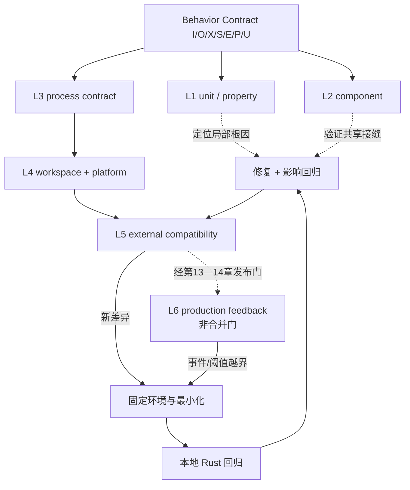

# 第 8 章：测试层次

> **定位**：本章把[第 3 章七字段契约](../part1/ch03-behavior-contract.md#从五元组展开为七字段契约)和[第 7 章静态门禁](ch07-static-gates.md#概念模型五层拒绝器与三种范围)映射为六层动态证据：unit、component、utility 进程、workspace／平台、外部兼容套件与生产反馈。适用于选择测试落点、设计 fixture／平台矩阵、分诊 flaky failure 和规定测试所有权；读者最终应能把外部或生产反例固化为本地 Rust 回归。

## 具体失败现场：四百个单元测试没有启动过进程

合成命令 `emit-record PATH` 输出 NUL 分隔记录。四百个纯函数测试和静态门禁全绿，第一个进程测试却发现 stderr 被并入 stdout、usage error 返回 0，工作目录还继承了开发机。

Linux 通过后，macOS 顺序波动促使测试直接 `sort()`，连重复记录丢失也被隐藏。外部套件又找到非 UTF-8 差异，维护者只加永久 skip；套件升级后缺陷重现。

测试数量和行覆盖率不能回答“观察了哪一层”。测试层次的职责是：**用最便宜的层定位原因，用足够外部的层证明契约，再把新反例固化到可维护层。**

## 概念模型：六层动态证据与四个评价维度

论文在其测量窗口把项目测试描述为单元、项目集成和外部端到端三层。[E1-TEST-STACK] 本章把固定仓库边界与运行反馈组织成六层；L6 及整体阶梯均为作者提炼 [E4-VERIFICATION-LADDER]，不是论文的层数或当前覆盖率。

| 层 | 典型对象 | 反馈 | 观察范围 | 主要 oracle | 反例持久化 |
|---|---|---|---|---|---|
| L1 纯函数／单元 | parser、转换、错误分类、性质 | 最快、定位强 | 内存内输入输出 | 枚举期望、性质、模型 | 源码旁 `#[test]` |
| L2 crate/component | utility 与共享接口、feature | 快 | Rust API 与局部资源 | 类型化结果、不变量 | crate tests |
| L3 utility 进程 | argv/env/stdin、通道、exit、副作用 | 中 | 单命令真实进程 | Behavior Contract | `tests/by-util` |
| L4 workspace／平台 | shared core、multicall、target 组合 | 较慢 | 多消费者与 runner | 回归矩阵、平台契约 | 项目 CI 与平台测试 |
| L5 外部兼容套件 | 长期 CLI 兼容案例 | 慢、分诊成本高 | 外部用户视角 | 外部套件／参考观察 | 先分诊，再转本地 Rust 回归 |
| L6 生产反馈 | shadow/canary 后的真实工作负载 | 延迟最高、隔离最低 | 最广但不可控 | SLO、告警、日志、事件与回退阈值 | 事件最小化后转本地回归 |

四个评价维度是速度、隔离性、覆盖面和诊断成本。L1 定位强而范围窄；L6 触达真实负载却最慢、最难隔离。每个契约字段先放在**最小可见层**，再用外层验证接缝。L6 是发布后的运行门，不是合并门；没有生产信号不能抵扣 L1–L5 缺口。



## 一手测试架构走查：仓库实际能观察什么

### 执行入口区分局部与完整矩阵

固定 [`DEVELOPMENT.md:111–152`](https://github.com/uutils/coreutils/blob/d8bee62c1ddc227d5e4385d80bbf6d7dee266a41/DEVELOPMENT.md#L111-L152)给出 `cargo test`、平台 feature、选定 utility、`uucore/coreutils` package 和 nextest 入口；`:162–195` 给出 Make 下全体、排除、选择和 nextest 入口。[E2-TEST-COMMANDS] 这些命令展示可选择范围，不证明本章运行过它们，也不证明默认 `cargo test` 包含所有平台 feature。收据必须保存真实 selector。

### `CmdResult` 保留进程契约的原始观察

[`tests/uutests/src/lib/util.rs:119–159`](https://github.com/uutils/coreutils/blob/d8bee62c1ddc227d5e4385d80bbf6d7dee266a41/tests/uutests/src/lib/util.rs#L119-L159)的 `CmdResult` 保存退出状态及 `Vec<u8>` stdout/stderr。[E2-TEST-COMMANDS] 它支持非 UTF-8/NUL 观察；测试若改用文本、`trim()` 或宽松 contains，仍会主动丢信息。

### `TestScenario` 提供每例隔离目录和 fixture

[`util.rs:1366–1409`](https://github.com/uutils/coreutils/blob/d8bee62c1ddc227d5e4385d80bbf6d7dee266a41/tests/uutests/src/lib/util.rs#L1366-L1409)为每例创建唯一临时目录并复制 fixture。[E2-TEST-COMMANDS] 这减少并行污染，但 locale、时区、身份、umask、时钟与 FS 能力仍须显式配置；fixture 还需来源、digest 和平台说明。

### `UCommand` 让环境、资源与终端进入夹具

[`util.rs:1486–1524`](https://github.com/uutils/coreutils/blob/d8bee62c1ddc227d5e4385d80bbf6d7dee266a41/tests/uutests/src/lib/util.rs#L1486-L1524)说明 `UCommand` 包装命令、记录参数、使用独立工作目录并默认清空环境，同时持有 stdin/stdout/stderr、字节 stdin、Unix resource limit、timeout、终端模拟和 umask 等状态。[E2-TEST-COMMANDS] `1657–1705` 提供 env、umask 与 timeout builder；`1928–2048` 构建命令时清环境、设默认 timeout、连接 PTY 并应用 umask。

这些能力支持重放，也制造与真实 shell 的差异：清空环境、PTY、resource limit 与 `/dev/full` 都只覆盖声明条件，须回写契约 `E/P/U`。

### 真实用例展示环境与副作用观察

固定 [`tests/by-util/test_date.rs:69–102`](https://github.com/uutils/coreutils/blob/d8bee62c1ddc227d5e4385d80bbf6d7dee266a41/tests/by-util/test_date.rs#L69-L102)显式设置 `LANG/LC_ALL=C` 和 `TZ=UTC0`，检查大年份、偏移边界、成功输出与无效日期失败。[E2-TEST-COMMANDS] 它证明这些具体用例控制了 locale/timezone，不证明整个 date 测试或所有 locale 受控。

固定 [`tests/by-util/test_cp.rs:74–145`](https://github.com/uutils/coreutils/blob/d8bee62c1ddc227d5e4385d80bbf6d7dee266a41/tests/by-util/test_cp.rs#L74-L145)提供元数据比较、Linux `/dev/full` 写失败、stdout 写失败后目标状态、普通复制和已有目标断言。[E2-TEST-COMMANDS] 它显示进程测试能同时观察通道与文件状态；单个宏所列 mode/uid/time 也不是所有副作用的穷尽，xattrs、links、稀疏区间和故障时点仍需对应用例。

### 外部套件是发现入口，不是唯一规范

固定 [`DEVELOPMENT.md:197–239`](https://github.com/uutils/coreutils/blob/d8bee62c1ddc227d5e4385d80bbf6d7dee266a41/DEVELOPMENT.md#L197-L239)记录外部套件入口、平台前提和选择方式。[E2-EXTERNAL-SUITES] 它只证明项目文档存在执行入口，不证明 Agent 获得上下文权限或套件内容是规范；失败仍须分诊，不能直接模仿或 skip。

固定 [`AGENTS.md:17–23`](https://github.com/uutils/coreutils/blob/d8bee62c1ddc227d5e4385d80bbf6d7dee266a41/AGENTS.md#L17-L23)要求新行为或 bug 修复有本地 Rust 测试；外部测试从失败变为通过，也要新增 Rust 回归以防静默复发。[E2-NO-TEST-NO-MERGE] 这给出明确所有权迁移：外部套件发现，项目内最小回归永久保存。

<!-- source: DEVELOPMENT.md -->
<!-- source: AGENTS.md -->
<!-- source: tests/uutests/src/lib/util.rs -->
<!-- source: tests/by-util/test_date.rs -->
<!-- source: tests/by-util/test_cp.rs -->

## 同一行为在多层测试：重复还是互补

以合成 `emit-record` 的“含非 UTF-8 路径时原样输出一条 NUL 记录”为例：

| 层 | 测试 | 会发现 | 不会发现 |
|---|---|---|---|
| L1 | `encode_record(os_bytes)` 的表驱动／性质测试 | lossy、分隔符、重复丢失、空输入 | argv、进程通道、入口多消费参数 |
| L2 | utility parser + encoder component | 类型转换接缝、错误 enum | shell/OS 参数、真实 stdout write failure |
| L3 | 创建字节路径并启动命令，断言 stdout bytes/stderr/exit | 入口、原生路径、通道和退出 | 其他 target、外部长期组合 |
| L4 | standalone/multicall 与 Unix/Windows 能力矩阵 | 调度与目标分支 | 未运行平台、所有 filesystem |
| L5 | 允许的外部兼容案例 | 项目未编码的历史组合 | oracle 正确、差异应保留、项目回归持久性 |
| L6 | shadow/canary 指标、日志、事件与回退 | 真实组合、打包和长期负载差异 | 低频未来事件、根因隔离与测试前置证明 |

六层不是复制断言：L1 定位编码，L3 验证进程，L4 覆盖入口／平台，L5 搜索历史兼容面，L6 观察真实运行。共享同一个错误 expected helper 不增加独立证据；判断重复要看观察面、fixture 与 oracle 是否新增信息。

## 环境、权限与平台矩阵

环境矩阵先按能力再按 OS。`locale=C`、`timezone=UTC0`、`umask=022` 是 fixture 值，不是自然默认；权限用例还要记录有效 uid/gid、是否 root、容器 capability、文件系统 mount option。平台行至少有 `supported|unsupported|unknown`，其中 runner 缺失是 unknown，不是 skip-pass。

| 维度 | 最小控制 | 负控 | 常见误判 |
|---|---|---|---|
| cwd／临时目录 | 每例唯一目录，断言路径范围 | 在外部放同名文件 | 临时目录存在就等于无泄漏 |
| locale/TZ | 显式 env 与输出编码 | 换 locale/偏移应改变指定行为 | 开发机默认恰好为 C/UTC |
| umask/mode | setup 设置并拍 before/after | 改 umask 应击穿 mode 断言 | Git fixture mode 可靠跨平台 |
| 用户／权限 | 记录身份和 capability | 非特权用户应拒绝受保护操作 | root CI 代表普通用户 |
| 时间 | 固定时钟或输入绝对时点 | 跨边界时刻/DST | “运行很快”就确定 |
| 文件系统 | 类型、mount、link/xattr 能力 | 另一个 FS 或能力缺失 | OS 名称等于 FS 语义 |
| target | 原生 runner 优先，交叉 check 另报 | 未运行 target 必须 unknown | 能编译等于能执行 |

## 完整工程案例

### `emit-record` 从外部差异到永久回归

**契约。** `BC-EMIT-041@v3` 规定输入一个目录；stdout 是 NUL 分隔原生路径多重集合，顺序可变但重复显著；stderr 为空、exit 0；缺目录 exit 1；Unix 字节路径与 Windows 原生路径分别建平台 outcome。性能、并发目录变化和网络文件系统为 non-goal/unknown。

**L1 表示。** `[ascii, 0xFF, newline, duplicate]` 验证一输入一条 NUL 记录和字节可逆；lossy／集合去重负控必须失败，但它不证明进程传入原生路径。

**L2 组件。** parser 保留 `PathBuf`，collector 保留 `OsString`；显示错误保持结构化，真实 exit 留给 L3。

**L3 进程。** Unix fixture 含字节 `FF`、换行和 lossy 显示碰撞名；`CmdResult` 按 bytes 断言 NUL 多重集合、stderr、exit 与目录不变。交换通道、exit 固定 0、删除重复的负控都应失败。

**L4 入口／平台。** standalone、multicall 与 Linux 字节路径分别执行；Windows 使用自己的原生路径 outcome。macOS 缺 fixture 能力时记 `blocked_by_fixture`，不算 pass。

**L5 外部发现。** 外部套件暴露换行名称被拆分；固定版本／环境后最小化，将样本加入 L3 Rust 回归再修复。套件重跑只是关闭原发现的附加收据。

**L6 生产反馈。** 经[第 13 章完成门](../part4/ch13-definition-of-done.md)与[第 14 章分阶段发布](../part5/ch14-rollout-rollback.md)后，canary 的解析失败率越过阈值并触发回退。运行收据保存版本、流量段、指标窗口、日志与回退；事件被最小化为本地 fixture，先让 L3 失败，再修复并重跑 L1–L5。L6 的低隔离、晚反馈和 operational oracle 不能批准 merge，只能反馈新契约／回归与发布决策；生产事实边界详见[第 15 章](../part5/ch15-ubuntu-boundaries.md)。

**影响回归。** 共享修复运行消费者与 workspace 矩阵；Change Package 分栏记录 L1–L5 命令与 L6 运行收据，保留未覆盖并发／网络 FS。

链条完成“定位→进程→平台→外部搜索→运行反馈→本地资产化”；外部用例或事件消失后，回归仍由项目拥有。

## flaky test 分诊与所有权

flaky 不是“多跑几次直到绿”。第一次波动就生成 Flake Record：测试 ID、首次 commit、runner、seed、时间、资源、并行度、fixture digest、stdout/stderr/exit、前后状态和重跑分布。分类顺序：

1. **产品非确定性未建模**：输出顺序、时钟或竞态需要契约允许集合；不能随意 `sort/trim`。
2. **测试隔离缺陷**：共享目录、端口、env、全局 umask 或残留进程；修夹具并加负控。
3. **平台／资源依赖**：runner 能力、磁盘、权限或负载；固定能力或配置专用 runner。
4. **真实竞态／产品 bug**：保留失败样本和时序，进入第 10 章最小化与回归。
5. **基础设施故障**：下载、runner 中断等与候选无关，但仍记录，不能混入 pass 率。

只有证据支持基础设施偶发时才允许受限 retry；第一次失败仍保留。quarantine 要有 owner、issue、到期与发布影响，且结果是 `quarantined/unknown`，不是 pass。高风险契约测试被隔离通常阻断发布。

所有权按层分配：函数 owner 管 L1，utility owner 管 L2/L3，shared/platform owner 管 L4，compatibility owner 分诊 L5，release/ops owner 管 L6 指标、事件与回退；fixture owner 维护数据。关闭者必须能解释契约与证据。

## 反例

**反例一：所有逻辑都做进程测试。** 反馈慢、失败定位差，组合空间无法扩大。解析和性质应在 L1 穷举，L3保留边界代表；进程层不能替代局部性质。

**反例二：为去 flaky 无条件排序／trim。** 如果契约只允许重排，可以按多重集合比较；普通集合会丢重复，trim 会丢尾随字节。每个归一化规则要有 contract 引用与一个会被拒绝的语义负控。

**反例三：外部套件是绝对规范。** 套件可能依赖不承诺扩展、特定 shell/平台或参考缺陷。正确流程先分诊与人工裁决；若决定不兼容，要把允许差异和理由写入契约，而不是让测试偷偷 skip。

**反例四：测试通过就删除失败资产。** 外部用例可能演化或不可长期运行；没有本地 Rust 回归，修复无法独立保持。[E2-NO-TEST-NO-MERGE]

## 可复用工件

下面的 **Test Layer Map** 是 E4 作者工件，可直接进入 Task Contract／Change Package：

```yaml
schema: test-layer-map/v1
id: TLM-EMIT-041
contract: BC-EMIT-041@v3
commit: candidate-sha
behavior_fields: [I.path, O.stdout_bytes, X.exit, S.no_mutation, E.locale, P.native_path, U.order]
layers:
  L1_unit:
    selectors: [encode_record_table, encode_record_roundtrip_property]
    oracle: [one_record_per_input, bytes_roundtrip, duplicate_significant]
    negative_controls: [lossy, trim, set_dedup]
  L2_component:
    selectors: [parser_collector_encoder]
    oracle: [native_types, structured_error]
  L3_process:
    selector: test_emit_record_contract
    fixture: {id: emit-native-v2, digest: sha256:..., isolated_tempdir: true}
    observations: [stdout_bytes, stderr_bytes, exit, before_after_tree]
    entry: standalone
  L4_matrix:
    entries: [standalone, multicall_name, multicall_second_arg]
    platforms:
      - {capability: unix_path_bytes, runner: linux, state: planned}
      - {capability: windows_native_path, runner: windows, state: planned}
      - {capability: unix_path_bytes, runner: macos, state: blocked_by_fixture, owner: platform-owner}
  L5_external:
    suite_version: pinned
    role: discovery_not_absolute_spec
    failure_dispositions: [candidate_bug, non_goal, suite_assumption, environment, reference_bug, flaky]
    local_regression_required_on_candidate_fix: true
  L6_production_feedback:
    role: runtime_non_merge_gate
    entry_condition: staged_release_only
    oracle: [slo, alert, log, incident, rollback_threshold]
    receipt: [version, traffic_segment, window, metrics, rollback]
    incident_to_local_regression: required
environment:
  cwd: unique_tempdir
  env_clear: true
  locale: C
  timezone: not_applicable
  umask: "022"
  timeout: 30s
receipts_required: [command, selector, runner, env, fixture_digest, counts, exit_code, log_digest]
flaky_policy:
  retry_preserves_first_failure: true
  quarantine_requires: [owner, issue, expires, release_disposition]
proof_boundary:
  demonstrated: []
  unknown: [concurrent_mutation, network_fs, unlisted_platforms]
```

Map 先计划，receipt 后填结果；归一化列负控，阻塞保持可见，L5/L6 反例都绑定本地回归。L6 不参与 merge verdict。

## 模式提炼

**最小可见层**：先把契约字段放在最便宜且能观察的层，再用进程／平台验证接缝。前提是层间 oracle 不完全同源；否则相关错误会共同放行。

**外部发现、本地拥有**：外部套件扩大搜索面，最小反例经裁决进入 Rust 回归。[E2-NO-TEST-NO-MERGE] 参考现象不是自动规范，skip/xfail 需要 owner 与重评。

**环境是测试输入**：cwd、env、locale、TZ、umask、用户、FS、时间和 target 都进入 fixture。未设置不等于不相关，而是 inherited/unknown；继承必须是有意契约。

**负向可见性**：为高风险断言准备会交换通道、改变 exit、丢副作用或过宽归一化的候选，确认测试失败。它检查测试能否看到风险，不证明正向期望本身正确。

**flaky 是未决证据**：保留首次失败、分类来源、限时 quarantine。重跑绿只能说明后续运行通过，不能抹去原失败。

**生产反馈回流**：L6 用 operational oracle 暴露真实组合，但只生成事件、回退与本地回归输入，不倒写为“上线即测试”。其前置是 L1–L5 与发布门已满足，失效边界是用生产流量替代合并证据。

## AI Coding 工作台

工作台按 contract field 展示测试层，而不是只显示一串命令。Agent 可以生成 L1 表格、L3 fixture 草稿和收据摘要；它必须先运行负控，不能通过扩大 normalization、删除失败样本、无限 retry 或添加无期限 skip 取得绿灯。外部失败先输出分诊包，不立即模仿参考。

提示骨架：

```text
按 TLM-EMIT-041 为 BC-EMIT-041@v3 实现测试，不改产品代码和外部 suite。
L1 覆盖 byte roundtrip/duplicates；L3 启动真实进程并观察 stdout/stderr/exit/tree；
L4 保持 runner 缺失为 unknown；L5 失败先最小化与分类。
L6 只接收已发布版本的运行收据；事件必须回流本地回归，不能改变 merge 结果。
禁止 lossy/trim/set normalization，除非 contract 明确且有负控。
flaky 保留首次失败；超过两次非同型结果就停止并生成 Flake Record。
交付真实命令、fixture digest、结果、未运行项和 proof boundary。
```

人类负责批准 oracle、允许差异、外部套件裁决、quarantine 与发布范围。Agent 的“测试覆盖全面”不是证据；只有 Map 和 receipt 能说明覆盖了哪些字段、在哪个环境、还缺什么。

## 能证明什么／不能证明什么

| 能证明什么 | 不能证明什么 |
|---|---|
| 论文窗口记录单元、项目集成和外部端到端测试层。[E1-TEST-STACK] | 历史测试数量等于当前仓库、层数本身保证独立或所有行为被覆盖。 |
| 固定开发文档给出 Cargo/nextest/Make 与选择 utility、feature 的入口。[E2-TEST-COMMANDS] | 本次实际运行、默认命令覆盖所有平台，或选择器没有漏依赖。 |
| `CmdResult` 能保存退出状态和 stdout/stderr 原始字节，`TestScenario/UCommand` 能隔离目录并控制多项环境。[E2-TEST-COMMANDS] | 每个测试都断言所有字段、fixture 模拟真实系统，或无有损 accessor。 |
| 固定 date/cp 用例展示 locale/TZ、元数据、写失败和目标状态可进入进程测试。[E2-TEST-COMMANDS] | 所有 locale、权限、文件系统、故障时点和平台已验证。 |
| 外部套件通过证明其版本、环境与实际执行条目未报告未豁免失败。[E2-EXTERNAL-SUITES] | 参考绝对正确、skip 合理、未执行条目通过或项目无需本地回归。 |
| 本地回归与负控通过支持声明案例的可见性和候选结果。[E2-NO-TEST-NO-MERGE] | 未枚举输入、生产时序、网络 FS、长期资源行为或数学完备性。 |
| L6 收据可证明指定版本、流量段与窗口出现了指标、日志、事件或回退结果。[E4-VERIFICATION-LADDER] | merge 应通过、根因已定位、未出现的长尾安全，或生产能替代 L1–L5。 |

## 局限

测试是有限样本。行覆盖、分支覆盖和测试数量都不能替代行为契约覆盖；进程测试也可能漏掉权限、链接、时间戳或清理。oracle、expected helper 与归一化本身可以有 bug，需要来源、评审和负控。

平台矩阵受 runner 与能力限制。容器、PTY、临时 FS 和 root runner 不等于用户生产环境；无法复制的条件要进入 unknown 和上线边界。外部套件有许可、平台、版本和运行成本，本章不把它当唯一事实源。

分层会产生 fixture 漂移、慢测、flaky 和 owner 失联；L6 还受隐私、观测盲区和事故成本限制。第 9–10 章处理差分/fuzz，第 14–15 章处理发布与生产事实；六层不覆盖状态空间。

## 实践清单

- [ ] 每个高风险 contract field 是否分配到最小可见层，并有至少一个外层接缝测试？
- [ ] `CmdResult` 是否按需要使用原始字节，stdout/stderr/exit/副作用是否分别断言？
- [ ] fixture 是否记录来源、digest、cwd、env、locale、TZ、umask、身份、FS 和 timeout？
- [ ] 平台缺 runner/fixture 是否保持 unknown，没有把 skip 当 pass？
- [ ] 外部差异是否先分诊、最小化，再固化为本地 Rust 回归？
- [ ] flaky 是否保留首次失败与 owner；L6 是否明确非合并门，并把事件转成回归？

## 练习

- **练习一：分层同一行为。** 为“输入含尾随空格的原生路径，stdout 原样输出、exit 0”分别设计 L1、L3、L4 测试，说明每层新观察和盲区；不得复用同一个 expected generator。
- **练习二：设计验证。** 为写文件命令构造磁盘满、stdout 写失败和权限拒绝 fixture，同时观察通道、exit、目标前后态与清理；加入一个已知截断目标的负控，证明测试会失败。
- **练习三：flaky 分诊。** 给定一个目录顺序测试 20 次失败 2 次，填写 Flake Record，区分允许重排、重复丢失、共享目录污染和真实竞态；提出最小实验、owner、quarantine 到期与发布处置。

## 本章证据

本章四项主证据为论文测试栈 [E1-TEST-STACK]、固定命令／夹具 [E2-TEST-COMMANDS]、文档化外部入口 [E2-EXTERNAL-SUITES]、外部修复须落本地回归的规则 [E2-NO-TEST-NO-MERGE]。六层模型、L6 非合并门、Test Layer Map 与 flaky 流程均属作者提炼 [E4-VERIFICATION-LADDER]；`emit-record` 是合成案例。

### 版本演化说明

论文基线为 **arXiv:2608.07135**（其中测试数量只属于论文测量窗口）；源码与测试架构固定核验于 **d8bee62c1ddc227d5e4385d80bbf6d7dee266a41**；核验日期为 **2026-08-14**。测试命令、fixture API、suite 版本和平台 runner 会演化，复用时必须重新核验，不能把固定收据写成当前覆盖率。
