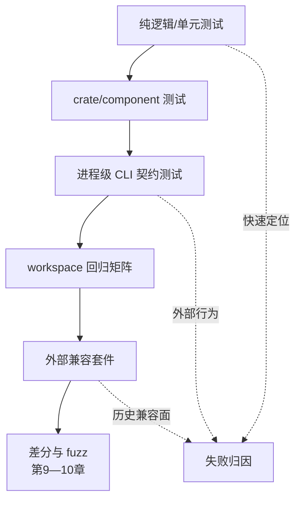

# 第 8 章：测试层次

> **定位**：本章把行为契约映射为多层动态证据。前置依赖是静态门禁与可观察行为矩阵；输出是一个从纯逻辑单元测试到外部兼容套件的验证组合，并明确每层失败和缺口的处理。

测试层次不是按目录命名的装饰性金字塔。它的真正作用是用不同观察强度拦截不同错误：纯函数测试容易穷尽输入，却看不到进程退出码；进程级测试能观察 stdout/stderr 与文件副作用，却可能很慢；外部兼容套件能捕捉长期积累的真实语义，却不一定精准对应当前架构。

uutils 论文把项目测试栈作为重要分析对象 [E1-TEST-STACK]。当前仓库文档列出 Cargo 测试、nextest 等执行方式，以及 GNU/BusyBox 外部测试套件的使用路径。[E2-TEST-COMMANDS] [E2-EXTERNAL-SUITES] 项目级规则强调变更要有测试证据，不把 AI 生成本身当作质量保证。[E2-NO-TEST-NO-MERGE]

<!-- source: DEVELOPMENT.md -->
<!-- source: AGENTS.md -->

## 五层动态验证

**第一层：纯逻辑与单元测试。** 适合参数归一化、数值转换、格式决策、路径分类与错误映射等无外部副作用逻辑。这一层应快速、确定、能使用表驱动或属性测试扩展输入。它不应为了追求覆盖率而大量 mock 文件系统，因为 mock 的行为可能正是迁移需要验证的对象。

**第二层：crate/component 测试。** 适合验证 utility 与共享核心的边界，包括错误类型、平台适配器和 feature 组合。测试目标应与原子变更对齐，使 Agent 能先运行最小相关集，再扩展到受影响的共享回归。

**第三层：进程级 CLI 契约测试。** 真正启动二进制，控制 cwd、环境变量、stdin 与临时文件系统，采集 stdout、stderr、退出码和执行后状态。它是第 3 章行为元组的直接机械化，也是发现「内部 `Result` 正确、进程退出错误」这类边界缺陷的关键层。

**第四层：workspace 回归矩阵。** 当共享核心、入口调度、依赖或平台适配变化时，只运行局部 utility 测试不足以覆盖影响面。workspace 矩阵应根据修改集选择受影响包、feature 与 target，并定期运行全量检查，防止影响分析本身遗漏。

**第五层：外部兼容套件。** 它们可以带来项目未曾显式想到的历史边界，并从外部使用者视角检查兼容性。但外部套件不是唯一规范：它可能对某个参考实现过度特化，可能假设特定 shell/平台，也可能包含已知不适用条目。项目必须对 skip、xfail 和本地适配保留理由。

## 测试设计从行为矩阵开始

功能测试常围绕「给定输入，获得期望输出」。迁移测试需要额外问四件事：失败通道是什么？可观察副作用是什么？平台或环境前提是什么？未被该测试覆盖的范围是什么？因此每个高风险场景应包含正常路径、无效输入、资源失败、部分完成和平台边界。

例如，对一个写文件的命令，不应只断言目标内容。还要在可适用时检查权限、所有权、时间戳、符号链接处理、目标已存在策略与中途失败后状态。对 stdout 文本，需要决定是字节精确、结构化解析后相等，还是忽略经确认的非确定字段。「大概一样」不是可执行契约；「删除所有变动字段」又容易让真正差异逃逸。

## 确定性、沙箱与失败注入

兼容测试需要管理时区、locale、umask、用户身份、时钟、文件系统类型和资源限制。如果测试默认继承开发机环境，它所描述的其实是偶然状态。建议由夹具显式设置环境，使用每测试独立临时目录，避免并行用例共享路径，并在失败时保留足够诊断。

资源失败很难仅靠普通输入触发。对内存分配、短写、磁盘耗尽、权限变化、信号和竞态窗口，需要故障注入、特定文件系统、隔离容器或定向并发夹具。故障注入应尽可能作用在稳定接缝，并同时保留少量真实系统端到端测试，防止候选实现只是与测试替身相容。

## 从局部测试到变更证据

一份原子变更通常先运行最小目标测试，这能快速提供反馈。但最终证据需要与影响面对齐：改动了共享错误映射，就应运行使用该映射的代表性 utility；改动了 multicall 调度，就应测试多种调用形式；改动了平台层，就应在对应 target 上取得证据。

变更证据不要只写「测试通过」。应写明命令、选择器、环境、通过/跳过/失败数、已知豁免与关键日志位置。如果因平台或时间限制没有执行某层，就标记「未验证」，并在发布准入中决定是否阻断。这种诚实的缺口比一份模糊全绿报告更安全。

## 如何处理外部套件失败

外部套件失败不应直接归因为「候选实现错了」，也不应立即加入 skip。先固定环境与输入，然后将结果分为：候选兼容缺陷；套件依赖了项目明确不承诺的扩展；参考实现的历史缺陷；环境或夹具问题；非确定失败。每个 skip/xfail 应绑定分类、证据、负责人和重评条件。

对外部套件的本地修改也需要特别谨慎。如果为了让候选通过而改宽断言，应能说明这是项目批准的兼容边界，不是隐藏差异。最好保留上游套件未修改结果与本地适配后结果，使审稿人能看见适配层实际过滤了什么。

## 测试数据也是产品代码

迁移项目的样本库、预期输出、文件系统夹具与归一化规则会直接决定哪些差异能被看见。它们不应被当作可随意重生成的附属文件。每个样本应有来源、适用平台、敏感信息状态和保留理由；每个归一化规则应说明它移除的非确定字段，并用一个负向测试证明真实语义差异仍会导致失败。

当 Agent 生成测试时，人类审稿人要问的不是「是否覆盖了新分支」，而是「这个断言能否在候选实现故意改错时失败」。可以用 mutation 思路做小规模核验：暂时改变退出码、交换 stdout/stderr、跳过一次副作用或改变错误顺序，确认测试真正拦截。这不要求全项目都使用自动变异测试，而是将「测试能失败」当作高风险断言的质量属性。

## 模式提炼

**分层证据而非测试总数**：单元、进程集成、外部套件和系统测试分别证明不同边界，并以契约条目连接。它适用于能为失败定位到责任层的系统；若所有层共享同一错误夹具或只汇报“测试数全绿”，相关性会制造虚假信心。

## 局限

测试总是样本，覆盖率不等于契约覆盖。高行覆盖可能从未检查输出语义，低行覆盖的端到端测试可能命中极高风险边界。外部套件也可能与当前平台、规范或项目目标不完全对齐。论文中的测试数量只属于论文基线，不应被当作当前仓库即时统计或质量分数。

测试维护负债本身也应进入发布准入评估，并有明确负责人。

## 实践清单

- [ ] 为行为矩阵的每个高风险条目选择最小有效测试层。
- [ ] 让进程级测试同时观察 stdout、stderr、退出码与执行后状态。
- [ ] 显式控制 cwd、locale、时区、umask、时钟和临时文件系统。
- [ ] 用故障注入补充普通输入无法稳定触发的失败路径。
- [ ] 对外部套件的 skip/xfail 记录原因、证据、负责人和重评条件。
- [ ] 在证据包中同时报告目标测试、影响回归、跳过项与未执行项。

## 本章证据

测试栈案例来自论文 [E1-TEST-STACK]，当前执行命令与外部套件说明来自仓库 [E2-TEST-COMMANDS] [E2-EXTERNAL-SUITES]，人类拥有测试证据的要求来自项目规则 [E2-NO-TEST-NO-MERGE]，多层验证顺序与证据组合属于本书的验证阶梯 [E4-VERIFICATION-LADDER]。

### 版本演化说明

论文基线为 **arXiv:2608.07135**；本地源码基线为 **d8bee62c1ddc227d5e4385d80bbf6d7dee266a41**；本章证据核验日期为 **2026-08-14**。论文的测试数量仅属于其测量时点；实际执行应以当前仓库命令、套件版本与目标环境为准。
