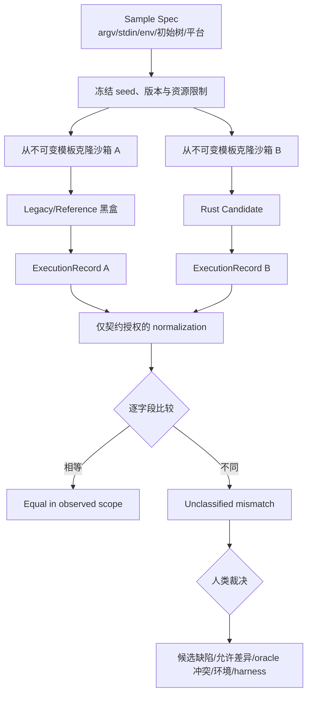

# 第 9 章：Differential Testing——让差异成为待裁决事实

> **定位**：本章把[第 3 章的七字段行为契约](../part1/ch03-behavior-contract.md)和[第 8 章的隔离测试](ch08-test-layers.md)编译成双路黑盒实验。前置条件是参考程序可依法受控执行、候选可在等价初态运行；输出是可重放的 Differential Run Record，而不是“与旧程序一样”的口号。读完后，读者应能决定比较哪些观察、哪些差异可归一化，以及何时必须暂停修复并交给人类裁决。

## 问题现场：两边都“成功”，目录却只剩一边正确

迁移团队为一个虚构的 `manifest-copy SRC DST` 命令写了差分脚本。脚本准备同一目录树，先执行参考程序，再清空 stdout，执行 Rust 候选，最后比较两边的 stdout 文本与退出码。某个样本中两边都返回 `0`，stdout 经 `trim()` 后完全相同，CI 把它计为兼容。

人工复查目录才发现：源树含一个带尾随空格的名称和一个符号链接。参考执行保留名称字节和链接，候选把名称末尾空格吞掉，并跟随链接复制了目标内容。更糟的是，两次执行共享同一可写目录；第二次运行看见了第一条命令创建的文件，初态已经不同。这个脚本同时犯了三个错误：观察面少了文件系统，文本归一化删掉了行为，双路运行没有隔离。

修复脚本后又出现相反风险。两边 stderr 都含沙箱绝对路径，团队用正则删除整行，差异清零；但候选把“权限拒绝”误报成“不存在”，同样被删掉。归一化从“消噪”变成了“删证据”。差分测试真正困难的部分不是启动两个程序，而是使**输入、初态、采集和裁决都可解释**。

论文把 differential fuzzing、grammar-guided 输入、覆盖引导和失败缩减列入 uutils 的兼容测试实践 [E1-DIFF-FUZZ]。固定源码基线中的 `uufuzz` 则给出一个更窄、更具体的工具形状：`CommandResult` 保存字符串形式的 stdout、stderr 和整数退出码，库提供候选运行、参考命令运行与比较函数。[E2-UUFUZZ-RUN] [E2-UUFUZZ-COMPARE] 二者不能混写：论文描述研究与项目实践，源码只能证明这个提交中库实际实现的接口。

<!-- source: fuzz/uufuzz/src/lib.rs -->
<!-- source: src/uucore/src/lib/mods/error.rs -->

## 心智模型：比较执行包，不把参考实现封为规范

差分测试（differential testing）对同一受控样本运行两个或多个实现，比较契约指定的外部观察。参考一侧可以是旧二进制、另一种独立实现、黄金结果或性质 oracle；候选一侧是正在验证的 Rust 实现。相等是一次实验结果，不是普遍正确性证明；不等是待分类事实，不自动表示候选错误。

对 CLI，样本不是单独的 argv，至少包括：

\[
Sample=(argv, stdin, env, cwd, initial\_state, platform, limits)
\]

结果也不是一个“返回值”，而是执行包：

\[
Observation=(stdout, stderr, termination, final\_state, timing)
\]

第 3 章已经规范输入、输出、终止、副作用、环境、平台和非确定性；本章不重定义这些字段，而是增加一次运行所需的标识、哈希和裁决状态。理想的执行记录优先保存 stdout/stderr 原始字节，区分正常退出、信号、超时与 harness 失败，保存执行前后状态快照，并绑定候选 commit、参考版本、比较器版本和沙箱镜像。

参考实现只是 oracle 候选，不是规范本身。它可能含历史 bug，可能依赖某个版本或平台，也可能展现项目决定不复制的危险行为。若标准、产品契约、多个独立实现和旧程序冲突，应进入 `OracleConflict`，由具名契约负责人裁决；比较器不得把“参考侧出现”直接改写成“目标必须实现”。这是 **E4-SEARCHER 的明确作者提炼**：Agent 可以搜索候选与聚类差异，行为授权仍属于人类控制面。[E4-SEARCHER]

差分结果采用五类，而非简单红绿：

| 类别 | 判定 | 下一动作 |
|---|---|---|
| `candidate_defect` | 契约与独立证据支持参考侧，候选偏离 | 最小化并固化回归，随后修复 |
| `allowed_difference` | 契约明确允许不同观察 | 添加窄规则与负控，不改候选 |
| `oracle_conflict` | 参考与规范、安全要求或其他实现冲突 | 暂停自动修复，交契约负责人 |
| `environment_noise` | 初态、locale、时钟、资源或排程不等价 | 修复夹具后重放 |
| `harness_defect` | 采集、解码、快照或比较器丢失信息 | 修 harness，重放受影响记录 |

未分类差异的合法状态是 `Unclassified`，不是 `Pass`。这个状态会在[第 12 章 Change Package](../part4/ch12-change-package.md)中成为明确未验证项，并在[第 13 章 DoD](../part4/ch13-definition-of-done.md)中阻断晋级。

## 固定提交走查：uufuzz 库真实提供什么

源码基线固定为 `d8bee62c1ddc227d5e4385d80bbf6d7dee266a41`。`fuzz/uufuzz/src/lib.rs:26-38` 的 `CommandResult` 只有三个公开字段：`stdout: String`、`stderr: String`、`exit_code: i32`。[E2-UUFUZZ-RUN] 它不包含 argv、环境、cwd、信号、超时或文件系统快照。书中后续的 `ExecutionRecord` 是 E4 扩展设计，不能说成 uufuzz 基线已有能力。

候选侧 `generate_and_run_uumain` 在 `62-135` 接收 `OsString` 参数、一个 `uumain` 函数和可选字符串 stdin，通过重定向文件描述符捕获输出；`137-155` 最后以 `String::from_utf8_lossy` 解码字节。stderr 在 `125-133` 先按第一个冒号切分，再 `trim()`。参考侧 `run_gnu_cmd` 在 `157-243` 启动外部命令、固定 `LC_ALL=C`，同样 lossy 解码，并对 stderr 做相似切分与裁剪。[E2-UUFUZZ-RUN]

这段走查支持四个精确结论。第一，库确实有双路执行的核心接口。第二，基线结果是字符串，不是无损字节容器。第三，参考侧显式固定了 `LC_ALL=C`，但这不等于所有环境变量、时区和文件系统条件都已隔离。第四，stderr 前缀裁剪是实现行为，不能自动升级为适合所有 utility 的兼容政策。

`compare_result` 位于 `246-323`。stdout 在 `271-279` 经双方 `trim()` 后比较，不同必然触发失败；stderr 在 `281-291` 同样比较，但是否触发失败由 `fail_on_stderr_diff` 决定；退出码在 `293-300` 精确比较并触发失败。[E2-UUFUZZ-COMPARE] 它没有文件系统比较，也没有按契约选择 stdout comparator 的结构化模式。调用者只能为 stderr 选择“差异是否失败”，而不能分别声明字节相等、语义类别、允许集合或路径映射。

还要把**库能力**与**具体 fuzz target 的能力**分开。固定提交的 `fuzz_echo.rs:20-65` 自己生成 `-n/-e/-E` 组合和随机字符串，再调用 uufuzz；`fuzz_sort.rs:19-57` 自己生成选项和输入行，调用比较器时在 `77-84` 选择不因 stderr 差异失败；`fuzz_date.rs:14-47` 直接用 LibFuzzer 提供的字节按 NUL 切 argv，并跳过会读 stdin 的组合，但它只运行候选 `uumain`，没有调用参考命令或 `compare_result`。因此不能写“uufuzz 库自动具备语法感知 date 差分能力”：生成策略、跳过策略和是否差分属于每个 target；库只提供可被复用的执行、随机工具和比较接口。

同一固定提交的 `src/uucore/src/lib/mods/error.rs:461-506` 展示了窄范围的 OS error 文本兼容处理。[E2-ERROR-COMPAT] 这说明项目可以在明确语义上做规范化，但不证明差分 harness 可以全局删掉诊断前缀。内部错误类型最终仍要落到进程可观察的通道、文本/字节和退出状态，比较政策必须绑定行为契约。

### 基线能力与生产扩展边界

| 观察/机制 | 固定 uufuzz 库 | 具体 target 可能增加 | 本书生产级扩展（E4） |
|---|---|---|---|
| 参数 | `OsString` 参数传入候选/参考 | target 生成选项、拆分 fuzz bytes | 样本 schema、语法覆盖、稳定 seed |
| stdin | 可选 `&str` | target 决定是否构造 | 原始字节、关闭/管道/文件等来源 |
| stdout/stderr | lossy `String`，比较前 `trim()` | target 选择 stderr 是否致命 | 原始字节、字段 comparator、负控 |
| 终止 | 整数退出码；信号映射可落为 `-1` | target 无统一扩展 | code/signal/timeout/harness error 分型 |
| 文件系统 | 未采集 | target 可自行创建文件 | 双沙箱 before/after 结构化快照 |
| 生成 | 随机字符串/临时文件辅助函数 | 每 target 定义 grammar/state | 可版本化 grammar、状态模型与覆盖账本 |
| 裁决 | 不等则报告/可能 panic | target 决定调用方式 | 五类分类、负责人、allowlist 生命周期 |

这个表是本章最重要的事实防线：使用一个真实库做证据锚点，不代表可以把理想 harness 的所有能力归给它。

## 受控双路流程：相同不是碰巧，差异可以重放



流程先冻结样本，再从同一不可变模板克隆两个沙箱。参考与候选不能先后使用同一可写目录，也不能共享输出文件、锁、缓存或随机状态。对会改外部系统的命令，应使用容器、虚拟机、文件系统镜像或专用仿真；无法安全复制的真实状态不应为了追求差分覆盖而双跑。

采集顺序同样重要。开始前记录 runner、内核、文件系统、uid/gid、umask、locale、时区、cwd 和环境白名单；运行时限制 CPU、内存、进程数、持续时间和输出大小；结束后先保存原始输出与终止状态，再计算文件树快照。若候选超时，记录 `candidate_timeout`，不要把 harness 强杀产生的退出码与参考正常退出码直接比较。

文件系统快照按风险选择字段。只读命令可验证无意外写入；复制类命令通常比较路径原生表示、节点类型、内容摘要、链接目标、权限和残留临时文件；所有权、时间戳、扩展属性、稀疏区间与 ACL 只有在契约要求且 runner 支持时纳入。未采集字段写 `not_observed`，不能默认为相等。

### 归一化政策：映射已知变量，不删除未知信息

归一化（normalization）是把契约允许变化的表示映射到可比较形式。每条规则至少要有：稳定 ID、适用字段、契约引用、变换、正样本、负控、负责人、期限和版本。没有契约依据的变换不得进入全局默认。

优先使用窄映射。例如，错误中仅沙箱根不同，可把已知前缀 `/tmp/run-a-123` 和 `/tmp/run-b-456` 映射为 `<ROOT>`，保留后面的原生路径和错误类别；输出允许任意顺序时，解析为保留重复计数的字节多重集合，而不是 `sort -u`；时间只允许落在范围时，比较字段与容差，不删除所有数字。

负控要主动证明规则没有吞掉语义。对 `<ROOT>` 映射，构造一个错误类别不同但路径同构的候选，比较必须失败；对多重集合，删掉一条重复记录必须失败；对时间容差，超过边界必须失败。若某规则无法写出有意义的负控，它通常太宽或契约尚未成熟。

允许差异（allowlist）也不是永久垃圾桶。记录必须包含最小样本指纹、字段、参考/候选观察、裁决理由、适用版本/平台、批准人、到期或重评触发器。比较器只能命中精确条件；“忽略全部 stderr”不是 allowlist，而是撤掉一个观察通道。

## 完整工程案例

团队要迁移虚构命令 `manifest-copy SRC DST` 的 `BC-MANIFEST-007` 契约，目标是复制静态目录树并用 NUL 分隔的原始路径记录报告已提交文件。初始失败来自一个 Unix 名称 `report-\xFF.csv`、一个带尾随空格名称和一个断链。平台限定 Linux 本地文件系统；并发修改、网络文件系统与断电不在当前结论内。

**第一轮：建立样本和负控。** 测试负责人把源树写成可寻址 fixture，保存路径字节十六进制、节点类型、内容摘要和 mode。两边从同一只读模板克隆，argv、`LC_ALL=C`、`TZ=UTC0`、umask 和资源限制固定。先运行一个故意把路径做 lossy UTF-8 的负控候选，确认比较器能看见 `\xFF` 身份碰撞；再运行一个跟随断链的负控，确认 after snapshot 会失败。

**第二轮：发现三个差异。** Rust 候选 stdout 少一条尾随空格记录，退出码同为 `0`；断链节点被复制成空普通文件；stderr 为空。原 uufuzz 形状若用字符串和 `trim()`，第一项可能消失，且没有文件快照发现第二项。扩展记录把它们拆为 `DIFF-OUT-01` 与 `DIFF-FS-02`，均处于 `Unclassified`。

**第三轮：裁决而非模仿。** 契约负责人确认路径字节与链接类型属于强契约，两个差异都是 `candidate_defect`。同时发现参考 stderr 在另一个失败样本中包含绝对沙箱路径；安全负责人决定候选只输出相对路径。该差异分类为 `allowed_difference`，规则 `NORM-ROOT-01` 只替换两个已登记根前缀，并加入“权限错误不能变不存在”的负控。

**第四轮：最小化与修复。** 路径差异缩减为单文件 `x<space>`，链接差异缩减为一个断链。第 10 章的生命周期将在这里继续：先把两个最小样本固化为具名 Rust 回归，再修改候选的路径记录和复制分支。修复没有触及通用输出框架，避免把局部行为变成共享风险。

**第五轮：复验与有限结论。** 两个最小用例 red/green 成立，原始复合样本重放相等，相关进程测试通过。记录的结论是：“在 `BC-MANIFEST-007` 指定的 Linux、本地文件系统、静态树和已采集字段内，候选与裁决后的允许集合一致。”Windows 原生路径、网络文件系统、并发树和断电仍是 `not_observed`，进入风险账本。团队没有写“完全兼容”。

这个案例从输入、契约、失败、诊断、裁决、修复到验证闭合；同时展示了参考 bug/安全差异不被自动复制。它生成 `DRR-MANIFEST-007`、两个最小 seed、两个回归 ID、一个归一化规则和四项明确未知，为第 10、12、13 章提供同一证据链。

## 反例

反例一是**单沙箱顺序执行**。有人认为每次都删除 `DST` 就足够，但命令还可能改变父目录 mode、缓存、锁文件、挂载状态或外部服务；清理脚本本身又可能遗漏。只要初态不可证明等价，相等与差异都难以解释。替代方案是从同一模板克隆，或把无法复制的状态明确排除并使用其他验证机制。

反例二是**参考即真理**。旧程序对畸形路径泄露工作目录，候选做了安全修复。若 compare_result 只要求字节相等，Agent 会被驱动去恢复泄露。正确做法是 `oracle_conflict`：引用安全/产品裁决，添加“不泄露绝对路径”的负向测试，并让 allowlist 精确记录这项有意差异。

反例三是**零差异率 KPI**。团队为了图表好看逐渐添加 `trim`、忽略 stderr、删除时间与数字、跳过难运行平台，差异率确实下降，但观察面同步萎缩。差分系统应同时报告采集字段、归一化命中、skip、Unclassified、平台与负控健康；没有这些分母，零差异没有意义。

反例四是把某个 target 的策略归给库。`fuzz_date` 过滤 UTF-8 参数并避免 stdin 挂起，只运行候选；`fuzz_sort` 自己生成选项/行并做差分。说“uufuzz 对 date 和 sort 都做同样的语法感知差分”会把目标差异抹掉，也会误导读者对覆盖面的判断。

## 模式提炼

**模式一：双沙箱执行包。** 问题是两次运行初态与观察面不可比；机制是从同一不可变模板克隆、逐字段采集并固定工具版本。前提是状态可隔离或仿真；失效边界是共享外部服务、竞态中间态和未采集元数据。无法隔离时改用记录重放、性质测试或受控 canary，不伪造双路等价。

**模式二：契约授权的窄归一化。** 问题是环境变量制造噪声；机制是带契约 ID、负控和期限的字段映射。前提是允许差异可被结构化表达；失效边界是未知字段和跨 utility 的宽规则。替代方案是修环境、改采集或把差异交人工分类。

**模式三：oracle 冲突闸门。** 问题是参考实现 bug 会被自动复制；机制是将不等先置为 Unclassified，再由独立证据和具名负责人裁决。前提是团队拥有行为决策权；失效边界是没有规范、没有负责人或安全材料受限。此时应阻断，不用多数实现投票伪装确定性。

**模式四：观察范围随结论同行。** 问题是有限实验被写成普遍兼容；机制是在每个 Pass 上绑定样本、平台、字段与 normalization 版本。前提是记录可寻址；失效边界是日志过期或 runner 不可重建。替代方案是降级结论并补保存策略。

## 可复用工件

下面的 **Differential Run Record** 是 E4 工件，不是 uutils 仓库现行格式；可复制到差分平台或 Change Package。它故意把机器观测、机器判定和人类裁决分开。

```yaml
schema: differential-run/v1
run_id: DRR-MANIFEST-007
contract: BC-MANIFEST-007@v4
source_baseline: d8bee62c1ddc227d5e4385d80bbf6d7dee266a41
sample:
  seed_id: SEED-MANIFEST-007-COMPOSITE
  argv_hex: [6d616e69666573742d636f7079, "535243", "445354"]
  stdin: {kind: closed, sha256: null}
  env: {LC_ALL: C, TZ: UTC0}
  cwd: /sandbox/work
  initial_snapshot: sha256:fixture-tree
  platform: {os: linux, arch: x86_64, fs: ext4, uid: nonroot, umask: "022"}
  limits: {wall_ms: 2000, output_bytes: 1048576, processes: 8}
implementations:
  reference: {id: legacy-9.x, artifact_sha256: refhash, sandbox: A}
  candidate: {commit: abcdef0, artifact_sha256: rusthash, sandbox: B}
capture:
  fields: [stdout_bytes, stderr_bytes, termination, filesystem_snapshot]
  not_observed: [acl, xattrs, sparse_extents, crash_durability]
  collector_version: exec-record/v3
normalization:
  - {id: NORM-ROOT-01, contract_rule: DIAG-PATH-RELATIVE, negative_control: NC-DIAG-KIND-01}
comparison:
  stdout: {comparator: bytes_multiset_nul_records, verdict: pass}
  stderr: {comparator: diag_path, verdict: pass}
  termination: {comparator: exact_code, verdict: pass}
  filesystem: {comparator: tree_v2, verdict: pass}
machine_state: compared_equal
human_classification: allowed_difference
decision_owner: compatibility-owner
decision_reason: contract fields equal after approved root mapping
limitations: [windows_path, network_fs, concurrent_tree, power_loss]
artifacts: [raw-a, raw-b, before-a, after-a, before-b, after-b, diff-json]
```

机器只可写 `machine_state`（如 `compared_equal`、`mismatch`、`harness_error`）；`human_classification` 只能由授权流程写入 `candidate_defect`、`allowed_difference`、`oracle_conflict`、`environment_noise` 或 `harness_defect`。若两者矛盾，记录保持不闭合，不让 Agent 自动选择最有利状态。

## AI Coding 工作台

工作台给 Agent 的输入应包含：行为契约版本、允许的参考执行入口、禁止读取的实现来源、两个沙箱模板、样本 seed、采集 schema、允许 normalization ID、目标路径和停止条件。Agent 的任务可以是“实现采集器”“最小化 `DIFF-FS-02`”或“修候选局部路径分支”，不能是“让差异率变成零”。

提示骨架可以写成：

```text
任务：处理 DRR-MANIFEST-007 中已裁决的 candidate_defect DIFF-FS-02。
可读：BC-MANIFEST-007、DRR 原始工件、候选 Rust 路径、项目测试与规则。
禁止：参考实现源码、未批准外部来源、修改全局 normalization。
允许修改：目标 utility 与对应 Rust 回归测试。
必须先做：证明最小 seed 在候选基线上失败；保留 before/after 快照。
停止：需要共享接口、差异分类改变、seed 不稳定或观察字段缺失。
交付：最小 diff、red/green receipt、相关回归、局限和回退影响。
```

Agent 可以聚类输出、建议最小化顺序、生成结构化 diff 和检查 schema 引用；不能裁决 oracle、扩大 allowlist、把未采集字段记为相等，或在同一任务中降低比较器。若生成器、harness 与候选同时变化，应拆成可独立审查的包，否则差异消失无法归因。

## 能证明什么／不能证明什么

| 能证明什么 | 不能证明什么 |
|---|---|
| 固定 uufuzz 基线有字符串 stdout/stderr、整数退出码、候选/参考运行与比较接口。[E2-UUFUZZ-RUN] [E2-UUFUZZ-COMPARE] | 它无损保存任意字节、隔离所有环境、采集信号/超时/文件系统，或自动裁决差异。 |
| 一份完整 DRR 可证明指定候选、参考、样本、runner、采集字段和 comparator 的一次结果。 | 未生成输入、未采集字段、其他平台、并发时序和生产负载均兼容。 |
| 负控通过可证明某条 normalization 对已构造的语义差异仍敏感。 | 该规则不会隐藏所有未知差异，或适合别的 utility。 |
| oracle 冲突记录可证明团队看见并作出了具名裁决。 | 参考实现、产品决定或多数投票天然正确。 |
| 文件树快照相等可证明快照 schema 覆盖字段的前后结果一致。 | 执行中间态、断电持久性、未采集 ACL/xattr 或外部系统副作用一致。 |

## 局限

差分测试受 oracle、生成器、隔离、采集与预算共同限制。两个实现可能共享同一误解而相等；参考程序可能拒绝某平台；真实权限、文件系统、信号和并发难以在普通 CI 高保真复现。差分还能发现性能异常，但短时延测量受缓存与调度影响，不应与行为等价混成一个布尔门禁。

大规模保存原始执行包可能含路径、命令参数和用户数据，必须做最小采集、脱敏、访问控制和保留期。脱敏规则本身也可能改变可重放性，应保存可审计变换和受限原件索引。结论只能覆盖明确的观察范围，无法由“运行次数很多”升级为形式化证明。

还要警惕 harness 成为新的单点。它若与候选共享解析器、路径库或 normalization 代码，两边可能以同一种方式丢失字节，形成相关性假阴性。高风险字段可以增加一条独立的离线检查器，用不同实现解析已保存的原始工件；采集 schema 升版时，用历史记录回放新旧比较器并列出判定变化。比较器变更本身应作为独立 Change Package 审查，不能与正在消除的候选差异混在一次提交中，否则团队无法判断绿色来自修复行为还是改变尺子。

## 实践清单

- [ ] 为每个样本冻结 argv、stdin、env、cwd、初态、平台、限制和 seed。
- [ ] 从同一不可变模板克隆两个沙箱，避免共享可写状态。
- [ ] 按契约采集原始输出、终止与副作用；未采集字段标 `not_observed`。
- [ ] 每条 normalization/allowlist 绑定契约、负控、负责人和期限。
- [ ] 不等先进入 Unclassified；oracle 冲突不得由 Agent 自动修复。
- [ ] 区分 uufuzz 库、各 fuzz target 和本书扩展的能力边界。
- [ ] 让结论携带 commit、runner、样本、字段、比较器版本和局限。

## 练习

- **练习一：设计验证。** 为一个会创建文件的虚构命令设计双沙箱 fixture，列出 before/after 至少六个字段、两个故障注入点和一个能证明快照比较器有效的负控；说明哪些生产副作用仍不可观察。
- **练习二：审计归一化。** 给定“删除 stderr 中全部数字”的规则，构造 PID、权限 mode、文件大小和退出码四类样本，将它拆成最小字段映射；任何无法写负控的规则必须删除或返回契约评审。
- **练习三：裁决冲突。** 设计三个独立 oracle 对同一畸形输入给出不同结果的桌面演练，写出 `oracle_conflict` 记录、需要的规范/安全证据、决策角色和在裁决前允许执行的 Agent 子任务。

## 本章证据

论文的差分 fuzz、生成与缩减背景来自 [E1-DIFF-FUZZ]；固定提交中执行、结果字段和环境处理来自 [E2-UUFUZZ-RUN]，stdout/stderr/退出码比较来自 [E2-UUFUZZ-COMPARE]，窄 OS error 文本兼容处理来自 [E2-ERROR-COMPAT]。双沙箱执行包、五类裁决、DRR schema 和工作台属于 E4 作者综合 [E4-SEARCHER]，并非 uufuzz 现有功能声明。

### 版本演化说明

论文基线为 **arXiv:2608.07135**；源码事实固定在 **d8bee62c1ddc227d5e4385d80bbf6d7dee266a41**，仓库描述版本为 `0.10.0-120-gd8bee62c1`；本章核验截止日为 **2026-08-14**。后续复用必须重新核验 `CommandResult`、执行函数、比较策略和每个 fuzz target；本章所有“生产级扩展”均明示为 E4，不应随库演化被倒写成基线事实。
