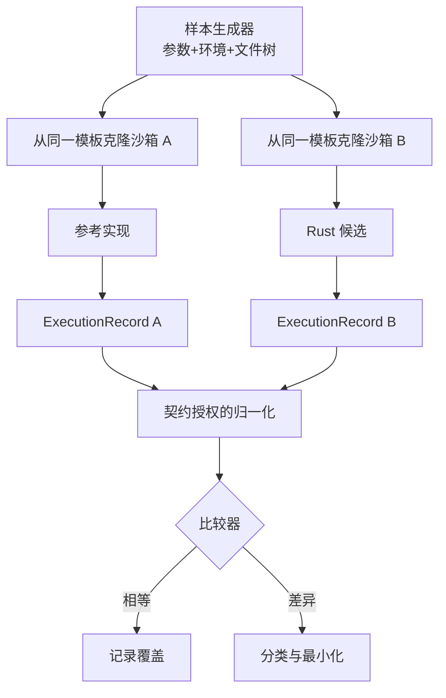

# 第 9 章：Differential Testing

> **定位**：本章将参考程序与 Rust 候选放入受控黑盒比较。前置依赖是行为契约、多层测试和 clean-room 许可；输出是一个同时捕获 stdout、stderr、退出码和文件系统副作用，并能分类差异的比较器。

当一个旧系统已经在大量环境中运行，人工编写的功能测试很难快速覆盖它积累的边界。Differential testing 提供了一个高杠杆方法：对同一组输入与初始状态，分别执行参考实现和 Rust 候选，再比较可观察结果。它尤其适合 CLI 工具，因为参数、环境、输入字节、进程输出和文件系统状态都能被记录。

uutils 论文将差分 fuzz 视为重要的兼容性技术 [E1-DIFF-FUZZ]。当前 `uufuzz` 源码中，命令执行结果包含 stdout、stderr 与退出状态，参考命令和候选命令被执行后进入比较逻辑。[E2-UUFUZZ-RUN] [E2-UUFUZZ-COMPARE] 这提供了基本执行与比较形状，但基线将输出经 lossy UTF-8 保存并在比较前 `trim()`，还会处理 stderr 前缀；stderr 是否导致失败可配置，且没有采集文件系统副作用。下面的原始字节、信号、资源限制和前后快照是本书提出的生产级扩展，不是对基线 `uufuzz` 已有能力的描述。

<!-- source: fuzz/uufuzz/src/lib.rs -->

## 比较的不是「返回值」，而是执行包

对 CLI 程序，一次执行应产生一个结构化执行包：

```text
ExecutionRecord {
  argv, stdin, env, cwd, platform,
  stdout_bytes, stderr_bytes, exit_status, signal,
  before_snapshot, after_snapshot,
  duration, timeout, resource_limits
}
```

`stdout_bytes` 与 `stderr_bytes` 应优先保留原始字节，而不是过早强制为 UTF-8；类 Unix 系统的路径和输出可能包含任意字节。`exit_status` 应区分正常退出码与信号终止。文件系统快照应至少包括相对路径、类型、内容摘要、权限和链接目标；根据契约增加所有权、时间戳、稀疏区间或扩展属性。

Rust 内部错误类型不是差分比较对象，外部错误语义才是。这与 `uucore` 将内部 utility 结果桥接到进程退出状态的模式一致。[E2-ERROR-MODEL] [E2-ERROR-COMPAT] 候选可以使用更精细的 Rust 枚举，只要它在进程边界产生契约允许的 stderr、退出码与副作用。

## 受控执行拓扑



参考与候选不应在同一可写沙箱中依次运行，因为第一个进程的副作用会改变第二个进程的初始状态。正确做法是从同一份不可变模板创建两个隔离沙箱，分别执行并采集快照。时钟、随机源、locale、时区、umask、用户与资源限制应尽量一致；无法固定的部分在归一化政策中明示处理。

执行参考实现必须符合第 4 章的上下文边界：允许执行黑盒不等于允许读取实现文件。沙箱可只暴露参考二进制的执行能力和受控工作目录，不暴露其他文件。如果命令可能修改系统资源，应使用容器、虚拟机或专用隔离账户，并设置 CPU、内存、进程数、输出大小与时间限制。

## 归一化必须由契约授权

实际比较中会出现 PID、临时路径、时间戳、排序、locale 文本和平台错误信息等变量。最快的「修复」是把它们全部删掉，但这会同时删掉真实兼容性差异。因此每条 normalization 规则都要回答：哪个契约允许该字段变化？规则是删除、映射还是结构化比较？有没有负向样本证明其他差异仍会失败？

优先使用结构化比较而非正则删除。例如，对包含临时目录的错误，可以先将已知沙箱根映射为 `<ROOT>`，保留剩余文本；对允许任意顺序的输出，先解析为条目集合，同时保留重复计数和字节内容。一个「忽略所有数字」的规则几乎总是过宽，因为退出码、文件大小、权限和计数往往就是契约。

## 差异分类先于修复

比较器发现不等时，不应直接将参考输出复制到候选。先将差异归入如下类别：

| 类别 | 判定要点 | 后续动作 |
|---|---|---|
| 候选缺陷 | 参考行为符合规范/项目契约，候选偏离 | 固定反例，最小修复 |
| 允许差异 | 项目已明示决定不复制该现象 | 更新契约与精确 normalization/allowlist |
| 参考缺陷 | 规范、安全要求或项目决定要求不同行为 | 保留候选行为，加入负向差分用例和理由 |
| 环境噪声 | 差异来自时钟、locale、资源、排程或夹具 | 修复可复现性，不改生产语义 |
| 比较器缺陷 | 观察采集、快照或归一化错误 | 先修比较器并重放样本 |

分类是人类所有权最密集的地方。Agent 可以聚类相似失败、生成最小化假设和找出规范条目，但「这个参考行为是否应成为我们的契约」是产品、安全和兼容性决策。未分类差异不应被计为通过，也不应无限期留在「已知问题」中而没有负责人。

## 从示例到搜索策略

差分测试的价值取决于输入空间。只重放手写正常用例，它与集成测试的增量有限。样本生成应组合：真实命令轨迹（经脱敏），选项语法模型，文件系统状态模板，已知边界样本，以及后续 fuzz 生成。高风险选项组合应获得更多预算，而不是对所有字符串均匀随机。

覆盖指标不只记录样本数。还应记录命中的选项/选项组合、初始状态类别、失败通道、平台、执行超时与差异类别。一百万个在同一主路径上相等的样本，不应比一个发现数据丢失边界的样本更有说服力。

## 模式提炼

**双沙箱执行包比较**：从同一不可变模板分别运行参考与候选，比较契约授权的观测并先分类差异。它适用于参考程序可受控执行的迁移；若两者共享可写状态、归一化没有契约依据，或未采集关键副作用，相等结果不具有兼容证明力。

## 局限

参考实现不是绝对 oracle，它可能包含缺陷、平台特性或项目决定不保留的历史行为。黑盒比较也受可观察性限制：如果快照没有采集某个扩展属性或竞态中间状态，字节输出相等不能证明它们一致。大规模差分运行还有计算、沙箱与样本保留成本，需要按风险分配预算。

性能差异也必须谨慎解读：短测量易受缓存、调度和冷启动影响，它可以作为退化筛查信号，却不应与行为比较混成一个布尔结果。

最终结论必须保留测量不确定性。

## 实践清单

- [ ] 将 argv、stdin、env、cwd、平台与资源限制作为样本一部分。
- [ ] 分别在从同一模板克隆的沙箱中执行参考和候选。
- [ ] 同时比较 stdout/stderr 原始字节、退出/信号状态与副作用快照。
- [ ] 为每条归一化规则绑定契约条目和负向测试。
- [ ] 在修代码前将差异分为候选缺陷、允许差异、参考缺陷、环境或比较器问题。
- [ ] 用行为类别、平台与差异类别衡量覆盖，不只计数样本。

## 本章证据

差分 fuzz 的案例背景来自论文 [E1-DIFF-FUZZ]；命令执行与 stdout/stderr/退出状态比较来自 `uufuzz` 源码 [E2-UUFUZZ-RUN] [E2-UUFUZZ-COMPARE]；内部错误到外部行为的桥接来自 `uucore` [E2-ERROR-MODEL] [E2-ERROR-COMPAT]。差异分类、沙箱快照与归一化治理是本书对证据闭环的综合 [E4-DISCOVER-LOOP]。

### 版本演化说明

论文基线为 **arXiv:2608.07135**；本地源码基线为 **d8bee62c1ddc227d5e4385d80bbf6d7dee266a41**；本章证据核验日期为 **2026-08-14**。`uufuzz` 的具体类型与比较器可在后续 commit 演化；本章所依赖的是基线中可核验的执行与比较形状，不假定其实现永久不变。
