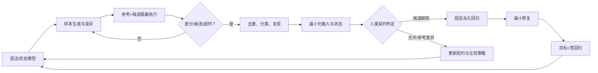

# 第 10 章：Fuzz、最小化与永久回归

> **定位**：本章将第 9 章的差分比较扩展为持续发现系统。前置依赖是受控执行包、差异分类与可复现沙箱；输出是一条将 fuzz 失败最小化、审核、固定为永久回归并回流到生成器的闭环。

Fuzz 常被误解为「给程序随机字节，看它会不会崩溃」。崩溃寻找很有价值，但兼容性迁移的关键问题往往不会崩溃：程序正常退出，却输出了不同字节；两者都失败，却返回不同退出码；候选留下了参考未留下的部分文件。Differential fuzzing 将「与契约授权的参考行为不同」当作 oracle，从而把搜索范围扩展到语义偏差。[E1-DIFF-FUZZ]

uutils 当前 `uufuzz` 始终用 stdout 和退出码差异判定失败；stderr 差异会报告，并可按调用配置为失败条件，为这类流程提供了具体案例。[E2-UUFUZZ-COMPARE] 仓库的兼容开发流程强调先添加能复现问题的测试，再实现修复，项目级规则则要求 AI 生成代码没有测试不应合并。[E2-COMPAT-WORKFLOW] [E2-NO-TEST-NO-MERGE] 因此 fuzz 只有进入永久回归时，才从一次发现变成项目知识。

<!-- source: fuzz/uufuzz/src/lib.rs -->
<!-- source: CONTRIBUTING.md -->
<!-- source: AGENTS.md -->

## 发现闭环

这条链中，「最小化」必须发生在「固定永久回归」之前。原始 fuzz 样本可能包含数十个选项、庞大文件树与大量无关字节。直接把它保存为测试，会让未来审稿者无法看出契约，还会使测试对无关变化脆弱。最小样本将失败压缩为一个可解释假设，它既是测试，也是行为文档。

## 生成器要理解语法和状态

纯随机字节对解析器很有效，却可能长期停留在「无效参数」的浅层路径。对 CLI 兼容性，生成器应了解：哪些是 flag，哪些选项携带值，哪些可以重复，哪些组合互斥，哪些操作数需要对应的文件树。语法生成能将更多样本送入深层语义，随机变异则可在有效结构周围发现边界。

状态生成同样重要。路径操作数需覆盖空字符串；可创建文件名覆盖长名称、换行、前导短横线，以及在 Unix 等适用平台上的非 UTF-8 字节。节点需覆盖普通文件、目录、符号链接、断链、稀疏文件与特殊文件（在隔离环境且适用时）；权限与所有权要产生可读、不可读、可写、不可写等状态。状态模型必须保证沙箱不逃逸，危险操作默认在虚拟机/容器中运行。

生成器还应使用历史反例作为种子。当某个错误涉及「目标是符号链接且父目录不可写」，修复后不只保留这个精确样本，还应让生成器在其邻域变异：不同链接深度、相对/绝对目标、权限变体和选项组合。这使一个事故的知识扩展为一个持续搜索区域。

## 最小化不只是删字节

对状态化 CLI，最小化需要分层进行：

1. **命令层**：删除无关选项、操作数和环境变量，缩短参数值。
2. **文件树层**：删除无关节点、缩小内容、简化权限与链接结构。
3. **环境层**：移除无关 locale、时区、umask 或资源限制。
4. **观察层**：确认差异的最小外部表现，例如仅退出码不同，还是同时有副作用差异。

每次缩减都必须在新克隆沙箱中重放，确认同一差异仍然存在。对竞态和超时，一次成功重放不足以证明；需要多次运行、固定调度点或专门并发夹具。最小化工具应保留原始样本链接，以免缩减错误后无法回看起点。

## 永久回归的完整形状

一个回归不应只是一串 fuzz 字节。它应包含：稳定 ID；最小化 argv/stdin/env；初始文件树；目标平台与所需能力；期望 stdout/stderr/退出与副作用；原始差异分类；对应行为契约；修复变更 ID；以及归一化规则。测试名称应表达契约，而不是 `fuzz_case_18472`。

回归需要在修复前先失败，在修复后通过。这个 red/green 证据防止一个常见问题：样本在最小化或转写为测试时已不再命中原缺陷，却因为与修复一起提交而一直是绿色。对 Agent 产出，门禁可要求变更包保留修复前失败日志或将测试和修复分为可独立审查的两步。

## 去重、语料库和预算

长期 fuzz 会产生大量相似失败。去重键不应只用完整输出哈希，因为时间戳或路径会把同一问题拆成多份。可组合退出类别、诊断结构、文件快照差异类型、栈/覆盖特征（如果可用）与归一化后输入来聚类。人类最终仍需确认两个症状是同一根因还是共享外部表现。

语料库要有生命周期。最小永久回归进入版本库；大型原始样本进入可寻址存储，并有保留时间；含敏感轨迹的输入要脱敏和限权；已被新的更小样本完全覆盖的旧样本可归档。运行预算按风险与新鲜度分配：高风险 utility、最近修改模块和历史差异邻域获得更多资源，同时保留一部分全局探索防止视野过窄。

## 安全发现与普通兼容差异分流

Fuzz 可能发现崩溃、越界资源消耗、路径逃逸、竞态破坏或其他安全敏感问题。这些样本不应与普通 stderr 格式差异进入同一公开队列。流水线应根据失败信号和受影响资源进行初步分流，将可疑安全发现送入受限制的响应流程，保留原始样本和环境，避免无审查披露。

初步分流不等于自动定性。Agent 可以帮助重放、寻找受影响版本和最小化，但安全影响、披露范围与修复发布节奏应由指定人类负责人决定。安全样本转为永久回归时，还要检查是否含有利用细节或敏感数据，必要时将公开回归与受限再现夹具分开。

对已修复安全发现，流程不应只证明崩溃消失。还要检查修复是否改变正常兼容行为，是否将风险转化为资源耗尽或永久拒绝服务，以及相邻输入是否仍存在同根因。这再次说明，fuzz 发现只是闭环起点，而不是修复完成的证明。

## 模式提炼

**发现—最小化—固化闭环**：把一次 fuzz 差异缩成可解释反例，先固定 red/green 回归，再修复并回流生成器。它要求失败可重放且有人类裁决契约；若只保存庞大 seed、跳过差异分类或丢弃原始样本，发现不会成为可靠项目知识。

## 局限

Fuzz 无法证明没有其他缺陷，其效果强烈依赖生成器、oracle、可观察性与运行预算。差分 fuzz 还会继承参考实现的缺陷和非确定性。一些竞态、资源耗尽与内核/文件系统特性需要专用环境，无法在普通 CI 中高保真重现。最小化也可能把一个多因素问题压缩成只触发其中一个，所以原始样本与分类记录不能立即丢弃。

此外，语料管理和敏感样本处理需要长期人力，不能只把 fuzz 当作无人值守的计算任务。

## 实践清单

- [ ] 结合语法生成、状态生成、真实脱敏轨迹与历史反例，不只投喂随机字节。
- [ ] 将崩溃、超时、stdout/stderr/退出差异和副作用差异都作为发现。
- [ ] 按命令、文件树、环境与观察分层最小化，每步在新沙箱重放。
- [ ] 在固定永久回归前完成差异分类和最小化。
- [ ] 保留回归的修复前失败与修复后通过证据。
- [ ] 将永久样本回流为生成器种子与风险邻域，定期管理语料库。

## 本章证据

差分 fuzz 案例来自论文 [E1-DIFF-FUZZ]，stdout/stderr/退出比较来自当前 `uufuzz` [E2-UUFUZZ-COMPARE]，先测试后修复与 AI 变更的测试所有权来自仓库规则 [E2-COMPAT-WORKFLOW] [E2-NO-TEST-NO-MERGE]。从失败到最小永久回归的闭环是本书的发现循环综合 [E4-DISCOVER-LOOP]。

### 版本演化说明

论文基线为 **arXiv:2608.07135**；本地源码基线为 **d8bee62c1ddc227d5e4385d80bbf6d7dee266a41**；本章证据核验日期为 **2026-08-14**。fuzz 语料、生成器和比较器会随新反例演化；永久回归的价值正在于将过去基线中的一次失败转换为未来版本的持续契约。
