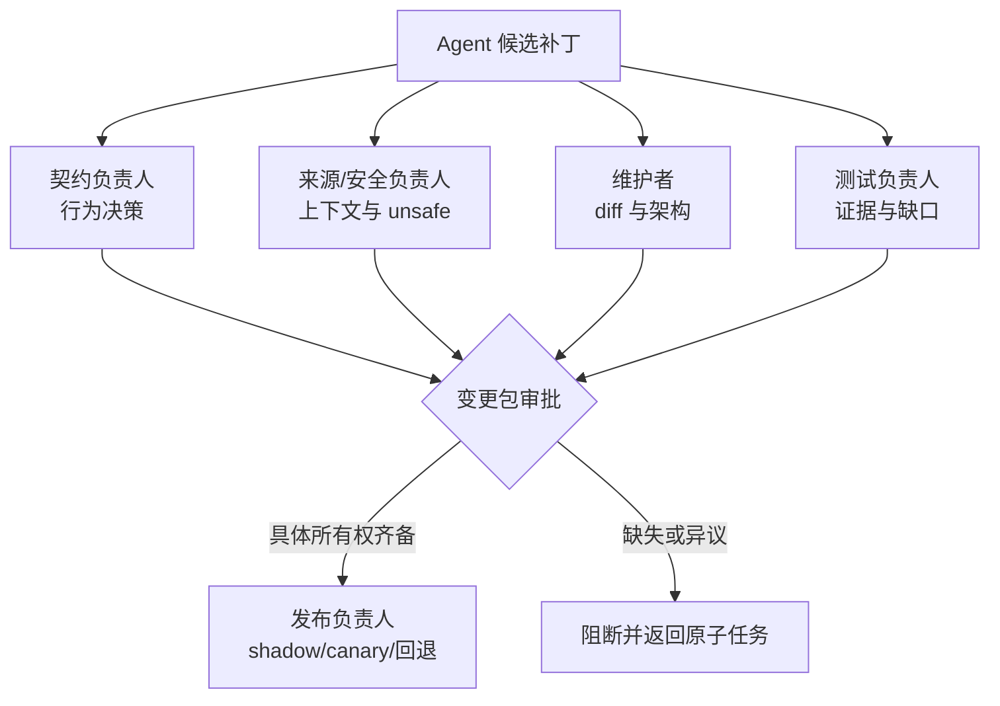

# 第 11 章：Human Owns the Change

> **定位**：本章定义 AI Coding 迁移中不可委托的人类所有权。前置依赖是原子补丁、多层门禁和反例回归；输出是一个将契约、来源、代码、测试、豁免与发布决策分配给具体负责人的责任模型。

「人类在回路中」很容易沦为形式：AI 生成整个变更，机械门禁通过，某个人点击合并。如果点击者不能说明修改了什么行为、依据哪些证据、还有什么未验证，这只是人类出现在流程中，不是人类拥有变更。

uutils 的两份规则合起来给出这条边界：`AGENTS.md` 要求驱动 Agent 的人对输出负责、提交前阅读 diff，并由人类回应审稿；`CONTRIBUTING.md` 的 AI policy 要求贡献者理解、解释和证明修改，同时保持变更小而聚焦、关注来源与许可风险。行为变化和 bug fix 还必须带测试。[E2-AI-OWNERSHIP] [E2-AI-POLICY] [E2-NO-TEST-NO-MERGE] 这些是核验时的当前仓库规则，不应倒灌为论文测量得出的 AI 工程结论。

<!-- source: AGENTS.md -->
<!-- source: CONTRIBUTING.md -->

## 五种不可委托的所有权

1. **契约所有权**：决定哪些历史行为必须保留，哪些差异可以被接受，哪些安全改进应有意打破兼容。
2. **来源与权限所有权**：批准 Agent 可读上下文，判断许可和 clean-room 风险，处理边界事故。
3. **变更所有权**：能够从契约追到 diff，解释关键 Rust 设计、`unsafe` 安全前提与平台差异。
4. **证据所有权**：确认测试真正命中契约，理解 normalization、skip、豁免和未执行项。
5. **发布所有权**：决定变更是否进入 shadow/canary，设置回退阈值，在生产偏差时优先保护用户。

这五种所有权可由不同人承担。兼容性专家可能拥有契约，Rust 维护者拥有变更，安全工程师拥有 `unsafe` 与许可评审，发布经理拥有 canary 决策。关键是每个决策都有命名负责人，且机械门禁不会在负责人缺失时自动晋级为最终批准。[E4-CHANGE-PACKAGE]

## 「理解」的可观察标准

无法用一个心理量表证明审稿人理解了代码，但可以要求他产生可观察输出。对一份 AI 生成变更，审稿人至少应能：

- 用自己的语言说明修改前后的外部行为；
- 指出主要数据流、错误边界和副作用点；
- 说明 Rust 类型系统排除了哪些错误，仍需哪些动态证据；
- 指出至少一个测试若删除或改宽，哪个契约会失去保护；
- 说明如何撤回，以及撤回后数据/用户会处于什么状态。

这些输出应进入变更包，而不只存在一次会话中。它们也不要求审稿人逐行手写代码；所有权的核心是能够对设计、风险和证据作出独立决策，而不是证明人比模型更快打字。

## 审稿不是复述 Agent 解释

Agent 生成的变更说明可以帮助定向阅读，但不能成为唯一解释。审稿人需要从反方向核对：从行为契约找测试，从测试找实现路径，从副作用找失败清理，从 `unsafe` 前提找所有调用者。若 Agent 说「这只是重构」，审稿者应用旧契约和 diff 确认零语义差异，不应直接接受标签。

一个实用方法是审稿前暂时隐藏 Agent 的「为什么正确」结论，先读任务契约、diff 与测试，写下自己的风险假设，再与 Agent 说明对照。这可以减少锚定效应：一旦先读到流畅的自我辩护，人很容易只在同一框架内寻找佐证。

## AI 披露、来源与合规

是否要求披露 AI 使用，取决于项目与组织政策。但对迁移工程，至少应保留能影响来源与验证的信息：使用了哪类工具/模型，它被授予哪些路径与外部来源，人类对哪些产物做了独立核对，是否发生过上下文边界异常。这些信息应与 context manifest 相连。

「生成的」不意味着「没有来源风险」。模型可能输出与已知代码高度相似的片段，也可能通过工具读取到项目禁止来源。人类负责人需要执行项目的 clean-room 与 license 流程，在高风险或异常相似时停止合并并寻求专业审查。本书的工程模板不代替法律意见。

## 异议、豁免与停止权

人类所有权最重要的表现不是批准，而是能够拒绝。任何负责人发现契约不明、来源越界、安全前提不成立、测试只证明主路径或回退不可行，就应有权停止变更。流程不应因为 Agent 已经产生了大量代码而提高拒绝成本。

必要豁免应是一个有责任人、有理由、有范围、有到期/重评时间和有补偿措施的对象。例如，某个稀有平台的实机测试暂时不可用，可以由发布负责人在不扩大流量、开启强监控与保留即时回退的条件下批准有限 canary。「CI 太慢，这次先过」不是完整豁免。

## 用演练而不是签字次数验证所有权

签字只证明某个身份对一个工件做了批准操作，并不证明团队能在事故中承担所有权。建议对高风险迁移定期做三种演练。第一种是「反例解释」：给审稿者一个新差分失败，要求他不依赖 Agent 结论完成环境复现、契约分类与修复范围界定。第二种是「证据缺口」：故意移除一项平台检查或加入过宽 normalization，看门禁和人类是否能拒绝。第三种是「回退」：在隔离环境发布候选，注入阈值事件，验证负责人、权限、命令与数据恢复都可用。

演练产物不应只是「完成」记录。它应暴露所有权的实际单点：只有一个人会重放差分夹具，发布负责人没有生产回退权限，证据日志在短保留期后不可用，或安全审查者无法根据 context manifest 追查来源。这些缺口应进入迁移风险账本，而不只在演练复盘会议中口头提及。

## 负责人的能力与轮换

如果一个所有权角色长期只有一人，迁移速度和系统安全都会受限。团队应为关键契约、平台、安全与发布能力建立至少一个备份所有者，通过配对审稿、交叉讲解和演练完成知识转移。轮换不是为了模糊责任；每份具体变更包仍需要一个最终负责人，只是组织不应让该人成为不可替代的单点。

## 模式提炼

**可观察的人类所有权**：负责人用自己的语言解释契约、diff、证据、未知项和回退，并拥有停止权。它适用于角色与审批权限可命名的组织；若人类只点击合并、复述 Agent 解释或没有生产回退权限，“human in the loop”仍只是形式。

## 局限

人类审查不是无限可扩展资源，也会受疲劳、锚定、专业知识缺口和组织压力影响。「已有人审查」不等于正确，就像「AI 已解释」不等于正确一样。高风险共享层、`unsafe`、安全修复和大范围发布需要多专业角色，而不是将所有责任压给单一维护者。

## 实践清单

- [ ] 为契约、来源/安全、变更、证据和发布分配具名负责人。
- [ ] 要求审稿人用自己语言说明行为变化、主要风险与回退。
- [ ] 从契约、测试和副作用反向核对 Agent 的说明，不只复述其结论。
- [ ] 保留与来源、权限和验证相关的 AI 使用/context manifest 记录。
- [ ] 确保任何负责人在契约、安全或证据不充足时都有停止权。
- [ ] 将豁免写成有范围、理由、负责人、补偿措施和重评时间的可审计对象。

## 本章证据

人类理解、验证与负责来自当前项目规则 [E2-AI-OWNERSHIP]，没有测试不合并来自同一规则集 [E2-NO-TEST-NO-MERGE]，小补丁、自审查与来源风险来自贡献指南 [E2-AI-POLICY]。五种所有权与可审计责任模型是本书的变更包综合 [E4-CHANGE-PACKAGE]。

### 版本演化说明

论文基线为 **arXiv:2608.07135**；本地源码基线为 **d8bee62c1ddc227d5e4385d80bbf6d7dee266a41**；本章证据核验日期为 **2026-08-14**。本章引用的 AI policy 属于当前仓库基线，不属于论文测量事实；后续政策更改应通过新基线重新核验。
