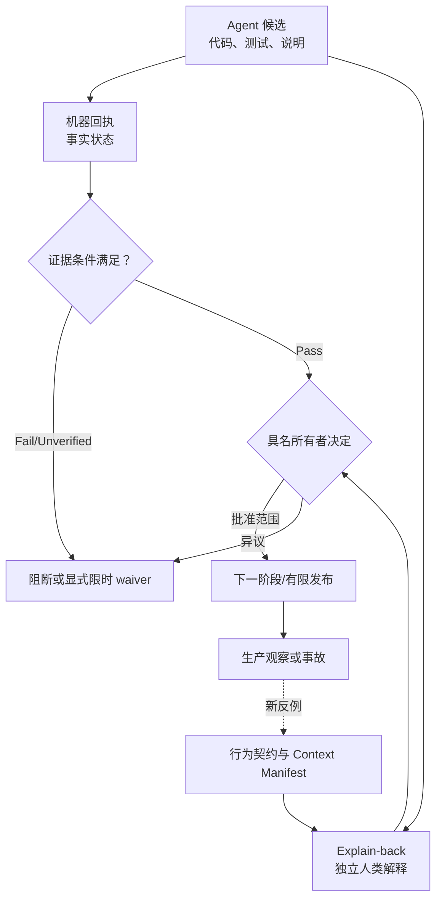

# 第 11 章：Human Owns the Change

> **定位**：本章定义 AI Coding 迁移中不可外包的人类所有权。前置依赖是 Context Boundary、原子补丁和第 7–10 章的验证证据；输出是一个覆盖需求、来源、实现、测试、审查、发布与事故的责任矩阵和 Review Ownership Record。适用于准备提交、审查或批准 AI 辅助变更的人，而不是用来衡量某个人是否“亲手写了多少代码”。

## 问题现场：三次签字，一次无人能解释的变更

一个 Agent 为共享错误层生成补丁和测试；第二个同系列模型做代码审查，结论是“设计一致、测试充分”；人类维护者看到 CI 全绿后批准；发布负责人看到两个 approval 后进入 canary。形式上已经有三层审核。

canary 中某个 utility 把本应返回 `2` 的缺能力分支折叠成 `1`。事故会议上，第一个人说实现由 Agent 生成，第二个说自己只看了静态质量，维护者无法指出退出码在哪一层映射，发布负责人不知道原变更未跑目标平台。三次签字只证明三次操作发生，没有任何一项证明契约被理解、测试命中了风险或回退条件已准备。

随后团队要求“以后所有 AI 变更多一个人工签字”。这仍然治标不治本：若新签字人继续依据同一段 Agent 总结和同一组测试绿灯，人数增加但证据没有增加。同源解释、共享假设和模糊责任可以穿过任意数量的复选框。

固定提交中的 uutils 项目规则给出了明确底线。`AGENTS.md:7-10` 要求驱动 Agent 的人对输出负责、发送前阅读 diff，并由人类回答审稿问题。[E2-AI-OWNERSHIP] `CONTRIBUTING.md:218-229` 允许 AI 辅助贡献，但要求贡献者理解每一行、能解释和证明变更，警惕来源风险，保持补丁小而聚焦并自审。[E2-AI-POLICY] `AGENTS.md:17-23` 还规定行为变化和 bug fix 要有测试、外部差异转绿后加入 Rust 回归、无测试不合并。[E2-NO-TEST-NO-MERGE] 这些是 2026-08-14 固定源码基线的仓库规则，不是论文对 AI 工程的测量结论。

<!-- source: AGENTS.md -->
<!-- source: CONTRIBUTING.md -->

## 心智模型：作者身份、执行工作与变更所有权是三件事

**作者身份（authorship）**描述谁或什么生成了某段文字或代码。**执行工作（execution）**描述谁运行测试、收集日志、做最小化或修改实现。**变更所有权（change ownership）**描述谁有权并有能力对行为意图、来源、证据、风险和发布决定作出承诺。Agent 可以大量承担前两项，不能因此自动获得第三项。

“Human owns the change”不等于人类重新手写 Agent 代码，也不要求一个人掌握所有专业领域。它要求每个不可机械决策都有具名人类所有者，且所有者产生可观察的判断：能复述行为变化、从契约追到 diff 和测试、说明未知与回退、处理审稿异议，并在证据不足时拒绝晋级。

本章把所有权拆为五种能力：

1. **契约所有权**：裁决哪些历史行为要保留、哪些差异允许、哪些旧缺陷不得复制；
2. **来源与权限所有权**：批准 Agent 可见材料，处理 clean-room、许可、隐私和安全边界；
3. **实现所有权**：解释关键数据流、错误路径、共享影响、平台分支和 `unsafe` 前提；
4. **证据所有权**：判断测试/差分/fuzz 到底证明什么，识别 skip、normalization、未运行与相关性盲点；
5. **发布所有权**：批准 rollout 范围、指标、阈值、值班和回退，并在事故中保护用户。

这五种能力可以分给不同角色，但每份 Change Package 都必须有最终变更负责人把意见合成明确决定。责任不能因“大家都看过”而稀释，也不能因某专家只负责一栏而让其结论被最终负责人无声忽略。

下面的 RACI 是 **E4-CHANGE-PACKAGE 的作者提炼**，不是 uutils 仓库现有流程。`A`（Accountable）每阶段只能有一个最终人类角色；`R`（Responsible）可以是 Agent 或人；`C`（Consulted）提供专业判断；`I`（Informed）接收状态。Agent 永远不能成为接受剩余风险的 `A`。

| 阶段 | A：最终负责 | R：执行 | C：必须咨询 | 需要的可观察输出 |
|---|---|---|---|---|
| 需求/契约 | 行为/产品负责人 | 分析者、Agent | 使用者、安全、平台 | 行为 intent、允许差异、non-goals、unknown |
| 来源/上下文 | 来源或安全负责人 | 工具管理员 | 法务/隐私/维护者 | Context Manifest、异常与处置 |
| 实现 | 维护者 | Agent/开发者 | 架构、平台专家 | 小 diff、设计不变量、影响矩阵 |
| 测试/差分/fuzz | 测试负责人 | Agent/测试系统 | 契约、平台、安全 | red/green、run receipt、局限、未执行项 |
| 代码审查 | 独立审稿人 | 审稿人 | 原作者、领域专家 | explain-back、异议和处置 |
| 合并 | 变更负责人 | 自动门禁/维护者 | 上述 A 角色 | Change Package 状态与批准理由 |
| 发布 | 发布负责人 | 发布系统/值班 | 产品、安全、SRE | 阶段、阈值、回退演练、观察窗口 |
| 事故 | 事故指挥 | 响应者、Agent | 安全、契约、发布 | 恢复、证据冻结、反例回流、复盘 |



图中两条路径不能合并成一个“approved”布尔值：机器回执回答发生了什么，人类路径回答这些事实是否足以接受声明范围。任何一侧缺失，变更都不能凭另一侧的数量补偿。

## 固定规则走查：政策能证明边界，不能替代审查

`AGENTS.md:7-8` 的责任句紧接“Read the diff before you send it”，因此不能把“负责”解释为只对 Agent 提示负责；输出本身必须被阅读。[E2-AI-OWNERSHIP] 第 10 行要求审稿回复由人完成，`29-33` 又要求 issue、PR 描述和审稿回复用自己的语言，目的是检查人是否理解。这里的“自己的语言”不是文风要求，而是一个可观察门禁：不能把 Agent 生成的答复直接转发给审稿人。

`CONTRIBUTING.md:220-229` 更具体：同一标准适用于 AI 辅助补丁；贡献者应理解每一行，能在审查中解释和证明，特别注意输出可能来源于受限代码，并保持补丁小而聚焦。[E2-AI-POLICY] 小补丁并非为了让统计好看，而是让人类认知预算足以建立契约—实现—测试的对应关系。若补丁大到无人能解释，正确动作是拆分或拒绝，不是降低理解标准。

`AGENTS.md:19-23` 将测试位置和兼容差异的永久回归写得很窄：行为或 bug fix 要带项目自己的测试；外部测试从失败变为通过，还要加入 Rust 测试避免静默回归。[E2-NO-TEST-NO-MERGE] 人类负责人不能用“外部套件已绿”跳过项目回归，也不能因为测试由 Agent 写就假定它能失败。测试所有权包括验证负控、期望来源和覆盖边界。

政策也有清晰的不能证明项。它没有规定本章的 RACI、表单或批准状态；没有保证审稿人没有疲劳、锚定或知识缺口；也没有把签字变成技术证据。仓库规则是最小行为边界，本章的组织机制是 E4 实施模型。

## Explain-back：把“我理解”变成可以审查的输出

理解无法由心理量表直接测量，但可以要求负责人完成 **Explain-back Protocol**。它不是复述 Agent 总结，而是从独立输入重建变更。

**第一步，先隐藏结论。** 审稿人先读 Task Contract、允许来源、diff 与测试，不先读 Agent 的“为什么正确”。写下自己的行为变化、风险假设和至少一个可能遗漏。这减轻流畅解释带来的锚定。

**第二步，行为复述。** 用两到四句话说明修改前后外部可观察行为，包含失败路径和副作用。若只能说“重构了错误处理”“提升兼容性”，说明契约尚未被理解。

**第三步，路径追踪。** 从一个最小输入走到参数解析、关键分支、错误/退出映射和进程输出，指出改变发生在哪一处。共享层变更还要列代表消费者和平台分支。审稿人不必背每行，但必须知道关键不变量由什么代码维持。

**第四步，证据反推。** 对每项测试回答：它保护哪个契约字段？若将退出码改错、交换 stdout/stderr、跳过副作用或放宽 normalization，测试是否会失败？删除一项测试会失去什么证明？这些问题防止把数量当证据。

**第五步，未知与回退。** 列出至少一个未验证边界，说明它为何不在本次结论里、何时补齐；描述 revert 代码之外的数据/配置影响和恢复验证。无法回答时，包保持 Candidate。

**第六步，独立异议。** 与 Agent 说明对照，差异逐项进入审稿记录。人类可以接受 Agent 补充，但最终答复必须由人写并承担技术含义。一个有效 explain-back 应让另一位维护者仅靠记录重建批准理由。

## 同源盲点：Agent 生成、Agent 审查为什么不独立

让另一个 Agent 审查可以发现格式、遗漏分支、类型错误或不一致，是有价值的辅助检查。但两个模型可能共享训练先验、提示材料、工具输出和错误契约；第二个模型还容易被第一个模型的流畅解释锚定。它们的结论相关，不能按“两次独立证据”计算。

独立性应来自**不同证据路径**，而不仅是不同会话：从契约反向找实现；使用由人类批准的负控；让不同角色分别核对来源、平台与发布；在另一 runner 重放；用真实生产指标检查。Agent review 可列为 `automated_review` receipt，人类技术决定列为 `human_decision`，两者字段和权限不同。

同源盲点还有测试层版本：Agent 同时生成代码与测试，可能把同一误解写入双方。解决方法不是禁用 Agent 测试，而是要求期望来自独立契约/反例，保留修复前 red，并对关键断言做 mutation 负控。若 Agent 又修改比较器或 DoD 规则，应拆成独立治理变更。

## 完整工程案例

案例：共享错误层变更 `CP-ERROR-004` 要把“缺平台能力”从普通 I/O 错误中分离，使两个 utility 返回契约指定的 `2`，其他普通失败仍为 `1`。Agent 生成一个很小的 enum 变更，却触及共享转换和多个平台条件。

**契约与来源。** 行为负责人批准两个 outcome，明确不统一 stderr 文案、不迁移其他 utility。来源负责人确认 Agent 只读 Task Contract、候选 Rust、项目测试与规则，没有接触禁止来源；Context Manifest 绑定 commit 和路径。这里的批准只支持“上下文边界被审查”，不证明实现正确。

**实现与测试。** Agent 增加变体、迁移两个调用者并生成回归。维护者的 explain-back 发现一个 `From<io::Error>` 仍把新变体折回 `1`，而 Agent review 没指出，因为它只跟随主调用路径。测试负责人把回归在修复前基线运行：其中一项一直为绿，原来只断言“非零”。包被退回，测试改为精确 code 并增加无副作用断言，red receipt 成立后才修实现。

**审查与异议。** 平台审稿人指出 Windows runner 未执行；变更负责人没有把签字转成 Pass，而是将该门禁写为 `Unverified`。由于当前合并范围只声明 Linux utility，Windows 路径被阻断在后续任务；若共享 enum 已在 Windows 编译路径公开使用，则范围不能切掉，必须补 runner 或显式高层豁免。安全审稿确认无 `unsafe`，但不替代平台决定。

**批准与发布。** Change Package 的机械门禁转为 Verified 后，变更负责人用自己的话记录行为、错误桥、两项测试、未知平台和 Git 原子回退。发布负责人只在内部 canary 使用候选，监控两个退出类别；阈值演练触发后成功切回。最后批准的是“这个范围内可进入下一状态”，不是“所有错误路径永久正确”。

**事故演练。** 团队故意删除精确退出码断言，DoD 应失败；再给审稿人一个新的 utility 差异，要求其不用 Agent 结论完成分类。演练暴露只有一人会重放 runner，于是指定备份所有者并把命令写入记录。所有权因此表现为能发现、拒绝、恢复和转移知识，而非签字数量。

## 反例

**签字即证据**是本章核心反例。一条 `approved: true` 只能证明授权身份做过决定，不能证明命令运行、测试能失败、diff 被理解或回退可用。签字必须引用证据和 explain-back；证据本身仍要由机器回执或可重放工件支持。人类签字不能把 `Unverified` 改成 `Pass`，只能在有权且满足流程时创建有期限的 waiver。

**“理解每一行”等于背诵语法**也是反例。审稿者可以逐行说出 Rust 表达式，却不知道退出码如何影响调用者；这不是所有权。相反，审稿者可以不记住 helper 的每个局部变量，但能解释不变量、失败边界、测试与回退，属于有效理解。重点是可决策的因果链。

**同一人承担全部角色**在低风险局部补丁中可能可行，在共享、安全或发布关键变更中容易形成单点。若组织规模小，应通过分时独立阅读、外部专家、演练和更小发布范围补偿，而不是假装角色天然独立。

**因为 Agent 很快而接受大补丁**会使人的理解预算失配。已投入很多生成成本不是接受理由；无法解释的关键代码必须拆分、重做或拒绝。沉没成本不能成为风险豁免。

## 模式提炼

**模式一：可观察的人类所有权。** 问题是“human in the loop”只剩点击；机制是 explain-back、证据反推、未知与回退说明。前提是负责人有时间、权限与专业能力；失效边界是疲劳、组织压力和单点知识。替代是缩小范围、增加专业审稿或降低发布阶段。

**模式二：决策与执行分权。** 问题是 Agent 同时生成、测试、评审并自我批准；机制是机器/Agent产生候选和回执，人类角色持有行为裁决与晋级权限。前提是系统能区分字段权限；失效边界是把人类签字当证据。第 12–13 章将机器状态和人工决定写成不同 schema 字段。

**模式三：异议优先。** 问题是流程只优化批准速度；机制是每个所有者拥有停止权，异议有状态、证据、负责人和处置。前提是组织不惩罚合理阻断；失效边界是截止日期凌驾安全。替代是缩小范围、限时实验或回到契约。

**模式四：能力演练。** 问题是记录完美但事故时不会操作；机制是反例解释、证据缺口和真实回退三类演练。前提是隔离环境与真实权限可用；失效边界是桌面演练冒充实际恢复。演练结果进入风险账本。

## 可复用工件

下面的 **Review Ownership Record** 是 E4 工件，不是 uutils 当前格式。`machine_receipts` 只记录事实回执；`human_decisions` 记录具名判断。任何签字不得直接覆盖机器状态。

```yaml
schema: review-ownership/v1
change_id: CP-ERROR-004
candidate_commit: abcdef0
contract: BC-ERROR-004@v2
context_manifest: CTX-ERROR-004@v1
roles:
  behavior_accountable: behavior-owner
  source_accountable: security-owner
  implementation_accountable: maintainer-a
  evidence_accountable: test-owner
  review_accountable: reviewer-b
  release_accountable: release-owner
agent_contributions:
  implementation: agent-run-17
  tests: agent-run-18
  automated_review: agent-run-19
  scope: [candidate_code, candidate_tests, review_suggestions]
explain_back:
  behavior_before: missing_capability_collapses_to_exit_1
  behavior_after: selected_utilities_exit_2_without_side_effect
  key_path: [cli, utility_error, shared_conversion, process_exit]
  invariants: [ordinary_io_remains_1, stderr_not_normalized_globally]
  test_to_contract:
    REG-ERROR-001: [exit_code, side_effects]
  residual_unknowns: [windows_runner]
  rollback_effect: no_persistent_state_revert_commit
machine_receipts:
  - {id: RUN-REG-001-RED, state: fail_as_expected, commit: baseline}
  - {id: RUN-REG-001-GREEN, state: pass, commit: abcdef0}
  - {id: RUN-WINDOWS-001, state: unverified, reason: runner_unavailable}
human_decisions:
  behavior: {decision: approve_contract, owner: behavior-owner, evidence: [BC-ERROR-004]}
  source: {decision: boundary_clear, owner: security-owner, evidence: [CTX-ERROR-004]}
  technical_review: {decision: approve_linux_scope, owner: reviewer-b, evidence: [RUN-REG-001-RED, RUN-REG-001-GREEN]}
  release: {decision: internal_canary_only, owner: release-owner, evidence: [ROLLBACK-DRILL-004]}
objections:
  - {id: OBJ-PLATFORM-01, raised_by: platform-owner, status: open, effect: blocks_windows_scope}
signatures:
  - {role: change_owner, identity: maintainer-a, signed_object_hash: ownership-record-hash}
record_state: approved_for_internal_canary
```

签名绑定对象哈希，防止内容改变后仍沿用旧批准；它证明身份对该版本作出决定，不证明 `RUN-*` 真实，后者必须能重放或验证签名/日志。`record_state` 只能由 Change Package 状态机根据机器条件和所需人工决定计算，不能由 Agent自由填写。

## AI Coding 工作台

工作台应把 Agent 与人的权限做成控制面，而非提示约定。Agent 可写 `agent_contributions`、建议 explain-back 问题、收集 machine receipts 和提出风险；不能写人类身份的 `decision`、关闭异议、替审稿人回复或生成最终签名。审稿回复编辑入口应明确由人提交，保留与 Agent 草稿的边界。

人类审稿界面先展示契约、diff 和测试，再可选展开 Agent 解释；要求填写行为复述、关键路径、测试—契约映射、未知和回退。对于高风险 Profile，系统随机选择一个负控或调用路径要求 explain-back，避免所有记录成为复制模板。

提示 Agent 时也应明确角色：“你是证据整理者，不是批准者”“只列出可能遗漏，不给最终接受结论”“若需要更改契约或 DoD，停止并请求人类”。这不是依赖提示保证安全；后端字段权限、审计日志与状态机才是强边界。

## 能证明什么／不能证明什么

| 能证明什么 | 不能证明什么 |
|---|---|
| 固定仓库规则要求驱动 Agent 的人负责输出、阅读 diff，并由人回答审稿。[E2-AI-OWNERSHIP] | 某个人已经理解具体变更，或任意组织都应采用同一 RACI。 |
| AI policy 要求理解、解释、证明、小而聚焦和来源警惕。[E2-AI-POLICY] | AI 产物天然合规，或多一个签字能消除来源风险。 |
| 测试规则要求行为/bug fix 有项目回归。[E2-NO-TEST-NO-MERGE] | 测试期望正确、测试能失败、所有平台已运行。 |
| Explain-back 记录可证明负责人对列出的契约、路径、证据和未知作过可审查陈述。 | 陈述必然正确、负责人没有疲劳/锚定，或生产结果无未知。 |
| 签名可证明某身份批准了特定对象哈希。 | 被签对象中的机器回执真实、证据充分，或 `Unverified` 已变成 Pass。 |

## 局限

人类会犯错，审查也受时间、能力、地位和激励影响。高风险共享层、安全路径和默认发布需要多专业角色，但增加角色会增加协调成本。流程应按风险扩张，不能让低风险机械变更承受生产默认切换的全部仪式，也不能因成本存在就取消关键决策。

本章不规定雇佣、法律责任或所有组织结构；clean-room 与许可判断仍可能需要专业法律意见。记录理解不能读取人的隐式推理，只能保存可观察输出。最终目标不是证明人类永不犯错，而是让错误决策可追踪、可挑战、可回退并能转化为改进。

## 实践清单

- [ ] 分开 Agent authorship、执行工作与人类 change ownership。
- [ ] 为契约、来源、实现、证据、审查、发布和事故分配具名 A 角色。
- [ ] 审稿前独立读契约、diff 和测试，再与 Agent 解释对照。
- [ ] 要求 explain-back 覆盖行为、关键路径、测试映射、未知和回退。
- [ ] 将 Agent review 记为辅助回执，不按独立人类决定计数。
- [ ] 签字只绑定决定与对象哈希，不把签字当测试或证据充分性。
- [ ] 任何所有者在来源、契约、证据或恢复不足时拥有停止权。
- [ ] 定期做反例、证据缺口和真实回退演练，并培养备份所有者。

## 练习

- **练习一：责任设计。** 为一个“Agent 生成共享错误层、另一个 Agent 审查”的案例建立 RACI，强制每阶段一个人类 A；列出两个同源盲点和两条来自不同证据路径的补偿检查。
- **练习二：Explain-back 演练。** 选择一份小 diff，在不读作者结论时写行为复述、关键路径、测试—契约映射、未知和回退；再与原说明对照，所有差异进入异议记录而不是直接改答案。
- **练习三：验证签字边界。** 设计一个机器测试 `Unverified` 但两名人类都签字的 Change Package，说明状态机为什么仍阻断；再写一份合法限时 waiver，包含范围、补偿控制、到期和关闭证据。

## 本章证据

人类输出责任与审稿回复边界来自 [E2-AI-OWNERSHIP]；理解、解释、小补丁、自审与来源注意来自 [E2-AI-POLICY]；行为修复与永久测试要求来自 [E2-NO-TEST-NO-MERGE]。五种所有权、RACI、Explain-back、同源盲点控制和 Review Ownership Record 均是 E4-CHANGE-PACKAGE 作者提炼，不归入论文事实或仓库现行接口。

### 版本演化说明

论文基线为 **arXiv:2608.07135**；规则事实固定在 **d8bee62c1ddc227d5e4385d80bbf6d7dee266a41**；本章核验截止日为 **2026-08-14**。AI policy 和审稿规则可能随仓库演化，复用前必须重新读取；无论工具如何变化，“机器事实、Agent 建议、人类决定”应继续使用不同权限和字段表达。
