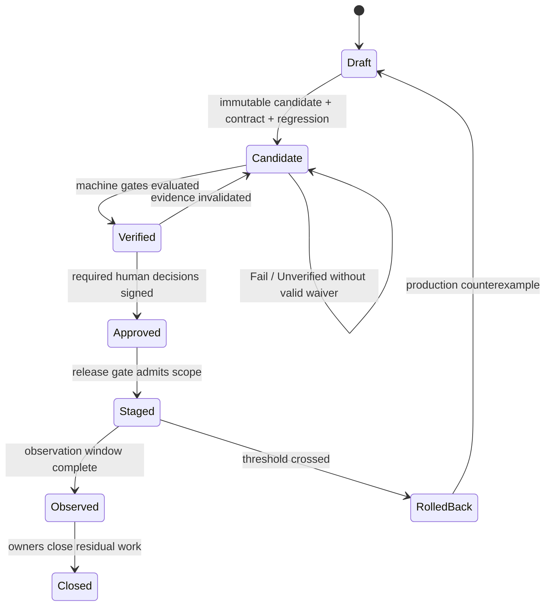
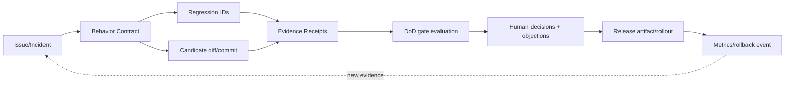

# 第 12 章：Change Package

> **定位**：本章把 Agent 的交付单位从代码 diff 升级为可决策、可审计、可回退的 Change Package。前置依赖是行为契约、Context Manifest、原子任务、静态/测试/差分/fuzz 回执和第 11 章的人类所有权；输出是一份人读摘要与机器 schema 指向同一事实的包。适用于实现交接、审稿、DoD 判定和发布准入。

## 问题现场：一段“测试已通过”无法回答的七个问题

Agent 提交一个 140 行 patch，并附上：“修复边界行为；所有测试通过；风险低。”审稿人打开 CI 链接只看到最后二十行 `test result: ok`。没人知道命令在哪个目录执行、启用了哪些 feature、是否跑了目标平台、有没有 skip、修复前测试是否失败、差分 comparator 是否忽略 stderr，也没人知道 revert 后如何清理已产生的文件。

维护者尝试从聊天历史补齐背景，却发现契约在第一轮对话，允许来源在第二轮，失败 seed 在临时 artifact，测试日志已经覆盖，回退讨论只存在一次会议。patch 的字节仍在，做出接受决定所需的证据图却不存在。所谓“交付完成”只是 Agent 停止生成。

仓库规则提供三条项目事实底线：行为变化和 bug fix 需要项目自己的测试，没有测试不合并 [E2-NO-TEST-NO-MERGE]；AI 辅助贡献仍由人理解、解释、证明、自审并保持小而聚焦 [E2-AI-POLICY]；提交和 PR 应小而原子，机械移动与功能修改分离。[E2-ATOMICITY] 这些事实没有规定本章 schema，但说明孤立 patch 不是充分的审查接口。

<!-- source: AGENTS.md -->
<!-- source: CONTRIBUTING.md -->

## 心智模型：包是索引和判定面

Change Package（变更包）把一个行为意图、一个可寻址实现、回归与运行证据、来源边界、风险、人工决定和回退影响绑定为同一交付原子。它不是把所有源码和日志复制到 YAML；大型工件仍留在 Git、CI、对象存储和发布系统，包用稳定 ID、内容哈希和版本连接它们。

一份包同时有两种视图：

- **Human View**：一页内回答为什么改、行为怎样变化、证据支持什么、还不知道什么、谁决定、如何回退；
- **Machine View**：字段、枚举、引用和状态可解析，可验证必填项、哈希、门禁合取与权限，不替人判断风险是否值得接受。

两种视图必须由同一数据生成；摘要“全绿”而机器数据有 `unverified`，或 YAML 写 `approved` 却无签名对象，都应阻断。

本章结构是 **E4-CHANGE-PACKAGE 作者提炼**，不是 uutils 现行格式；它引用前章规范，不重复定义。

## schema 设计：事实、机器判定与人工决定分层

变更包最小包含九个区块：

| 区块 | 规范字段 | 审稿问题 |
|---|---|---|
| identity | schema、package_id、revision、candidate commit/hash、owners | 审的是哪个不可变对象？ |
| intent | contract ID、before/after、non-goals、issue/incident | 只改变一个主要行为吗？ |
| provenance | context manifest、允许/禁止源结论、异常 | 候选如何产生，边界是否清楚？ |
| implementation | diff/commit、allowed paths、设计不变量、影响矩阵 | 代码怎样实现契约？ |
| regression | 具名测试、pre-fix red、post-fix green、fixture | 测试真的捕获原缺陷吗？ |
| evidence | command receipts、差分/fuzz资产、平台和局限 | 每个结论由哪项运行支持？ |
| gates | selected DoD profiles、四值状态、适用规则 | 完成条件是否一致可算？ |
| decisions | explain-back、异议、批准/拒绝/waiver | 谁接受了哪个范围与理由？ |
| rollback | 代码、配置、数据、副作用、触发与恢复验证 | 切回以后系统是什么状态？ |

机器检查状态统一为四值：`Pass`、`Fail`、`Unverified`、`N/A`。`N/A` 不是空值，必须带适用规则与人工确认；`Unverified` 表示未运行、环境不可用、日志不足或差异未分类，不能写成 `Pass`。第 13 章和附录 E 将继续使用同一枚举。

人工决定统一为 `Approve`、`Reject`、`Waive`，但**决定不能改写机器检查状态**。人类可以批准一份有边界、有期限、有补偿控制的 waiver；原检查仍保持 `Unverified` 或 `Fail`，包另记录 `verification_basis: LimitedWithWaiver`。这样查询历史时不会误以为当年检查实际通过。

五个 DoD Profile 名称也在这里预留为稳定接口：`Mechanical`、`Local Behavior`、`Shared Core`、`Safety Critical`、`Release Default`。`selected_profiles` 是数组，命中多项取要求并集；第 13 章规范触发规则。机器不得根据 Agent 自报风险自动降级，人类若改变 Profile 选择必须单独记录决定与理由。

包状态与上述字段分离：`Draft`（契约/工件可不齐）、`Candidate`（实现与目标回归已存在）、`Verified`（适用门禁直接满足或有限 waiver 结构有效）、`Approved`（所需人类决定齐备）、`Staged`、`Observed`、`Closed`，以及失败分支 `RolledBack`。`Verified` 不等于 Approved；机器证据齐备不能替人接受风险，人签字也不能凭空产生 Verified。



## Evidence Receipt：让“测试通过”变成可复核事实

每次命令运行生成一个 Evidence Receipt。最小字段包括：`run_id`、目的、原样参数数组、cwd、源码/候选 commit、工具链、平台、feature、受控环境、开始时间、持续时间、退出状态、通过/失败/跳过数量、原始日志哈希、解析器版本、契约字段和局限。

命令保存为参数数组而不是可执行 shell 字符串，既便于安全重放，也避免引号在渲染中变化。敏感环境变量只记录名称和密钥版本/摘要，不存值。`purpose` 必须具体到契约，例如“验证缺能力时 exit=2 且不创建目标”，不能写“run tests”。

回执区分三种失败：被测代码失败、验证基础设施失败、命令根本未执行。第一种通常是 `Fail`；第二种为 `Unverified` 并引用 infra incident；第三种为 `Unverified:not_run`。skip/xfail 单独计数和列 ID，不能包含在 passed。日志摘要供人快速阅读，原始 artifact/hash 供机器与审稿核对；一段手工复制的末尾输出不构成完整回执。

red/green 是两个不同 commit 的两个回执。`pre_fix_receipt` 必须显示最小回归在基线以预期方式失败；`post_fix_receipt` 显示同一 test ID 和 fixture 在候选通过。若旧基线无法构建，包记录替代负控和证据降级，不能倒写 red 已执行。

差分与 fuzz 不塞进普通 test 文本。第 9 章 DRR、第 10 章 FFP 作为独立 artifact 引用，变更包只提取分类、最小 seed、回归 ID、比较字段和残余未知。这样审稿人可从契约一路追到原始观察，而不会让几百 MB 日志淹没摘要。

## 可追溯关系与双向闭合

一条完整追溯至少支持六个查询：给定契约找到实现和测试；给定 diff 找到行为意图；给定测试找到期望来源；给定运行找到 commit/环境；给定批准找到证据和对象哈希；给定生产事故找到引入包、回退与新回归。



链接必须固定到不可变 commit、artifact digest 与日志 hash；浮动 `main` 或“最新镜像”不支持历史决定。索引还要拒绝孤儿：契约字段、测试、waiver、批准和 rollout 均能双向追到版本化对象。

## 完整工程案例

案例使用第 10 章 `FFP-MANIFEST-001`：尾随空格路径导致 stdout 缺记录，已最小化为 `REG-MANIFEST-TRAILING-SPACE-001`。Agent 交付候选 commit `abcdef0`，只改目标 utility 与测试。

**Draft。** 迁移负责人创建 `CP-MANIFEST-017@r1`，引用 `BC-MANIFEST-007@v4`、Context Manifest 和 FFP。Human View 写一句行为变化：“保留原生路径尾随空格，成功记录与已提交文件一一对应。”non-goals 明确不改 stderr、Windows 路径和共享 I/O。机器 schema 验证引用存在，但尚无 green，状态为 Draft。

**Candidate。** 测试负责人上传 `RUN-REG-017-RED`：基线 commit、Linux/ext4、目标选择器、exit=非零、一个预期断言失败；再上传候选的 `RUN-REG-017-GREEN`。实现区列出两处路径、设计不变量和 Git 原子回退。包进入 Candidate，不因两个回执自动 Approved。

**证据扩展。** 目标进程测试、相关 utility 测试、静态门禁和原复合 seed 重放各有 receipt。Windows runner 没有执行，状态 `Unverified`；由于 `Local Behavior` Profile 和当前声明平台只包含 Linux，平台负责人将 Windows 写为范围外后续契约，而不是把检查改 Pass。若代码触及共享跨平台路径，这种切分不会被 Profile 规则接受，必须升级 `Shared Core`。

**人类决定。** 维护者完成 explain-back，审稿人提出“测试是否保留重复路径记录”的异议；补上负控后异议关闭。机器聚合显示直接证据全部 Pass，`verification_basis: Direct`，状态进入 Verified。行为、来源、审稿与变更负责人分别签署同一包 hash，才进入 Approved。

审稿人从摘要可快速了解意图和风险，从 schema 可追到每项回执；机器和人使用同一状态，不会出现 Markdown 说“通过”而 YAML 说“未运行”。这就是从 patch 到可决策包的完整闭合。

## 反例

**只有 patch。** Agent 返回 diff，没有契约、测试、来源、证据和回退。即使代码看起来正确，交付状态仍是 `Draft/incomplete`；审稿人不得靠个人考古把它偷偷补成 Candidate。正确动作是要求最小 Change Package，或由人类明确接管并生成缺失工件。

**只贴一段绿日志。** 最后十行不能证明选择器、平台、skip、commit 或 red。应拒绝并请求结构化 receipt。日志摘要可以是 Human View 的一部分，但不是机器事实的唯一载体。

**机器与人工共用 `approved` 字段。** 自动脚本将测试绿写 `approved=true`，审稿人签字也写同一字段，事后无法判断谁批准了什么。正确设计分别保存 validation status、derived verification、human decision 和 package phase，字段权限不同。

**waiver 把未知洗成绿。** 平台未运行，人签字后 status 被改 Pass。历史会误以为证据存在。正确做法是保持 `Unverified`，新增 waiver（范围、风险、补偿、owner、approver、expires、closure evidence），`verification_basis` 标 `LimitedWithWaiver`。

**变更包变成 AI 长文。** 几页流畅摘要重复每个 hunk，却没有稳定 ID 和局限。人读内容应从 schema 渲染，解释只保留决策理由；PR 描述依旧可以遵守项目的简短要求，Change Package 留在内部证据系统，两者不是同一文档。

## 模式提炼

**模式一：Change Package 作为交付原子。** 问题是 patch 丢失行为与证据；机制是稳定 ID/哈希连接契约、实现、回归、回执、决定与回退。前提是工件可版本化；失效边界是浮动链接和不可追溯日志。替代是先归档或降低结论。

**模式二：双视图单一事实源。** 问题是 Markdown 与机器数据漂移；机制是 Human View 从 schema 渲染并做冲突门禁。前提是 schema 能表达解释与未知；失效边界是为追求可解析而删除人类理由。机器字段与自由文本各承担不同职责。

**模式三：事实—判定—决定三层。** 问题是测试绿、风险接受和签字混成一个布尔；机制是 Evidence Receipt、gate evaluation、human decision 分层。前提是字段权限与签名可验证；失效边界是管理员绕过后不留审计。替代是不可变事件账本。

**模式四：缺口一等化。** 问题是未运行项从摘要消失；机制是四值状态和显式 waiver。前提是 `Unverified` 默认阻断；失效边界是 waiver 无期限/补偿。第 13 章继续规范例外生命周期。

## 可复用工件

下面 YAML 可直接复制；它是 E4 示例，不是 uutils 强制格式。为节省篇幅，真实包可把详细列表拆成引用文件，但根字段和枚举保持一致。

```yaml
schema: change-package/v1
package_id: CP-MANIFEST-017
revision: 1
object_hash: sha256:package-canonical-json
phase: Approved
verification_basis: Direct        # Direct | LimitedWithWaiver
identity:
  title: preserve trailing-space path identity in success records
  candidate_commit: abcdef0
  candidate_artifact: sha256:candidate
  change_owner: maintainer-a
intent:
  contract: BC-MANIFEST-007@v4
  before: trailing space is removed from one stdout record
  after: native path bytes are emitted once after commit
  non_goals: [stderr_text, windows_native_path, shared_io_refactor]
provenance:
  context_manifest: CTX-MANIFEST-017@v1
  source_boundary: Pass
  incidents: [FFP-MANIFEST-001]
implementation:
  diff: git:abcdef0
  allowed_paths: [src/uu/example, tests/by-util/example]
  invariants: [committed_multiset_equals_stdout, failed_item_has_no_record]
  rollback_effect: no_persistent_format_change
regression:
  tests: [REG-MANIFEST-TRAILING-SPACE-001]
  pre_fix_receipts: [RUN-REG-017-RED]
  post_fix_receipts: [RUN-REG-017-GREEN]
evidence_receipts:
  - id: RUN-REG-017-GREEN
    purpose: prove exact path bytes and no residual temp after success
    argv: [cargo, test, --test, test_example, trailing_space]
    cwd: repo-root
    commit: abcdef0
    runner: {os: linux, arch: x86_64, fs: ext4, toolchain: pinned}
    features: [default]
    result: {exit: 0, passed: 1, failed: 0, skipped: 0}
    log: {uri: artifact:run-017, sha256: loghash}
    contract_fields: [output.stdout, side_effects]
    limitations: [windows_native_path]
selected_profiles: [Local Behavior]
gate_results:
  - {requirement: LOCAL-RED-GREEN, status: Pass, evidence: [RUN-REG-017-RED, RUN-REG-017-GREEN]}
  - {requirement: WINDOWS-NATIVE, status: N/A, reason: outside_approved_linux_contract, confirmed_by: platform-owner}
  - {requirement: NETWORK-FS, status: N/A, reason: outside_approved_linux_contract, confirmed_by: platform-owner}
machine_evaluation:
  schema_valid: true
  eligible_for_verified: true
  evaluated_policy: dod-policy/v1
human_decisions:
  - {role: behavior_owner, decision: Approve, object_hash: sha256:package-canonical-json, reason: contract_preserved}
  - {role: reviewer, decision: Approve, object_hash: sha256:package-canonical-json, reason: explain_back_and_receipts_complete}
objections: []
waivers: []
rollback:
  trigger: regression_or_canary_contract_mismatch
  action: revert abcdef0
  data_repair: none_expected
  verification: [REG-MANIFEST-TRAILING-SPACE-001]
```

`NETWORK-FS` 不属已批准 Linux 契约，故为有确认人的 `N/A`，可在 residual unknown 保留调查。若合同包含它，则应为 Unverified、`eligible_for_verified=false`；限时 waiver 可形成 `LimitedWithWaiver`，原 status 不变。

## AI Coding 工作台

Agent 可采集命令、commit、runner、exit、计数和日志 hash，生成摘要草稿并检查引用；不能伪造 receipt、把 skip 算 passed、替人批准、改写 Unverified 或修改失败的 DoD policy。受信 runner、身份系统和固定 policy engine 分别写 receipt、人工决定和机器判定；候选 Agent 只写实现、回归与解释草稿。包在签字前冻结 canonical hash，修改即升 revision 并使旧签字失效。界面按“契约→diff→测试→回执→未知→回退”展示，降低重建成本而非生成更多文字。

## 能证明什么／不能证明什么

| 能证明什么 | 不能证明什么 |
|---|---|
| 固定规则要求行为修复有测试、AI 贡献由人理解和负责、小而原子。[E2-NO-TEST-NO-MERGE] [E2-AI-POLICY] [E2-ATOMICITY] | 本书 YAML 是项目现行格式，或包字段齐全就证明行为正确。 |
| Evidence Receipt 可证明某命令在声明 commit/runner 上产生了记录的退出与计数（若日志/hash可信）。 | 未选测试、未运行平台、测试期望正确或 red 真正对应根因。 |
| schema gate 可证明字段、enum、引用、签名对象和状态迁移符合 policy。 | 风险判断合理、waiver 值得接受、实现没有未知缺陷。 |
| Human View 与 Machine View 同源可证明两者没有数据漂移。 | 摘要没有遗漏 schema 尚未建模的风险。 |
| rollback 演练 receipt 可证明该产物和环境下执行过恢复路径。 | 所有生产数据、依赖者和事故时序都可恢复。 |

## 局限

变更包增加工件治理成本；若与 issue、Git、CI 和发布系统重复录入，会迅速过时。应自动采集机器事实，以链接和 hash 复用现有系统，只让人维护意图、理由、未知、异议和决定。schema 也会演化，必须版本化并提供迁移/历史只读支持。

Change Package 不是形式化证明，也不能保存模型的隐式推理或人的全部理解。过度追求字段完整会诱发机械填表；审查应抽查引用、负控和实际回退。低风险变更可以用较小视图，高风险变更增加 Profile 要求，但事实/判定/决定分层不应消失。

## 实践清单

- [ ] 用一个 package ID/hash 连接契约、上下文、diff、回归、证据和回退。
- [ ] Human View 从 Machine View 渲染，冲突时阻断而非选有利一侧。
- [ ] 每条命令 receipt 记录目的、argv、cwd、commit、runner、结果、skip、日志和局限。
- [ ] red/green 分别绑定修复前后 commit；外部差异引用 DRR/FFP。
- [ ] 使用 Pass、Fail、Unverified、N/A；人工决定不改写机器状态。
- [ ] selected_profiles 使用五个规范名称且可组合取并集。
- [ ] 签字绑定 canonical object hash，包修改后生成新 revision。
- [ ] 回退影响覆盖代码、配置、数据、副作用、触发和恢复验证。

## 练习

- **练习一：设计验证。** 把一段“cargo test 全绿”日志改写为 Evidence Receipt；故意加入一个 skip、一个不可用 runner 和错误 commit，设计机器规则确保摘要不能显示“全部通过”。
- **练习二：追溯审计。** 给定契约、两个测试、三个 receipt、一个 diff 和一次批准，画双向索引；找出一个没有期望来源的测试与一个没有对象 hash 的签字，并说明它们分别阻断哪个状态迁移。
- **练习三：例外一致性。** 构造一个适用平台检查为 Unverified 的包：先证明无 waiver 时 `eligible_for_verified=false`；再添加范围、补偿、owner、approver、expires、closure evidence 完整的 waiver，保持原状态不变并将 basis 标成 LimitedWithWaiver。

## 本章证据

测试随行为修复进入合并要求来自 [E2-NO-TEST-NO-MERGE]；AI 辅助贡献的理解、自审和小范围来自 [E2-AI-POLICY]；原子提交、PR 与机械/行为分离来自 [E2-ATOMICITY]。Change Package schema、Evidence Receipt、双视图、四值检查、人工决定和状态机均为 E4-CHANGE-PACKAGE/E4-ATOMICITY 作者综合，不是仓库现行交付格式。

### 版本演化说明

论文基线为 **arXiv:2608.07135**；规则事实固定在 **d8bee62c1ddc227d5e4385d80bbf6d7dee266a41**；本章核验截止日为 **2026-08-14**。未来工具可以改用 JSON、数据库或签名事件流，但五个 Profile 名称、四值验证状态，以及“机器事实—机器判定—人工决定”分层应作为后续第 13 章和附录的规范接口保持一致。
