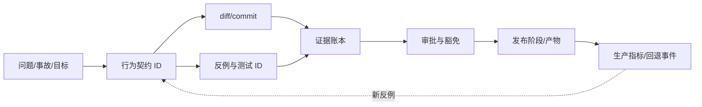

# 第 12 章：从 Patch 到 Change Package

> **定位**：本章将代码 diff 扩展为可决策、可审计、可回退的变更包。前置依赖是人类所有权、原子补丁和多层证据；输出是一份把意图、契约、来源、diff、测试、缺口与回退影响连在一起的标准产物。

Patch 只回答「哪些字节变了」。对一个局部 bugfix，经验丰富的维护者可以从 diff、测试和 issue 自行重建其余背景。对 AI Coding 驱动的大规模迁移，这种隐式重建不再可扩展：产出速度超过审稿速度，契约分散在任务对话中，测试结果只剩一个「绿」，未验证项和回退前提往往消失。

仓库规则为变更包提供了底线：没有测试的 AI 生成变更不合并，贡献者要理解并审查产物，变更保持小而聚焦，机械移动与行为修改分开。[E2-NO-TEST-NO-MERGE] [E2-AI-POLICY] [E2-ATOMICITY] 变更包将这些要求组织成一个可验收对象，而不是增加一篇流畅但不可核对的 AI 摘要。[E4-CHANGE-PACKAGE]

<!-- source: AGENTS.md -->
<!-- source: CONTRIBUTING.md -->

## 变更包的最小结构

| 区块 | 必填内容 | 审稿问题 |
|---|---|---|
| 身份 | 稳定 ID、标题、负责人、关联任务/事故 | 谁对最终决策负责？ |
| 意图与范围 | 要改变的一句行为、允许文件、范围外 | 是否只有一个主要决策？ |
| 行为契约 | 修改前/后的 I/O、错误、副作用、平台前提 | 差异是否被明示批准？ |
| 来源与上下文 | 证据 ID、context manifest、clean-room/许可结果 | 候选是如何得出的？ |
| 实现 | commit/diff、设计决策、关键 Rust 不变量 | 代码如何实现契约？ |
| 证据 | 命令、环境、结果、反例、覆盖面 | 每个结论由哪项检查支持？ |
| 缺口与豁免 | 未执行项、skip/xfail、理由、负责人、重评时间 | 哪些东西仍然不知道？ |
| 发布与回退 | 阶段、指标、阈值、回退步骤、数据影响 | 如果事实与预期不同，如何安全撤回？ |

字段数量看上去很多，但原子变更会让每一格很短。如果一份变更包需要几页才能说清行为范围，这本身就是重新切片的信号。变更包不是为了让每个小修改产生庞大官僚文档，而是让审稿者不需要从聊天历史和 CI 截图中猜测关键结论。

## 证据账本：记录命令、范围、结果与环境

「测试通过」是不完整证据。它没有说明运行了哪个测试选择器，哪些 feature 被启用，目标平台是什么，有多少项被跳过，也没有说明它是在修复前失败还是一直为绿。证据账本应对每个命令记录：

```text
EvidenceRun {
  purpose, command, cwd, source_commit,
  toolchain, platform, features, environment,
  started_at, duration, exit_status,
  passed, failed, skipped, output_artifact,
  contract_ids, limitations
}
```

`purpose` 必须将命令与契约联系起来：「验证无效选项返回非零且不创建目标」比「运行测试」更有用。`limitations` 记录未覆盖平台、无法触发的故障和 normalization 前提。`output_artifact` 可指向 CI 日志、JUnit/JSON 结果、差分执行包或 fuzz 最小样本，使文档不需嵌入大量不可检索截图。

变更包的证据账本可以由 CI 自动生成，但 `purpose`、contract IDs 和局限需要在任务契约中预先定义或由人类复核。Agent 不应在看到全绿后倒推一个宽泛目的，仿佛测试已经证明了所有相关行为。

## 可追溯关系：从契约到发布指标



追溯不意味所有信息都复制在一个 Markdown 文件里。更好的方式是使用稳定 ID 和内容哈希连接现有系统：任务契约、Git commit、CI 运行、差分样本、审批记录、发布产物与监控事件。变更包是索引和决策面，底层大型日志仍留在专用存储。

对 AI 产物，追溯还应包含 context manifest 与人类审稿产物。这不是为了保存模型全部隐式推理，而是记录它实际被授权的信息源、工具与任务边界。当发现来源问题或错误契约时，团队可以查找受同一上下文或契约影响的其他变更。

## 回退影响是必填项

「可以 revert commit」不等于可以安全回退。如果变更修改了文件格式、持久状态、包替代关系、默认路径或用户已经观察的输出，回退二进制可能无法恢复之前的数据与环境。每个行为变更都应评估：

- 回退产物是否可与已产生数据/配置兼容；
- 变更期间的部分副作用是否需要清理或修复；
- 依赖者是否已经开始使用新行为，回退会否二次破坏；
- 在什么时间窗口内回退是机械的，何时必须前向修复；
- 谁有权触发，回退后如何验证真正恢复。

对只改变进程内部实现且外部契约不变的重构，回退影响可以很短；但仍应明示说明「无持久/对外影响」与其证据。这比字段空缺更容易审计，也避免日后不确定当时是否做过评估。

## 变更包的状态机

变更包不应只有「打开/关闭」两个状态。可以使用：`Draft`（契约与反例尚在建立）、`Candidate`（实现和目标证据已有）、`Verified`（所有适用门禁完成）、`Approved`（所有权人批准）、`Staged`（进入发布阶段）、`Observed`（观察窗口完成）与 `Closed`。任何状态都可因新反例返回前一阶段，生产发现可触发 `RolledBack` 或新的前向修复包。

状态迁移需要机械条件与人类决策共同成立。例如，`Candidate -> Verified` 由证据账本中适用门禁的合取决定，`Verified -> Approved` 还需要契约、安全和发布负责人的具名签署。Agent 可以填充工件和建议状态，但不应自我晋级为 `Approved`。

## 模式提炼

**Change Package 作为交付原子**：把行为意图、实现、回归、运行证据、风险、责任与回退绑定为同一可寻址对象。它适用于证据可以版本化的流程；若日志不可重放、责任字段只是布尔值，或包与实际提交脱节，它会退化为漂亮的变更说明。

## 局限

变更包会增加工件管理成本。如果字段与现有 issue、Git、CI 和发布系统重复，人们会通过复制粘贴产生过时数据。因此应以链接和稳定 ID 为主，自动采集可机械得出的信息，只让人类维护决策、理由、局限与豁免。变更包也不是正确性证明；它只能使证据与缺口更容易被判断。

## 实践清单

- [ ] 为每份原子变更创建稳定 ID，连接意图、契约、diff、证据与发布。
- [ ] 用证据账本记录命令、范围、环境、结果、工件和局限，不只写「测试通过」。
- [ ] 将 context manifest、clean-room/license 结论与人类审查结果放入变更包索引。
- [ ] 对未执行、skip、xfail 与豁免记录负责人、理由与重评时间。
- [ ] 对每个行为变更评估二进制回退、数据状态、依赖者与前向修复边界。
- [ ] 用状态机区分候选、已验证、已批准、已发布和已观察，不允许 Agent 自我批准。

## 本章证据

测试所有权、AI 贡献要求和变更分离来自当前仓库 [E2-NO-TEST-NO-MERGE] [E2-AI-POLICY] [E2-ATOMICITY]。从 patch 到变更包的结构、证据账本与状态机是本书方法综合 [E4-CHANGE-PACKAGE] [E4-ATOMICITY]，回退影响评估与后续发布闭环相连 [E4-ROLLBACK]。

### 版本演化说明

论文基线为 **arXiv:2608.07135**；本地源码基线为 **d8bee62c1ddc227d5e4385d80bbf6d7dee266a41**；本章证据核验日期为 **2026-08-14**。变更包的工具表示可以随组织系统演化，但意图、契约、来源、证据缺口、人类所有权与回退影响不应从决策面消失。
