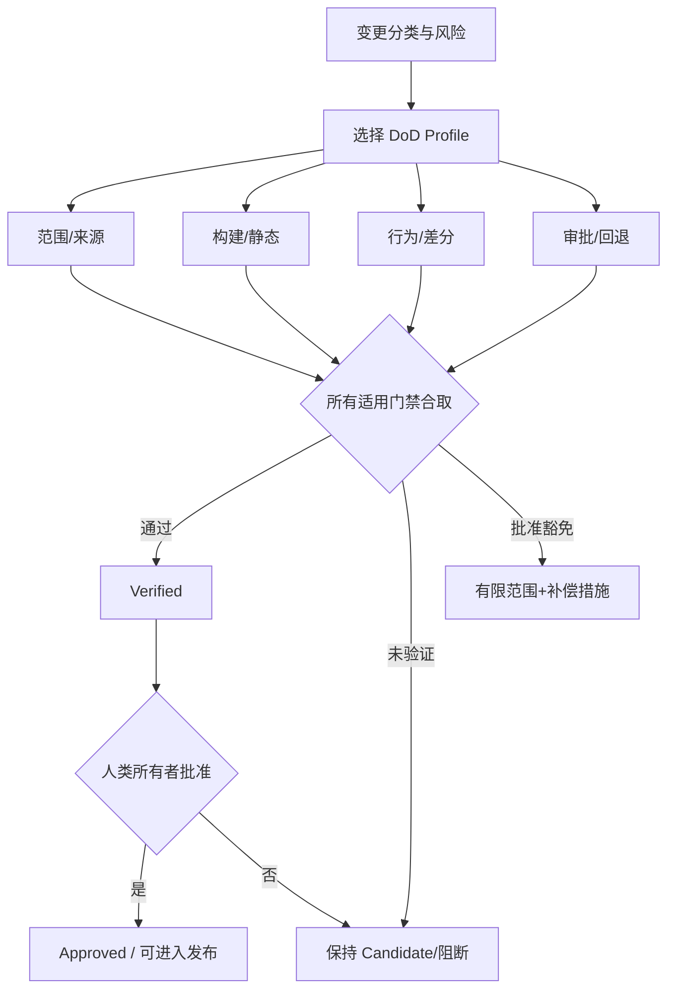

# 第 13 章：AI Migration Definition of Done

> **定位**：本章将前面的契约、门禁、证据包和人类所有权合成完成定义。前置依赖是已进入 `Candidate` 状态的变更包；输出是一个按风险选择、以适用门禁合取决定、能明示表达未验证与豁免的 Definition of Done。

「代码已生成」、「编译通过」、「所有测试通过」和「审稿人已批准」都不能单独定义完成。它们各自回答不同问题：候选是否存在，类型是否成立，已建模样本是否匹配，以及具名负责人是否接受剩余风险。可验证迁移的完成是一组门禁的合取，并且这组门禁要与变更风险和发布阶段对齐。

uutils 当前仓库使用格式、Clippy、依赖政策与多层测试等门禁，并要求 AI 生成变更由人类理解和验证，没有测试不应合并。[E2-STATIC-GATES] [E2-AI-OWNERSHIP] [E2-NO-TEST-NO-MERGE] 本章不将这些仓库命令照搬为任何 Rust 项目的唯一清单，而是提炼「先分类变更，再选择必须同时成立的证据」的方法。

<!-- source: .pre-commit-config.yaml -->
<!-- source: DEVELOPMENT.md -->
<!-- source: AGENTS.md -->

## 完成是一个合取表达式

对一份高风险行为变更，可以把完成概念写成：

\[
Done = Scope \land Provenance \land Build \land Static \land Behavior \land Diff \land Review \land Rollback
\]

- `Scope`：变更符合原子任务边界，没有混入无关决策。
- `Provenance`：上下文、来源、clean-room 和许可要求已满足。
- `Build`：所有目标包、feature 与平台矩阵在适用范围内可构建。
- `Static`：格式、lint、`unsafe` 前提、依赖和仓库策略通过。
- `Behavior`：行为契约有目标、失败、副作用与平台证据。
- `Diff`：适用时的差分/fuzz 反例已分类，候选缺陷已固定回归。
- `Review`：人类负责人理解并批准，异议与豁免有记录。
- `Rollback`：发布阶段、指标、阈值、权限和数据影响已被验证或明示豁免。

这个式子的关键是合取：不能用更多单元测试抵消未审查 `unsafe`，不能用人类签字抵消无法回退，也不能用 Rust 内存安全抵消错误的兼容行为。某一维度不适用时，应以评估和理由将它标记为 `N/A`，而不是从模板中消失。

## 不同变更使用不同 Profile

无语义机械移动、局部兼容修复、共享核心变更、`unsafe`/FFI 变更与生产默认切换的风险不同。如果所有变更使用同一套最重门禁，团队会将模板视为官僚障碍，并逐渐用宽泛豁免绕过它。如果只根据开发者自行声明风险，Agent 又容易把任务分类为最轻量级。因此 Profile 选择应由可观察规则决定。

| Profile | 触发条件示例 | 额外必要门禁 |
|---|---|---|
| Mechanical | 只移动/命名，对外契约不变 | 机械差异审核，移动前后目标+回归一致 |
| Local Behavior | 一个 utility 的一行契约变更 | 反例 red/green、进程副作用、相关差分 |
| Shared Core | 共享错误、I/O、平台层或 multicall | 受影响 utility 矩阵、多 target/feature、独立架构审稿 |
| Safety Critical | `unsafe`、FFI、权限、删除、原子替换或已知安全路径 | 专业安全审稿、故障/竞态测试、攻击面与回退演练 |
| Release Default | 更改默认二进制/路径/广泛流量 | shadow/canary、观察窗口、下游验证、值班与实际回退 |

Profile 可组合。一份共享核心的 `unsafe` 修复同时命中 Shared Core 和 Safety Critical，必须满足两者门禁的并集，而不是任选其一。变更包应记录 Profile 选择与触发规则，使审稿者能检查是否少选。

## 三值状态：Pass、Fail 和 Unverified

许多系统只有绿/红两种结果，但迁移经常面对第三种状态：没有在必要环境运行、夹具不可用、结果因基础设施失败无法判定，或一个新差异尚未分类。将它们标为 Pass 是虚假，标为 Fail 又可能混淆代码问题与验证能力问题。因此 DoD 应支持 `Unverified`。

`Unverified` 默认阻断 `Verified`。若确需继续，必须转化为显式豁免：记录哪个契约缺少证据，为什么无法执行，发布范围如何缩小，有哪些补偿监控，何时补齐，以及谁承担决策。豁免是一条有限期、有边界的替代路径，不是将 `Unverified` 改名为绿色。

## 防止「自我完成」

Agent 可以运行门禁、收集日志、填充变更包，但不能根据自己生成的测试和解释宣布最终完成。机械门禁应验证工件存在与命令结果，人类所有者应验证契约解释、证据强度与豁免可接受性。变更包从 `Verified` 进入 `Approved` 的签署不应由创建候选的 Agent 自动触发。

同样，门禁配置和 DoD Profile 修改应是独立的治理变更。若当前候选因一项检查失败，它不能在同一份变更中把该检查从 DoD 中删除。如果规则确实不合理，由独立证据包和负责人先修改规则，然后所有候选在新基线下重新验证。

## 从合并 DoD 到发布 DoD

通过仓库合并门禁只能说明变更适合进入下一个集成状态。对默认替换，还需要发布 DoD：包装与升级路径可验证，参考与候选可以在 shadow 阶段并行观察，canary 指标与阈值已设置，回退产物、权限和值班链路已演练，观察窗口足以覆盖关键周期。[第 14 章](../part5/ch14-rollout-rollback.md)将展开这个过程；可执行的四值状态表与 Profile 追加项见[附录 E](../appendices/dod-checklist.md)，安全检查见[附录 D](../appendices/rust-safety-profile.md)。

因此，「Done」必须总是带对象的：代码候选已完成，变更包已验证，补丁已合并，候选已通过 canary，或迁移已完成。如果一个团队只说「这个任务完了」，而不说明在哪个状态机上完成，管理者很容易把工程产出误读为发布就绪。

## 模式提炼

**可组合证据合取**：按 Mechanical、Local Behavior、Shared Core、Safety Critical、Release Default 的命中规则组合门禁，所有适用项同时成立才晋级。它要求 `Unverified` 可见且 Agent 不能自改规则；若 Profile 互斥或用一个绿灯抵消另一维缺口，DoD 即失效。

## 局限

Definition of Done 可以让缺口和责任可见，但不能消除未知风险。模板过重会鼓励机械勾选，过轻又无法拦截高风险变更。Profile 规则需根据事故和审计发现演化，并定期检查豁免是否正在变成常态。对无法自动化的设计判断，DoD 仍然需要有能力的人类负责人，而不是一个「已评审」布尔字段。

## 实践清单

- [ ] 将完成写成范围、来源、构建、静态、行为、差分、审批与回退门禁的合取。
- [ ] 根据可观察变更类型选择并组合 DoD Profile，不由 Agent 自由降级。
- [ ] 支持 Pass、Fail 和 Unverified，默认让 Unverified 阻断晋级。
- [ ] 将无法执行的门禁转换为有范围、负责人、补偿措施与期限的显式豁免。
- [ ] 分离机械 `Verified` 与人类 `Approved`，不允许候选 Agent 自我批准。
- [ ] 区分候选、合并、canary 和完整迁移的完成状态，不用一个模糊「Done」包办。

## 本章证据

当前静态门禁、人类所有权与测试要求来自仓库 [E2-STATIC-GATES] [E2-AI-OWNERSHIP] [E2-NO-TEST-NO-MERGE]。合取 DoD、变更 Profile、三值状态与审批分离是本书的变更包与验证阶梯综合 [E4-CHANGE-PACKAGE] [E4-VERIFICATION-LADDER] [E4-ROLLBACK]。

### 版本演化说明

论文基线为 **arXiv:2608.07135**；本地源码基线为 **d8bee62c1ddc227d5e4385d80bbf6d7dee266a41**；本章证据核验日期为 **2026-08-14**。DoD Profile 应随工具链、仓库策略、安全审计和生产事故演化；一份旧变更的完成记录必须保留当时 Profile 与工具版本，而不用新规则重写历史。
