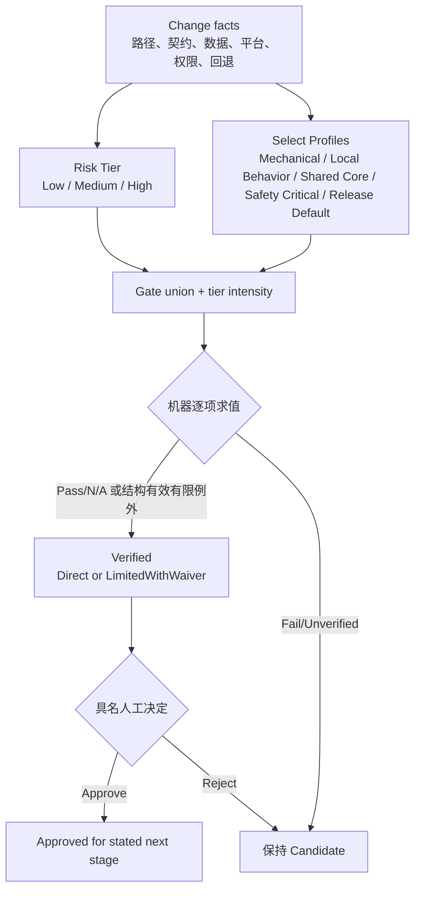

# 第 13 章：AI Migration Definition of Done

> **定位**：本章把第 7–12 章证据合成为风险分级的 Definition of Done（DoD）。输入是 Candidate Change Package；输出是 Profile、门禁合取、例外生命周期和 DoD Decision Record，用来决定候选能否进入下一状态。

## 问题现场：二十七个勾都绿，最关键的一项没有执行

团队为迁移补丁设计了 27 项清单。Agent 自动填表：编译、格式、lint、18 项单元测试、文档、两个 approval，全都显示绿色。候选进入默认发布后，在另一个平台把权限错误当成普通缺文件，脚本继续执行并覆盖了目标。

复盘发现，清单里确实有“目标平台测试”，但 CI 没有对应 runner；生成摘要时空字段被模板渲染成绿色勾。另一个“人工审查”只有签字，没有解释权限分支。回退项写“revert commit”，却没有处理候选已创建的文件。清单项目很多，完成定义却把**未验证、人工决定和恢复能力**折叠成了一个颜色。

反向措施也会失败：团队要求每份补丁运行全 workspace、所有平台、差分、fuzz、安全审查和生产 canary。低风险重命名为等待稀有 runner 停滞，维护者开始批量选择 `N/A`，高风险变更也混在同一模板里。一个不按风险选择的 DoD，要么太轻而漏风险，要么太重而诱发绕过。

固定提交中的仓库事实提供了门禁实例：`DEVELOPMENT.md:53-88` 记录 pre-commit、Clippy、rustfmt 和 cargo-deny 等入口 [E2-STATIC-GATES]；`AGENTS.md:17-23` 要求行为变化与 bug fix 有项目测试、无测试不合并 [E2-NO-TEST-NO-MERGE]；`AGENTS.md:7-10` 要求驱动 Agent 的人负责输出、读 diff、由人回应审稿。[E2-AI-OWNERSHIP] 它们证明该项目有多类门禁与人类边界，不证明任何 Rust 迁移都应照抄同一命令集合。

<!-- source: DEVELOPMENT.md -->
<!-- source: .pre-commit-config.yaml -->
<!-- source: AGENTS.md -->

## 心智模型：完成是“适用门禁的合取”，并且总带对象

DoD 不是一个静态 checklist，而是函数：

\[
DoD(change, scope, stage, policy) = \bigwedge ApplicableGates
\]

输入包括变更事实、声明范围、当前阶段和固定 policy 版本；输出不是“代码永远正确”，而是“证据足以把这个对象推进到下一个状态”。同一补丁可以“候选实现完成”但“发布未完成”；可以“Linux 局部行为 Verified”但“Windows Unverified”；可以“已合并”但“尚未完成默认迁移观察窗口”。

所有门禁必须使用第 12 章同一四值状态：`Pass`、`Fail`、`Unverified`、`N/A`。`Pass` 有可重放证据；`Fail` 有证据显示不满足；`Unverified` 是未运行、基础设施失败、结果不足或差异未裁决；`N/A` 是根据可观察触发规则确实不适用，并有理由与确认。空值不合法。

人工决定沿用 `Approve`、`Reject`、`Waive`，但不修改检查状态。waiver 只能创建一条有限替代路径：保留原 `Unverified/Fail`，记录范围、风险、补偿控制、owner、approver、到期和关闭证据，将 `verification_basis` 标为 `LimitedWithWaiver`。直接证据齐备时为 `Direct`。

完成合取可分为八类：

\[
Done = Scope \land Provenance \land Build \land Static \land Behavior \land Differential \land Ownership \land Recovery
\]

更多单元测试不能抵消来源越界；人类签字不能抵消没跑的平台；Rust 类型安全不能抵消错误退出码；差分相等不能抵消回退不可执行。不同证据维度只能互补，不能用总分相互抵扣。这一 **E4-VERIFICATION-LADDER** 是作者提炼，不是仓库或论文原有公式。

## 先定风险，再选择五个可组合 Profile

风险 tier 与 Profile 是两个正交概念。**Tier** 表达总体审查/发布强度（Low、Medium、High）；**Profile** 表达由变更形状触发的门禁模块。低风险机械变更通常只选 Mechanical；一个很小的 `unsafe` 修复代码行少，却会选择 Safety Critical 并落入 High。不能由 diff 行数单独定级。

### 五维风险评分

| 维度 | Low | Medium | High |
|---|---|---|---|
| 行为表面 | 无外部行为或单一可逆格式 | 单 utility 多 outcome/错误语义 | 广泛契约、共享输出/调度/安全行为 |
| 数据变更 | 无持久状态 | 可恢复文件/配置修改 | 删除、权限、原子替换、不可逆迁移 |
| 平台扩散 | 单一已验证 target | 多 feature/两个代表平台 | 条件代码、稀有 FS/架构、广泛下游 |
| 权限/安全 | 普通非特权路径 | 敏感输入或边界校验 | `unsafe`、FFI、提权、秘密、漏洞路径 |
| 回退成本 | Git revert 即恢复 | 需包/配置切换与清理 | 数据修复、系统关键 provider、长恢复窗 |

团队可把每维记 `0/1/2`，但分数不是最终真理：任一 High 触发 High tier；两个以上 Medium 至少进入 Medium；事故、未知平台或监管要求可以人工上调，不能无证据下调。机器可根据 diff 路径、标签和契约初步计算，风险负责人确认并记录差异。

### 五个规范 Profile

以下名称与语义是第 12 章、附录 B/E 和后续 pipeline 的稳定接口；大小写与空格保持一致：

| Profile | 可观察触发条件 | 追加门禁核心 |
|---|---|---|
| **Mechanical** | 仅移动、命名、格式或等价生成物，声明零契约变化 | 机械 diff 审核；移动前后 build/test 选择一致；不得混入行为改动 |
| **Local Behavior** | 一个 utility/组件的一个行为契约变化 | 最小复现；pre-fix red/post-fix green；进程观察；相关差分/性质；原子回退 |
| **Shared Core** | 公共 crate、错误/I/O/路径/平台层、multicall 或多消费者接口 | 影响矩阵；代表消费者；多 feature/target；架构审稿；宽回归 |
| **Safety Critical** | `unsafe`、FFI、权限、删除、链接、原子替换、安全/隐私路径 | 专项安全审稿；前提/攻击面；故障/竞态/负控；恢复或数据修复演练 |
| **Release Default** | 默认 provider/二进制/路径改变，或广泛真实流量 | 真实产物；shadow/canary；指标阈值；值班；观察窗口；实际回退演练 |

`selected_profiles` 是数组，命中多个取并集。例如共享错误层 FFI 选择 `[Shared Core, Safety Critical]`；局部行为随默认 provider 发布选择 `[Local Behavior, Release Default]`。Profile 不互斥。

机器按可观察事实强制 Profile；人类可增加，删除触发项需独立 policy override，候选 Agent 无权自降。



## 三套风险 DoD：强度不同，状态语义相同

### Low：机械或封闭局部、无持久风险

Low 要求范围/来源清楚、相关 build/static/test 通过、diff 由人读且回退可描述。Mechanical 需机械等价与零行为变化确认；差分、fuzz、平台或 rollout 只有经触发规则才可为 `N/A`。一旦出现契约变化，立即升级 Local Behavior/Medium。

### Medium：局部行为或有限共享影响

Medium 要求契约、最小反例、red/green、进程观察、宽回归、适用平台、风险相称的差分/性质/fuzz、人类 explain-back 和原子回退。Shared Core 再加影响矩阵、代表消费者、feature/target 与独立架构审稿；某工具不适用须写理由。

### High：安全关键、系统关键或默认发布

High 包含 Medium，并按 Safety Critical/Release Default 加专项审稿、威胁/故障模型、权限/竞态负控、真实产物、shadow/canary、指标、值班、观察窗口和恢复演练。waiver 范围更小、期限更短；回退不可行通常直接阻断。

### 风险—门禁矩阵

| 门禁维度 | Low | Medium | High |
|---|---|---|---|
| Scope/Provenance | 路径与来源确认 | 契约/Context Manifest/version | 独立来源/安全审查、异常处置 |
| Build/Static | 相关目标 | 相关+影响范围 | 全组合/关键 target、依赖与安全政策 |
| Behavior | 原有测试或机械等价 | 最小 red/green、进程副作用 | 故障、权限、竞态、真实负载 |
| Differential/Fuzz | 通常 N/A，理由 | 风险相称、差异已分类 | 专项 campaign、长期/生产反例回流 |
| Human | diff 复核 | explain-back、独立技术审稿 | 多专业角色、停止权与值班 |
| Recovery/Release | Git/产物回退说明 | 回退步骤与验证 | 真实演练、数据修复、shadow/canary/阈值 |

## 机器判定与人工决定：同一 schema、不同权限

第 12 章 Change Package 已规定四值检查、三种人工决定和 package phase。本章的 policy engine 只做三件事：根据变更事实算适用 Profile/tier；展开 requirement 并验证 receipt/引用；计算 `eligible_for_verified` 和 `verification_basis`。它不能判断产品是否接受 stderr 差异，不能签署安全风险，也不能把候选 Agent 的解释当 approval。

机器求值记录 policy、触发事实、requirement/status/receipt、N/A/waiver 与 hash，规则升级不重写历史。人工决定记录 role、identity、`Approve/Reject/Waive`、对象 hash、范围、理由和时间，只推进当前阶段；异议保持 `Open/Resolved/AcceptedRisk`，不能用多数签字覆盖专业阻断。

`Verified` 有两种 basis：

- `Direct`：所有适用 requirement 为 Pass，或有确认理由的 N/A；
- `LimitedWithWaiver`：至少一项保持 Fail/Unverified，但存在 policy 允许、结构完整、未过期且将范围收窄的 waiver，其他适用项满足。

原检查事实不变，人工只新增例外决定；到期后包失去晋级资格，除非关闭缺口或创建新 waiver。

## 例外治理：失败、未知、豁免、过期和补偿控制

**Fail** 首选修复并重验。若失败表示契约本身错误，先用独立包更新契约/policy，再让候选重新求值；候选不能为了通过删除门禁。**Unverified** 首选补 runner、修 harness 或分类差异；基础设施失败不应归罪代码，也不应记绿。

waiver 至少含：requirement、当前状态、为什么现在无法满足、最坏影响、批准范围、被排除范围、补偿控制、监控/阈值、回退、owner、approver、`expires_at` 和 `closure_evidence`。只有对该风险有授权的人能批准；候选作者和 Agent 不能自批。补偿控制必须可验证，例如“仅 1% canary、权限异常立即回退”，不能写“密切关注”。

到期只有三种结果：补证转 Pass；发现问题维持/转 Fail 并停止；重新评估后创建新的 waiver revision。自动延长、空到期或“直到有时间”为无效。系统应统计同一 requirement 的 waiver 频率；若反复出现，说明验证能力或 Profile 设计有结构缺陷，需要治理任务。

N/A 也会腐化。每项 N/A 必须有触发规则、理由和确认角色；一旦变更事实改变，机器重新计算。例如局部 utility 的 Windows 测试可因契约只支持 Linux而 N/A，但共享路径代码使它重新适用，旧 N/A 不能沿用。

## 完整工程案例

案例：`CP-ERROR-004` 修改共享错误转换，让两个 utility 的缺能力分支返回 `2`。diff 只有几十行，但触及公共 crate、多个消费者和平台条件。风险评分：行为表面 Medium、数据 Low、平台 High、权限 Low、回退 Low，因此总 tier 为 High；选择 `[Local Behavior, Shared Core]`，未触发 Safety Critical/Release Default。

**Profile 展开。** Local Behavior 要求两个最小反例、red/green、进程输出/退出/副作用和相关差分；Shared Core 要求消费者影响矩阵、代表 utility、全 feature build、Unix/Windows runner和独立架构审稿。静态规则从固定仓库入口选择实际命令，不声称编译证明行为。[E2-STATIC-GATES]

**第一轮求值。** Linux 两个回归 red/green，代表消费者测试和静态门禁 Pass；Windows build Pass，但运行环境不可用，`SHARED-WINDOWS-RUN` 为 Unverified。Agent 摘要说“所有测试通过”，schema 渲染器拒绝该句并保持 Candidate。人类 approval 尚未进入求值。

**选择路径。** 因公共转换在 Windows 可达，平台负责人拒绝 N/A。团队有三个选择：补 runner；拆分接口使当前变更不触及 Windows；或申请有限 waiver。deadline 不能自动选择。最终发布负责人批准一个只允许合并到隔离分支、不进入默认产物的 waiver，补偿是 Windows build、静态路径审查和禁止发布；期限七天，关闭证据是实机回归。

**LimitedWithWaiver。** 原 requirement 仍为 Unverified，`verification_basis=LimitedWithWaiver`，scope 标 `integration_branch_only`。机器确认 waiver 结构、权限、期限与范围后允许 Verified；维护者 explain-back 和独立架构审稿通过后，人工决定只 Approve 该有限阶段。没有任何字段显示 Windows Pass。

**关闭。** runner 恢复后测试发现退出仍为 `1`，requirement 转 Fail 并阻断。新原子任务修复后 red/green 转 Pass，旧 waiver 以 closure evidence 关闭，basis 回到 Direct；所有者重新签署 revision。

**进入发布。** 将来若该共享变更随默认 provider 发布，另一个 release package 选择 Release Default，引用本包而不修改历史。shadow/canary/指标/回退由[第 14 章](../part5/ch14-rollout-rollback.md)证明。完成始终带对象与阶段。

## 反例

**清单合规反例。** 团队给每项都勾选，但没有 receipt、N/A 理由或对象版本。清单只能证明有人填过表。DoD 要求结构化证据、负控、机器求值和人工决定，不能把勾选数量当完成。

**单项绿灯反例。** 编译通过不能证明退出码，差分相等不能证明文件系统未采集字段，人类签字不能证明 runner 执行，canary 低错误率不能抵消一次数据损坏。合取禁止跨维抵扣。

**最重 Profile 取代并集。** `[Shared Core, Safety Critical]` 只选“看起来更重”的 Safety Critical，会漏消费者矩阵；只选 Shared Core 又漏 unsafe 前提。五个 Profile 规范是正交追加模块，永远取并集。

**Agent 自降级。** 候选修改共享路径却在包中声明 `Local Behavior`。机器应从 touched paths/contract facts 强制 Shared Core；若规则误报，使用独立 policy override，而不是让候选编辑当前要求。

**永久 waiver。** “缺 runner，持续监控”没有范围、期限或回退，不是例外治理。它把验证缺口变成组织遗忘。有效 waiver 必须收窄阶段并自动过期。

## 模式提炼

**模式一：风险分级、Profile 组合。** 问题是统一清单过轻或过重；机制是五维 tier 决定强度，五个可观察 Profile 决定模块，取要求并集。前提是变更事实可采集；失效边界是 Agent 自报风险或 policy 漂移。人工可上调，降级需独立决定。

**模式二：证据合取。** 问题是总分掩盖关键缺口；机制是适用门禁全部满足才能 Direct Verified。前提是每项有唯一语义与 receipt；失效边界是高度相关测试被当独立证据。补充负控和不同路径审查。

**模式三：未知保持未知。** 问题是流程把空白渲染绿色；机制是 Unverified 默认阻断，waiver 不改原状态。前提是系统支持四值与期限；失效边界是例外常态化。统计 waiver 并修验证能力。

**模式四：阶段化 Done。** 问题是合并被误读成迁移完成；机制是每个 package phase/发布阶段有独立对象和 Profile。前提是工件可串联；失效边界是同一批准跨阶段复用。发布新包引用历史证据而不篡改。

## 可复用工件

下面 **DoD Decision Record** 与第 12 章 schema 使用同一状态、人工决定、Profile 名称和 basis。它是 E4 模板，不是 uutils 现行文件。

```yaml
schema: dod-decision/v1
decision_id: DOD-ERROR-004-R3
change_package: CP-ERROR-004@r3
object_hash: sha256:change-package-r3
policy_version: migration-dod/v1
risk:
  tier: High
  dimensions:
    behavior_surface: Medium
    data_mutation: Low
    platform_spread: High
    privilege_security: Low
    rollback_cost: Low
  confirmed_by: risk-owner
selected_profiles: [Local Behavior, Shared Core]
profile_triggers:
  Local Behavior: behavior_contract_changed_for_two_utilities
  Shared Core: shared_error_conversion_touched
requirements:
  - id: LOCAL-RED-GREEN
    status: Pass
    evidence: [RUN-ERROR-RED, RUN-ERROR-GREEN]
  - id: SHARED-CONSUMERS
    status: Pass
    evidence: [IMPACT-ERROR-004, RUN-REPRESENTATIVE-UTILS]
  - id: SHARED-WINDOWS-RUN
    status: Pass
    evidence: [RUN-WINDOWS-ERROR-004]
  - id: RELEASE-SHADOW
    status: N/A
    reason: Release Default_not_selected
    confirmed_by: release-owner
waivers:
  - id: WV-WINDOWS-004
    requirement: SHARED-WINDOWS-RUN
    original_status: Unverified
    scope: integration_branch_only
    compensating_controls: [windows_build, no_release_artifact]
    owner: platform-owner
    approver: release-owner
    expires_at: 2026-08-21
    closure_evidence: RUN-WINDOWS-ERROR-004
    state: Closed
machine_evaluation:
  eligible_for_verified: true
  verification_basis: Direct
  evaluated_at: 2026-08-20T10:00:00Z
  result_hash: sha256:evaluation
human_decisions:
  - role: architecture_reviewer
    decision: Approve
    scope: merge
    object_hash: sha256:change-package-r3
    reason: consumers_and_platform_paths_verified
  - role: change_owner
    decision: Approve
    scope: merge
    object_hash: sha256:change-package-r3
    reason: explain_back_complete
package_transition: Candidate -> Verified -> ApprovedForMerge
residual_unknowns: []
```

记录保留已关闭 waiver；r3 为 Direct，旧 r2 保持 Unverified + LimitedWithWaiver，历史不会被补证重写。

## AI Coding 工作台

Agent 可建议风险/Profile、运行门禁、采集 receipt 和列缺口；不能下调强制项、把空值当 N/A、批准 waiver、修改当前 policy 或写人类签名。工作台并列显示 requirement status、机器 `eligible/basis` 与人工 decision/objection，摘要始终保留 Unverified/Fail。提示只负责聚焦：“按固定 policy 评估；无法执行标 Unverified；只起草 waiver；需改门禁则停止。”字段权限仍由系统强制。

## 能证明什么／不能证明什么

| 能证明什么 | 不能证明什么 |
|---|---|
| 固定项目有静态检查入口、测试要求与人类输出责任。[E2-STATIC-GATES] [E2-NO-TEST-NO-MERGE] [E2-AI-OWNERSHIP] | 本书五 Profile 是仓库现行标准，或这些命令足以证明任意迁移完成。 |
| policy engine 可证明声明变更事实按固定版本展开了哪些 requirement，并校验 receipt/状态/waiver 结构。 | 风险事实完整、测试期望正确、人工接受剩余风险合理。 |
| Direct basis 可证明所有已知适用门禁为 Pass/确认 N/A。 | 没有未知缺陷、未生成输入正确、生产不会出现新环境。 |
| LimitedWithWaiver 可证明缺口保持可见且例外具备范围、控制、owner 与期限。 | 缺失验证已经通过，或补偿控制与直接证据等价。 |
| 五 Profile 取并集可防止一个维度的“更重”覆盖另一维度。 | Profile 触发规则永远完备；事故仍需反向更新 policy。 |

## 局限

DoD 使证据和缺口可见，不能消除未知。tier/Profile 不是形式化证明；policy 要随事故、审计和平台演化并独立审查。

门禁有成本和相关性。多项测试可能共享同一错误 fixture，表面数量不能当独立信心；高风险人工审查也会疲劳。组织应度量 escape、waiver、返工和回退准备度，而不是追求勾选数或永远零失败。DoD 的目标是诚实晋级，不是制造“从不出错”的形象。

## 实践清单

- [ ] 每个 Done 声明写清对象、范围、阶段和 policy 版本。
- [ ] 风险按行为、数据、平台、权限和回退五维判定；任一 High 不被平均。
- [ ] 只使用五个规范 Profile 名称，命中多个取 requirement 并集。
- [ ] 状态固定为 Pass、Fail、Unverified、N/A，空值非法。
- [ ] 人工 Approve/Reject/Waive 不改写机器检查事实。
- [ ] Direct 与 LimitedWithWaiver 分开，waiver 有范围、补偿、owner、期限和关闭证据。
- [ ] Candidate Agent 不得修改当前 policy、自降 Profile 或自我批准。
- [ ] 区分 ApprovedForMerge、Staged、Observed 与完整迁移，不复用跨阶段签字。

## 练习

- **练习一：设计验证。** 给一个修改共享路径解析且含一处 `unsafe` 的 20 行补丁做五维风险评估，选择 `[Shared Core, Safety Critical]`，为每个 Profile 各设计两项不能被另一 Profile 替代的门禁与负控。
- **练习二：三套 DoD。** 将同一行为问题分别放入 Low（只改测试说明）、Medium（局部实现修复）和 High（随默认 provider 发布），写出每层 Pass/N/A/Unverified 的差别，不允许用测试总数抵消恢复门禁。
- **练习三：例外生命周期。** 构造一个 runner 不可用的 Unverified 项，先证明它阻断 Direct；再写 LimitedWithWaiver，模拟到期时“补证 Pass”“发现 Fail”“重新评估”三条路径，并保持历史状态不被重写。

## 本章证据

静态工具入口来自 [E2-STATIC-GATES]；行为修复与测试合并边界来自 [E2-NO-TEST-NO-MERGE]；Agent 输出与人类审稿责任来自 [E2-AI-OWNERSHIP]。风险五维、三 tier、五个可组合 Profile、合取公式、四值状态、waiver 生命周期和 DoD Decision Record 均为 E4-CHANGE-PACKAGE/E4-VERIFICATION-LADDER 作者综合，不是行业标准或形式化证明。

### 版本演化说明

论文基线为 **arXiv:2608.07135**；规则事实固定在 **d8bee62c1ddc227d5e4385d80bbf6d7dee266a41**；本章核验截止日为 **2026-08-14**。工具与 policy 会演化，但后续附录和 pipeline 应把 **Mechanical、Local Behavior、Shared Core、Safety Critical、Release Default** 作为五个可组合规范接口，并保持 `Pass/Fail/Unverified/N/A`、`Approve/Reject/Waive` 与 `Direct/LimitedWithWaiver` 的语义一致。
