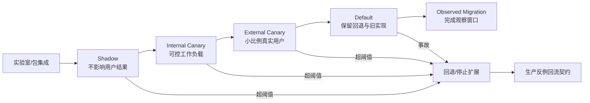
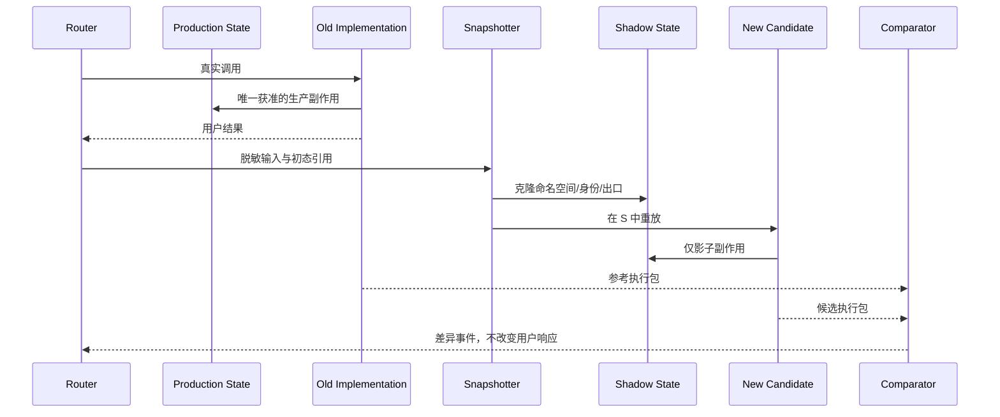

# 第 14 章：Shadow、Canary、监控与回滚

> **定位**：本章将已批准变更从仓库带入生产环境。前置依赖是通过合并 DoD、拥有可构建产物和回退影响评估的变更包；输出是每阶段都有准入、观察窗口、扩展决策与回退阈值的渐进发布路径。

仓库内测试无法枚举生产环境里的所有脚本、文件系统、locale、安全策略、包升级顺序与资源竞争。因此，默认替换不应是「发布一个新二进制」的单点事件，而应是一组可逆、可观察、逐步增加真实流量的实验。

uutils 论文将操作系统集成与项目经验纳入分析，说明迁移成功不能停留在上游测试。[E1-OS-INTEGRATION] [E1-LESSONS] Ubuntu 25.10 的官方迁移设计处理 Essential 包在解包过程中不能暂时丢失工具、供应者包切换、旧实现共存和回退机制，显示生产发布的原子性与代码原子性是两个层次。[E3-MIGRATION-DESIGN]

<!-- source: book/src/appendices/evidence-index.md -->

## 问题现场：全绿以后，第一次真实失败发生在哪里

设想团队迁移了一个内部归档命令 `archive-pack`。CI 覆盖了普通文件、空目录、无权限输入和磁盘写满；差分样本中 stdout、stderr、退出码与输出树均一致；Change Package 也通过了第 13 章的 Local Behavior 与 Release Default Profile。于是发布经理把默认路径一次性切到候选。切换后第一个工作日，某个租户的目录中出现了一个测试从未构造过的远端文件系统挂载点：候选在列目录时经历短暂超时，调用方重试，同一归档被提交两次。最终字节都正确，但下游把第二份归档视为新版本，覆盖了审计链中的第一次时间戳。

这个事故不是“测试没有价值”，而是测试结论被越界使用。仓库证据证明的是受控环境中的已建模行为；它没有证明真实租户、挂载类型、重试器和调度窗口的笛卡尔积。发布阶段需要继续提出反例，而且必须在反例仍只影响有限对象时发现它。若没有双实现路由、可定位的流量分组和经演练的回退，团队只能在未知影响面上边查边修。

Ubuntu 25.10 的 `date` 通知提供了一个真实边界：2025 年 10 月 23 日发布的官方说明称，一个当时已解决的问题曾使部分系统不能自动检查可用更新，并给出不受影响的修复版本。[E3-DATE-INCIDENT] 本章不推断通知没有披露的实现根因，也不把 Ubuntu 的包方案复制为通用发布平台；它只提炼一个生产约束：基础工具的局部差异可能经下游链路放大，回退和观测必须在默认切换前存在。

## 心智模型：发布是受控取证，不是代码搬运

第 13 章的 DoD 回答“候选是否有资格进入下一环境”，本章回答“下一环境怎样产生新的证据，同时限制错误半径”。两者接口是一份不可变的发布候选：产物摘要、Behavior Contract、Change Package、所选 DoD Profile、已知差异、未验证项和回退影响必须一起冻结。若进入 canary 后又重新构建二进制，先前证据与实际产物就失去连接。

一次发布实验可写成五元组：

\[
R = (Artifact, Cohort, Observation, Threshold, Recovery)
\]

`Artifact` 是被验证的精确产物；`Cohort` 是哪些调用会观察候选；`Observation` 是要收集的行为、性能与系统结果；`Threshold` 是扩流、停留和回退规则；`Recovery` 是恢复旧路径以及修复候选副作用的程序。五项缺一，所谓“canary”很可能只是小流量直发：它减少了请求数，却没有形成可判断的实验。

发布证据有两种互补性质。**比较证据**把候选与参考置于相同或可比输入下，回答差异在哪里；**运行证据**观察候选在真实依赖链中是否满足服务目标。Shadow 偏向前者，canary 偏向后者。不能用 shadow 中的“输出相等”替代 canary 的下游健康，也不能用 canary 的低工单量替代逐字段兼容比较。

## 六个发布状态



**实验室/包集成**验证真实发布产物，而不只是开发者 `target/` 中的二进制。要在干净环境中安装、升级、降级和切换供应者，检查关键工具文件在解包和切换的任何时点都不会缺失，手册、shell completion、安全 profile 与符号链接一致。

**Shadow**在不改变用户结果的前提下将真实输入同时交给参考与候选。对纯读操作，可以完整双运行；对写操作，不能简单执行两次，需使用副本、仿真平台、事务影子或只对解析/计划阶段做 shadow。用户只看到已批准实现的结果，候选差异作为离线事件进入分类。

### Stateful shadow 的隔离语义

“候选结果不返回给用户”并不足以定义 shadow。只要候选能修改与参考共享的文件、锁、缓存、配额、审计记录或下游队列，它就已经影响真实结果。stateful shadow 必须同时满足四类隔离：

1. **命名空间隔离**：候选只能看到由同一初态克隆的影子目录、卷或事务分支；所有路径在进入候选前完成受审计映射，禁止通过绝对路径、符号链接或 mount 逃回生产命名空间。
2. **身份与权限隔离**：使用不能写生产资源的独立身份。只依赖“程序约定不写”不是控制；权限系统应让误写失败，并把失败作为 shadow 结果记录。
3. **副作用出口隔离**：网络、消息、通知、计费、日志触发器和外部命令要被阻断、替换为 sink，或赋予幂等测试键。候选生成的邮件即使不被最终用户看到，也可能触发其他系统。
4. **生命周期隔离**：每次执行从可寻址快照开始，结束后保存最小差异并销毁工作副本。不能让上一次候选的残留成为下一次输入，否则比较对象已不再共享初态。

对“读取后更新缓存”或“读取时获取排他锁”的命令，读写分类不能只看业务语义。若候选会改变任何共享状态，就按 stateful 路径处理。无法可靠隔离时，只 shadow 参数解析、计划生成或只读探针，把完整执行留给可恢复的 internal canary，并在 Change Package 中将“完整 shadow 未执行”标为 `Unverified`，而不是声称不适用。



**Internal Canary**将候选交给团队可控且可恢复的工作负载，例如专用 CI runner、内部容器构建或镜像生成。它检验真实脚本与负载，但故障半径仍受组织控制。准入条件不只是 shadow 差异数为零，还要确认所有差异已分类、观测与回退可用。

**External Canary**将真实用户或机器的小比例流量切换到候选。分组不应只随机，还应覆盖架构、平台、文件系统、地区/locale、云镜像与高价值工作负载的代表性。高破坏性工具需要比只读工具更小流量、更长观察与更低回退阈值。

Canary 的基本单位不是“百分之一请求”，而是可解释且可撤回的 cohort。按机器分组可以避免同一工作流在一次执行中混用实现；按租户分组便于确定影响与通知；按 utility、平台和文件系统分层便于诊断。对于包含多步状态变更的工具，粘性路由通常比逐请求随机更安全：同一作业在观察窗口内固定到一个实现，回退时再以作业边界切换，避免新旧实现交替写同一状态。

逐级放量至少包含“准入—最小样本—最短窗口—代表性要求—扩展批准”五项。1% 到 5% 的变化不是数字自动触发；发布负责人要确认新样本确实增加了平台或负载覆盖，而不是只重复低风险主路径。若样本总量达到门槛但关键月度任务尚未出现，应保持当前阶段或定向纳入该任务，不能用更多普通调用抵消周期缺口。

**Default 与 Observed Migration**区分「已经成为默认」与「迁移已经完成」。成为默认后，旧实现、切换机制、监控和值班仍需保留足够长时间，覆盖日/周/月周期、升级波次和稀有工作负载。只有观察窗口完成、重大差异关闭、回退仍可执行并且所有者批准时，才能关闭迁移项目或缩减双实现支持。

## 监控四象限

| 象限 | 指标示例 | 需要的基线 |
|---|---|---|
| 正确性 | 非预期退出码、stderr 类别、shadow 差异、文件快照偏差 | 旧实现同负载或发布前历史值 |
| 性能 | p50/p95/p99 时延、CPU、峰值内存、I/O、二进制/镜像大小 | 按工具、输入大小、平台和冷/热状态分层 |
| 故障率 | 超时、崩溃、重试、系统更新失败、工作负载中断 | 参考实现历史率与 canary 对照组 |
| 回退信号 | 数据丢失/权限异常、高危审计发现、关键包链断裂、手动退回请求 | 预先批准的绝对阈值，不只是统计波动 |

正确性与性能不应混成一个总分。一个更快但偶发删错文件的实现不会因为性能收益而达标。同样，一个字节完全兼容但使系统构建耗时倍增的默认替换也可能无法接受。每个指标都需要绑定变更包中的契约或非功能目标，并在扩展前完成观察窗口。

## 扩展决策与观察窗口

一个阶段通过不是「运行了 24 小时没人报 bug」。需在阶段前定义：最少执行量/用户数，必须覆盖的负载类别，必须经历的时间周期，允许的差异类型，性能区间，以及回退绝对信号。只有样本量和时间同时满足，才能覆盖稀有路径与周期任务。

扩展必须是一次新决策，不应在当前阶段起始时就自动排定。负责人需审查差异分类、指标趋势、事故和豁免是否变化。一个未分类但频率很低的文件状态差异，不应因为总体成功率足够高而被淹没。已批准的文本差异则应出现在精确 allowlist 与用户文档中，不应永久阻断。

指标应同时拥有相对阈值和绝对阈值。相对阈值回答候选相对对照是否退化，例如某平台非零退出率高出 0.2 个百分点；绝对阈值保护不能接受的事件，例如任一经确认的数据丢失、越权路径访问、关键包链不可用或无法执行回退。绝对阈值一旦命中，样本量和总体成功率都不能把它平均掉。

指标还要有观察延迟定义。错误率可在分钟内稳定，数据完整性可能要等下游消费，资源泄漏可能在长进程或重复任务后出现。发布记录必须说明每项信号的最迟到达时间；扩流不得早于关键延迟窗口。否则“观察 24 小时”只是一段时长，不代表已看见需要看的结果。

## Kill switch：把停止权落实到路由、权限和验证

Kill switch 不是配置文件里一个布尔值。它是一条经过身份验证、权限隔离、传播有界且能确认生效的控制路径。至少回答六个问题：谁能触发；触发对象是 utility、cohort、平台还是全部候选；配置多久到达每台机器；在途作业如何处理；离线节点恢复后会读到什么默认；怎样证明请求已回到参考实现。

推荐使用 fail-closed 的发布控制面：当路由配置过期、观测后端不可用或候选健康未知时，不继续扩流；高风险场景直接回到参考实现。对已开始的写操作，立即杀进程可能留下更坏中间态，因此 kill switch 要区分“拒绝新任务”“等待当前事务完成”“按恢复手册中止并清理”。这些语义必须与 Behavior Contract 的提交点一致。

每次触发都生成事件 ID，记录发起者、范围、理由、传播完成时间、在途任务数、恢复验证和重新开启条件。没有这一回执，控制台显示“off”只能证明配置接受了写入，不能证明生产已经恢复。

## 回退必须先于迁移设计

回退不能在事故发生后才讨论。Ubuntu 的迁移设计之所以讨论供应者包、Essential 文件不得消失、保护性 diversion 与 GNU 变体，就是因为切换机制自身可以使系统无法继续执行包管理命令。[E3-MIGRATION-DESIGN] 对其他系统，类似风险可能是数据库 schema 不向后兼容、通信协议已被新客户使用，或旧二进制无法读取候选产生的文件。

回退计划应包含五层：路由/默认开关回退；二进制/包回退；配置与符号链接回退；数据与副作用修复；对受影响用户/下游的通知。演练必须使用真实产物、权限和操作手册，计时并检查回退后的行为契约，而不只演示开关能够从开变成关。[E4-ROLLBACK]

### Rollback drill 的最低通过条件

演练从一个可验证的触发开始，而不是发布经理口头说“现在回退”。在隔离或限定 cohort 中注入错误阈值，确认告警抵达正确值班人；由有权限的人使用正式入口触发；观察路由收敛；等待或清理在途写操作；验证旧产物摘要、默认链接/包 provider、配置和关键契约；最后检查候选造成的状态是否需要前向修复。

演练要产生两个时间：`time_to_decision` 从信号出现到授权回退，`time_to_verified_recovery` 从授权到关键契约重新通过。前者暴露所有权和告警问题，后者暴露控制面、包与数据恢复问题。只报告“恢复耗时五分钟”会把两类瓶颈混在一起。

通过条件至少包括：正式凭证可用且有备份负责人；旧产物仍可获取并验证摘要；离线/延迟节点不会在恢复后重新启用候选；在途任务处置符合契约；恢复探针覆盖真实下游，而不只检查进程启动；事件记录可追到变更包。任何一项失败都使 Release Default Profile 回到 `Unverified`。

## 完整工程案例

回到 `archive-pack`。团队先冻结候选 `sha256:ap-042`，关联契约 `BC-AP-042` 与第 13 章组合 Profile `[local_behavior, release_default]`。实验室阶段用正式包在干净镜像中安装、升级和降级，确认旧版能读取候选生成的格式；回退影响评估发现归档索引一旦提交会触发下游通知，因此 stateful shadow 禁止访问真实索引和通知队列。

Shadow 路由复制脱敏参数，并从只读快照创建独立目录。候选身份没有生产写权限，网络出口只允许写入测试 sink。比较器同时检查退出状态、归档内容清单、权限、资源峰值和临时文件残留。第一轮发现远端挂载快照无法稳定复现；团队没有把它列为“shadow 通过”，而是保留 `UNVERIFIED-FS-REMOTE`，把 internal canary 限定到可恢复的测试租户。

Internal canary 使用粘性租户 cohort，故意注入一次超时。监控显示候选退出非零，但调度器按原策略重试；幂等键使第二次提交被拒绝，没有覆盖审计链。这个结果使团队补充一项系统契约：归档提交以作业 ID 幂等，而不是依赖命令绝不重试。新反例回流为进程测试和模拟队列测试，Change Package 更新后重新从 shadow 开始。

第二轮进入 external canary：先选 20 个可恢复租户，覆盖本地盘、网络盘、两种 locale 与月末批处理；最短窗口跨过一次周任务和一次月末任务。正确性指标按契约 ID 统计，性能按输入规模分桶；任一内容摘要偏差、越权写或审计链断裂为绝对回退信号。p99 上升 6% 只触发停留与调查，因为仍在批准区间；一次候选临时目录清理失败命中故障率阈值，扩流停止但无需回退已完成作业。

发布前的 rollback drill 注入“候选健康未知”。值班人在 90 秒内决定关闭新任务，路由在 45 秒内收敛；两个在途作业按契约完成后不再接收候选任务。旧实现恢复后，探针执行真实归档并由下游读取，验证的不只是进程启动。事件回执暴露一台离线 worker 的配置 TTL 太长，团队修正后重演。只有这一缺口关闭，才从 20 个租户扩到 5%，再逐步成为默认。

默认切换后仍保留旧产物、kill switch 和监控，直到观察窗口覆盖升级波次与两次月末任务。最终“Observed Migration”结论写成：已覆盖哪些 cohort、执行量和周期；哪些平台仍由旧实现服务；回退最后演练时间；剩余未知。它不是一句“100% 成功”。

## 反例

最典型的反例是“CI 全绿，所以周五全量”。它把仓库 DoD 误当发布 DoD；没有真实 cohort、没有观察延迟、没有旧路径在线验证，也没有证据证明包切换过程中关键命令始终可用。出事后即使能 revert Git，已部署包、离线节点和候选副作用仍不会自动恢复。

另一个反例是伪 shadow：参考和候选都在同一工作目录执行，候选输出不返回给用户，于是团队称其为“只观察”。候选先清理了一个临时文件，参考随后看到不同初态；比较器报告差异，团队反而把它归为噪声。更危险时，候选双写真实队列，造成用户可见副作用。修复不是增加 normalization，而是建立命名空间、身份、出口和生命周期隔离；做不到就降级为计划阶段 shadow。

第三个反例是自动扩流。平台设定“错误率连续一小时低于 0.1% 就从 1% 扩到 25%”，却没有检查样本是否覆盖高风险文件系统，也没有把单次数据损坏设为绝对停止信号。统计阈值能管理频率，不能替团队定义不可接受的事件。

## 可复用工件

下面的 **Rollout Readiness Record** 与第 13 章 Profile 接口直接组合；它追加发布证据，不重新定义通用 DoD。

```yaml
rollout_id: "ROLLOUT-AP-042"
candidate:
  artifact_digest: "sha256:..."
  behavior_contracts: ["BC-AP-042"]
  change_package: "CP-AP-042"
  profile_schema_ref: "chapter-13/profile-schema-v1"
  selected_profiles: ["local_behavior", "release_default"]
  residual_unverified: ["UNVERIFIED-FS-REMOTE"]

stateful_shadow:
  production_result_owner: "old"
  namespace: "snapshot per run; no production mounts"
  identity: "shadow-ap; production write denied"
  egress: "test sink only"
  lifecycle: "clone -> execute -> compare -> retain digest -> destroy"
  escape_tests: ["absolute-path", "symlink", "network", "queue"]

stages:
  - name: "internal-canary"
    cohort: "20 recoverable tenants; sticky by job"
    admission: ["shadow classified", "kill switch green", "drill current"]
    minimum_sample: "all declared FS/locale classes"
    minimum_window: "one weekly and one monthly cycle"
    expand_if: "all required observations pass; no open critical diff"
    hold_if: "performance outside review band or delayed signal pending"
    rollback_if: ["data-integrity", "privilege-boundary", "critical-chain"]

kill_switch:
  scope: ["utility", "cohort", "platform", "global"]
  decision_owner: "release-owner"
  operator_backup: "on-call-secondary"
  config_ttl: "60s"
  in_flight_policy: "finish committed transaction; reject new"
  recovery_probes: ["route", "artifact", "contract", "downstream"]

rollback_drill:
  last_run: "2026-08-10T03:00:00Z"
  injected_signal: "candidate-health-unknown"
  time_to_decision_seconds: 90
  time_to_verified_recovery_seconds: 135
  evidence: "DRILL-AP-042-02"
  unresolved: []

privacy:
  capture_minimization: "argv/path hashed; content absent"
  retention: "30d raw, 1y aggregate"
approvals:
  contract_owner: "..."
  evidence_owner: "..."
  release_owner: "..."
```

评审时先核对 `artifact_digest` 与已验证产物是否相同；再核对 stateful shadow 四种隔离是否由技术控制而非约定；最后从 `rollback_if` 随机抽取一个信号现场演练。`last_run` 超过组织规定的有效期，或候选/路由发生实质变化后未重演，回退准备度自动降为 `Unverified`。

## AI Coding 工作台

Agent 可以协助生成 cohort 覆盖矩阵、从执行包聚类差异、校验工件引用、起草演练步骤和检查阈值是否缺少单位。它不能决定一个历史差异是否可接受，不能把未分类事件自动加入 allowlist，也不能因总体指标好看而解除绝对回退信号。

发布任务的允许输入应包括冻结 Change Package、只读指标 schema、脱敏执行包、路由配置和演练沙箱；禁止输入包括未经授权的原始用户内容、生产凭证和可直接修改全局流量的令牌。Agent 输出只能是候选配置、分析与待批准操作。真正执行扩流、豁免和回退的身份由具名人类控制，并产生独立审计事件。

一个合格的发布提示骨架是：“对 `ROLLOUT-AP-042` 检查 internal-canary 准入；只读取列明工件；列出缺失证据和阈值歧义；不得修改流量或告警；若发现未分类正确性差异、shadow 隔离逃逸或 drill 过期，停止并返回阻断理由。”这把 Agent 用在一致性检索上，而不是把生产授权交给语言模型。

## 能证明什么／不能证明什么

| 能证明什么 | 不能证明什么 |
| --- | --- |
| 隔离测试可证明候选身份无法写已列生产资源 | 不能证明遗漏的出口或内核/平台隔离零缺陷 |
| Shadow 相等可证明已采集字段在已重放样本上落入允许集合 | 不能证明未采集副作用、未来输入或真实时序全部兼容 |
| Canary 指标可证明已定义 cohort 和窗口中的运行结果 | 不能把低平均错误率外推为没有绝对数据安全事件 |
| Kill switch 演练可证明当时产物、权限和控制面的恢复路径 | 不能保证凭证、拓扑或人员变化后仍可用，必须重演 |
| Observed Migration 记录可证明声明范围内已完成观察 | 不能证明其他平台、长尾周期或新版本自动继承结论 |

## 练习

- 为一个会写文件、发送通知并更新缓存的命令设计 stateful shadow。画出命名空间、身份、出口和生命周期四种隔离，并列出一个能证明隔离真实生效的逃逸测试。
- 给“候选错误率”“p99”“数据损坏”“关键下游停更”分别设置扩流、停留和回退规则。说明哪些是相对阈值、哪些必须是绝对信号，以及信号最迟多久到达。
- 设计一次 rollback drill：注入条件、两位操作人、在途任务策略、恢复探针和证据回执必须完整。再故意让一个离线节点错过配置，说明门禁应怎样失败。

## 生产反馈必须回到工程系统

一次 canary 差异不应只在监控平台中关闭。它要变成可重放的执行包，脱敏后进入差分/fuzz 语料，更新行为契约，并产生新的原子修复包。如果环境或并发条件不能在 CI 完整重现，至少应保留触发条件、状态快照、平台和时序，建立专用隔离回放环境。

回退本身也是一个事件。需要记录触发指标、决策人、用时、受影响范围、数据修复、回退后验证与是否发生二次影响。这些事实可改进下一个发布阶段的阈值与手册。迁移成熟度的标志不是从不回退，而是能早期发现、快速限制影响、可验证地恢复并将知识固化。

## 模式提炼

**可逆的扩流状态机**：实验室、Shadow、内部/外部 Canary、Default 与 Observed Migration 各有准入、观察和回退条件。它适用于能隔离流量并保留旧路径的系统；若写操作被无保护双跑、回退没有真实演练或 Default 被当作完成，状态机不能控制爆炸半径。

## 局限

Shadow 对有副作用的命令成本高且可能危险，不应为了「覆盖率」在真实数据上双写。Canary 样本也可能无法代表稀有平台和长尾工作负载，低故障率不等于无数据安全风险。双实现共存会增加包、安全维护和支持成本，因此需要明确退场条件；但退场不应早于发布风险可被另一套机制管理。

监控本身还可能泄漏命令参数、路径与用户数据，因此观测设计必须同时符合最小化采集、脱敏、保留期和访问权限要求。不能为了证明兼容而创建新的数据安全问题。

## 实践清单

- [ ] 用真实包/产物演练安装、升级、降级、供应者切换与任何时点的工具可用性。
- [ ] 对读操作与写操作分别设计 shadow，不在真实数据上无保护双写。
- [ ] 为每个阶段定义准入、代表性样本、观察窗口、扩展决策与回退阈值。
- [ ] 同时监控正确性、性能、故障率和绝对回退信号，不混成一个总分。
- [ ] 在迁移前设计并实际演练路由、二进制、配置、数据与通知五层回退。
- [ ] 把 canary 差异与回退事件回流为契约、最小回归、生成器种子和新变更包。

## 本章证据

操作系统集成与长期项目经验来自论文 [E1-OS-INTEGRATION] [E1-LESSONS]；Essential 包切换、旧实现共存与回退机制来自 Ubuntu 迁移设计 [E3-MIGRATION-DESIGN]；阶段化发布、监控四象限和生产反馈回流是本书的回退综合 [E4-ROLLBACK] [E4-DISCOVER-LOOP]。

### 版本演化说明

论文基线为 **arXiv:2608.07135**；本地源码基线为 **d8bee62c1ddc227d5e4385d80bbf6d7dee266a41**；本章证据核验日期为 **2026-08-14**。Ubuntu 迁移设计是 2025 年特定包系统与发行周期的方案，本章仅引用其中可验证的生产原子性与回退问题，不把具体包命令作为其他系统的通用处方。
