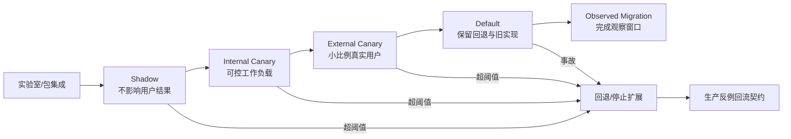

# 第 14 章：Shadow、Canary、监控与回滚

> **定位**：本章将已批准变更从仓库带入生产环境。前置依赖是通过合并 DoD、拥有可构建产物和回退影响评估的变更包；输出是每阶段都有准入、观察窗口、扩展决策与回退阈值的渐进发布路径。

仓库内测试无法枚举生产环境里的所有脚本、文件系统、locale、安全策略、包升级顺序与资源竞争。因此，默认替换不应是「发布一个新二进制」的单点事件，而应是一组可逆、可观察、逐步增加真实流量的实验。

uutils 论文将操作系统集成与项目经验纳入分析，说明迁移成功不能停留在上游测试。[E1-OS-INTEGRATION] [E1-LESSONS] Ubuntu 25.10 的官方迁移设计处理 Essential 包在解包过程中不能暂时丢失工具、供应者包切换、旧实现共存和回退机制，显示生产发布的原子性与代码原子性是两个层次。[E3-MIGRATION-DESIGN]

## 六个发布状态

**实验室/包集成**验证真实发布产物，而不只是开发者 `target/` 中的二进制。要在干净环境中安装、升级、降级和切换供应者，检查关键工具文件在解包和切换的任何时点都不会缺失，手册、shell completion、安全 profile 与符号链接一致。

**Shadow**在不改变用户结果的前提下将真实输入同时交给参考与候选。对纯读操作，可以完整双运行；对写操作，不能简单执行两次，需使用副本、仿真平台、事务影子或只对解析/计划阶段做 shadow。用户只看到已批准实现的结果，候选差异作为离线事件进入分类。

**Internal Canary**将候选交给团队可控且可恢复的工作负载，例如专用 CI runner、内部容器构建或镜像生成。它检验真实脚本与负载，但故障半径仍受组织控制。准入条件不只是 shadow 差异数为零，还要确认所有差异已分类、观测与回退可用。

**External Canary**将真实用户或机器的小比例流量切换到候选。分组不应只随机，还应覆盖架构、平台、文件系统、地区/locale、云镜像与高价值工作负载的代表性。高破坏性工具需要比只读工具更小流量、更长观察与更低回退阈值。

**Default 与 Observed Migration**区分「已经成为默认」与「迁移已经完成」。成为默认后，旧实现、切换机制、监控和值班仍需保留足够长时间，覆盖日/周/月周期、升级波次和稀有工作负载。只有观察窗口完成、重大差异关闭、回退仍可执行并且所有者批准时，才能关闭迁移项目或缩减双实现支持。

## 监控四象限

| 象限 | 指标示例 | 需要的基线 |
|---|---|---|
| 正确性 | 非预期退出码、stderr 类别、shadow 差异、文件快照偏差 | 旧实现同负载或发布前历史值 |
| 性能 | p50/p95/p99 时延、CPU、峰值内存、I/O、二进制/镜像大小 | 按工具、输入大小、平台和冷/热状态分层 |
| 故障率 | 超时、崩溃、重试、系统更新失败、工作负载中断 | 参考实现历史率与 canary 对照组 |
| 回退信号 | 数据丢失/权限异常、高危审计发现、关键包链断裂、手动退回请求 | 预先批准的绝对阈值，不只是统计波动 |

正确性与性能不应混成一个总分。一个更快但偶发删错文件的实现不会因为性能收益而达标。同样，一个字节完全兼容但使系统构建耗时倍增的默认替换也可能无法接受。每个指标都需要绑定变更包中的契约或非功能目标，并在扩展前完成观察窗口。

## 扩展决策与观察窗口

一个阶段通过不是「运行了 24 小时没人报 bug」。需在阶段前定义：最少执行量/用户数，必须覆盖的负载类别，必须经历的时间周期，允许的差异类型，性能区间，以及回退绝对信号。只有样本量和时间同时满足，才能覆盖稀有路径与周期任务。

扩展必须是一次新决策，不应在当前阶段起始时就自动排定。负责人需审查差异分类、指标趋势、事故和豁免是否变化。一个未分类但频率很低的文件状态差异，不应因为总体成功率足够高而被淹没。已批准的文本差异则应出现在精确 allowlist 与用户文档中，不应永久阻断。

## 回退必须先于迁移设计

回退不能在事故发生后才讨论。Ubuntu 的迁移设计之所以讨论供应者包、Essential 文件不得消失、保护性 diversion 与 GNU 变体，就是因为切换机制自身可以使系统无法继续执行包管理命令。[E3-MIGRATION-DESIGN] 对其他系统，类似风险可能是数据库 schema 不向后兼容、通信协议已被新客户使用，或旧二进制无法读取候选产生的文件。

回退计划应包含五层：路由/默认开关回退；二进制/包回退；配置与符号链接回退；数据与副作用修复；对受影响用户/下游的通知。演练必须使用真实产物、权限和操作手册，计时并检查回退后的行为契约，而不只演示开关能够从开变成关。[E4-ROLLBACK]

## 生产反馈必须回到工程系统

一次 canary 差异不应只在监控平台中关闭。它要变成可重放的执行包，脱敏后进入差分/fuzz 语料，更新行为契约，并产生新的原子修复包。如果环境或并发条件不能在 CI 完整重现，至少应保留触发条件、状态快照、平台和时序，建立专用隔离回放环境。

回退本身也是一个事件。需要记录触发指标、决策人、用时、受影响范围、数据修复、回退后验证与是否发生二次影响。这些事实可改进下一个发布阶段的阈值与手册。迁移成熟度的标志不是从不回退，而是能早期发现、快速限制影响、可验证地恢复并将知识固化。

## 模式提炼

**可逆的扩流状态机**：实验室、Shadow、内部/外部 Canary、Default 与 Observed Migration 各有准入、观察和回退条件。它适用于能隔离流量并保留旧路径的系统；若写操作被无保护双跑、回退没有真实演练或 Default 被当作完成，状态机不能控制爆炸半径。

## 局限

Shadow 对有副作用的命令成本高且可能危险，不应为了「覆盖率」在真实数据上双写。Canary 样本也可能无法代表稀有平台和长尾工作负载，低故障率不等于无数据安全风险。双实现共存会增加包、安全维护和支持成本，因此需要明确退场条件；但退场不应早于发布风险可被另一套机制管理。

监控本身还可能泄漏命令参数、路径与用户数据，因此观测设计必须同时符合最小化采集、脱敏、保留期和访问权限要求。不能为了证明兼容而创建新的数据安全问题。

## 实践清单

- [ ] 用真实包/产物演练安装、升级、降级、供应者切换与任何时点的工具可用性。
- [ ] 对读操作与写操作分别设计 shadow，不在真实数据上无保护双写。
- [ ] 为每个阶段定义准入、代表性样本、观察窗口、扩展决策与回退阈值。
- [ ] 同时监控正确性、性能、故障率和绝对回退信号，不混成一个总分。
- [ ] 在迁移前设计并实际演练路由、二进制、配置、数据与通知五层回退。
- [ ] 把 canary 差异与回退事件回流为契约、最小回归、生成器种子和新变更包。

## 本章证据

操作系统集成与长期项目经验来自论文 [E1-OS-INTEGRATION] [E1-LESSONS]；Essential 包切换、旧实现共存与回退机制来自 Ubuntu 迁移设计 [E3-MIGRATION-DESIGN]；阶段化发布、监控四象限和生产反馈回流是本书的回退综合 [E4-ROLLBACK] [E4-DISCOVER-LOOP]。

### 版本演化说明

论文基线为 **arXiv:2608.07135**；本地源码基线为 **d8bee62c1ddc227d5e4385d80bbf6d7dee266a41**；本章证据核验日期为 **2026-08-14**。Ubuntu 迁移设计是 2025 年特定包系统与发行周期的方案，本章仅引用其中可验证的生产原子性与回退问题，不把具体包命令作为其他系统的通用处方。
