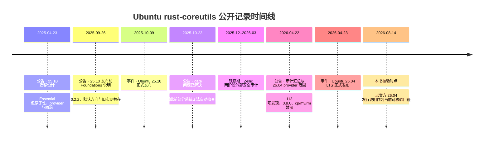
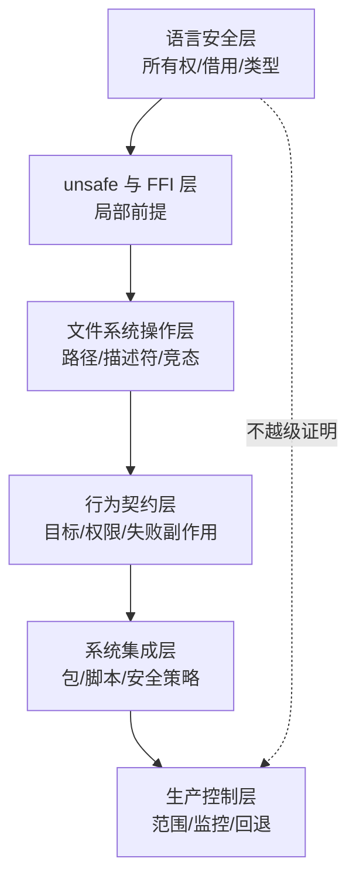
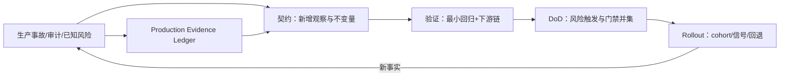

# 第 15 章：Ubuntu 部署、安全审计与方法边界

> **定位**：本章用 Ubuntu 25.10—26.04 的公开记录检验[第 14 章阶段发布与回退](ch14-rollout-rollback.md)；输出是按精确日期分层的事件线及方法边界，再交给[第 16 章流水线](ch16-pipeline.md)形成闭环。

生产案例的价值不是为某种技术站队，而是暴露仓库证据与默认系统之间的差距。如果只选择「Ubuntu 已默认使用 rust-coreutils」，容易得出「重写已经完成」的过度结论。如果只选择安全审计问题，又可能忽略上游与下游大量修复、将多数工具作为默认以及保留兼容回退的工程事实。成熟分析必须在时间线中同时保留成功和缺口。

论文将 Ubuntu 集成作为 uutils 演化的重要环节 [E1-OS-INTEGRATION]。后续官方资料则给出了更细的包切换、事故、安全审计和 26.04 LTS 范围。[E3-MIGRATION-DESIGN] [E3-DATE-INCIDENT] [E3-AUDIT-UPDATE] [E3-RELEASE-26.04] 本章对所有数量与状态都保留发布日期或明示的「as of」时点，不把它们拼成一个无时间的「现状」。

<!-- source: SECURITY.md -->

## 问题现场：一句“已经默认”包含多少种状态

在一次迁移评审会上，负责人展示三张幻灯片：论文说 uutils 已达到 drop-in replacement；Ubuntu 25.10 已把 rust-coreutils 作为默认；Ubuntu 26.04 LTS 继续使用。听众据此得出“生产已经证明所有工具安全兼容”。同一周，安全负责人拿出外部审计发现、`cp`/`mv`/`rm` 的保留范围和已知风险，又有人得出相反结论：“迁移失败，Rust 没有带来安全收益。”

两种结论都把不同问题压成了一个布尔值。论文回答一个项目在特定研究和测量窗口里如何演化；发行版默认回答某个日期哪些包提供哪些命令；安全审计回答被检查范围内发现了哪些问题；保留三个高风险工具回答当时的证据是否足以改变其 provider。它们的观察对象、时间与否定范围不同，不能互相抵消。

本章的任务不是给迁移项目打总分，而是示范如何让生产事实修正方法。遇到“已经默认”“审计发现 113 项”“还有 8 个问题”这类句子，先补齐六个字段：事实对象、事件/观察期、发布日期、版本/供应范围、来源原话能支持的命题、不能支持的外推。缺少任一字段，数字越醒目，越容易误导。

## 证据时间的语法

生产时间线至少区分四种日期。**事件日**是发行、切换或事故影响实际发生的日期；**观察期**是一轮审计、canary 或测量覆盖的区间；**发布日期**是来源向公众披露事实的日期；**核验日**是本书最后确认页面口径的日期。来源只给发布日期而未给事件日时，正文必须写“某日发布的说明称……”，不能把发布日期自动当成事故首次发生日。

版本同样有不同角色：上游 release、发行版 package version、默认 provider 和具体 utility provider 不是同一字段。Ubuntu 26.04 纳入上游 0.8.0，不等于每个命令都由该实现提供；发行说明明确把 `cp`、`mv`、`rm` 留在另一 provider。生产陈述必须至少写发行版与 utility 范围，不能只写一个上游版本。

## 事件线：每个结论只在对应时点成立



2025 年 4 月 23 日的迁移设计从包管理角度说明了问题难度：`coreutils` 是 Essential 包，仅解包时就必须工作，切换期间不能有一刻使 `cp` 等文件消失。设计使用 provider 包、前置依赖、文件冲突/替换与保护性机制，并为 GNU 版保留路径。[E3-MIGRATION-DESIGN] 对这类 Essential-package 迁移，本书据此要求从包图和解包时序设计回退，而不是只给一条 Git revert；这是 E4 工程推论。

2025 年 9 月 26 日发布的 [Ubuntu Foundations 说明](https://discourse.ubuntu.com/t/ubuntu-25-10-foundations-edition-what-s-coming-and-what-s-next/68147)是在发行前约两周写成的：页面称系统核心工具已由 rust-coreutils 包提供，版本为 0.2.2，同时明示“不一定完全兼容”，因此旧工具并存且可切换。它是发布前口径，不是发行事件；[release schedule](https://documentation.ubuntu.com/release-notes/25.10/schedule/) 与[发布公告](https://discourse.ubuntu.com/t/ubuntu-25-10-questing-quokka-released/69067)把正式发布日期记为 **2025 年 10 月 9 日**。混写两日会把候选状态误作已发行状态。

2025 年 10 月 23 日的官方通知说明，一个当时已解决的 `date` 缺陷曾使部分 Ubuntu 25.10 系统无法自动检查更新，影响包括云部署、容器镜像、桌面和服务器安装；通知给出了不受影响的修复版本 `0.2.2-0ubuntu2.1` 或更高。[E3-DATE-INCIDENT] 这个事件的方法含义并非「Rust 不可用」，而是一个基础命令的小行为差异可以跨越调度器、包管理与多种系统形态扩散；生产反例必须快速变成回归与发布阈值。

## 外部安全审计改变了信心的形状

2026 年 4 月 22 日的 Ubuntu 更新说明，为建立 26.04 LTS 所需信心，Canonical 与外部机构 Zellic 合作，分两个阶段进行安全审计：2025 年 12 月至 2026 年 1 月审查高优先级工具，2026 年 2—3 月审查其余工具；两个阶段共报告 113（73+40）项不同严重度发现，更新表示绝大多数已被处理，并将上游 0.8.0 纳入 Ubuntu 26.04。[E3-AUDIT-UPDATE]

同一更新将 `cp`、`mv` 和 `rm` 保留为 GNU 实现，因为截至 2026 年 4 月 22 日还有 8 个开放 TOCTOU 问题，并将 26.10 完全 rust-coreutils 写为当时的目标。[E3-AUDIT-UPDATE] 这些数字只能作为 4 月 22 日快照，不应在 8 月被改写成「当前仍有 8 个」。这些 issue 的状态此后可能继续变化；本书不用动态查询自行推断 Ubuntu 已改变供应者范围，而是以官方发行说明为准。

本书在 2026 年 8 月 14 日核验到的 Ubuntu 26.04 LTS 官方说明仍将 rust-coreutils 描述为系统 core utilities 的主供应者，同时明示表示尚未完全兼容，继续提供经典 GNU 工具作为兼容与回退，并说明 `cp`、`mv`、`rm` 仍由 GNU 提供。[E3-RELEASE-26.04] 发行说明也列出一组已知 rust-coreutils 漏洞，要求用户评估影响并应用建议缓解/更新。[E3-KNOWN-RISKS]

### Paper versus production：两种证据不能压成一列

论文在 arXiv 的提交日期是 **2026 年 8 月 7 日**；论文正文包含更早的测量与历史材料，并明确提示 2025 年活动数据在测量时仍不完整。论文发布时间因此不能被当成其中每项观察的事件日。反过来，Ubuntu 2026 年 4 月的生产状态也不能倒写进论文的测量结果。正确做法是保留两条证据线，再在 E4 层做有限综合。

| 维度 | 论文证据能回答 | 生产证据能回答 | 不合法的合并 |
|---|---|---|---|
| 对象 | 上游项目的设计、测试、社区与长期集成经验 | 某 Ubuntu 版本中的包、provider、事故与已知问题 | 用发行版 provider 推断上游所有版本状态 |
| 时间 | 论文所述历史/测量窗口；arXiv 于 2026-08-07 提交 | 2025-04-23 至 2026-04-23 的公告、观察期与发行事件 | 把论文提交日当成测量日，或把公告日当事故日 |
| 兼容 | 项目目标、测试策略和已观察兼容面 | 真实脚本、升级链与发行范围暴露的差异 | “默认 provider”自动等于全部命令完全兼容 |
| 安全 | 语言、依赖、复杂度与历史事实的研究讨论 | 外部审计发现、TOCTOU 快照、CVE 与发行决策 | “Rust”自动等于系统安全，或“有发现”自动等于无收益 |
| 外推 | 为方法提出问题与边界 | 校准门禁、发布与回退 | 把 Ubuntu 的 Essential/provider 机制当所有组织标准 |

这张矩阵要求结论保留两个脚注：“截至何时”与“对哪些 utility/平台”。例如，可以说“Ubuntu 26.04 LTS 以 rust-coreutils 提供系统核心工具，同时其发行说明把 `cp`、`mv`、`rm` 记为 GNU 提供”；不能缩写为“Ubuntu 26.04 已全部迁移”或“Ubuntu 26.04 没有迁移这三个命令以外的工具”。后一种也超出了来源逐项列举的范围。

## 「内存安全」与「系统安全」的边界

Rust 的安全子集能阻止大量内存安全缺陷，这是重写基础软件的真实价值。Canonical 于 2026 年 4 月 10 日发布的 [26.04 安全文章](https://ubuntu.com/blog/ubuntu-26-04-lts-security-updates)把方向表述为：当 Rust 替代实现足够成熟时替换安全敏感组件，先在 interim release 验证，再在达到严格就绪条件后进入 LTS；文章同时说明传统工具继续用于兼容与回退。审计更新直接证明当时仍有审计发现与 TOCTOU 问题，发行说明另列已知风险。[E3-AUDIT-UPDATE] [E3-KNOWN-RISKS] 本书由此在 E4 层要求继续审查逻辑授权、文件系统竞态、权限语义和兼容性安全影响；这些类别不是单一页面逐项证明的发现清单。

因此安全结论应分层：语言层排除哪些 bug 类别；`unsafe`/FFI 边界是否局部且前提可审查；系统调用与文件操作是否可抗竞态；外部行为是否符合权限与数据安全契约；发布时是否保留安全回退。「Rust 实现」是第一层的强证据，不是最后一层的自动结论。



**语言层**能强约束 safe Rust 中的内存生命周期和数据竞争，却不知道用户本来要删除哪个路径。**`unsafe`/FFI 层**需要逐处说明指针、所有权、线程与平台前提。**文件系统层**关心路径在检查与使用之间是否被替换、遍历是否锚定、符号链接如何解析。**行为层**关心即使系统调用都成功，命令是否选择了正确目标、错误顺序与清理。**集成层**关心包切换、AppArmor/SELinux、脚本和升级。**生产层**决定证据不足时保留谁、如何发现与恢复。

任一层的强证据都不能抵消下一层的缺口。例如，用文件描述符锚定遍历可以减少重新解析路径的竞态，但若参数解析把保护选项理解反了，仍可能操作错误目标；进程级测试证明某个目录树正确，也不能证明包升级期间命令文件不会暂时消失。

## 为什么 `cp`、`mv`、`rm` 需要更强的证据

这三个工具的共同点不是“代码量大”，而是它们改变持久状态，且路径身份可能在操作过程中变化。风险可拆成五个相互作用的面。

**路径解析面。** 相对路径依赖 cwd，绝对路径跨越目录层次，符号链接与 `..` 改变实际目标，非 UTF-8 名称不能安全地先转为普通字符串。契约必须描述“操作数指向什么”以及何时重新解析，不能只记录用户输入的文本。

**递归遍历面。** 目录树不是静态值。程序读取子项后，攻击者或并发进程可能替换节点；若后续以字符串路径重新打开，就可能从已检查树跳到另一个目标。安全讨论要明确遍历锚点、链接策略、文件描述符生命周期和失败时已经处理的节点。

**TOCTOU 面。** “检查目标可写，然后按路径写入”在两步之间存在窗口。Rust 借用检查器能保证内存引用规则，不能让内核路径在两个系统调用间保持同一对象。需要基于适当系统原语的设计、攻击性竞态测试和审计，而不是增加一个 Rust 枚举就宣称消除。

**提交与恢复面。** `cp` 可能部分覆盖目标，`mv` 可能跨文件系统退化为复制加删除，`rm` 的删除通常不可逆。即使错误被正确返回，用户状态也可能已经改变。契约必须定义提交点、部分成功、残留、重试幂等性和回退究竟是切回二进制还是恢复数据。

**权限与策略面。** mode、所有者、ACL、安全标签、挂载选项和沙箱策略共同决定结果。一个在普通 ext4、单用户、无 LSM 环境通过的案例，不能代表带 ACL、SELinux/AppArmor 或网络文件系统的生产范围。Ubuntu 的审计与 provider 决策正说明这些工具要按风险单独取得证据，而不能被“其余工具默认”带过。

三者也不能被当成同一个风险：复制保留源但可能破坏目标，移动同时改变源/目标可见性并涉及跨文件系统，删除直接缩小可恢复集合。DoD Profile 共享 Safety Critical 与 Release Default 追加项，但故障注入、数据恢复和绝对回退信号必须按 utility 定义。

## 完整工程案例

### 用生产证据决定一个删除工具的边界

某组织要用 Rust 候选 `tree-prune` 替换内部清理工具。最初的 Task Contract 把需求写成“递归删除给定工作目录中过期文件”，测试覆盖普通文件、只读节点、符号链接和失败退出码。候选由 safe Rust 编写，静态门禁全绿，差分样本也相等。若按语言或测试总数判断，它似乎已经完成。

第 15 章式证据账本改变了评审。团队先把 Ubuntu 公开事实只作为风险校准：高破坏性文件工具在 26.04 被逐项保留，理由与开放 TOCTOU 问题有关；这不证明 `tree-prune` 含同一缺陷，却要求团队证明自己的路径身份与竞态假设。安全负责人把 Profile 组合为 `[local_behavior, safety_critical, release_default]`。

攻击性夹具在“读取目录项”和“执行删除”之间交换一个目录为指向沙箱外的符号链接。第一版候选没有越出测试根，但日志暴露它在多个步骤中重新从字符串解析路径；当前测试成功来自时序没有命中，而不是设计消除了窗口。团队停止发布，修改契约：所有递归操作必须锚定已打开的根；遇到节点身份变化要失败关闭；任何沙箱外 inode 访问都是绝对失败。

第二版使用局部平台适配层承载系统原语，`unsafe`/FFI 前提单独评审。竞态测试重复交换节点，进程测试检查部分删除清单，恢复演练从只读快照还原 canary 数据。stateful shadow 只在副本运行，internal canary 限于可恢复租户；kill switch 拒绝新清理任务，但允许已确认进入提交阶段的单文件操作完成，避免留下应用层锁。

Canary 发现一个新事实：某租户依赖默认 ACL 让重建目录继承权限，而恢复脚本只还原内容和 mode。候选删除行为本身没有越权，回退却不能恢复原状态。团队把问题分类为 Release Default 缺口，更新恢复工件与平台矩阵，再重演。最终批准范围只包含已验证文件系统；网络挂载保持旧实现并有明确 owner 和复评日期。

这个案例的成功不是“Rust 工具全部替换”，而是生产证据让范围变窄、契约变强、恢复变真实。部分保留是一个有证据的状态，不是进度表上的失败。

案例的最终风险矩阵没有用“高/中/低”覆盖细节，而是逐个写出可观察失败与发布控制：

| 风险面 | 最坏可观察结果 | 仓库证据 | 生产追加证据 | 未满足时的决定 |
|---|---|---|---|---|
| 路径身份 | 删除根外节点 | 锚定设计评审、符号链接回归 | canary 只读审计与绝对告警 | 保持旧实现 |
| 竞态窗口 | 检查后节点被交换 | 对抗性重复测试、平台审查 | 限定文件系统与实时事件 | 缩小 cohort |
| 部分状态 | 一部分已删、恢复不全 | 故障注入、删除账本 | 快照恢复演练与下游核对 | 阻断默认 |
| 权限/ACL | 重建后权限扩大 | mode/ACL 平台矩阵 | 真实挂载上的恢复探针 | 平台例外 |
| 控制面 | kill switch 到达过慢 | 路由集成测试 | 离线节点 drill | 修复后重演 |

这个矩阵把“语言是否安全”转换为可行动的问题：路径身份主要依赖系统原语与契约，恢复主要依赖发布工件，语言保证则约束实现中的内存和并发错误。任何一列为空都不能由另一列的更多测试数量补偿。

## 反例

**成功叙事吞掉反证。** 把“26.04 的系统核心工具由 rust-coreutils 提供”写成“所有工具都已安全替换”，会删除同一发行说明中的兼容回退和三个 utility 保留。相反，把 113 项发现写成“审计证明 Rust 重写不安全”，又忽略发现经过协调、绝大多数已处理、0.8.0 被纳入 LTS 的同一来源。事实必须成组保留。

**把快照写成当前状态。** “8 个开放 TOCTOU 问题”有明确的 `as of Apr 22, 2026`。8 月核验可以说“4 月 22 日公告记录 8 个”，不能说“当前还有 8 个”，也不能根据后来上游 release notes 自行宣布 Ubuntu provider 已改变。上游修复、发行版纳入与默认切换是三次不同决策。

**用语言替代威胁模型。** “候选全是 safe Rust，所以无需竞态测试”把内存模型越级当成文件系统原子性；“发现 TOCTOU，所以 Rust 没价值”又否定了语言层确实排除的 bug 类别。公平结论是逐层列出收益、残余风险与补充控制。

**把 Ubuntu 方案当模板照抄。** Essential、Pre-Depends、provider 和 protective diversion 是特定包系统约束。容器平台、嵌入式固件或 SaaS 路由需要不同回退控制。可迁移的是“切换任一时点关键能力可用、旧路径可验证恢复”的要求，不是命令行配方。

## 可复用工件

下面的 **Production Evidence Ledger** 把事实与 E4 决策分开。它可挂到第 12 章 Change Package，并为第 13 章 Profile 与第 14 章 Rollout Readiness Record 提供输入。

```yaml
claim_id: "PROD-UBUNTU-26.04-COREUTILS"
fact:
  object: "Ubuntu 26.04 LTS coreutils providers"
  event_or_observation:
    kind: "release"
    start: "2026-04-23"
    end: "2026-04-23"
  published_at: "2026-04-23"
  verified_at: "2026-08-14"
  distribution: "Ubuntu 26.04 LTS"
  upstream_version: "0.8.0 (reported by 2026-04-22 update)"
  provider_scope:
    primary: "rust-coreutils"
    exceptions: ["cp", "mv", "rm"]
  source: "E3-RELEASE-26.04"
  direct_support: "provider scope and fallback described by release notes"
  does_not_support:
    - "all utilities are fully compatible"
    - "open issue count after 2026-04-22"
    - "future 26.10 provider scope"

method_decision:                 # E4; not attributed to Ubuntu
  local_system: "tree-prune"
  analogy_used: "destructive path operations need utility-specific evidence"
  analogy_limits: "different code, packaging and threat model"
  profile_schema_ref: "chapter-13/profile-schema-v1"
  selected_profiles: ["local_behavior", "safety_critical", "release_default"]
  required_new_evidence:
    - "descriptor-anchored traversal review"
    - "symlink-swap race test"
    - "partial-state recovery drill"
  owner: "migration-risk-owner"
  review_at: "2026-09-30"
```

账本评审有三个动作。先核对 `event_or_observation` 与 `published_at` 是否真能从来源区分；再核对 `direct_support` 是否只复述来源可支持的范围；最后核对 `method_decision` 是否明示为类比而不是事实。若来源更新，应新增一条带新核验日的记录，不覆盖旧记录，否则无法重建当时为什么保留或扩流。

## AI Coding 工作台

Agent 适合从官方页面提取日期、版本、provider、限定词和链接，生成待核对时间线；适合检查同一句中是否混用了“目标”“当时状态”“当前核验”；也适合把生产反例映射到尚未覆盖的契约和测试。它不能根据 issue 已关闭自动决定发行版已纳入修复，不能把搜索摘要当一手来源，更不能用流畅概括删除限定词。

上下文清单应只允许论文、固定仓库基线和明确列出的一手官方页面。网络抓取保存 URL、抓取时间、页面发布日期与关键段落摘要；动态 issue 状态只能支撑对应抓取时点，且不得替代发行说明。对无法确认的数字，正确输出是 `Unverified` 与需要哪位 owner 核验，不是补一个大致值。

事实抽取提示应写：“分别输出事件/观察期、发布日期、版本、范围、原文限定和不可外推项；如果页面只给发布日期，不推断事件日；把 E3 事实与 E4 方法建议分成两个对象；不得提出 provider 变更。”这种结构比“总结 Ubuntu rust-coreutils 迁移”更能抑制时间压缩。

## 能证明什么／不能证明什么

| 能证明什么 | 不能证明什么 |
| --- | --- |
| 官方发布说明可证明该发行版声明的 provider 与例外范围 | 不能证明所有安装实例、后续更新或未来发行版状态 |
| 2026-04-22 审计更新可证明两轮时间、113 项发现、0.8.0 与当日 8 项快照 | 不能把发现数解释为仍未修复数或安全严重度总分 |
| `date` 通知可证明部分系统曾受影响及不受影响的修复版本 | 不能从公告发布日期推断缺陷首次发生日或未披露根因 |
| Rust 类型系统可证明 safe Rust 中一类内存/并发规则 | 不能证明路径目标正确、TOCTOU 消失、权限或 CLI 兼容 |
| `cp`/`mv`/`rm` 保留可支持按 utility 分层的保守决策 | 不能证明其他项目的同名/相似工具必须采用同一方案 |

## 练习

- 把本章时间线改写为一个机器可读表，字段必须包含 `event_at`、`observation_window`、`published_at`、`verified_at`。对 `date` 通知说明为什么不能填精确 `event_at`。
- 为 `cp`、`mv`、`rm` 各设计一个不同的 Safety Critical 验证：分别覆盖目标保全、跨文件系统部分状态、递归删除路径交换；说明失败后怎样恢复。
- 选择一个你所在组织的生产迁移案例，制作 paper-vs-production 矩阵与 Production Evidence Ledger。加入一条会诱使 Agent 过度外推的事实，设计门禁让它失败。

## 对 AI Coding 迁移的七个方法含义

1. **默认不等于完成。** 默认是扩大观测的发布阶段，不是取消回退和缺口记录的理由。
2. **部分代替可以是成熟决策。** 将高风险工具暂留在参考实现，同时发布其他已达标工具，比为了「100%」统计过早全切更可验证。
3. **包系统是迁移代码的一部分。** 解包时序、供应者冲突、符号链接和安全 profile 可以破坏一个上游测试全绿的实现。
4. **生产事故是契约发现器。** `date` 事件表明一个命令行差异可以在无显式依赖的系统链中传播。
5. **外部审计不是对开发团队的否定。** 它使威胁模型与缺口在 LTS 决策前可见，并将外部专业能力带入闭环。
6. **时点是证据的一部分。** “8 个开放问题”只能与 2026-04-22 同时出现；目标与后来实际发布范围必须分开。
7. **共存的旧实现是安全设施，也是维护负债。** 需要明确何时保留、如何更新与何时退场。

这七点还意味着迁移看板不应只有一个“完成率”。至少并列显示：已实现 utility、已达到仓库 DoD、已取得生产观察、仍由旧 provider 服务、回退已演练和未验证平台。若 90% 的命令已默认，却把数据破坏半径最大的 10% 保留在旧路径，项目状态应写“按风险部分替换”，而不是为了数字好看把它标成 90% 成功或 10% 失败。供应范围是工程决策的输出，不是价值判断。

退场同样需要证据。旧实现仍在时，要继续接收安全更新、验证切换路径并防止配置漂移；移除它时，要证明候选观察窗口覆盖关键周期、历史回退事件已关闭、数据格式向后边界明确、紧急前向修复能力可用。否则双实现的维护负债只是被一个不可逆的删除动作隐藏。

## 生产反馈怎样反向修改四个工程层

生产发现只有被翻译成工程对象才会提升下一次发布。第一层回到 **Behavior Contract**：把事故输入、初态、平台、下游观察和不变量写成新条目；若来源没有披露根因，就只记录可确认的外部症状。`date` 事件可支持“自动更新新鲜度是下游观察”，但不能支持本书猜测具体解析分支。

第二层回到 **Verification**：创建能在修复前失败、修复后通过的最小回归，并扩展邻域生成器。生产链通常还需要一个下游测试，例如模拟调度或包管理如何消费命令结果；只增加 utility 单元测试会再次漏掉放大链。无法在普通 CI 重现的文件系统与竞态进入专用环境，状态保持 `Unverified` 直到取得运行证据。

第三层回到 **DoD Profile**：事故或审计表明原风险分类过轻时，更新触发规则，而不是只给当前补丁加一次性检查。若路径交换可造成越界删除，所有命中同类遍历的任务都组合 Safety Critical；若默认 provider 变化会影响更新链，则组合 Release Default。已有变更保留当时 Profile，新的规则从明确版本起生效。

第四层回到 **Rollout**：将最早可见的下游信号加入监控，将绝对风险加入 kill switch，把受影响平台/utility 从自动扩流中分离。`cp`/`mv`/`rm` 的保留说明发布单元可以细到 utility；对组织内部系统，它还可以细到 feature、文件系统或租户。回退后要验证下游恢复，而不是只验证旧二进制再次可执行。



这条回路还要避免“以事故数量评估语言”。事故说明某一契约或控制失败，审计说明某一检查范围发现问题；它们应改变测试、威胁模型与 provider 决策。除非有可比的暴露时间、范围和发现方法，不能用简单计数比较两种实现的总体安全性。

## 模式提炼

**带时点的生产反证**：把默认范围、事故、审计发现和回退能力固定在各自发布日期，用它们校准仓库内证据。它适用于有公开或内部可审计运行记录的迁移；若把目标、当时快照和后来状态拼成一个“当前”，案例就会变成宣传而非验证。

## 局限

Ubuntu 是特定发行版、包管理与安全维护生态，其 Essential 包机制、发行节奏和人员投入不能照搬到每个企业迁移。公开资料也不代表所有内部决策与运行数据。本章使用的是核验时可见的官方公告、发行说明和审计更新，并不据此推断未公开动机或 26.10 最终将以何种范围发布。

## 实践清单

- [ ] 对每个生产数量、版本、开放问题数和目标附上精确日期或发行版。
- [ ] 区分当时的计划、当时的现状、后来的修复和核验日可确认的官方口径。
- [ ] 将包安装/升级/切换的原子性与源码补丁原子性分开验证。
- [ ] 将生产事故转化为可重放反例、契约更新、永久回归和发布阈值。
- [ ] 将 Rust 语言层安全、`unsafe`/FFI、系统竞态、外部行为与发布回退分层审计。
- [ ] 接受「高风险单元暂不切换」可能是证据驱动的成熟结论，而不是项目失败。

## 本章证据

操作系统集成背景来自论文 [E1-OS-INTEGRATION]；生产事件主证据为迁移设计、`date` 事故、审计更新、发行说明与已知风险 [E3-MIGRATION-DESIGN] [E3-DATE-INCIDENT] [E3-AUDIT-UPDATE] [E3-RELEASE-26.04] [E3-KNOWN-RISKS]。25.10 状态/发行日与 26.04 安全方向由正文直接链接一手页面。本章的分层安全结论是 E4 综合，不是优劣投票。

### 版本演化说明

论文基线为 **arXiv:2608.07135**；本地源码基线为 **d8bee62c1ddc227d5e4385d80bbf6d7dee266a41**；本章网络事实核验日期为 **2026-08-14**。其中 113 项发现、0.8.0 与「8 个开放 TOCTOU 问题」属于 2026-04-22 快照；26.04 供应者范围以核验时可见的官方发行说明为准；26.10 完全切换只能写为当时公开目标，不预告未来事实。
