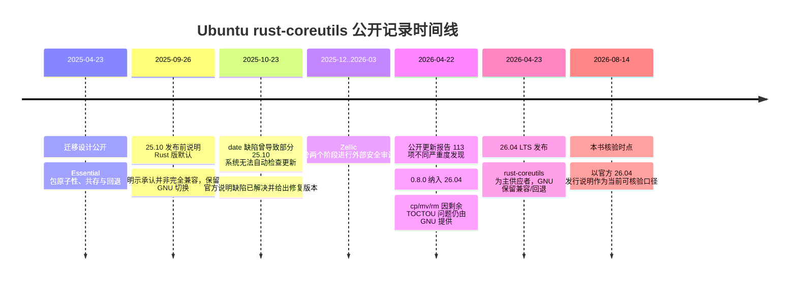

# 第 15 章：Ubuntu 部署、安全审计与方法边界

> **定位**：本章用 Ubuntu 25.10—26.04 的公开记录检验前述方法。前置依赖是阶段发布、生产反馈与回退；输出是一张按精确日期分层的事件线，以及对「Rust 重写」、「默认切换」、「安全」和「完成」之间边界的严格结论。

生产案例的价值不是为某种技术站队，而是暴露仓库证据与默认系统之间的差距。如果只选择「Ubuntu 已默认使用 rust-coreutils」，容易得出「重写已经完成」的过度结论。如果只选择安全审计问题，又可能忽略上游与下游大量修复、将多数工具作为默认以及保留兼容回退的工程事实。成熟分析必须在时间线中同时保留成功和缺口。

论文将 Ubuntu 集成作为 uutils 演化的重要环节 [E1-OS-INTEGRATION]。后续官方资料则给出了更细的包切换、事故、安全审计和 26.04 LTS 范围。[E3-MIGRATION-DESIGN] [E3-DATE-INCIDENT] [E3-AUDIT-UPDATE] [E3-RELEASE-26.04] 本章对所有数量与状态都保留发布日期或明示的「as of」时点，不把它们拼成一个无时间的「现状」。

## 事件线：每个结论只在对应时点成立

2025 年 4 月 23 日的迁移设计从包管理角度说明了问题难度：`coreutils` 是 Essential 包，仅解包时就必须工作，切换期间不能有一刻使 `cp` 等文件消失。设计使用 provider 包、前置依赖、文件冲突/替换与保护性机制，并为 GNU 版保留路径。[E3-MIGRATION-DESIGN] 这证明「可回退」需要从包图和解包时序开始设计，而不是一条 Git revert 命令。

2025 年 9 月 26 日的 Ubuntu Foundations 文章说明 rust-coreutils 将作为 25.10 默认，同时明示表示其不一定完全兼容，因此保留了在 Rust 与 GNU 供应者之间切换的机制。[E3-DEFAULT-25.10] 这是阶段发布的一个现实表达：默认使用扩大真实测试面，回退通道同时保留。

2025 年 10 月 23 日的官方通知说明，一个当时已解决的 `date` 缺陷曾使部分 Ubuntu 25.10 系统无法自动检查更新，影响包括云部署、容器镜像、桌面和服务器安装；通知给出了不受影响的修复版本 `0.2.2-0ubuntu2.1` 或更高。[E3-DATE-INCIDENT] 这个事件的方法含义并非「Rust 不可用」，而是一个基础命令的小行为差异可以跨越调度器、包管理与多种系统形态扩散；生产反例必须快速变成回归与发布阈值。

## 外部安全审计改变了信心的形状

2026 年 4 月 22 日的 Ubuntu 更新说明，为建立 26.04 LTS 所需信心，Canonical 与外部机构 Zellic 合作，分两个阶段进行安全审计：2025 年 12 月至 2026 年 1 月审查高优先级工具，2026 年 2—3 月审查其余工具；两个阶段共报告 113（73+40）项不同严重度发现，更新表示绝大多数已被处理，并将上游 0.8.0 纳入 Ubuntu 26.04。[E3-AUDIT-UPDATE]

同一更新将 `cp`、`mv` 和 `rm` 保留为 GNU 实现，因为截至 2026 年 4 月 22 日还有 8 个开放 TOCTOU 问题，并将 26.10 完全 rust-coreutils 写为当时的目标。[E3-AUDIT-UPDATE] 这些数字只能作为 4 月 22 日快照，不应在 8 月被改写成「当前仍有 8 个」。这些 issue 的状态此后可能继续变化；本书不用动态查询自行推断 Ubuntu 已改变供应者范围，而是以官方发行说明为准。

本书在 2026 年 8 月 14 日核验到的 Ubuntu 26.04 LTS 官方说明仍将 rust-coreutils 描述为系统 core utilities 的主供应者，同时明示表示尚未完全兼容，继续提供经典 GNU 工具作为兼容与回退，并说明 `cp`、`mv`、`rm` 仍由 GNU 提供。[E3-RELEASE-26.04] 发行说明也列出一组已知 rust-coreutils 漏洞，要求用户评估影响并应用建议缓解/更新。[E3-KNOWN-RISKS]

## 「内存安全」与「系统安全」的边界

Rust 的安全子集能阻止大量内存安全缺陷，这是重写基础软件的真实价值。Ubuntu 的安全文章也将「在足够成熟时，用内存安全 Rust 实现替换历史实现」写成分阶段方向，并强调先在 interim release 验证再进入 LTS。但外部审计发现和 TOCTOU 问题又说明，内存安全不能防止逻辑授权、文件系统竞态、错误权限语义或兼容性导致的安全影响。[E3-SECURITY-26.04] [E3-AUDIT-UPDATE]

因此安全结论应分层：语言层排除哪些 bug 类别；`unsafe`/FFI 边界是否局部且前提可审查；系统调用与文件操作是否可抗竞态；外部行为是否符合权限与数据安全契约；发布时是否保留安全回退。「Rust 实现」是第一层的强证据，不是最后一层的自动结论。

## 对 AI Coding 迁移的七个方法含义

1. **默认不等于完成。** 默认是扩大观测的发布阶段，不是取消回退和缺口记录的理由。
2. **部分代替可以是成熟决策。** 将高风险工具暂留在参考实现，同时发布其他已达标工具，比为了「100%」统计过早全切更可验证。
3. **包系统是迁移代码的一部分。** 解包时序、供应者冲突、符号链接和安全 profile 可以破坏一个上游测试全绿的实现。
4. **生产事故是契约发现器。** `date` 事件表明一个命令行差异可以在无显式依赖的系统链中传播。
5. **外部审计不是对开发团队的否定。** 它使威胁模型与缺口在 LTS 决策前可见，并将外部专业能力带入闭环。
6. **时点是证据的一部分。** “8 个开放问题”只能与 2026-04-22 同时出现；目标与后来实际发布范围必须分开。
7. **共存的旧实现是安全设施，也是维护负债。** 需要明确何时保留、如何更新与何时退场。

## 模式提炼

**带时点的生产反证**：把默认范围、事故、审计发现和回退能力固定在各自发布日期，用它们校准仓库内证据。它适用于有公开或内部可审计运行记录的迁移；若把目标、当时快照和后来状态拼成一个“当前”，案例就会变成宣传而非验证。

## 局限

Ubuntu 是特定发行版、包管理与安全维护生态，其 Essential 包机制、发行节奏和人员投入不能照搬到每个企业迁移。公开资料也不代表所有内部决策与运行数据。本章使用的是核验时可见的官方公告、发行说明和审计更新，并不据此推断未公开动机或 26.10 最终将以何种范围发布。

## 实践清单

- [ ] 对每个生产数量、版本、开放问题数和目标附上精确日期或发行版。
- [ ] 区分当时的计划、当时的现状、后来的修复和核验日可确认的官方口径。
- [ ] 将包安装/升级/切换的原子性与源码补丁原子性分开验证。
- [ ] 将生产事故转化为可重放反例、契约更新、永久回归和发布阈值。
- [ ] 将 Rust 语言层安全、`unsafe`/FFI、系统竞态、外部行为与发布回退分层审计。
- [ ] 接受「高风险单元暂不切换」可能是证据驱动的成熟结论，而不是项目失败。

## 本章证据

操作系统集成背景来自论文 [E1-OS-INTEGRATION]；生产事件来自 Ubuntu 迁移设计、25.10 默认说明、`date` 事故、4 月 22 日审计更新、26.04 发行说明、安全文章与已知风险 [E3-MIGRATION-DESIGN] [E3-DEFAULT-25.10] [E3-DATE-INCIDENT] [E3-AUDIT-UPDATE] [E3-RELEASE-26.04] [E3-SECURITY-26.04] [E3-KNOWN-RISKS]。本章的分层安全结论是对这些时点事实的方法综合，不是对 Rust 或 uutils 的简单优劣投票。

### 版本演化说明

论文基线为 **arXiv:2608.07135**；本地源码基线为 **d8bee62c1ddc227d5e4385d80bbf6d7dee266a41**；本章网络事实核验日期为 **2026-08-14**。其中 113 项发现、0.8.0 与「8 个开放 TOCTOU 问题」属于 2026-04-22 快照；26.04 供应者范围以核验时可见的官方发行说明为准；26.10 完全切换只能写为当时公开目标，不预告未来事实。
