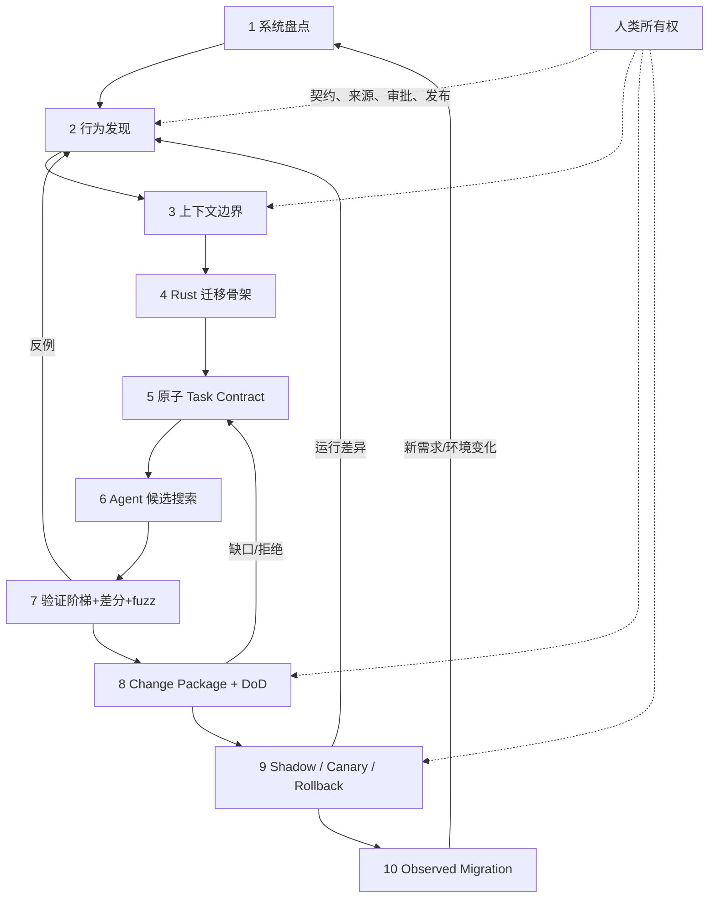
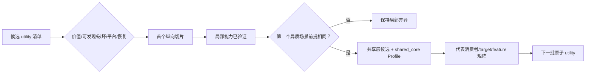

# 第 16 章：AI-Native Rust Migration Pipeline

> **定位**：本章把[行为契约](../part1/ch03-behavior-contract.md)、[Agent 上下文](../part2/ch04-clean-room.md)、[验证阶梯](../part3/ch07-static-gates.md)、[变更包](../part4/ch12-change-package.md)和[生产回退](ch14-rollout-rollback.md)收敛为十阶段流水线；可执行模板回到[附录 A—E](../appendices/e2e-traces.md)。

AI-native 不是「在原有流程中增加一个 prompt 步骤」。如果任务仍然是模糊的「把这个子系统改成 Rust」，验收仍然是一次编译与一次人工演示，发布仍然是默认全切，那么 AI 只是加速了候选代码的产生，没有加速团队对系统的理解与信心建立。

uutils 的长期重实现、测试、社区和操作系统集成经验表明，基础软件迁移是一个持续发现与修正行为的过程。[E1-LESSONS] 当前仓库的 AI policy、兼容开发流程和测试要求则将人类理解、小变更、先反例后修复与没有测试不合并组织在一起。[E2-AI-POLICY] [E2-COMPAT-WORKFLOW] Ubuntu 的审计与分阶段供应范围则说明代码之后还需生产证据。[E3-AUDIT-UPDATE] 本章将三层证据组合为方法，不声称其是所有组织的唯一最佳流程。

<!-- source: CONTRIBUTING.md -->

## 问题现场：平台先建好了，迁移却没有前进

一家组织为“AI-native migration”准备了代码索引、多个 Agent、自动开分支、Rust 模板和全量 CI。三个月后生成了二十万行候选代码，却没有一个 utility 能进入真实 shadow。原因不是模型不会写 Rust，而是流水线只覆盖“领取 issue—生成代码—跑测试—开 PR”。旧行为由谁裁决、禁止上下文怎样强制、差分为何失败、谁批准 normalization、默认切换怎样撤回，都留在平台之外。

团队为了显示进度，把“编译通过 utility 数”设为北极星指标。Agent 很快把解析器和共享错误层同时改完；workspace 绿色，但审稿人无法把差异追到单一契约。某个 utility 的退出码回归被标为低优先级，因为总体通过率仍上升。迁移项目产出了更多代码，也制造了更大的未知堆积。

十阶段 pipeline 的目的就是改变交付对象：每一阶段消费带版本的输入，产生可寻址工件，由机械门禁和具名人类共同决定退出；失败必须回到能修改错误假设的阶段。代码生成只是第 6 阶段的一种活动。一个项目即使最终决定停止重写、长期共存或只替换低风险单元，只要决定由完整证据支持，pipeline 仍然成功。

## 概念边界：控制面、工作流与工件流

**控制面**定义允许状态迁移、Profile、负责人和停止权；**工作流**定义人在某次任务中做什么；**工件流**保存 Behavior Contract、Context Manifest、Task Contract、Change Package、EvidenceRun 和 Rollout Record。三者不能混为一个 CI YAML：CI 可以检查工件字段和命令结果，却不能自己裁决历史行为是否要保留。

每阶段统一使用六个问题：输入是否来自上一阶段且版本冻结；输出是否可由下一阶段消费；主要负责人是否具名；机械门禁是否可重放；人类门禁需要什么判断；失败返回哪个阶段。缺少返回边的 pipeline 是瀑布，缺少工件的 pipeline 是会议流程，缺少人类所有者的 pipeline 是自动化幻觉。

## 十阶段表

| # | 阶段 | 输入 | 产物 | 主责角色 | 机械门禁 | 人类退出条件 / 失败返回 |
|---:|---|---|---|---|---|---|
| 1 | 系统盘点 | 业务目标、资产与部署现状 | 边界图、依赖图、风险/恢复初评 | 项目负责人 | 资产、调用方、产物可追溯 | 批准迁移/共存/停止范围；缺资产回本阶段 |
| 2 | 行为发现 | 盘点范围、允许规范与黑盒 | 行为表面、来源账本、未知项 | 契约负责人 | 来源、版本、原始观察完整 | 裁决哪些进入契约；冲突回 1 或继续取证 |
| 3 | 上下文建模 | 来源账本、许可/隐私政策 | Context Manifest 与工具 ACL | 来源/安全负责人 | 允许/禁止/实际访问一致 | 批准边界；越界冻结产物并回 2/3 |
| 4 | 迁移骨架 | 契约类别、平台/共享需求 | workspace、utility、共享与平台接缝 | Rust 架构负责人 | 基线构建、入口黑盒与策略门禁 | 接缝能隔离证明责任；不成立回 1/2 |
| 5 | 原子任务 | 一个契约差异、上下文、接缝 | Task Contract、反例、预算、停止条件 | 任务/契约负责人 | 字段、允许路径、验证选择器完整 | 可独立接受/拒绝/回退；过大回 2/4 |
| 6 | Agent 候选搜索 | 冻结 Task Contract 与最小上下文 | red 测试、最小 Rust patch、访问回执 | 实现者（人类拥有） | 格式、编译、lint、依赖、来源 | diff 可解释且未扩域；扩域回 5 |
| 7 | 行为验证 | 候选、反例、契约、影响图 | 单元/进程/差分/fuzz EvidenceRun | 验证负责人 | red/green、影响测试、差异账本 | 差异分类且缺口显式；新行为回 2/5 |
| 8 | 变更包与 DoD | diff、manifest、全部证据与风险 | Change Package、组合 Profile、豁免 | 维护/安全/发布所有者 | 适用门禁合取，Unverified 阻断 | 具名批准；拒绝回 5–7，规则问题独立治理 |
| 9 | 渐进发布 | 冻结产物、批准包、回退影响 | Shadow/Canary 记录、kill switch、drill | 发布负责人 | cohort、阈值、窗口、产物与恢复探针 | 扩流/停留/回退；生产差异回 2/7 |
| 10 | 观测迁移 | 默认期运行事实、事故与维护成本 | 生产回归、范围结论、旧路径退场决定 | 项目与服务所有者 | 观察周期、回流和责任闭环 | 关闭/长期共存/新循环；环境变化回 1 |

这个表不是一条只向右的瀑布。任何阶段都可因新证据回到早期阶段：差分失败更新行为矩阵，安全审计更新威胁模型与 DoD Profile，canary 事故更新语料库和发布阈值。流水线管理的不是一批代码从左走到右，而是证据如何不断缩小未知量。[E4-PIPELINE]

### 三条不可裁剪的底线

低风险任务可以减少平台矩阵、差分规模或 canary 层级，却不能删除三件事。第一，必须有最小 Behavior Contract；否则测试没有判断对象。第二，必须有具名人类所有权；否则允许差异、来源和发布风险无人承担。第三，必须有恢复计划；即使恢复只是“revert 单一文档提交并重建”，也要说明对象、入口与验证。

不使用遗留 oracle 不等于删除第 2、7 阶段。项目可用公开规范、性质断言、黄金文件、用户轨迹或多实现共识；若没有足够参考，就把相应行为列为未知并缩小替换承诺。裁剪减少的是与风险无关的执行量，不是把未知改名为 `N/A`。

阶段编号也不是成熟度分数。一个候选从第 9 阶段因生产差异返回第 2 阶段，并不意味着项目“退回到 20%”；它意味着控制面把新事实送回了能改变契约的位置。相反，一个看似停在第 10 阶段却没有保存生产反例、旧路径退场责任和新环境触发器的项目，只是把未知移出看板。

每次状态迁移都应生成回执：上一状态、输入工件版本、通过的机械门禁、作出判断的人、理由、下一状态和失败返回目标。这样既能计算在制品与等待时间，也能在事故后重建“为何当时允许扩流”。回执不是模型的思维链；它只保存可审计事实与人类决定。

同一 utility 可以同时存在多个状态，但对象必须不同：某个修复包处于 Verified，冻结产物处于 external canary，而整个 utility 仍处于旧实现默认。状态名称必须带工件 ID 和范围，禁止用一句“utility 已到阶段 9”掩盖平台、版本与 cohort 差异。

## 端到端闭环



图中的 Agent 只在第 6 阶段显式出现，但它可以辅助其他阶段：从手册生成行为候选、聚类差异、最小化样本、生成证据账本、分析 canary 事件。之所以不让 Agent 成为每个阶段的主语，是为了保持决策边界：契约是否接受历史行为，clean-room 例外是否可批准，差异是候选缺陷还是参考缺陷，以及当前证据是否足以扩大生产流量，始终由具名人类负责人拥有。

## 三个循环的不同节奏

**内循环：候选搜索。** 以分钟到小时级工程节奏运行，内容是最小测试、Rust 补丁、格式/编译/lint 与局部反例。目标是快速排除不合格候选，不承担最终兼容结论。

**中循环：变更验证。** 以变更包为单元，执行更广 workspace、外部套件、差分/fuzz、架构/安全审查和人类批准。目标是将一个代码候选变成可接受的工程决策。

**外循环：生产迁移。** 以发布周期和真实工作负载为节奏，通过 shadow、canary、默认、观察窗口与回退演练建立信心。目标是将一个已批准变更变成可持续运行的系统状态。

三个循环不能用同一个「速度」指标管理。内循环可以追求低延迟反馈，中循环关心证据完整与审稿带宽，外循环关心有代表性的观察时间与故障半径。用代码生成速度逼迫外循环加速，会把 AI 的带宽优势转化为生产风险。

## utility 选择、迁移顺序与共享层演化

第一个纵向切片应同时满足四点：行为边界可枚举、参考或规范可用、真实用户存在、回退简单。选择完全无人使用的 toy utility 虽容易成功，却无法验证组织的审稿、发布与反馈接口；选择 `rm` 类破坏性工具又会让平台在第一次练习中承担最高恢复成本。推荐从只读或输出型 utility 开始，但要有至少一个真实平台差异或下游消费者。

迁移顺序不是按源文件大小排列。可用一个投资组合评分：业务价值、行为可发现性、状态破坏性、平台扩散、共享依赖和恢复成本。高价值、易发现、低破坏单元优先；共享层被多个已迁移单元真实重复需要时再演化。若先建设“大一统 uucore”，每个错误契约都会同时污染未来 utility。

共享能力的晋升要经历三态：先在 utility 局部实现并验证；第二个异质 utility 复用概念但保持独立；当两个以上契约证明前提和错误语义相同，再提取共享接口。共享变更自动组合 `shared_core` Profile，运行代表消费者与平台矩阵。代码重复的短期成本，通常低于过早抽象造成的全局返工。

并行工作只发生在契约、允许修改集、测试夹具和共享前提互不冲突时。两个 Agent 可以分别处理不同 utility 的独立解析分支；不能同时修改共享错误模型并各自假设另一版接口。项目控制面维护依赖图和“共享热点锁”，冲突时按证据成熟度排队，而不是让合并冲突替架构做决定。



## 角色与决策接口

小团队可以一人兼任多个角色，但每份工件仍要写清此人此刻以什么责任签字。最低角色集合如下：

| 角色 | 拥有的决定 | 不应单独决定 |
|---|---|---|
| 项目负责人 | 范围、投资组合顺序、停止/共存 | 具体兼容差异与安全豁免 |
| 契约负责人 | 行为、允许差异、未知项 | Rust 内部设计与生产扩流 |
| 来源/安全负责人 | Context Manifest、许可/隐私、unsafe/威胁模型 | 产品是否保留历史缺陷 |
| Rust 实现负责人 | 接缝、最小 patch、解释关键不变量 | 自己生成测试后的最终批准 |
| 验证负责人 | 测试层、差分分类流程、EvidenceRun 质量 | 未经契约 owner 允许 normalization |
| 维护/审稿负责人 | diff、架构、影响矩阵与 Change Package | 用签字替代未执行证据 |
| 发布/服务负责人 | cohort、阈值、值班、回退与退场 | 无契约 owner 的行为变更 |

接口冲突必须显式升级。例如，契约负责人认为 stderr 差异可接受，安全负责人认为它泄露路径；状态保持阻断，二人提交带依据的决策记录，由有权产品/安全治理者裁决。Agent 可以整理证据，不能以多数模型投票解决责任冲突。

## 流水线的最小度量

不建议用「AI 写了多少代码」作为核心指标。更有用的度量包括：从发现反例到最小回归的时间；每份变更包未验证契约数；差异分类队列年龄；豁免过期率；人类审稿中发现的 Agent 假设比例；从回退触发到已验证恢复的时间；生产反例回流为 CI 永久测试的比例。

这些度量也会被游戏化。例如，团队可通过将差异快速标为「允许」来降低队列年龄，或通过避免记录 Unverified 来提高完整度。因此度量必须与抽样复审、事故与审计发现对照，它们用于发现流程拥堵，不是给 Agent 或团队生成单一排名。

度量应按“结果—流动—准备度”分组。**结果指标**包括生产兼容差异、门禁逃逸、数据/权限事件和回退次数；它们低频但最接近用户。**流动指标**包括反例到回归周期、变更包返工率、差异分类年龄和审稿等待；它们定位瓶颈。**准备度指标**包括关键契约覆盖、Unverified 年龄、回退演练新鲜度、备份 owner 覆盖和旧产物可获取率；它们在事故前暴露薄弱处。

返工率不能简单越低越好。第 7 阶段发现候选假设并返回第 5 阶段，是流水线正常学习；生产才发现同一类问题才是高成本逃逸。建议记录“在哪一阶段发现”和“返回几级”，目标是让高风险反例向左移动，而不是让所有变更一次通过。

### 30/60/90 天采用路线

**0–30 天：完成一条可信纵切。** 选一个低至中风险、可回退 utility；确定七个角色的兼任关系；建立最小 Contract、Manifest、Task Contract、EvidenceRun、Change Package 和 Rollout Record；只自动化字段检查与已有命令回执。退出标准不是代码量，而是一次 rollback drill 和一个生产或内部反例成功回流为回归。

**31–60 天：验证第二个异质切片。** 选择带文件系统副作用或平台分支的 utility，测试第一条切片的模板是否过拟合；建立差分环境、风险 Profile 组合、共享热点依赖图和审稿服务水平。将重复能力保持局部，直到证据支持共享。退出标准是两条 Change Package 可由不同审稿人复述，Unverified 与豁免都有 owner 和期限。

**61–90 天：形成可扩展控制面。** 只自动化已经重复且稳定的动作：manifest ACL、证据回执、选择性门禁、cohort 配置验证和指标回流；建立组合 Profile 治理与旧路径退场规则；用第三个切片测试并行边界。退出标准是季度路线以风险和审稿容量排序，团队能报告门禁逃逸、返工阶段和回退准备度，而不是只报告 Agent 产出。

90 天后再决定扩大 utility 数、建设专用平台或停止。若第一条纵切暴露参考不可用、回退成本过高或缺少所有者，先解决这些组织约束；增加 Agent 并发不会使它们消失。

## 从一个工具开始导入

不需要在项目第一天就搭建完整平台。可选一个边界明确、有参考二进制、有真实用户且回退简单的工具作为纵向切片。先完成一条从行为矩阵、context manifest、原子 Task Contract、Rust 候选、进程测试、差分、change package 到内部 canary 和回退的小闭环。再根据其实际成本自动化重复步骤，而不是先构建一个庞大但尚未与生产相连的「AI 迁移平台」。

第二个切片应故意选择不同风险：例如一个有文件系统副作用或平台分支的工具。它会验证第一个切片提炼的共享骨架是真正模式，还是一次性偶然。只有两个以上行为单元证明相同的能力，才应晋升为共享抽象或组织级模板。

## 完整工程案例

组织选择只读命令 `manifest-list` 作为首个切片：它遍历制品目录并输出稳定清单，被发布脚本真实消费，旧二进制可黑盒执行，失败时可即时切回。阶段 1 盘点出三个调用方、Linux 与 macOS、普通/非 UTF-8 路径和一个月度审计作业；风险为 `local_behavior`，若共享路径模块变化则追加 `shared_core`。

阶段 2 按第 3 章写完整 `K=(I,O,X,S,E,P,U)`：`I` 固定参数/前态，`O` 规定 stdout 原始字节与 stderr 类别，`X` 固定退出/超时，`S` 要求无写副作用，`E/P` 固定路径、locale 与平台能力，`U` 记录允许排序差异与未知；`non_goals` 另列性能和未支持平台。黑盒发现同一文件名在两个 locale 下排序不同；契约 owner 决定不锁定本地化排序，而要求 `--stable` 模式字节排序。阶段 3 的 Manifest 允许规范、黑盒执行包和候选仓库，禁止参考源码与原始客户目录；所有真实轨迹先脱敏。

阶段 4 只建立 utility crate、进程入口和局部路径适配器，不先抽共享模块。阶段 5 把第一个任务切成“`--stable` 对非 UTF-8 文件名按原始字节排序并保持空 stderr”；停止条件是需要改变公共错误接口或 macOS 无法构造样本。阶段 6 中 Agent 先提交 red 进程测试，再提交最小排序实现；访问回执显示未越界，静态门禁通过。

阶段 7 的双沙箱差分发现退出码一致、清单字节一致，但候选在不可读子目录上多输出一条 stdout 提示。人类将其分类为候选缺陷而非“更友好信息”，因为 stdout 被脚本解析；反例最小化后回到阶段 5，新任务只修通道。macOS 非 UTF-8 样本无法合法构造，经触发规则与平台 owner 确认为 `N/A`，而不是伪造通过；另一个权限差异保持 `Unverified` 并阻断 macOS 默认。

阶段 8 形成 L2 Change Package，`local_behavior` 的适用 requirement 为 `Pass/N/A`；审稿人从契约追到 red/green 和 diff，并记录 `Approve`。进入阶段 9 前另建 L3 release package，引用 L2 包和同一 artifact，按唯一 schema 选择 `[local_behavior, release_default]`。随后 shadow 真实脱敏目录，internal canary 在两个可恢复 runner 上运行，kill switch 以 job 为粘性单位。月度审计作业出现内存峰值超预算，扩流停留；修复后重走 5–9，并完成旧产物切回 drill。

阶段 10 观察两个审计周期后，Linux 成为默认；macOS 因权限语义未知继续旧实现。生产发现一个带换行文件名使日志聚合误分行，但清单字节正确。团队没有改 utility 输出，而是更新观测编码与下游测试。最终结论是“Linux 声明范围 Observed，macOS 共存”，并把第二个切片选为有状态的归档命令，以检验恢复与共享路径假设。

这个案例跨过全部十阶段，两次返回早期阶段，却没有把返工视为失败。真正失败是差异穿过阶段 9 后仍无法定位，或生产范围在证据不足时被扩张。

## 反例

**代码生成流水线。** 系统从 issue 直接到 Agent，再到 CI 和 PR，没有契约、上下文与发布状态。它最多是候选生产线，不是迁移 pipeline；增加模型评审只会形成同源解释。

**模板一次性铺开。** 团队在没有纵切证据前强制所有 utility 使用同一共享错误层和 DoD 表。为了适配差异，人们不断增加布尔开关和 `N/A`，最终模板不再表达风险。正确顺序是先跑两个异质切片，再提取稳定字段。

**低风险裁剪到底线。** 因命令只读，团队删除 Behavior Contract、人类审批和回退，直接把编译通过当完成。只读命令仍可破坏下游解析或泄露数据；低风险可以缩小差分样本和 canary，却不能失去决策对象与恢复入口。

**单一速度 KPI。** 用“每天合并 utility 数”管理团队，会激励大范围 normalization、隐藏 Unverified 和跳过观察窗口。生产差异与审稿返工被视为拖慢，而不是发现系统在工作。

## 可复用工件

下面的 **Program Adoption Canvas** 引用前文规范工件，不复制其完整 schema，避免与第 13 章和附录 B–E 冲突。

```yaml
program_id: "MIG-2026-Q3"
mission:
  target_outcome: "可验证地替换或有证据地共存"
  exclusions: ["按生成行数考核", "Agent 自我批准", "无回退默认切换"]
baselines:
  paper: "arXiv:2608.07135"
  source: "d8bee62c1ddc227d5e4385d80bbf6d7dee266a41"
  currentness_cutoff: "2026-08-14"

portfolio:
  - utility: "manifest-list"
    value: 4
    behavior_discoverability: 4
    state_destructiveness: 1
    platform_spread: 3
    recovery_cost: 1
    change_profiles: ["local_behavior"]
    release_profiles: ["local_behavior", "release_default"]
    current_stage: 9
    canonical_artifacts:
      contract: "BC-ML-001"
      context: "CTX-ML-001"
      task: "TASK-ML-001"
      change_package: "CP-ML-001"
      release_package: "RP-ML-001"
      dod: "DOD-ML-001"
      rollout: "ROLLOUT-ML-001"
    unverified: ["macos-permission-error"]
    return_to: 7

roles:
  program: "..."
  contract: "..."
  source_security: "..."
  rust_implementation: "..."
  verification: "..."
  maintenance_review: "..."
  release_service: "..."

cadence:
  days_0_30: "one vertical slice + rollback drill"
  days_31_60: "second heterogeneous slice + review SLA"
  days_61_90: "stable automation + profile governance"
metrics:
  outcomes: ["production-differences", "gate-escapes", "rollback-events"]
  flow: ["counterexample-to-regression", "rework-stage", "diff-triage-age"]
  readiness: ["unverified-age", "drill-freshness", "backup-owner-coverage"]
governance:
  profile_schema_ref: "chapter-13/profile-schema-v1"
  requirement_status_enum: ["Pass", "Fail", "Unverified", "N/A"]
  verification_basis_enum: ["Direct", "LimitedWithWaiver"]
  human_decision_enum: ["Approve", "Reject", "Waive"]
  exception_ledger: "WAIVERS-v1"
  stop_authority: ["contract", "source_security", "release_service"]
```

Canvas 的 `canonical_artifacts` 只保存引用；工件内容仍由其规范章节维护。项目周会只问三类问题：哪个阶段的新证据改变了判断；哪个 Unverified 正在老化；哪个返回边反复触发并说明系统边界有误。这样状态报告不会退化为代码百分比。

## AI Coding 工作台

Agent 的最佳位置是阶段内部的受限搜索与机械联结：从规范生成待评审契约候选、按 Manifest 检索允许上下文、实现一个原子任务、运行选择器、聚类差异、检查 Change Package 引用和起草生产事件摘要。控制面要阻断其修改 Profile registry、豁免、来源许可和发布流量。

每次 Agent 工作都消费明确的 `stage_input`，输出 `candidate_artifacts`、`evidence_receipts`、`assumptions`、`unverified` 和 `stop_reason`。若输入版本变化，候选作废或重新验证；若任务需要新的共享接口，返回阶段 5，而不是在 prompt 中授权“必要时顺便修改”。

工作台还应显示人类队列。Agent 空闲不代表应继续生成补丁；当审稿或差异分类积压超过阈值，系统降低新候选并发，把资源转向最小化、文档和回放。AI-native 的关键不是让模型始终忙碌，而是让整个证据系统维持可判断的在制品数量。

## 能证明什么／不能证明什么

| 能证明什么 | 不能证明什么 |
| --- | --- |
| 阶段表与工件引用可证明任务按声明控制面推进 | 不能证明每个契约裁决本身正确或没有未知行为 |
| 原子任务和 EvidenceRun 可证明指定候选在声明门禁中的结果 | 不能把局部绿灯外推到共享层、其他平台或生产 |
| 30/60/90 路线可检验组织是否完成纵切与恢复演练 | 不能保证固定天数适合所有团队或项目规模 |
| 结果/流动/准备度指标可暴露瓶颈与逃逸 | 不能形成无博弈、可替代人类判断的单一评分 |
| Observed 状态可证明声明 cohort 与观察周期的运行事实 | 不能证明未来版本、环境变化或未覆盖 utility 自动完成 |

## 练习

- 为三个候选 utility 建立投资组合评分，其中一个只读、一个写文件、一个修改共享核心。给出迁移顺序，并说明哪两项证据会使顺序反转。
- 把你现有“issue -> Agent -> PR”流程映射到十阶段，列出缺失输入、工件、owner 和返回边。设计一个门禁，确保第 7 阶段的新行为差异能回到第 2 阶段而不是直接 normalization。
- 制作 30/60/90 天 Adoption Canvas，至少包含一个 rollback drill、第二个异质切片、三组指标和一项会阻断扩张的 `Unverified`。说明如何防止团队通过少记未知来美化指标。

## 模式提炼

**证据驱动的迁移控制面**：十阶段流水线让每一阶段消费明确输入、生成工件并由门禁决定晋级或返回。它适用于能持续保存契约、运行与责任证据的项目；若阶段只是项目管理标签、没有失败返回边或允许 Agent 自我批准，流水线不会缩小错误空间。

## 局限

十阶段是一个可操作参考模型，不是无条件的行业标准。不同系统的可观察性、参考实现可用性、法律边界、实时约束、安全分类和发布基础设施差异很大。有些项目无法执行黑盒参考，有些写操作无法安全 shadow，有些硬件环境无法大规模 fuzz。这些情况需要等价证据或显式的未验证/豁免路径，不是删除该阶段作为问题。

## 实践清单

- [ ] 将迁移从「代码转换」重新定义为十阶段行为发现、候选搜索、验证、决策与生产观测。
- [ ] 为每个阶段指定主要产物、机械门禁、人类所有者与返回路径。
- [ ] 分开候选搜索、变更验证和生产迁移三种节奏，不用生成速度压缩观察窗口。
- [ ] 用未验证契约、差异队列、豁免、审稿发现和回退恢复衡量闭环，不以生成行数排名。
- [ ] 从一个可回退纵向切片完成全链路，再用第二个异质切片验证共享模式。
- [ ] 让每个生产反例能返回行为契约、永久回归、生成器与 DoD Profile，使流水线持续学习。

## 本章证据

长期重实现经验来自论文 [E1-LESSONS]，人类理解、小变更与先反例后修复来自当前仓库 [E2-AI-POLICY] [E2-COMPAT-WORKFLOW]，生产审计与部分供应范围来自 Ubuntu 更新 [E3-AUDIT-UPDATE]。十阶段、三循环与闭环度量是本书对全部证据的最终方法综合 [E4-PIPELINE] [E4-DISCOVER-LOOP] [E4-ROLLBACK]。

### 版本演化说明

论文基线为 **arXiv:2608.07135**；本地源码基线为 **d8bee62c1ddc227d5e4385d80bbf6d7dee266a41**；本章证据核验日期为 **2026-08-14**。这条 pipeline 应随项目反例、工具链、组织所有权与发布基础设施演化；它的稳定内核是证据比候选更先行、人类拥有决策、生产反馈能回到契约。
