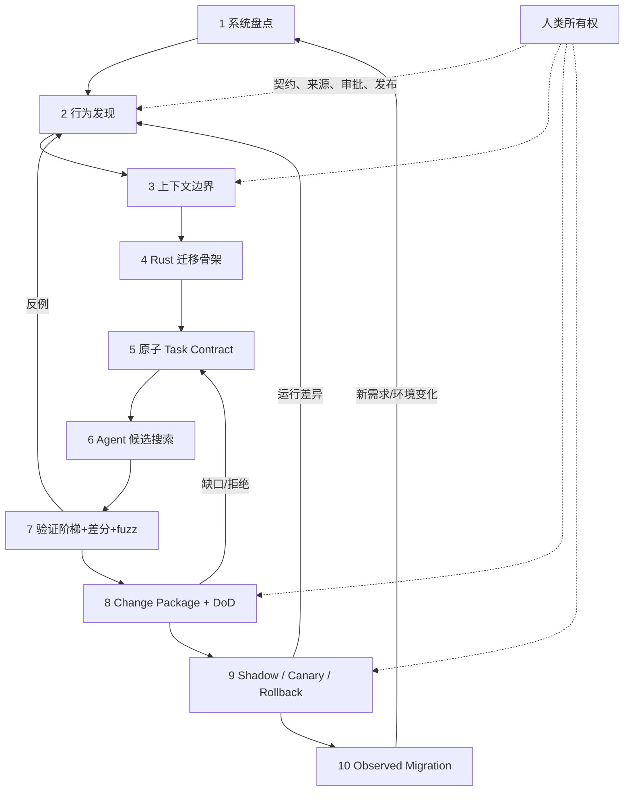

# 第 16 章：AI-Native Rust Migration Pipeline

> **定位**：本章将全书方法收敛为一条可运行的十阶段流水线。前置依赖是行为契约、Agent 上下文、Rust 骨架、验证阶梯、变更包和生产回退；输出是一个不以代码生成结束，而以已观测迁移与知识回流结束的端到端系统。

AI-native 不是「在原有流程中增加一个 prompt 步骤」。如果任务仍然是模糊的「把这个子系统改成 Rust」，验收仍然是一次编译与一次人工演示，发布仍然是默认全切，那么 AI 只是加速了候选代码的产生，没有加速团队对系统的理解与信心建立。

uutils 的长期重实现、测试、社区和操作系统集成经验表明，基础软件迁移是一个持续发现与修正行为的过程。[E1-LESSONS] 当前仓库的 AI policy、兼容开发流程和测试要求则将人类理解、小变更、先反例后修复与没有测试不合并组织在一起。[E2-AI-POLICY] [E2-COMPAT-WORKFLOW] Ubuntu 的审计与分阶段供应范围则说明代码之后还需生产证据。[E3-AUDIT-UPDATE] 本章将三层证据组合为方法，不声称其是所有组织的唯一最佳流程。

## 十阶段表

| # | 阶段 | 主要产物 | 机械门禁 | 人类决策 |
|---:|---|---|---|---|
| 1 | 系统盘点 | 边界图、依赖图、风险分级 | 资产/发布物可追溯 | 迁移目标、顺序与停止条件 |
| 2 | 行为发现 | 规范索引、黑盒观察、行为矩阵 | 来源与版本完整 | 哪些现象是契约 |
| 3 | 上下文建模 | MAY READ/MUST NOT READ/NEEDS REVIEW、manifest | 索引/路径/工具权限检查 | clean-room、许可与例外 |
| 4 | 迁移骨架 | workspace、局部单元、共享/平台接缝 | 构建矩阵与基线黑盒测试 | 架构边界与技术负债限额 |
| 5 | 原子任务 | Task Contract、已知反例、允许 diff | 任务字段与修改边界 | 可独立接受/拒绝/回退吗 |
| 6 | Agent 候选搜索 | 测试与最小 Rust 补丁 | 格式、编译、lint、依赖、来源 | 扩大范围是否需新契约 |
| 7 | 行为验证 | 单元/进程/外部套件/差分/fuzz 证据 | 验证阶梯与永久回归 | 差异分类、normalization、缺口 |
| 8 | 变更包与 DoD | 证据账本、豁免、回退评估 | Profile 合取与工件完整性 | 五类所有者批准 |
| 9 | 渐进发布 | 包、shadow、canary、阈值、回退演练 | 流量、时间、指标和产物验证 | 扩展、停止或回退 |
| 10 | 观测迁移 | 生产反例、新回归、事故复盘、退场评估 | 观察窗口和回流闭环 | 关闭项目、保留双实现或开新循环 |

这个表不是一条只向右的瀑布。任何阶段都可因新证据回到早期阶段：差分失败更新行为矩阵，安全审计更新威胁模型与 DoD Profile，canary 事故更新语料库和发布阈值。流水线管理的不是一批代码从左走到右，而是证据如何不断缩小未知量。[E4-PIPELINE]

## 端到端闭环

图中的 Agent 只在第 6 阶段显式出现，但它可以辅助其他阶段：从手册生成行为候选、聚类差异、最小化样本、生成证据账本、分析 canary 事件。之所以不让 Agent 成为每个阶段的主语，是为了保持决策边界：契约是否接受历史行为，clean-room 例外是否可批准，差异是候选缺陷还是参考缺陷，以及当前证据是否足以扩大生产流量，始终由具名人类负责人拥有。

## 三个循环的不同节奏

**内循环：候选搜索。** 以分钟到小时级工程节奏运行，内容是最小测试、Rust 补丁、格式/编译/lint 与局部反例。目标是快速排除不合格候选，不承担最终兼容结论。

**中循环：变更验证。** 以变更包为单元，执行更广 workspace、外部套件、差分/fuzz、架构/安全审查和人类批准。目标是将一个代码候选变成可接受的工程决策。

**外循环：生产迁移。** 以发布周期和真实工作负载为节奏，通过 shadow、canary、默认、观察窗口与回退演练建立信心。目标是将一个已批准变更变成可持续运行的系统状态。

三个循环不能用同一个「速度」指标管理。内循环可以追求低延迟反馈，中循环关心证据完整与审稿带宽，外循环关心有代表性的观察时间与故障半径。用代码生成速度逼迫外循环加速，会把 AI 的带宽优势转化为生产风险。

## 流水线的最小度量

不建议用「AI 写了多少代码」作为核心指标。更有用的度量包括：从发现反例到最小回归的时间；每份变更包未验证契约数；差异分类队列年龄；豁免过期率；人类审稿中发现的 Agent 假设比例；从回退触发到已验证恢复的时间；生产反例回流为 CI 永久测试的比例。

这些度量也会被游戏化。例如，团队可通过将差异快速标为「允许」来降低队列年龄，或通过避免记录 Unverified 来提高完整度。因此度量必须与抽样复审、事故与审计发现对照，它们用于发现流程拥堵，不是给 Agent 或团队生成单一排名。

## 从一个工具开始导入

不需要在项目第一天就搭建完整平台。可选一个边界明确、有参考二进制、有真实用户且回退简单的工具作为纵向切片。先完成一条从行为矩阵、context manifest、原子 Task Contract、Rust 候选、进程测试、差分、change package 到内部 canary 和回退的小闭环。再根据其实际成本自动化重复步骤，而不是先构建一个庞大但尚未与生产相连的「AI 迁移平台」。

第二个切片应故意选择不同风险：例如一个有文件系统副作用或平台分支的工具。它会验证第一个切片提炼的共享骨架是真正模式，还是一次性偶然。只有两个以上行为单元证明相同的能力，才应晋升为共享抽象或组织级模板。

## 模式提炼

**证据驱动的迁移控制面**：十阶段流水线让每一阶段消费明确输入、生成工件并由门禁决定晋级或返回。它适用于能持续保存契约、运行与责任证据的项目；若阶段只是项目管理标签、没有失败返回边或允许 Agent 自我批准，流水线不会缩小错误空间。

## 局限

十阶段是一个可操作参考模型，不是无条件的行业标准。不同系统的可观察性、参考实现可用性、法律边界、实时约束、安全分类和发布基础设施差异很大。有些项目无法执行黑盒参考，有些写操作无法安全 shadow，有些硬件环境无法大规模 fuzz。这些情况需要等价证据或显式的未验证/豁免路径，不是删除该阶段作为问题。

## 实践清单

- [ ] 将迁移从「代码转换」重新定义为十阶段行为发现、候选搜索、验证、决策与生产观测。
- [ ] 为每个阶段指定主要产物、机械门禁、人类所有者与返回路径。
- [ ] 分开候选搜索、变更验证和生产迁移三种节奏，不用生成速度压缩观察窗口。
- [ ] 用未验证契约、差异队列、豁免、审稿发现和回退恢复衡量闭环，不以生成行数排名。
- [ ] 从一个可回退纵向切片完成全链路，再用第二个异质切片验证共享模式。
- [ ] 让每个生产反例能返回行为契约、永久回归、生成器与 DoD Profile，使流水线持续学习。

## 本章证据

长期重实现经验来自论文 [E1-LESSONS]，人类理解、小变更与先反例后修复来自当前仓库 [E2-AI-POLICY] [E2-COMPAT-WORKFLOW]，生产审计与部分供应范围来自 Ubuntu 更新 [E3-AUDIT-UPDATE]。十阶段、三循环与闭环度量是本书对全部证据的最终方法综合 [E4-PIPELINE] [E4-DISCOVER-LOOP] [E4-ROLLBACK]。

### 版本演化说明

论文基线为 **arXiv:2608.07135**；本地源码基线为 **d8bee62c1ddc227d5e4385d80bbf6d7dee266a41**；本章证据核验日期为 **2026-08-14**。这条 pipeline 应随项目反例、工具链、组织所有权与发布基础设施演化；它的稳定内核是证据比候选更先行、人类拥有决策、生产反馈能回到契约。
