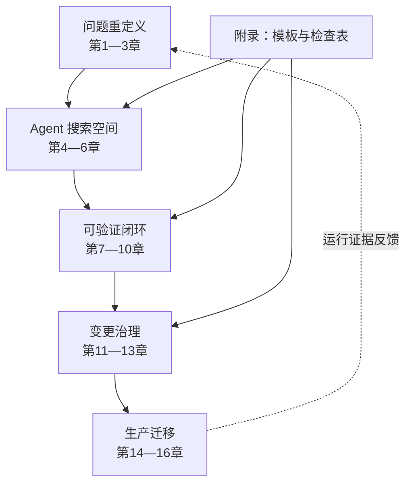

# 前言：这不是一本「让 AI 替你翻译代码」的书

uutils 做了一件看似容易、实则异常苛刻的事：用 Rust 重新实现人们已经使用了数十年的 Unix 基础工具。「重写」这个词容易让人把任务想成语法转换：找到旧函数，用 Rust 的所有权、`Result` 和 trait 再表达一遍。但基础软件真正的契约并不只在源码里，而是散落在命令行语法、退出码、错误文本、文件系统副作用、信号、平台差异、脚本假设和运维经验中。

AI Coding 放大了这个矛盾。模型可以很快地产生一份「看起来像 Rust」的实现，却不会因此自动获得旧系统的隐性知识。一次编译成功能证明类型关系成立，不能证明命令在稀有错误路径上保持了原有行为；一次演示成功能证明主路径存在，不能证明它可以替换生产环境的旧二进制。因此，这本书不把 AI 当作最终决策者，而把它放在一个有边界、有反馈、有门禁的搜索循环里。

本书的材料有三层。第一层是 2026 年论文 *Rust Coreutils: Rebuilding Unix Foundations in a Modern Language*，它给出了 uutils 的历史、架构、测试和操作系统集成视角。第二层是本书核验时的 uutils 仓库，它提供可追溯的工程事实：贡献规则、workspace、共享库、多调用入口、错误模型、测试命令与差分 fuzz 设施。第三层是 Ubuntu 部署与安全审计的公开记录，它提醒我们：仓库内的成功与操作系统默认替换之间，还有很长的距离。

书名中的「从 uutils 提炼」是有意设置的限定语。本书不宣称 uutils 是所有 Rust 迁移的唯一模板，也不把它的每一个仓库选择抬高为「行业最佳实践」。我们要提炼的是可迁移的方法：如何先建立行为契约，如何限制 Agent 可读上下文，如何把大任务切成可审查的原子变更，如何将差分测试、fuzz、静态检查和生产回滚连成闭环。

## 本书试图解决什么

遗留迁移通常同时面对三种不完整。第一，规范不完整：文档没有记录所有错误顺序、副作用和平台惯例。第二，验证不完整：现有测试覆盖已知主路径，却不能证明未知组合。第三，组织知识不完整：真正知道回退、下游脚本和历史事故的人并不都在同一个代码审查里。Coding Agent 可以加快实现搜索，也会更快地把这些缺口变成一份表面完整的候选代码。

因此，本书把迁移对象拆成四个彼此制约的系统：行为系统回答“外界能看到什么”；实现系统回答“Rust 如何承载这些行为”；证据系统回答“我们凭什么相信候选”；治理系统回答“谁能改变契约、批准例外并承担发布”。任何一个系统缺席，另外三个都可能给出虚假的完成感。完整方法不是多运行几个测试，而是让未知项、失败项和决策权都保持可见。

这也解释了书名中的“可验证”。这里不承诺数学意义上的完备证明，也不声称 fuzz 或生产观察能够穷尽输入空间。可验证指的是：一个重要结论应当指向可重放工件；一个未运行环境必须明确标成 `Unverified`；一个兼容差异必须有人分类；一个发布决定必须知道如何撤回。证据有强弱，但不能用流畅的解释代替证据本身。

## 阅读前提，以及不要求你先掌握什么

读者最好理解基本的 Rust crate/workspace、`Result`、feature 与条件编译，熟悉命令行进程的 stdin、stdout、stderr 和退出码，并有过代码审查或 CI 经验。涉及文件系统、打包和发布的章节会使用权限、符号链接、TOCTOU、canary 等术语，附录 F 提供简要术语入口。

你不需要先读过 GNU coreutils 源码；本书也刻意不以它作为材料。你不需要是 fuzz 专家、安全审计师或 Ubuntu 包维护者，正文会把这些能力放在迁移流程中的正确位置。你也不需要接受“所有遗留代码都应重写”这一前提：第 15、16 章反复保留部分替换、停止迁移和长期共存的合法结论。方法的目标是改善决策质量，而不是替某一种技术路线预设胜利。

## 三类事实分别回答什么

论文事实适合回答项目在其研究窗口里做了什么、如何组织架构与测试、作者从长期实践观察到什么；它不适合直接证明核验日的仓库状态。固定源码事实适合回答某个 commit 中规则、接口、目录和比较逻辑确实怎样；它不自动证明 Ubuntu 当前使用范围。生产事实适合回答特定日期发行版如何部署、发生过什么事故、审计和回退如何改变范围；它不应被反向写成所有 Rust 重写的一般定律。

本书提出的 Task Contract、Agent Context Boundary、Agent Atomicity、Change Package 与十阶段流水线属于第四类：对前三类证据的工程综合。它们可以被其他项目采用、修改或拒绝，但必须以适用条件和失效边界接受检验。每章的“模式提炼”和“局限”正是为防止从个案跳到无条件处方。

## 用这本书完成一次真实迁移

不要先把 16 章全部抄进组织规范。选择一个小而真实的行为差异，按以下顺序走一遍：

1. 用第 3 章和[附录 B](appendices/task-contract.md)写出行为六元组、非目标、停止条件与验证要求。
2. 用第 4 章和[附录 C](appendices/context-permissions.md)声明允许来源、禁止来源和实际访问记录；成稿扫描与工具访问审计分别报告。
3. 用第 5、6 章限定 Rust 接缝和一个可独立决策的补丁，不让“顺便重构”扩大证明责任。
4. 用第 7—10 章先建立 red/green 回归，再选择静态、集成、差分和 fuzz 证据；未运行项保持 `Unverified`。
5. 用第 11—13 章形成 Change Package，并按[附录 D](appendices/rust-safety-profile.md)和[附录 E](appendices/dod-checklist.md)选择可组合 Profile。
6. 如果候选会进入真实默认路径，用第 14—16 章设计观察、停止、回退和生产反例回流。

[附录 A](appendices/e2e-traces.md)提供三条端到端轨迹，可用作桌面演练。第一次采用时，最有价值的结果未必是合并 Rust 代码；发现 oracle 不稳定、权限边界无法强制、平台证据缺失或回退不可用，同样是阻止错误进入生产的有效产出。

## 谁适合读这本书

如果你在负责 C/C++ 或其他历史系统的 Rust 迁移，这本书提供一套可执行的路线。如果你在设计 AI Coding 工程流程，它给出一种将模型放入证据回路的方法。如果你是架构师、审稿人或发布负责人，你会看到代码之外的部分：人类所有权、证据包、阶段性上线与方法边界。

## 三条阅读路径

- **系统迁移路径**：按第 1—16 章顺序阅读。它从问题重定义开始，经过 Rust 骨架、验证闭环和变更治理，最后进入生产发布。
- **AI 治理路径**：优先阅读第 4、6、11、12、13 与 16 章，再使用附录 B—E 把规则放入自己的仓库。
- **验证工程路径**：优先阅读第 3、7、8、9、10 与 14 章，把行为契约逐步变成静态门禁、测试、差分样本与回滚触发器。

章节可以跳读，但有代价。直接从差分测试开始，容易把参考实现误当绝对规范；只读 Rust 骨架，容易把编译成功误当兼容；只读 DoD 模板，容易机械打勾而不知道每项证据在证明什么；只读生产章节，则容易把一次事故或一个发行版选择过度外推。每章开头的“定位”列出前置依赖，跳读时至少先补齐那里指向的概念。

如果你在团队中共读，可以让不同角色分别走三条路径，最后共同完成附录 A 的一条轨迹：实现者解释数据流与失败清理，兼容负责人解释契约与差异，安全负责人解释上下文和 Safety Profile，发布负责人演练回退。只有这些视角能汇合到同一份 Change Package，流程才真正连起来。

建议把第一次演练的全部工件保存在仓库，而不是只记录会议结论。下一次迁移任务应能直接复用契约 schema、run ID、差异分类和回退入口；若只能复用提示词，说明组织积累的仍是聊天技巧，不是迁移工程能力，也无法持续演化。

## 知识地图

## 如何阅读证据标记

正文中的 `[E1-…]` 到 `[E4-…]` 不是装饰性引用。E1 表示论文事实，E2 表示本地源码与项目文档，E3 表示 Ubuntu 等生产记录，E4 表示本书在明示前提下做出的方法综合。每章末尾都给出版本演化说明，避免把论文测量时点、本地源码基线和生产环境现状混为一谈。详细规则见「证据与版本策略」和附录 F。

希望这本书最终带来的，不是「用 AI 多写了多少行 Rust」，而是一个更坚实的问题：**我们有什么证据，能够让这个变更被理解、被审查、被发布，也能在必要时被安全地撤回？**
