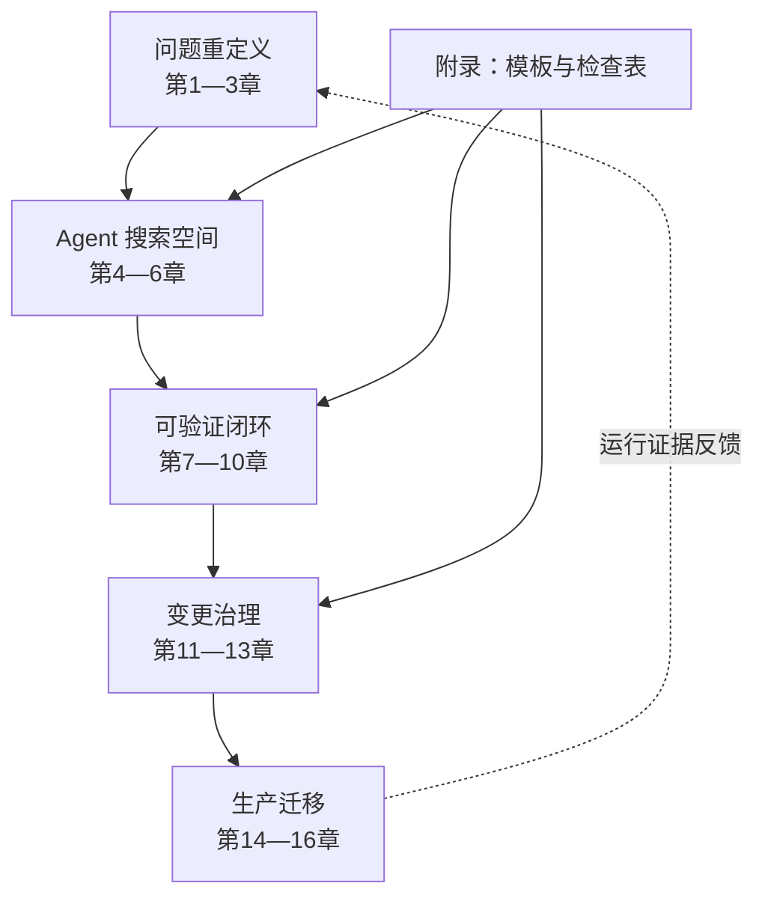

# 前言：这不是一本「让 AI 替你翻译代码」的书

uutils 做了一件看似容易、实则异常苛刻的事：用 Rust 重新实现人们已经使用了数十年的 Unix 基础工具。「重写」这个词容易让人把任务想成语法转换：找到旧函数，用 Rust 的所有权、`Result` 和 trait 再表达一遍。但基础软件真正的契约并不只在源码里，而是散落在命令行语法、退出码、错误文本、文件系统副作用、信号、平台差异、脚本假设和运维经验中。

AI Coding 放大了这个矛盾。模型可以很快地产生一份「看起来像 Rust」的实现，却不会因此自动获得旧系统的隐性知识。一次编译成功能证明类型关系成立，不能证明命令在稀有错误路径上保持了原有行为；一次演示成功能证明主路径存在，不能证明它可以替换生产环境的旧二进制。因此，这本书不把 AI 当作最终决策者，而把它放在一个有边界、有反馈、有门禁的搜索循环里。

本书的材料有三层。第一层是 2026 年论文 *Rust Coreutils: Rebuilding Unix Foundations in a Modern Language*，它给出了 uutils 的历史、架构、测试和操作系统集成视角。第二层是本书核验时的 uutils 仓库，它提供可追溯的工程事实：贡献规则、workspace、共享库、多调用入口、错误模型、测试命令与差分 fuzz 设施。第三层是 Ubuntu 部署与安全审计的公开记录，它提醒我们：仓库内的成功与操作系统默认替换之间，还有很长的距离。

书名中的「从 uutils 提炼」是有意设置的限定语。本书不宣称 uutils 是所有 Rust 迁移的唯一模板，也不把它的每一个仓库选择抬高为「行业最佳实践」。我们要提炼的是可迁移的方法：如何先建立行为契约，如何限制 Agent 可读上下文，如何把大任务切成可审查的原子变更，如何将差分测试、fuzz、静态检查和生产回滚连成闭环。

## 本书试图解决什么

遗留迁移通常同时面对三种不完整。第一，规范不完整：文档没有记录所有错误顺序、副作用和平台惯例。第二，验证不完整：现有测试覆盖已知主路径，却不能证明未知组合。第三，组织知识不完整：真正知道回退、下游脚本和历史事故的人并不都在同一个代码审查里。Coding Agent 可以加快实现搜索，也会更快地把这些缺口变成一份表面完整的候选代码。

因此，本书把迁移对象拆成四个彼此制约的系统：行为系统回答“外界能看到什么”；实现系统回答“Rust 如何承载这些行为”；证据系统回答“我们凭什么相信候选”；治理系统回答“谁能改变契约、批准例外并承担发布”。任何一个系统缺席，另外三个都可能给出虚假的完成感。完整方法不是多运行几个测试，而是让未知项、失败项和决策权都保持可见。

这也解释了书名中的“可验证”。这里不承诺数学意义上的完备证明，也不声称 fuzz 或生产观察能够穷尽输入空间。可验证指的是：一个重要结论应当指向可重放工件；一个未运行环境必须明确标成 `Unverified`；一个兼容差异必须有人分类；一个发布决定必须知道如何撤回。证据有强弱，但不能用流畅的解释代替证据本身。

## 阅读前提，以及不要求你先掌握什么

读者最好理解基本的 Rust crate/workspace、`Result`、feature 与条件编译，熟悉命令行进程的 stdin、stdout、stderr 和退出码，并有过代码审查或 CI 经验。涉及文件系统、打包和发布的章节会使用权限、符号链接、TOCTOU、canary 等术语，附录 F 提供简要术语入口。

你不需要先读过 GNU coreutils 源码；本书也刻意不以它作为材料。你不需要是 fuzz 专家、安全审计师或 Ubuntu 包维护者，正文会把这些能力放在迁移流程中的正确位置。你也不需要接受“所有遗留代码都应重写”这一前提：第 15、16 章反复保留部分替换、停止迁移和长期共存的合法结论。方法的目标是改善决策质量，而不是替某一种技术路线预设胜利。

## 三类事实分别回答什么

论文事实适合回答项目在其研究窗口里做了什么、如何组织架构与测试、作者从长期实践观察到什么；它不适合直接证明核验日的仓库状态。固定源码事实适合回答某个 commit 中规则、接口、目录和比较逻辑确实怎样；它不自动证明 Ubuntu 当前使用范围。生产事实适合回答特定日期发行版如何部署、发生过什么事故、审计和回退如何改变范围；它不应被反向写成所有 Rust 重写的一般定律。

本书提出的 Task Contract、Agent Context Boundary、Agent Atomicity、Change Package 与十阶段流水线属于第四类：对前三类证据的工程综合。它们可以被其他项目采用、修改或拒绝，但必须以适用条件和失效边界接受检验。每章的“模式提炼”和“局限”正是为防止从个案跳到无条件处方。

## 本书明确不做什么

这不是 Rust 语言入门。正文会解释为何某个类型边界、错误桥接或 `unsafe` 封装影响迁移风险，却不会从所有权基础语法开始教学。若你还不能独立阅读一个小型 Rust crate，建议先用官方 Rust Book 完成错误处理、trait、测试与并发章节，再回来执行书中的工件练习。这里的目标不是让读者记住更多语法，而是能判断一份候选实现还欠什么证据。

这也不是某个参考实现的导读或逐行复刻指南。本书遵守项目的 clean-room 边界，不读取、转述或推断受限制的 GNU 实现源码；讨论兼容性时，来源是公开规范、允许的黑盒观测、固定的候选仓库与生产记录。读者在自己的项目里必须重新确认许可证、商业秘密与数据授权，不能把“网上能搜到”误当成“任务可以读取”。

本书不提供性能、内存安全或兼容性的无条件胜利宣言。安全 Rust 能排除一类未定义行为，却不能自动保证路径语义、权限顺序、诊断文本、更新链路或并发文件操作正确；基准测试也只在固定工作负载、构建参数与硬件上成立。只要关键平台未运行、oracle 不稳定或回退未演练，结论就应停在 `Unverified`，而不是用语言优势补足证据缺口。

最后，本书不要求一次替换全部系统。局部迁移、多个 provider 长期共存、对高风险命令保留旧实现、甚至在证据不足时停止迁移，都是合法输出。第 16 章的流水线是一组可返回、可暂停的状态，不是只准向前的交付瀑布。组织采用本书时，应先选择一条真实而有限的任务，证明控制面能够工作，再扩大范围。

## 开始前的项目准备

执行第一条轨迹前，团队至少要准备四个可写入仓库的落点：契约目录、测试与 seed 目录、运行证据目录、Change Package 目录。它们叫什么并不重要，重要的是聊天结束后仍能被另一位评审者找到。CI 应能报告准确命令、提交、平台和退出状态；若日志只能在短期网页中查看，应把最小判定摘要与内容哈希保存在包内。

还需要为四类决策指定人类角色：行为所有者裁决兼容边界，安全评审者裁决 `unsafe`、权限与敏感数据，验证负责人维护 harness 与平台矩阵，发布负责人拥有 kill switch 和回滚。小团队可以一人兼任多个角色，但同一个高风险结论不应只有 Agent 自评。没有发布权限的人可以生成回滚步骤，不能据此声称回滚已演练。

最后固定基线：候选代码 commit、工具链、依赖锁、目标平台、oracle 身份、书中使用的证据截止日。基线改变并不意味着旧证据全部作废，但必须能判断哪些层需要重跑。代码变更通常使静态和目标测试失效；平台镜像变更可能使错误文本与文件系统证据失效；生产 provider 变更则要求重新审视 shadow、canary 与恢复入口。

## 用这本书完成一次真实迁移

不要先把 16 章全部抄进组织规范。选择一个小而真实的行为差异，按以下顺序走一遍：

1. 用第 3 章和[附录 B](appendices/task-contract.md)写出行为六元组、非目标、停止条件与验证要求。
2. 用第 4 章和[附录 C](appendices/context-permissions.md)声明允许来源、禁止来源和实际访问记录；成稿扫描与工具访问审计分别报告。
3. 用第 5、6 章限定 Rust 接缝和一个可独立决策的补丁，不让“顺便重构”扩大证明责任。
4. 用第 7—10 章先建立 red/green 回归，再选择静态、集成、差分和 fuzz 证据；未运行项保持 `Unverified`。
5. 用第 11—13 章形成 Change Package，并按[附录 D](appendices/rust-safety-profile.md)和[附录 E](appendices/dod-checklist.md)选择可组合 Profile。
6. 如果候选会进入真实默认路径，用第 14—16 章设计观察、停止、回退和生产反例回流。

[附录 A](appendices/e2e-traces.md)提供三条端到端轨迹，可用作桌面演练。第一次采用时，最有价值的结果未必是合并 Rust 代码；发现 oracle 不稳定、权限边界无法强制、平台证据缺失或回退不可用，同样是阻止错误进入生产的有效产出。

## 谁适合读这本书

如果你在负责 C/C++ 或其他历史系统的 Rust 迁移，这本书提供一套可执行的路线。如果你在设计 AI Coding 工程流程，它给出一种将模型放入证据回路的方法。如果你是架构师、审稿人或发布负责人，你会看到代码之外的部分：人类所有权、证据包、阶段性上线与方法边界。

## 三条阅读路径

- **系统迁移路径**：按第 1—16 章顺序阅读。它从问题重定义开始，经过 Rust 骨架、验证闭环和变更治理，最后进入生产发布。
- **AI 治理路径**：优先阅读第 4、6、11、12、13 与 16 章，再使用附录 B—E 把规则放入自己的仓库。
- **验证工程路径**：优先阅读第 3、7、8、9、10 与 14 章，把行为契约逐步变成静态门禁、测试、差分样本与回滚触发器。

章节可以跳读，但有代价。直接从差分测试开始，容易把参考实现误当绝对规范；只读 Rust 骨架，容易把编译成功误当兼容；只读 DoD 模板，容易机械打勾而不知道每项证据在证明什么；只读生产章节，则容易把一次事故或一个发行版选择过度外推。每章开头的“定位”列出前置依赖，跳读时至少先补齐那里指向的概念。

如果你在团队中共读，可以让不同角色分别走三条路径，最后共同完成附录 A 的一条轨迹：实现者解释数据流与失败清理，兼容负责人解释契约与差异，安全负责人解释上下文和 Safety Profile，发布负责人演练回退。只有这些视角能汇合到同一份 Change Package，流程才真正连起来。

建议把第一次演练的全部工件保存在仓库，而不是只记录会议结论。下一次迁移任务应能直接复用契约 schema、run ID、差异分类和回退入口；若只能复用提示词，说明组织积累的仍是聊天技巧，不是迁移工程能力，也无法持续演化。

## 知识地图

知识地图可以再按工件来读。第 1—3 章产生 Behavior Contract，第 4 章产生 Context Manifest，第 5—6 章确定 Rust 接缝与原子任务，第 7—10 章产生可重放的 run、差异与回归 seed，第 11—13 章把它们装入 Change Package，第 14—16 章再加入 rollout、监控、回退和生产反例。任何箭头都允许返回：差分不可裁决就回契约，补丁跨越共享层就回拆分，canary 越界就回退并把真实输入送回最小化。

附录不是与正文平行的另一套流程。附录 B 的字段实现第 3、4、6 章的约束；附录 C 记录第 4 章上下文生命周期；附录 D 细化安全检查；附录 E 只引用第 13 章的五种可组合 Profile；附录 A 展示三者如何进入完整轨迹；附录 F 让事实、术语与章节可以反向追踪。若模板和正文发生冲突，以正文定义和经过评审的 schema 版本为准，并通过维护流程修正模板。

## 如何阅读证据标记

正文中的 `[E1-…]` 到 `[E4-…]` 不是装饰性引用。E1 表示论文事实，E2 表示本地源码与项目文档，E3 表示 Ubuntu 等生产记录，E4 表示本书在明示前提下做出的方法综合。每章末尾都给出版本演化说明，避免把论文测量时点、本地源码基线和生产环境现状混为一谈。详细规则见「证据与版本策略」和附录 F。

| 记号 | 可以支持的结论 | 不能独自支持的结论 | 更新触发 |
|---|---|---|---|
| E1 | 论文研究窗口内的架构、测量与作者观察 | 当前仓库或发行版状态 | 新论文版本、勘误或方法重评 |
| E2 | 固定 commit 中可定位的代码、规则、命令与配置 | 未运行平台和生产采用情况 | 仓库基线或相应文件改变 |
| E3 | 有日期、有版本的发行、事故、审计与部署事实 | 对所有迁移项目的普遍因果律 | 官方更正、新版本或状态变化 |
| E4 | 在列明前提与边界下的流程设计 | 已被某个生产环境实证采用 | 反例、演练结果或治理变更 |

同一句话可能需要多层证据。例如“共享错误层值得集中治理”可以由 E2 证明共享层确实存在，由 E1 说明长期项目为何这样组织，再由 E4 推导影响矩阵和第二评审；三者不能互相替代。E3 的生产事故可以证明某个版本、某种环境发生了影响，却不能在没有来源时补写源码根因。遇到这种缺口，本书宁可精确写“官方记录未给出实现级因果链”，也不把合理猜测升级为事实。

日期必须回答“什么日期”。论文提交日、网页发布日期、发行事件日、事故通知日与修复可用日是不同字段。生产章节把事件日和发布日分开，是为了避免以后回看时把一篇晚发总结误当成事件首次发生。版本说明同理：`as of` 只约束该句，不应偷偷覆盖整章。

## 练习、工件与判分约定

每章的三道练习分别对应识别、构造和压力测试。识别题要求从现有材料找出缺口；构造题要求提交可复用工件；压力测试要求走失败分支、回退或例外，而不是只演示 happy path。建议以小组评审而非选择题答案判分：另一位成员能否只凭工件重放结论，能否指出仍是 `Unverified` 的边界，能否在不访问聊天记录的情况下找到决策人。

工件 ID 应稳定且不泄露敏感内容。一个实用约定是用类型、任务号和序号组合，例如 `BC-DATE-001`、`RUN-DATE-001-RED`、`CP-DATE-001`。原始日志可以短期保存，判定摘要必须记录命令、commit、平台、开始/结束时间、退出状态、内容哈希与脱敏规则。截图只适合辅助说明，不能取代机器可读输出。

练习中的虚构 utility、退出码和路径会明确标成假设。它们用于展示契约结构，不应被复制成真实 coreutils 行为声明。真实项目应从自己的允许证据重新观测，并让行为所有者裁决差异。若练习结果触及凭证、客户日志或禁止源码，应立即进入附录 C 的暂停与污染处置流程，而不是为了“完成作业”保留材料。

## 维护政策与证据截止

本版证据截止为 **2026-08-14**。E2 源码事实固定到附录 F 所列 commit；E3 动态事实只采用截止日前可核验的一手官方来源。后续维护者新增动态事实时，应记录页面标题、发布主体、URL、发布日期、事件日期、适用版本、访问/核验日期与原文支持的最小主张。若官方页面被更正，要保留更正说明并更新受影响章节，不用旧摘录与新状态拼接。

维护按三种变更处理。勘误只修复文字或失效链接，不改变方法判断；证据更新会移动 `as of`、版本或生产状态，需要重查所有引用同一 evidence ID 的章节；方法更新会改变 Task Contract、Profile 或流水线，必须给 schema 升版、迁移说明和反例。附录模板不能静默领先正文，正文也不能在不更新模板的情况下新增强制字段。

建议每个发行周期运行一次反向索引检查：从 E1—E4 ID 找到所有结论，从术语找到首次定义，从 Profile 找到第 13 章规范接口，从生产结论找到日期与版本。失效链接不一定使历史事实失效，但必须寻找官方归档或标为不可再核验；无法恢复的一手来源不能被二手摘要悄悄替换。

当新证据推翻旧判断时，修订应留下三件事：旧判断为何在当时成立、哪条新证据改变了边界、哪些工件或决策需要重跑。这样的版本演化比覆盖式改写更适合基础软件迁移，因为读者真正需要知道的不是“最新版永远正确”，而是结论怎样随代码、平台和生产反馈变化。

## 读完后应当带走什么

读者不必复制 uutils 的目录、错误类型或 CI 命令，但应能为自己的项目建立一条同构证据链：从一个外部可见差异出发，写出能被裁决的契约；只向 Agent 开放完成任务所需的来源；让一次变更只承担一个行为决策；用 red/green、进程测试、差分和风险相称的性质测试逐层压缩未知；让独立人类从 Change Package 复核；最后用真实产物、代表 cohort、kill switch 和回滚演练控制生产影响。

更重要的是，团队应能承认三种“没有完成”。第一种是事实未知：平台未运行或 oracle 不稳定，标为 `Unverified`。第二种是边界不成立：许可、接口或恢复路径无法满足，任务暂停并重新设计。第三种是证据否定候选：测试、审计或 canary 表明风险不可接受，执行修复或回退。这三种结果都比一份流畅但不可追溯的迁移总结更有价值。

本书所有模板最终服务于一个简单交接：新加入的维护者无需读取 Agent 对话，就能找到为什么改、依据什么、验证到哪里、谁批准、哪些仍未知，以及怎样安全撤回。只要这六个问题仍依赖某个人的记忆，迁移就还没有成为组织能力。

第一次实践建议选一个能在一天内反复重放、又确实影响用户判断的差异，而不是挑最显眼的核心模块。先让契约、权限、证据和回退在小范围里暴露摩擦，再决定哪些字段自动化、哪些决策保留人类审批。流程的成熟度不由模板数量衡量，而由失败出现时能否准确停下、返回正确阶段并保全证据衡量。

当团队能把一次失败完整转化为下一次可自动重放的保护，它才真正开始积累迁移能力，而不只是积累候选代码。

希望这本书最终带来的，不是「用 AI 多写了多少行 Rust」，而是一个更坚实的问题：**我们有什么证据，能够让这个变更被理解、被审查、被发布，也能在必要时被安全地撤回？**
